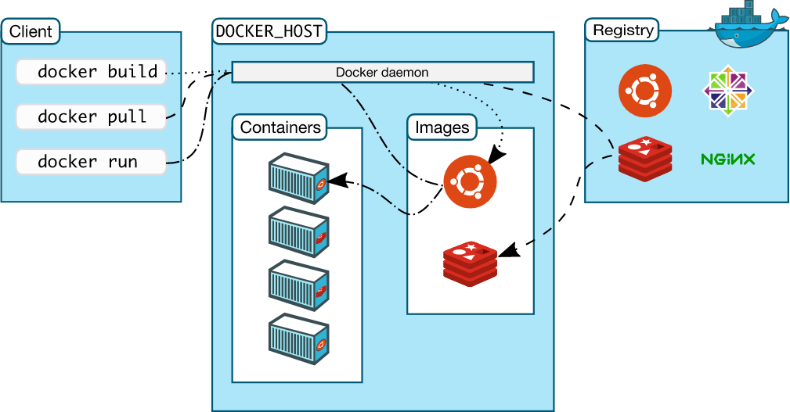

# 1、概述

官网：https://www.docker.com/

文档：https://docs.docker.com/

仓库：https://hub.docker.com/

Docker 是一个开源的应用容器引擎，让开发者可以打包他们的应用以及依赖包到一个可移植的镜像中，然后发布到任何流行的机器上，也可以实现虚拟化。容器是完全使用沙箱机制，相互之间不会有任何接口。

百度百科：https://baike.baidu.com/item/docker/13344470

## 1.1、容器技术

**虚拟机技术缺点：**

- 资源占用十分多
- 冗余步骤多
- 启动很慢

**容器化技术：容器化技术不是模拟的一个完整的操作系统**

- 传统虚拟机，虚拟出一个硬件，运行一个完整的操作系统，然后在这个系统上安装和运行软件
- 容器内的应用直接运行在宿主机的内容，容器是没有自己的内核，也没有虚拟硬件，所以轻便
- 每个容器间是互相隔离的，每个容器内都有属于自己的文件系统，互不影响

## 1.2、基本组成

**镜像（image）：**

Docker镜像好比一个模板，可以通过这个模板来创建容器服务，通过这个镜像可以创建多个容器（最终服务运行或项目运行就是在容器中的）

**容器（container）：**

Docker利用容器技术，独立运行一个或一组应用，通过镜像创建

可以将容器理解为一个简易的Linux系统

**仓库（repository）：**

存放镜像的地方，分为公有和私有

Docker Hub（默认是国外的）

