# 1、SOA

**SOA：面向服务架构（Service-Oriented Architecture）**

## 1.1、SOA定位：

- 如何**设计项目**，让开发时更有效率
- SOA是一种思想

## 1.2、之前项目设计架构

- 在公司项目不允许所哟项目都能访问数据库
- 开发时，数据库访问层代码可能出现冗余

## 1.3、SOA架构

- 有一个专门提供服务的单元，专门访问数据库的服务（项目）
- 其他所有单元都调用这个服务
- 开发时可以实现，数据访问控制和代码复用

## 1.4、实现SOA架构常用服务

- Doubbo
- WebService
- DoubboX
- 服务方就是web项目，调用web项目的控制器
  - 使用HttpClient可以调用其他项目的控制器

# 2、RPC

**RPC：远程过程调用协议（Remote Procedure Call）**

## 2.1、RPC解析

客户端(A)通过互联网调用远程服务器,不知道远程服务器具体实现,只知道远程服务器提供了什么功能.

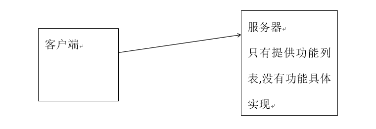

## 2.2、RPC优点

- 数据安全性

# 3、Dubbo

**Dubbo:一个分布式、高性能、透明化的RPC服务框架**

## 3.1、作用

**提供服务自动注册、自动发现等高效服务治理方案.**

## 3.2、Dubbo架构图

- **Provider** ：提供者,服务发布方.

- **Consumer**：消费者, 调用服务方

- **Container**：Dubbo容器.依赖于Spring容器.

- **Registry**：注册中心.当Container启动时把所有可以提供的服务列表上Registry中进行注册.
  - 作用：告诉Consumer提供了什么服务和服务方在哪里.

- Monitor：监听器

- 虚线都是异步访问,实线都是同步访问

- 蓝色虚线:在启动时完成的功能

- 绿色虚线(实线)都是程序运行过程中执行的功能

- 所有的角色都是可以在单独的服务器上.所以必须遵守特定的协议.

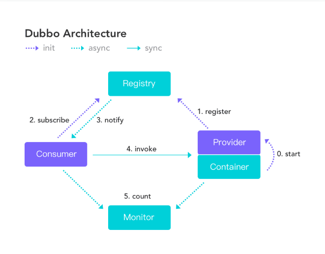

## 3.3、运行原理

- **0（start）**：启动容器,相当于在启动Dubbo的Provider

- **1（register）**：启动后会去注册中心进行注册.注册所有可以提供的服务列表

- **2（subscribe）**：在Consumer启动后会去Registry中获取服务列表和Provider的地址.进行订阅.
- **3（notify）**：当Provider有修改后,注册中心会把消息推送给Consummer
  - 使用了观察者设计模式(又叫发布/订阅设计模式)

- **4（invoke）**：根据获取到的Provider地址,真实调用Provider中功能.
  - 在Consumer方使用了代理设计模式.创建一个Provider方类的一个代理对象.通过代理对象获取Provider中真实功能,起到保护Provider真实功能的作用.

- **5（count）**Consumer和Provider每隔1分钟向Monitor发送统计信息,统计信息包含,访问次数,频率等.

# 4、Dubbo支持的注册中心

- Zookeeper
  - 优点：支持网络集群
  - 缺点：稳定性受限于Zookeeper

- Redis 
  - 优点：性能高.
  - 缺点：对服务器环境要求较高.

- Multicast
  - 优点：面中心化,不需要额外安装软件.
  - 缺点：建议同机房(局域网)内使用

- Simple
  - 适用于测试环境.不支持集群.

# 5、Zookeeper

- Zookeeper 分布式协调组件.
  - 本质一个软件.
- Zookeeper常用功能
  - 发布订阅功能.把zookeeper当作注册中心原因.
  - 分布式/集群管理功能.
- 使用java语言编写的

## 5.1、下载安装

Zookeeper官网：https://zookeeper.apache.org/index.html

3.6.1下载地址：https://www.apache.org/dyn/closer.lua/zookeeper/zookeeper-3.6.1/apache-zookeeper-3.6.1-bin.tar.gz

**Zookeeper安装前提配置好了JDK**

- 上传zookeeper 安装包到linux中/usr/local/temp 中(目录随意,对安装无影响)

- 解压zookeeper压缩包

  ```bash
  tar zxvf apache-zookeeper-3.6.1-bin.tar.gz
  ```

- 移动zookeeper解压后的文件夹到/usr/local下并起名为zookpper(复制后名称任意,对安装无影响)

  ```bash
  mv apache-zookeeper-3.6.1-bin ../zookeeper
  ```

-  进入到zookeeper文件夹中

  ```bash
  [root@localhost local]# pwd
  /usr/local
  [root@localhost local]# cd zookeeper/
  ```

- 在zookeeper中新建data文件夹,做为zookeeper数据存储文件夹

  ```bash
  mkdir data
  ```

- 进入到conf文件夹

  ```bash
  cd conf
  ```

- 复制zoo_sample.cfg,并给新起名的zoo.cfg

  ```bash
  ls
  configuration.xsl  log4j.properties  zoo_sample.cfg
  cp zoo_sample.cfg zoo.cfg  # 复制
  ls
  configuration.xsl  log4j.properties  zoo.cfg  zoo_sample.cfg
  ```

- 修改zoo.cfg中dataDir属性值为新建data文件夹的路径

  ```bash
  vim zoo.cfg
  ```

  修改后的效果   **2181为Zookeeper的端口号**

  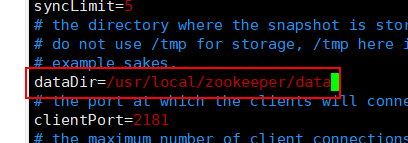

- 修改zookeeper内部自带`jetty`启动端口

  **`jetty`默认端口8080会和Tomcat端口冲突**

  在`zoo.cfg`文件中添加`admin.serverPort=没有被占用的端口号`

  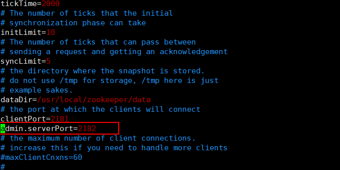

- 进入到zookeeper/bin文件夹,使用zkServer.sh启动zookeeper

  ```bash
  [root@localhost /]# cd usr/local/zookeeper/bin/  
  [root@localhost bin]# ls
  README.txt    zkCli.cmd  zkEnv.cmd  zkServer.cmd            zkServer.sh            zkSnapShotToolkit.sh  zkTxnLogToolkit.sh
  zkCleanup.sh  zkCli.sh   zkEnv.sh   zkServer-initialize.sh  zkSnapShotToolkit.cmd  zkTxnLogToolkit.cmd
  [root@localhost bin]# ./zkServer.sh 执行命令 查看参数
  ZooKeeper JMX enabled by default
  Using config: /usr/local/zookeeper/bin/../conf/zoo.cfg
  Usage: ./zkServer.sh [--config <conf-dir>] {start|start-foreground|stop|version|restart|status|print-cmd}
  [root@localhost bin]# ./zkServer.sh start  # 启动
  ZooKeeper JMX enabled by default
  Using config: /usr/local/zookeeper/bin/../conf/zoo.cfg
  Starting zookeeper ... STARTED
  ```

  启动效果图

  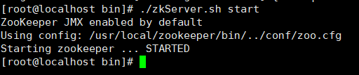

-  查看状态,其中Mode: standalone表示单机版

  ```bash
  ./zkServer.sh status
  ```

  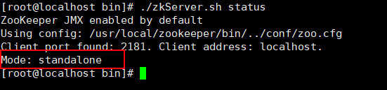

- 为了外部能访问,需要在防火墙中放行2181端口

  **这里使用默认防火墙firewalle不是iptables**

  - 查看Zookeeper默认端口2181是否开启

    ```bash
    firewall-cmd --query-port=2181/tcp
    ```

  - 开启2181端口

    ```bash
    firewall-cmd --zone=public --add-port=2181/tcp --permanent
    ```

  - 重启防火墙

    ```bash
    firewall-cmd --reload
    ```

  - 再次查询是否开启

  - 查询哪些端口是开启的

    ```bash
    firewall-cmd --list-port
    ```

  **具体防火墙命令可参考：**https://www.linuxidc.com/Linux/2019-06/159104.htm

# 6、Dubbo支持的协议

## Dubbo

- Dubbo官方推荐的协议.

- 本质:使用NIO和线程池进行处理.

- 缺点:大文件传输时可能出现文件传输失败问题.

## RMI

- JDK提供的协议,远程方法调用协议.

- 缺点:偶尔连接失败.

- 优点:JDK原生,不需要进行额外配置(导入jar)

## Hession

- 优点:基于http协议,http请求支持.
- 缺点:需要额外导入jar,并在短连接时性能低

# 7、Dubbo中搭建Provider

## 7.1、新建Maven Project, 里面只有接口(dubbo-service)

**为什么这么做**?

RPC框架,不希望Consumer知道具体实现.如果实现类和接口在同一个项目中,Consumer依赖这个项目时,就会知道实现类具体实现.

服务提供者和消费者都必须有接口，所以建一个接口的Model

## 7.2、新建Maven Project, 写接口的实现类(dubbo-service-impl)

### **7.2.1、在duboo-service-impl中配置pom.xml**

- 依赖接口

- 依赖dubbo

  **需要注意dubbo的版本。从2.5.4之后 依赖的spring是4.x版本，之前的spring版本为2.x,需要手动导入spring高版本在dubbo中剔除低版本**

  **Spring2.x之前所有的功能都在一个jar后才拆分**

  - 版本过低，剔除dubbo中的spring之后，需要依赖新版本spring

- 依赖zookeeper客户端工具zkClient

- 依赖curator

- 依赖Netty

  ```xml
  <dependencies>
      <!--导入接口模块-->
      <dependency>
          <groupId>com.zh</groupId>
          <artifactId>dubbo_service</artifactId>
          <version>1.0-SNAPSHOT</version>
      </dependency>
      <!--
          dubbo
          注意版本：从2.5.4开始 依赖的spring是4.x版本
                  之前的spring版本为2.x,需要手动导入spring高版本在dubbo中剔除低版本
  
          -->
      <dependency>
          <groupId>com.alibaba</groupId>
          <artifactId>dubbo</artifactId>
          <version>2.6.7</version>
      </dependency>
      <!-- 访问zookeeper的客户端jar -->
      <dependency>
          <groupId>com.101tec</groupId>
          <artifactId>zkclient</artifactId>
          <version>0.11</version>
      </dependency>
      <!-- 对zookeeper的底层api的一些封装 -->
      <dependency>
          <groupId>org.apache.curator</groupId>
          <artifactId>curator-framework</artifactId>
          <version>4.0.1</version>
      </dependency>
      <!-- 封装了一些高级特性，如：Cache事件监听、选举、分布式锁、分布式Barrier -->
      <dependency>
          <groupId>org.apache.curator</groupId>
          <artifactId>curator-recipes</artifactId>
          <version>4.0.1</version>
      </dependency>
      <!--Netty 是一个广泛使用的 Java 网络编程框架-->
      <dependency>
          <groupId>io.netty</groupId>
          <artifactId>netty-all</artifactId>
          <version>4.1.32.Final</version>
      </dependency>
  </dependencies>
  ```

### **7.2.2、新建实现类,并实现接口方法.**

```java
package com.zh.service.impl;

import com.zh.service.DemoService;

/**
 * @author Beloved
 * @date 2020/9/5 14:27
 */
public class DemoServiceImpl implements DemoService {

    public String demo(String name) {
        return "传递过来的name"+name;
    }
}
```

### 7.2.3、新建配置文件applicationContext-dubbo.xml,并配置

- `<dubbo:application/>`给provider起名,在monitor或管理工具中区别是哪个provider
- `<dubbo:registry/>` 配置注册中心
  - address:注册中心的ip和端口
  - protocol使用哪种注册中心

- `<dubbo:protocol/>` 配置协议
  - name 使用什么协议
  - port: consumer invoke provider时的端口号

- `<dubbo:service/>` 注册接口
  - ref 引用接口实现类<bean>的id值

```xml
<?xml version="1.0" encoding="UTF-8"?>
<beans xmlns="http://www.springframework.org/schema/beans"
       xmlns:xsi="http://www.w3.org/2001/XMLSchema-instance"
       xmlns:context="http://www.springframework.org/schema/context"
       xmlns:dubbo="http://code.alibabatech.com/schema/dubbo"
       xsi:schemaLocation="http://www.springframework.org/schema/beans
        http://www.springframework.org/schema/beans/spring-beans.xsd
        http://www.springframework.org/schema/context
        http://www.springframework.org/schema/context/spring-context.xsd
        http://code.alibabatech.com/schema/dubbo
        http://code.alibabatech.com/schema/dubbo/dubbo.xsd">

    <!--给当前Provider自定义个名字-->
    <dubbo:application name="dubbo-service" />
    <!--配置注册中心-->
    <dubbo:registry address="192.168.43.200:2181" protocol="zookeeper"></dubbo:registry>
    <!--配置端口-->
    <dubbo:protocol name="dubbo" port="20888"></dubbo:protocol>
    <!--注册功能-->
    <dubbo:service interface="com.zh.service.DemoService" ref="demoService"></dubbo:service>
    <bean id="demoService" class="com.zh.service.impl.DemoServiceImpl"></bean>

    <!--使用注解 配置注解扫描-->
    <!--<dubbo:annotation package="com.zh.service.impl" />-->
</beans>
```

**注册服务接口**

可以使用注解`@Service`

- 在配置文件中配置注解扫描

  ```xml
  <dubbo:annotation package="com.zh.service.impl" />
  ```

- 在接口实现类上使用注解`@Service`  **注意：不要和Spring的注解搞混**

  ```java
  package com.zh.service.impl;
  
  import com.alibaba.dubbo.config.annotation.Service;
  import com.zh.service.DemoService;
  
  /**
   * @author Beloved
   * @date 2020/9/5 14:27
   */
  @Service
  public class DemoServiceImpl implements DemoService {
  
      public String demo(String name) {
          return "传递过来的name"+name;
      }
  }
  ```

### 7.2.4、启动容器

- 通过spring方式启动

  - applicationContext-dubbo.xml位置没有要求

  ```java
  import com.alibaba.dubbo.container.Main;
  import org.springframework.context.support.ClassPathXmlApplicationContext;
  import java.io.IOException;
  
  /**
   * @author Beloved
   * @date 2020/9/5 15:00
   */
  public class Test01 {
      public static void main(String[] args) throws IOException {
          ClassPathXmlApplicationContext ac = new ClassPathXmlApplicationContext("applicationContext-dubbo.xml");
          ac.start();
          System.out.println("启动成功");
          System.in.read();
      }
  }
  ```

- 使用dubbo提供的方式启动(推荐使用这种方式)

  - 要求applicationContext-dubbo.xml必须放入类路径下`/META-INF/spring/*.xml`

  ```java
  import com.alibaba.dubbo.container.Main;
  import org.springframework.context.support.ClassPathXmlApplicationContext;
  import java.io.IOException;
  
  /**
   * @author Beloved
   * @date 2020/9/5 15:00
   */
  public class Test01 {
      public static void main(String[] args) throws IOException {
          // 官方推荐
          // 要求配置文件必须放在 /META-INF/spring/*.xml
          Main.main(args);
      }
  }
  ```

  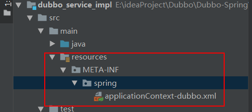

# 8、Dubbo-Admin管理界面

**本质就是一个web项目。获取注册中心内Provider注册的信息.用页面呈现出来**

参考文章：https://www.cnblogs.com/reformdai/p/11921593.html

**jar下载地址：**https://github.com/apache/dubbo-admin/tree/master

**war下载地址：**https://github.com/apache/dubbo/tree/2.5.x

配置文件建议使用war，springboot使用jar

war包打包方式：https://blog.csdn.net/han447227659/article/details/88421945

## 8.1、打包dubbo-admin

解压下载的文件，进入`dubbo-admin`，使用cmd命令进行打包，在target下会有一个war包

```bash
mvn package -Dmaven.skip.test=true
```

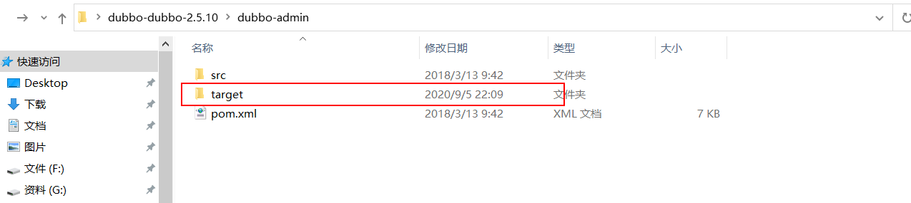

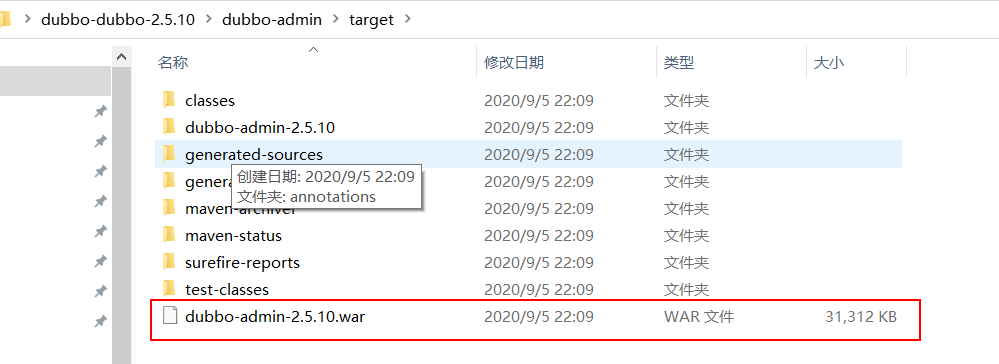

## 8.2、配置dubbo-admin

- 把dubbo-admin-2.5.10.war上传到服务器tomcat中

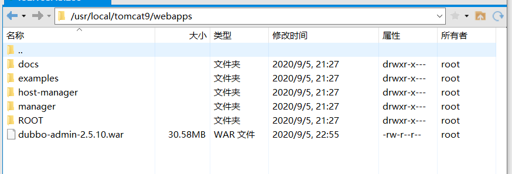

- 启动tomcat完成后关闭tomcat,删除上传的dubbo-admin-2.5.10.war

  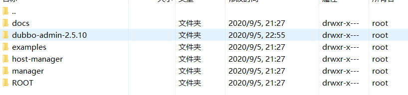

  - 需要修改解压后的文件夹,如果不删除.war文件,下次重启tomcat会还原成未修改状态
  - 进入dubbo-admin-2.5.10/WEB-INF/dubbo.properties,修改第一行为zookeeper的ip和端口
  - 第二行和第三行为管理界面的用户名和密码
  - **如果zookeeper和dubbo-admin在同一服务器不需要修改IP地址，只需要注意端口。不在同一机器，需要修改为zookeeper所在服务器的ip地址**

  

## 8.3、zookeeper 和tomcat 部署在同一主机8080端口问题

参考文章：https://blog.csdn.net/liujian8654562/article/details/100860002

在zookeeper启动的时候，看打印信息显示会启动jetty，启动一个adminServer on port 8080；

zookeeper最近的版本中有个内嵌的管理控制台是通过jetty启动，也会占用8080 端口。
通过查看zookeeper的官方文档，发现有3种解决途径：

（1）.删除jetty。
（2）修改端口。
修改方法的方法有两种，一种是在启动脚本中增加 -Dzookeeper.admin.serverPort=你的端口号.一种是在zoo.cfg中增加admin.serverPort=没有被占用的端口号
（3）停用这个服务，在启动脚本中增加”-Dzookeeper.admin.enableServer=false”

tomcat 默认的端口也是8080 ，造成无法访问tomcat问题，

```
HTTP ERROR 404

Problem accessing /. Reason:

    Not Found
Powered by Jetty:// 9.4.17.v20190418
123456
```

tomcat 在conf文件中的server.xml 中修改端口：

```
 <Connector port="8090" protocol="HTTP/1.1"
               connectionTimeout="20000"
               redirectPort="8443" />
123
```

改成其他端口即可访问

## 8.4、启动测试

启动tomcat, 在浏览器地址栏访问tomcat中dubbo-admin项目

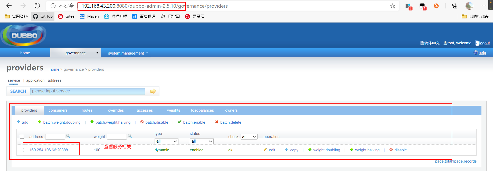

# 9、Consumer搭建过程

## 9.1、新建Maven Project(dubbo_consumer)

- 依赖接口

- 依赖dubbo

  **需要注意dubbo的版本。从2.5.4之后 依赖的spring是4.x版本，之前的spring版本为2.x,需要手动导入spring高版本在dubbo中剔除低版本**

  **Spring2.x之前所有的功能都在一个jar后才拆分**

  - 版本过低，剔除dubbo中的spring之后，需要依赖新版本spring

- 依赖zookeeper客户端工具zkClient

- 依赖curator

- 依赖Netty

```xml
<dependencies>
    <!--导入接口模块-->
    <dependency>
        <groupId>com.zh</groupId>
        <artifactId>dubbo_service</artifactId>
        <version>1.0-SNAPSHOT</version>
    </dependency>
    <!--
    dubbo
    注意版本：从2.5.4开始 依赖的spring是4.x版本
            之前的spring版本为2.x,需要手动导入spring高版本在dubbo中剔除低版本

    -->
    <dependency>
        <groupId>com.alibaba</groupId>
        <artifactId>dubbo</artifactId>
        <version>2.6.7</version>
    </dependency>
    <!-- 访问zookeeper的客户端jar -->
    <dependency>
        <groupId>com.101tec</groupId>
        <artifactId>zkclient</artifactId>
        <version>0.11</version>
    </dependency>
    <!-- 对zookeeper的底层api的一些封装 -->
    <dependency>
        <groupId>org.apache.curator</groupId>
        <artifactId>curator-framework</artifactId>
        <version>4.0.1</version>
    </dependency>
    <!-- 封装了一些高级特性，如：Cache事件监听、选举、分布式锁、分布式Barrier -->
    <dependency>
        <groupId>org.apache.curator</groupId>
        <artifactId>curator-recipes</artifactId>
        <version>4.0.1</version>
    </dependency>
    <!--Netty 是一个广泛使用的 Java 网络编程框架-->
    <dependency>
        <groupId>io.netty</groupId>
        <artifactId>netty-all</artifactId>
        <version>4.1.32.Final</version>
    </dependency>
</dependencies>
```

## 9.2、配置dubbo.xml

```xml
<?xml version="1.0" encoding="UTF-8"?>
<beans xmlns="http://www.springframework.org/schema/beans"
       xmlns:xsi="http://www.w3.org/2001/XMLSchema-instance"
       xmlns:context="http://www.springframework.org/schema/context"
       xmlns:dubbo="http://code.alibabatech.com/schema/dubbo"
       xsi:schemaLocation="http://www.springframework.org/schema/beans
        http://www.springframework.org/schema/beans/spring-beans.xsd
        http://www.springframework.org/schema/context
        http://www.springframework.org/schema/context/spring-context.xsd
        http://code.alibabatech.com/schema/dubbo
        http://code.alibabatech.com/schema/dubbo/dubbo.xsd">

    <!--给当前consumer自定义个名字-->
    <dubbo:application name="dubbo-consumer" />
    <!--配置注册中心-->
    <dubbo:registry address="192.168.43.200:2181" protocol="zookeeper"></dubbo:registry>

    <!--使用注解 配置注解扫描-->
    <dubbo:annotation package="com.zh.service.impl" />

    <bean id="testImpl" class="com.zh.service.impl.TestServiceImpl" ></bean>
</beans>
```

## 9.3、测试接口

- 创建测试接口

  ```java
  package com.zh.service;
  
  public interface TestService {
  
      void test();
  
  }
  ```

- 创建接口实现类

  - **在接口实现类中调用Provider中的服务**
  - **使用`@Reference`注解注入Provider中的服务**

  ```java
  package com.zh.service.impl;
  
  import com.alibaba.dubbo.config.annotation.Reference;
  import com.zh.service.DemoService;
  import com.zh.service.TestService;
  
  /**
   * @author Beloved
   * @date 2020/9/5 16:42
   */
  public class TestServiceImpl implements TestService {
  
      @Reference
      private DemoService demoService;
  
      public void test() {
          // 调用Provider中提供的方法
          String name = demoService.demo("张三");
          System.out.println(name);
      }
  }
  ```

## 9.4、测试

先启动Provider在启动消费者

```java
import com.zh.service.impl.TestServiceImpl;
import org.springframework.context.ApplicationContext;
import org.springframework.context.support.ClassPathXmlApplicationContext;

import java.io.IOException;

/**
 * @author Beloved
 * @date 2020/9/5 16:44
 */
public class Consumer {
    public static void main(String[] args) throws IOException {
        ApplicationContext ac = new ClassPathXmlApplicationContext("applicationContext-dubbo.xml");
        TestServiceImpl service = ac.getBean("testImpl", TestServiceImpl.class);
        service.test();
        System.in.read();
    }
}
```

可以在dubbo-admin中查看服务信息

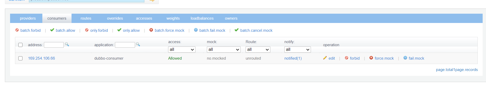