# 1、SOA

**SOA**：面向服务架构（Service-Oriented Architecture）

## 1.1、SOA定位：

- 如何**设计项目**，让开发时更有效率
- SOA是一种思想

## 1.2、之前项目设计架构

- 在公司项目不允许所哟项目都能访问数据库
- 开发时，数据库访问层代码可能出现冗余

## 1.3、SOA架构

- 有一个专门提供服务的单元，专门访问数据库的服务（项目）
- 其他所有单元都调用这个服务
- 开发时可以实现，数据访问控制和代码复用

## 1.4、实现SOA架构常用服务

- Doubbo
- WebService
- DoubboX
- 服务方就是web项目，调用web项目的控制器
  - 使用HttpClient可以调用其他项目的控制器

# 2、RPC

**RPC：远程过程调用协议（Remote Procedure Call）**

## 2.1、RPC解析

客户端(A)通过互联网调用远程服务器,不知道远程服务器具体实现,只知道远程服务器提供了什么功能.


## 2.2、RPC优点

- 数据安全性

# 3、Dubbo

**Dubbo:一个分布式、高性能、透明化的RPC服务框架**

官网：http://dubbo.apache.org/zh-cn/

## 3.1、作用

**提供服务自动注册、自动发现等高效服务治理方案.**

## 3.2、Dubbo架构图

- **Provider** ：提供者,服务发布方.

- **Consumer**：消费者, 调用服务方

- **Container**：Dubbo容器.依赖于Spring容器.

- **Registry**：注册中心.当Container启动时把所有可以提供的服务列表上Registry中进行注册.
  - 作用：告诉Consumer提供了什么服务和服务方在哪里.

- Monitor：监听器

- 虚线都是异步访问,实线都是同步访问

- 蓝色虚线:在启动时完成的功能

- 绿色虚线(实线)都是程序运行过程中执行的功能

- 所有的角色都是可以在单独的服务器上.所以必须遵守特定的协议.


## 3.3、运行原理

- **0（start）**：启动容器,相当于在启动Dubbo的Provider

- **1（register）**：启动后会去注册中心进行注册.注册所有可以提供的服务列表

- **2（subscribe）**：在Consumer启动后会去Registry中获取服务列表和Provider的地址.进行订阅.
- **3（notify）**：当Provider有修改后,注册中心会把消息推送给Consummer
  - 使用了观察者设计模式(又叫发布/订阅设计模式)

- **4（invoke）**：根据获取到的Provider地址,真实调用Provider中功能.
  - 在Consumer方使用了代理设计模式.创建一个Provider方类的一个代理对象.通过代理对象获取Provider中真实功能,起到保护Provider真实功能的作用.

- **5（count）**Consumer和Provider每隔1分钟向Monitor发送统计信息,统计信息包含,访问次数,频率等.

# 4、Dubbo支持的注册中心

- Zookeeper
  - 优点：支持网络集群
  - 缺点：稳定性受限于Zookeeper

- Redis 
  - 优点：性能高.
  - 缺点：对服务器环境要求较高.

- Multicast
  - 优点：面中心化,不需要额外安装软件.
  - 缺点：建议同机房(局域网)内使用

- Simple
  - 适用于测试环境.不支持集群.

# 5、Zookeeper

- Zookeeper 分布式协调组件.
  - 本质一个软件.
- Zookeeper常用功能
  - 发布订阅功能.把zookeeper当作注册中心原因.
  - 分布式/集群管理功能.
- 使用java语言编写的

## 5.1、下载安装

Zookeeper官网：https://zookeeper.apache.org/index.html

3.6.1下载地址：https://www.apache.org/dyn/closer.lua/zookeeper/zookeeper-3.6.1/apache-zookeeper-3.6.1-bin.tar.gz

**Zookeeper安装前提配置好了JDK**

- 上传zookeeper 安装包到linux中/usr/local/temp 中(目录随意,对安装无影响)

- 解压zookeeper压缩包

  ```bash
  tar zxvf apache-zookeeper-3.6.1-bin.tar.gz
  ```

- 移动zookeeper解压后的文件夹到/usr/local下并起名为zookpper(复制后名称任意,对安装无影响)

  ```bash
  mv apache-zookeeper-3.6.1-bin ../zookeeper
  ```

-  进入到zookeeper文件夹中

  ```bash
  [root@localhost local]# pwd
  /usr/local
  [root@localhost local]# cd zookeeper/
  ```

- 在zookeeper中新建data文件夹,做为zookeeper数据存储文件夹

  ```bash
  mkdir data
  ```

- 进入到conf文件夹

  ```bash
  cd conf
  ```

- 复制zoo_sample.cfg,并给新起名的zoo.cfg

  ```bash
  ls
  configuration.xsl  log4j.properties  zoo_sample.cfg
  cp zoo_sample.cfg zoo.cfg  # 复制
  ls
  configuration.xsl  log4j.properties  zoo.cfg  zoo_sample.cfg
  ```

- 修改zoo.cfg中dataDir属性值为新建data文件夹的路径

  ```bash
  vim zoo.cfg
  ```

  修改后的效果   **2181为Zookeeper的端口号**

  

- 修改zookeeper内部自带`jetty`启动端口

  **`jetty`默认端口8080会和Tomcat端口冲突**

  在`zoo.cfg`文件中添加`admin.serverPort=没有被占用的端口号`

  

- 进入到zookeeper/bin文件夹,使用zkServer.sh启动zookeeper

  ```bash
  [root@localhost /]# cd usr/local/zookeeper/bin/  
  [root@localhost bin]# ls
  README.txt    zkCli.cmd  zkEnv.cmd  zkServer.cmd            zkServer.sh            zkSnapShotToolkit.sh  zkTxnLogToolkit.sh
  zkCleanup.sh  zkCli.sh   zkEnv.sh   zkServer-initialize.sh  zkSnapShotToolkit.cmd  zkTxnLogToolkit.cmd
  [root@localhost bin]# ./zkServer.sh 执行命令 查看参数
  ZooKeeper JMX enabled by default
  Using config: /usr/local/zookeeper/bin/../conf/zoo.cfg
  Usage: ./zkServer.sh [--config <conf-dir>] {start|start-foreground|stop|version|restart|status|print-cmd}
  [root@localhost bin]# ./zkServer.sh start  # 启动
  ZooKeeper JMX enabled by default
  Using config: /usr/local/zookeeper/bin/../conf/zoo.cfg
  Starting zookeeper ... STARTED
  ```

  启动效果图

  

-  查看状态,其中Mode: standalone表示单机版

  ```bash
  ./zkServer.sh status
  ```

  

- 为了外部能访问,需要在防火墙中放行2181端口

  **这里使用默认防火墙firewalle不是iptables**

  - 查看Zookeeper默认端口2181是否开启

    ```bash
    firewall-cmd --query-port=2181/tcp
    ```

  - 开启2181端口

    ```bash
    firewall-cmd --zone=public --add-port=2181/tcp --permanent
    ```

  - 重启防火墙

    ```bash
    firewall-cmd --reload
    ```

  - 再次查询是否开启

  - 查询哪些端口是开启的

    ```bash
    firewall-cmd --list-port
    ```

  **具体防火墙命令可参考：**https://www.linuxidc.com/Linux/2019-06/159104.htm

# 6、Dubbo支持的协议

## Dubbo

- Dubbo官方推荐的协议.

- 本质:使用NIO和线程池进行处理.

- 缺点:大文件传输时可能出现文件传输失败问题.

## RMI

- JDK提供的协议,远程方法调用协议.

- 缺点:偶尔连接失败.

- 优点:JDK原生,不需要进行额外配置(导入jar)

## Hession

- 优点:基于http协议,http请求支持.
- 缺点:需要额外导入jar,并在短连接时性能低

# 7、Dubbo中搭建Provider

## 7.1、新建Maven Project, 里面只有接口(dubbo-service)

**为什么这么做**?

RPC框架,不希望Consumer知道具体实现.如果实现类和接口在同一个项目中,Consumer依赖这个项目时,就会知道实现类具体实现.

服务提供者和消费者都必须有接口，所以建一个接口的Model

## 7.2、新建Maven Project, 写接口的实现类(dubbo-service-impl)

### **7.2.1、在duboo-service-impl中配置pom.xml**

- 依赖接口

- 依赖dubbo

  **需要注意dubbo的版本。从2.5.4之后 依赖的spring是4.x版本，之前的spring版本为2.x,需要手动导入spring高版本在dubbo中剔除低版本**

  **Spring2.x之前所有的功能都在一个jar后才拆分**

  - 版本过低，剔除dubbo中的spring之后，需要依赖新版本spring

- 依赖zookeeper客户端工具zkClient

- 依赖curator

- 依赖Netty

  ```xml
  <dependencies>
      <!--导入接口模块-->
      <dependency>
          <groupId>com.zh</groupId>
          <artifactId>dubbo_service</artifactId>
          <version>1.0-SNAPSHOT</version>
      </dependency>
      <!--
          dubbo
          注意版本：从2.5.4开始 依赖的spring是4.x版本
                  之前的spring版本为2.x,需要手动导入spring高版本在dubbo中剔除低版本
  
          -->
      <dependency>
          <groupId>com.alibaba</groupId>
          <artifactId>dubbo</artifactId>
          <version>2.6.7</version>
      </dependency>
      <!--
          访问zookeeper的客户端jar
          dubbo 2.6以前的版本引入zkclient操作zookeeper
          dubbo 2.6及以后的版本引入curator操作zookeeper
          -->
      <!--        <dependency>-->
      <!--            <groupId>com.101tec</groupId>-->
      <!--            <artifactId>zkclient</artifactId>-->
      <!--            <version>0.11</version>-->
      <!--        </dependency>-->
      <!-- 对zookeeper的底层api的一些封装 -->
      <dependency>
          <groupId>org.apache.curator</groupId>
          <artifactId>curator-framework</artifactId>
          <version>4.0.1</version>
      </dependency>
      <!-- 封装了一些高级特性，如：Cache事件监听、选举、分布式锁、分布式Barrier -->
      <!--        <dependency>-->
      <!--            <groupId>org.apache.curator</groupId>-->
      <!--            <artifactId>curator-recipes</artifactId>-->
      <!--            <version>4.0.1</version>-->
      <!--        </dependency>-->
      <!--Netty 是一个广泛使用的 Java 网络编程框架-->
      <dependency>
          <groupId>io.netty</groupId>
          <artifactId>netty-all</artifactId>
          <version>4.1.32.Final</version>
      </dependency>
  </dependencies>
  ```

### **7.2.2、新建实现类,并实现接口方法.**

```java
package com.zh.service.impl;

import com.zh.service.DemoService;

/**
 * @author Beloved
 * @date 2020/9/5 14:27
 */
public class DemoServiceImpl implements DemoService {

    public String demo(String name) {
        return "传递过来的name"+name;
    }
}
```

### 7.2.3、新建配置文件applicationContext-dubbo.xml,并配置

- `<dubbo:application/>`给provider起名,在monitor或管理工具中区别是哪个provider
- `<dubbo:registry/>` 配置注册中心
  - address:注册中心的ip和端口
  - protocol使用哪种注册中心

- `<dubbo:protocol/>` 配置协议
  - name 使用什么协议
  - port: consumer invoke provider时的端口号

- `<dubbo:service/>` 注册接口
  - ref 引用接口实现类<bean>的id值

```xml
<?xml version="1.0" encoding="UTF-8"?>
<beans xmlns="http://www.springframework.org/schema/beans"
       xmlns:xsi="http://www.w3.org/2001/XMLSchema-instance"
       xmlns:context="http://www.springframework.org/schema/context"
       xmlns:dubbo="http://code.alibabatech.com/schema/dubbo"
       xsi:schemaLocation="http://www.springframework.org/schema/beans
        http://www.springframework.org/schema/beans/spring-beans.xsd
        http://www.springframework.org/schema/context
        http://www.springframework.org/schema/context/spring-context.xsd
        http://code.alibabatech.com/schema/dubbo
        http://code.alibabatech.com/schema/dubbo/dubbo.xsd">

    <!--给当前Provider自定义个名字-->
    <dubbo:application name="dubbo-service" />
    <!--配置注册中心-->
    <dubbo:registry address="192.168.43.200:2181" protocol="zookeeper"></dubbo:registry>
    <!--配置端口-->
    <dubbo:protocol name="dubbo" port="20888"></dubbo:protocol>
    <!--注册功能-->
    <dubbo:service interface="com.zh.service.DemoService" ref="demoService"></dubbo:service>
    <bean id="demoService" class="com.zh.service.impl.DemoServiceImpl"></bean>

    <!--使用注解 配置注解扫描-->
    <!--<dubbo:annotation package="com.zh.service.impl" />-->
</beans>
```

**注册服务接口**

可以使用注解`@Service`

- 在配置文件中配置注解扫描

  ```xml
  <dubbo:annotation package="com.zh.service.impl" />
  ```

- 在接口实现类上使用注解`@Service`  **注意：不要和Spring的注解搞混**

  ```java
  package com.zh.service.impl;
  
  import com.alibaba.dubbo.config.annotation.Service;
  import com.zh.service.DemoService;
  
  /**
   * @author Beloved
   * @date 2020/9/5 14:27
   */
  @Service
  public class DemoServiceImpl implements DemoService {
  
      public String demo(String name) {
          return "传递过来的name"+name;
      }
  }
  ```

### 7.2.4、启动容器

- 通过spring方式启动

  - applicationContext-dubbo.xml位置没有要求

  ```java
  import com.alibaba.dubbo.container.Main;
  import org.springframework.context.support.ClassPathXmlApplicationContext;
  import java.io.IOException;
  
  /**
   * @author Beloved
   * @date 2020/9/5 15:00
   */
  public class Test01 {
      public static void main(String[] args) throws IOException {
          ClassPathXmlApplicationContext ac = new ClassPathXmlApplicationContext("applicationContext-dubbo.xml");
          ac.start();
          System.out.println("启动成功");
          System.in.read();
      }
  }
  ```

- 使用dubbo提供的方式启动(推荐使用这种方式)

  - 要求applicationContext-dubbo.xml必须放入类路径下`/META-INF/spring/*.xml`

  ```java
  import com.alibaba.dubbo.container.Main;
  import org.springframework.context.support.ClassPathXmlApplicationContext;
  import java.io.IOException;
  
  /**
   * @author Beloved
   * @date 2020/9/5 15:00
   */
  public class Test01 {
      public static void main(String[] args) throws IOException {
          // 官方推荐
          // 要求配置文件必须放在 /META-INF/spring/*.xml
          Main.main(args);
      }
  }
  ```

  

# 8、Dubbo-Admin管理界面

**本质就是一个web项目。获取注册中心内Provider注册的信息.用页面呈现出来**

参考文章：https://www.cnblogs.com/reformdai/p/11921593.html

**jar下载地址：**https://github.com/apache/dubbo-admin/tree/master

**war下载地址：**https://github.com/apache/dubbo/tree/2.5.x

配置文件建议使用war，springboot使用jar

war包打包方式：https://blog.csdn.net/han447227659/article/details/88421945

## 8.1、打包dubbo-admin

解压下载的文件，进入`dubbo-admin`，使用cmd命令进行打包，在target下会有一个war包

```bash
mvn package -Dmaven.skip.test=true
```


## 8.2、配置dubbo-admin

- 把dubbo-admin-2.5.10.war上传到服务器tomcat中


- 启动tomcat完成后关闭tomcat,删除上传的dubbo-admin-2.5.10.war

  

  - 需要修改解压后的文件夹,如果不删除.war文件,下次重启tomcat会还原成未修改状态
  - 进入dubbo-admin-2.5.10/WEB-INF/dubbo.properties,修改第一行为zookeeper的ip和端口
  - 第二行和第三行为管理界面的用户名和密码
  - **如果zookeeper和dubbo-admin在同一服务器不需要修改IP地址，只需要注意端口。不在同一机器，需要修改为zookeeper所在服务器的ip地址**

  

## 8.3、zookeeper 和tomcat 部署在同一主机8080端口问题

参考文章：https://blog.csdn.net/liujian8654562/article/details/100860002

在zookeeper启动的时候，看打印信息显示会启动jetty，启动一个adminServer on port 8080；

zookeeper最近的版本中有个内嵌的管理控制台是通过jetty启动，也会占用8080 端口。
通过查看zookeeper的官方文档，发现有3种解决途径：

（1）.删除jetty。
（2）修改端口。
修改方法的方法有两种，一种是在启动脚本中增加 -Dzookeeper.admin.serverPort=你的端口号.一种是在zoo.cfg中增加admin.serverPort=没有被占用的端口号
（3）停用这个服务，在启动脚本中增加”-Dzookeeper.admin.enableServer=false”

tomcat 默认的端口也是8080 ，造成无法访问tomcat问题，

```
HTTP ERROR 404

Problem accessing /. Reason:

    Not Found
Powered by Jetty:// 9.4.17.v20190418
123456
```

tomcat 在conf文件中的server.xml 中修改端口：

```
 <Connector port="8090" protocol="HTTP/1.1"
               connectionTimeout="20000"
               redirectPort="8443" />
123
```

改成其他端口即可访问

## 8.4、启动测试

启动tomcat, 在浏览器地址栏访问tomcat中dubbo-admin项目


# 9、Consumer搭建过程

## 9.1、新建Maven Project(dubbo_consumer)

- 依赖接口

- 依赖dubbo

  **需要注意dubbo的版本。从2.5.4之后 依赖的spring是4.x版本，之前的spring版本为2.x,需要手动导入spring高版本在dubbo中剔除低版本**

  **Spring2.x之前所有的功能都在一个jar后才拆分**

  - 版本过低，剔除dubbo中的spring之后，需要依赖新版本spring

- 依赖zookeeper客户端工具zkClient

- 依赖curator

- 依赖Netty

```xml
<dependencies>
    <!--导入接口模块-->
    <dependency>
        <groupId>com.zh</groupId>
        <artifactId>dubbo_service</artifactId>
        <version>1.0-SNAPSHOT</version>
    </dependency>
    <!--
        dubbo
        注意版本：从2.5.4开始 依赖的spring是4.x版本
                之前的spring版本为2.x,需要手动导入spring高版本在dubbo中剔除低版本

        -->
    <dependency>
        <groupId>com.alibaba</groupId>
        <artifactId>dubbo</artifactId>
        <version>2.6.7</version>
    </dependency>
    <!--
        访问zookeeper的客户端jar
        dubbo 2.6以前的版本引入zkclient操作zookeeper
        dubbo 2.6及以后的版本引入curator操作zookeeper
        -->
    <!--        <dependency>-->
    <!--            <groupId>com.101tec</groupId>-->
    <!--            <artifactId>zkclient</artifactId>-->
    <!--            <version>0.11</version>-->
    <!--        </dependency>-->
    <!-- 对zookeeper的底层api的一些封装 -->
    <dependency>
        <groupId>org.apache.curator</groupId>
        <artifactId>curator-framework</artifactId>
        <version>4.0.1</version>
    </dependency>
    <!-- 封装了一些高级特性，如：Cache事件监听、选举、分布式锁、分布式Barrier -->
    <!--        <dependency>-->
    <!--            <groupId>org.apache.curator</groupId>-->
    <!--            <artifactId>curator-recipes</artifactId>-->
    <!--            <version>4.0.1</version>-->
    <!--        </dependency>-->
    <!--Netty 是一个广泛使用的 Java 网络编程框架-->
    <dependency>
        <groupId>io.netty</groupId>
        <artifactId>netty-all</artifactId>
        <version>4.1.32.Final</version>
    </dependency>
</dependencies>
```

## 9.2、配置dubbo.xml

```xml
<?xml version="1.0" encoding="UTF-8"?>
<beans xmlns="http://www.springframework.org/schema/beans"
       xmlns:xsi="http://www.w3.org/2001/XMLSchema-instance"
       xmlns:context="http://www.springframework.org/schema/context"
       xmlns:dubbo="http://code.alibabatech.com/schema/dubbo"
       xsi:schemaLocation="http://www.springframework.org/schema/beans
        http://www.springframework.org/schema/beans/spring-beans.xsd
        http://www.springframework.org/schema/context
        http://www.springframework.org/schema/context/spring-context.xsd
        http://code.alibabatech.com/schema/dubbo
        http://code.alibabatech.com/schema/dubbo/dubbo.xsd">

    <!--给当前consumer自定义个名字-->
    <dubbo:application name="dubbo-consumer" />
    <!--配置注册中心-->
    <dubbo:registry address="192.168.43.200:2181" protocol="zookeeper"></dubbo:registry>

    <!--使用注解 配置注解扫描-->
    <dubbo:annotation package="com.zh.service.impl" />

    <bean id="testImpl" class="com.zh.service.impl.TestServiceImpl" ></bean>
</beans>
```

## 9.3、测试接口

- 创建测试接口

  ```java
  package com.zh.service;
  
  public interface TestService {
  
      void test();
  
  }
  ```

- 创建接口实现类

  - **在接口实现类中调用Provider中的服务**
  - **使用`@Reference`注解注入Provider中的服务**

  ```java
  package com.zh.service.impl;
  
  import com.alibaba.dubbo.config.annotation.Reference;
  import com.zh.service.DemoService;
  import com.zh.service.TestService;
  
  /**
   * @author Beloved
   * @date 2020/9/5 16:42
   */
  public class TestServiceImpl implements TestService {
  
      @Reference
      private DemoService demoService;
  
      public void test() {
          // 调用Provider中提供的方法
          String name = demoService.demo("张三");
          System.out.println(name);
      }
  }
  ```

## 9.4、测试

先启动Provider在启动消费者

```java
import com.zh.service.impl.TestServiceImpl;
import org.springframework.context.ApplicationContext;
import org.springframework.context.support.ClassPathXmlApplicationContext;

import java.io.IOException;

/**
 * @author Beloved
 * @date 2020/9/5 16:44
 */
public class Consumer {
    public static void main(String[] args) throws IOException {
        ApplicationContext ac = new ClassPathXmlApplicationContext("applicationContext-dubbo.xml");
        TestServiceImpl service = ac.getBean("testImpl", TestServiceImpl.class);
        service.test();
        System.in.read();
    }
}
```

可以在dubbo-admin中查看服务信息


# 10、Springboot

## 10.1、Dubbo-admin.jar

- 地址 ：https://github.com/apache/dubbo-admin/tree/master

- 解压修改 dubbo-admin\src\main\resources \application.properties 指定zookeeper地址

  - 修改zookeeper的地址和端口

  ```properties
  server.port=7001
  spring.velocity.cache=false
  spring.velocity.charset=UTF-8
  spring.velocity.layout-url=/templates/default.vm
  spring.messages.fallback-to-system-locale=false
  spring.messages.basename=i18n/message
  spring.root.password=root
  spring.guest.password=guest
  
  dubbo.registry.address=zookeeper://127.0.0.1:2181
  ```

- 在项目目录下打包dubbo-admin

  ```bash
  mvn clean package -Dmaven.test.skip=true
  ```

- 将`/dubbo-admin`中打包的jar包运行即可

  **需要开放dubbo-admin端口：默认端口7001**

## 10.2、dubbo-service

测试接口

```java
package com.zh.service;

/**
 * @author Beloved
 * @date 2020/9/6 14:10
 */
public interface TestService {

    String test();

}
```

## 10.3、（服务提供者）provider-service

### 10.3.1、导入依赖

==**注意：zookeeper依赖不能超过3.4.12，不然连接不上**==

```xml
<!--服务接口-->
<dependency>
    <groupId>com.zh</groupId>
    <artifactId>dubbo-service</artifactId>
    <version>1.0-SNAPSHOT</version>
</dependency>
<!-- dubbo-springboot -->
<dependency>
    <groupId>org.apache.dubbo</groupId>
    <artifactId>dubbo-spring-boot-starter</artifactId>
    <version>2.7.8</version>
</dependency>
<!--zkclient-->
<!--		<dependency>-->
<!--			<groupId>com.101tec</groupId>-->
<!--			<artifactId>zkclient</artifactId>-->
<!--			<version>0.11</version>-->
<!--		</dependency>-->
<!-- 对zookeeper的底层api的一些封装 -->
<dependency>
    <groupId>org.apache.curator</groupId>
    <artifactId>curator-framework</artifactId>
    <version>4.0.1</version>
</dependency>
<!-- 封装了一些高级特性，如：Cache事件监听、选举、分布式锁、分布式Barrier -->
<dependency>
    <groupId>org.apache.curator</groupId>
    <artifactId>curator-recipes</artifactId>
    <version>4.0.1</version>
</dependency>
<!--日志会冲突-->
<!--		<dependency>-->
<!--			<groupId>org.apache.zookeeper</groupId>-->
<!--			<artifactId>zookeeper</artifactId>-->
<!--			<version>3.4.12</version>-->
<!--			&lt;!&ndash;排除slf4j-log4j12&ndash;&gt;-->
<!--			<exclusions>-->
<!--				<exclusion>-->
<!--					<groupId>org.slf4j</groupId>-->
<!--					<artifactId>slf4j-log4j12</artifactId>-->
<!--				</exclusion>-->
<!--			</exclusions>-->
<!--		</dependency>-->
```

### 10.3.2、配置dubbo

```properties
server.port=8081

# 服务应用名称
dubbo.application.name=provider-service
# 注册中心地址
dubbo.registry.address=zookeeper://192.168.43.200:2181
# 需要扫描的包
dubbo.scan.base-packages=com.zh.service.impl
```

### 10.3.3、创建接口实现类

**注册服务：**

- apache的dubbo中抛弃了@service注解
- 使用@DubboService注解注册服务
- 可以与spring中的@service区分开

```java
package com.zh.service.impl;

import com.zh.service.TestService;
import org.apache.dubbo.config.annotation.DubboService;
import org.springframework.stereotype.Service;

/**
 * @author Beloved
 * @date 2020/9/6 14:14
 */
@DubboService  // 注册服务
@Service	   // 注入ioc容器
public class TestServiceImpl implements TestService {
    @Override
    public String test() {
        return "我是一个测试服务";
    }
}
```

### 10.3.4、启动测试


## 10.4、（服务消费者）consumer-service

### 10.4.1、导入依赖

```xml
<!--服务接口-->
<dependency>
    <groupId>com.zh</groupId>
    <artifactId>dubbo-service</artifactId>
    <version>1.0-SNAPSHOT</version>
</dependency>
<!-- dubbo-springboot -->
<dependency>
    <groupId>org.apache.dubbo</groupId>
    <artifactId>dubbo-spring-boot-starter</artifactId>
    <version>2.7.8</version>
</dependency>
<!--zkclient-->
<!--		<dependency>-->
<!--			<groupId>com.101tec</groupId>-->
<!--			<artifactId>zkclient</artifactId>-->
<!--			<version>0.11</version>-->
<!--		</dependency>-->
<!-- 对zookeeper的底层api的一些封装 -->
<dependency>
    <groupId>org.apache.curator</groupId>
    <artifactId>curator-framework</artifactId>
    <version>4.0.1</version>
</dependency>
<!-- 封装了一些高级特性，如：Cache事件监听、选举、分布式锁、分布式Barrier -->
<dependency>
    <groupId>org.apache.curator</groupId>
    <artifactId>curator-recipes</artifactId>
    <version>4.0.1</version>
</dependency>
<!--日志会冲突-->
<!--		<dependency>-->
<!--			<groupId>org.apache.zookeeper</groupId>-->
<!--			<artifactId>zookeeper</artifactId>-->
<!--			<version>3.4.12</version>-->
<!--			&lt;!&ndash;排除slf4j-log4j12&ndash;&gt;-->
<!--			<exclusions>-->
<!--				<exclusion>-->
<!--					<groupId>org.slf4j</groupId>-->
<!--					<artifactId>slf4j-log4j12</artifactId>-->
<!--				</exclusion>-->
<!--			</exclusions>-->
<!--		</dependency>-->
```

### 10.4.2、配置dubbo

```properties
server.port=8002

# 服务应用名称
dubbo.application.name=provider-service
# 注册中心地址
dubbo.registry.address=zookeeper://192.168.43.200:2181
```

### 10.4.3、测试

**使用@DubboReference注解拿到服务**

```java
package com.zh;

import com.zh.service.TestService;
import org.apache.dubbo.config.annotation.DubboReference;
import org.junit.jupiter.api.Test;
import org.springframework.boot.test.context.SpringBootTest;

@SpringBootTest
class ConsumerServiceApplicationTests {

    @DubboReference
    private TestService testService;

    @Test
    void contextLoads() {

        String test = testService.test();

        System.out.println(test);

    }

}
```


# 11、Dubbo相关配置

## 11.1、XML配置方式

### 11.1.1、XML配置覆盖关系

以 timeout 为例，下图显示了配置的查找顺序，其它 retries, loadbalance, actives 等类似：

- **精确优先：**方法级优先，接口级次之，全局配置再次之。
- **消费者优先：**如果级别一样，则消费方优先，提供方次之。

其中，服务提供方配置，通过 URL 经由注册中心传递给消费方。


### 11.1.2、启动时检查

Dubbo 缺省会在启动时检查依赖的服务是否可用，不可用时会抛出异常，阻止 Spring 初始化完成，以便上线时，能及早发现问题，默认 `check="true"`。

可以通过 `check="false"` 关闭检查，比如，测试时，有些服务不关心，或者出现了循环依赖，必须有一方先启动。

另外，如果你的 Spring 容器是懒加载的，或者通过 API 编程延迟引用服务，请关闭 check，否则服务临时不可用时，会抛出异常，拿到 null 引用，如果 `check="false"`，总是会返回引用，当服务恢复时，能自动连上。

**不启动服务提供者直接启动消费端，去除调用服务。直接报错，找不到这个服务**


**配置参考：http://dubbo.apache.org/zh-cn/docs/user/demos/preflight-check.html**

在服务消费者方配置

- 配置单个服务

  ```xml
  <dubbo:reference interface="com.zh.service.DemoService" check="false" />
  ```

- 统一配置

  ```xml
  <dubbo:consumer check="false" />
  ```

#### 11.1.2.1、Zookeeper启动时检查

可以在zookeeper没有启动的时候启动不报错

```xml
<dubbo:registry check="false" />
```

### 11.1.3、超时配置

`timeout`配置服务的超时时间

**参考：11.1.1、XML配置覆盖关系**

**默认时间：1000（毫秒）**

以下顺便就是级别顺序

- 消费者方法级别

  ```xml
  <dubbo:reference interface="com.zh.service.DemoService">
      <dubbo:method name="方法名" timeout="1000"/>
  </dubbo:reference>
  ```

- 提供者方法级别

  ```xml
  <dubbo:service interface="com.zh.service.DemoService" ref="demoServiceImplNew">
      <dubbo:method name="方法名" timeout="2000"/>
  </dubbo:service>
  ```

- 消费者服务级别

  ```xml
  <dubbo:reference interface="com.zh.service.DemoService" timeout="3000"/>
  ```

- 提供者服务级别

  ```xml
  <dubbo:service interface="com.zh.service.DemoService" ref="demoServiceImplNew" timeout="4000"/>
  ```

- 消费者统一配置

  ```xml
  <dubbo:consumer timeout="5000" />
  ```

- 提供者统一配置

  ```xml
  <dubbo:provider timeout="6000" />
  ```

#### 11.1.3.1、超时重试次数配置

在超时时间后可配置 `retries="次数"`

**超时配置规则：**

- 超时重试次数，不包含第一次连接 0代表不重试
- 幂等（查询，删除，修改）：设置重试次数
- 非幂等（添加）：不设置重试次数

**示例：**

在服务实现类线程休眠模拟超时

```java
/**
 * @author Beloved
 * @date 2020/9/5 14:27
 */
public class DemoServiceImpl implements DemoService {

    public String demo(String name) {
        try {
            Thread.sleep(5000);
        } catch (InterruptedException e) {
            e.printStackTrace();
        }

        return name;
    }
}
```

配置超时重连5次

```xml
<dubbo:consumer
        check="false"
        timeout="5000"
        retries="5"
/>
```

启动测试

服务调用6次，请求超时


#### 11.1.3.2、模拟超时重连切换服务

配置服务提供者并行运行，启动多个服务


修改dubbo服务端口，启动多个。对服务实现类坐标记，方便查看


启动三个服务，端口分别是：20881、20882、20883


启动消费者测试，分别查看三个服务，三个服务共调用6次

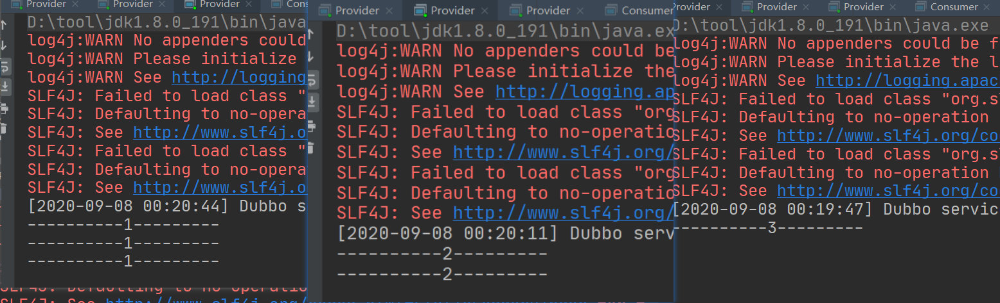

### 11.1.4、多版本

**参考：http://dubbo.apache.org/zh-cn/docs/user/demos/multi-versions.html**

当一个接口实现，出现不兼容升级时，可以用版本号过渡，版本号不同的服务相互间不引用。

可以按照以下的步骤进行版本迁移：

1. 在低压力时间段，先升级一半提供者为新版本
2. 再将所有消费者升级为新版本
3. 然后将剩下的一半提供者升级为新版本

复制一个服务实现类，模拟新版本

**在服务提供者通过`version`指定版本号**

**v 2.0.0**

```java
/**
 * @author Beloved
 * @date 2020/9/5 14:27
 */
public class DemoServiceImplNew implements DemoService {

    public String demo(String name) {
        System.out.println("----------new---------");
        try {
            Thread.sleep(2000);
        } catch (InterruptedException e) {
            e.printStackTrace();
        }

        return "传递过来的name"+name;
    }
}
```

**v 1.0.0**

```java
/**
 * @author Beloved
 * @date 2020/9/5 14:27
 */
public class DemoServiceImplOld implements DemoService {

    public String demo(String name) {
        System.out.println("----------old---------");
        try {
            Thread.sleep(5000);
        } catch (InterruptedException e) {
            e.printStackTrace();
        }

        return "传递过来的name"+name;
    }
}
```

**配置服务**

```xml
<!--
注册功能
timeout：超时时间
stub：是否配置本地存根
-->
<dubbo:service
        interface="com.zh.service.DemoService"
        ref="demoServiceImplOld"
        timeout="3000"
        version="1.0.0"
        stub="com.zh.service.impl.DemoServiceImpl"
/>
<bean id="demoServiceImplOld" class="com.zh.service.impl.DemoServiceImplOld"></bean>

<dubbo:service
        interface="com.zh.service.DemoService"
        ref="demoServiceImplNew"
        timeout="3000"
        version="2.0.0"
/>
<bean id="demoServiceImplNew" class="com.zh.service.impl.DemoServiceImplNew"></bean>
```

**消费端通过`version`指定版本号**

***表示随机版本**

```xml
<dubbo:consumer
        check="false"
        timeout="5000"
        retries="5"
        version="*"
/>
<!--<dubbo:reference interface="com.zh.service.DemoService" version="1.0.0"/>-->
```

### 11.1.5、本地存根

**参考：http://dubbo.apache.org/zh-cn/docs/user/demos/local-stub.html**

例如：在调用远程服务前做判断不符合就调用本地的实现类

一般本地存根和接口模块放在一起

创建本地存根

```java
/**
 * @author Beloved
 * @date 2020/9/7 23:18
 */
public class DemoServiceImpl implements DemoService {

    private final DemoService demoService;

    /**
     * 传入DemoService远程代理对象
     * @param demoService
     */
    public DemoServiceImpl(DemoService demoService){
        super();
        this.demoService = demoService;
    }

    /**
     * 可以在调用服务做一些判断是调用远程实现还是本地实现
     * @param name
     * @return
     */
    public String demo(String name) {

        if (name == null){
            return demoService.demo(name);
        }
        return "我是本地存根";
    }
}
```

**配置**

```xml
<!--
配置本地存根
本地存根的实现一般在接口放
提供者在service配置
参考：http://dubbo.apache.org/zh-cn/docs/user/demos/local-stub.html
消费者在reference配置stub
stub="本地存根实现的全限定类名"
-->
<dubbo:service
               interface="com.zh.service.DemoService"
               ref="demoServiceImplOld"
               timeout="3000"
               version="1.0.0"
               stub="com.zh.service.impl.DemoServiceImpl"
               />
```

**测试**

	


## 11.2、SpringBoot配置

### 11.2.1、在`application.properties`中配置属性

**参考：http://dubbo.apache.org/zh-cn/docs/user/configuration/properties.html**

- `@DubboService`：暴露服务

- `@DubboReference`：引用服务

- 在注解中添加相关配置

  例如：

  ```java
  @DubboService(timeout = 3000)
  @Service
  public class TestServiceImpl implements TestService {
      @Override
      public String test() {
          return "我是一个测试服务";
      }
  }
  // --------------------------------------------------------------------------
  @DubboReference(timeout = 3000)
  private TestService testService;
  ```

### 11.2.2、保留Dubbo XML配置文件

- 在启动类通过`@ImportResource(locations = "classpath:文件地址")`引入配置文件

  ```java
  @ImportResource(locations = "classpath:applicationContext-dubbo.xml")
  @SpringBootApplication
  public class ProviderServiceApplication {
  
     public static void main(String[] args) {
        SpringApplication.run(ProviderServiceApplication.class, args);
     }
  
  }
  ```


### 11.2.3、通过配置类实现

**参考：http://dubbo.apache.org/zh-cn/docs/user/configuration/api.html**

```java
package com.zh.config;

import com.zh.service.TestService;
import com.zh.service.impl.TestServiceImpl;
import org.apache.dubbo.config.*;
import org.springframework.context.annotation.Bean;
import org.springframework.context.annotation.Configuration;

import java.util.ArrayList;
import java.util.List;

/**
 * @author Beloved
 * @date 2020/9/8 8:42
 */
@Configuration
public class DubboConfig {

    /*
     * 可参考dubbo的xml配置文件
     * 每一个标签对应一个xxxConfig
     */
    
    // 应用配置
    @Bean
    public ApplicationConfig applicationConfig(){
        ApplicationConfig application = new ApplicationConfig();
        application.setName("provider-service");
        return application;
    }

    // 连接注册中心配置
    @Bean
    public RegistryConfig registryConfig(){
        RegistryConfig registry = new RegistryConfig();
        registry.setProtocol("zookeeper");
        registry.setAddress("120.55.45.177:2181");
        registry.setUsername("root");
        registry.setPassword("root");
        return registry;
    }

    // 服务提供者协议配置
    @Bean
    public ProtocolConfig protocolConfig(){
        ProtocolConfig protocol = new ProtocolConfig();
        protocol.setName("dubbo");
        protocol.setPort(20881);
        return protocol;
    }

    // 服务提供者暴露服务配置
    @Bean
    public ServiceConfig<TestService> testServiceConfig(TestService testService){

        ServiceConfig<TestService> config = new ServiceConfig<>();
        // 使用全限定类名或对象任意一种即可
        // config.setInterface("com.zh.service.impl.TestServiceImpl");
        config.setInterface(TestService.class);
        config.setRef(testService);
        config.setVersion("1.0.0");

        //配置每一个method信息
        MethodConfig methodConfig = new MethodConfig();
        methodConfig.setName("test");
        methodConfig.setTimeout(5000);

        List<MethodConfig> methods = new ArrayList<>();
        methods.add(methodConfig);
        // 将method配置在ServiceConfig中
        config.setMethods(methods);

        return config;
    }

    // ProviderConfig
    // MonitorConfig
}
```

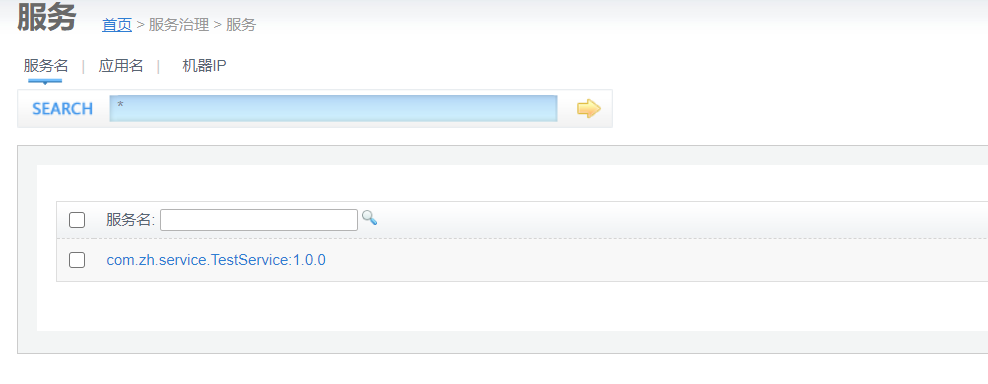

# 12、高可用

## 12.1、zookeeper宕机与dubbo直连

现象：zookeeper注册中心宕机，还可以消费dubbo暴露的服务

健壮性：

- 监控中心宕掉不影响使用，只是丢失部分采样数据
- 数据库宕掉后，注册中心仍能通过缓存提供服务列表查询，但不能注册新服务
- 注册中心对等集群，任意一台宕掉后，将自动切换到另一台
- 注册中心全部宕掉后，服务提供者和服务消费者仍能通过本体缓存通讯
- 服务提供者无状态，任意一台宕掉后，不影响使用
- 服务提供者全部宕掉后，服务消费者应用将无法使用，并无限次重连等待服务提供者恢复

高可用：通过设计，减少系统不能提供服务的时间

**当zookeeper宕机后，服务消费方可以请求之前请求过缓存到本地的数据**

关闭zookeeper，查看状态。消费者任然可以从缓存返回数据

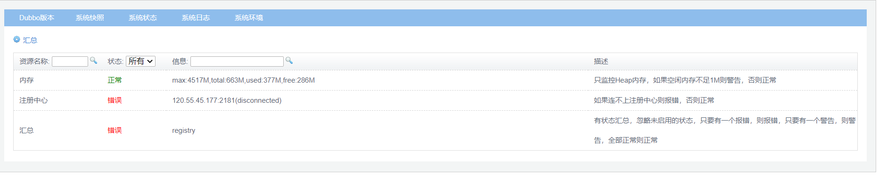


### 12.1.1、dubbo直连

**当zookeeper宕机，可以通过配置的dubbo的url地址，不经过zookeeper直接连接服务提供者**

**端口对应服务提供者配置的端口**

```java
@DubboReference(version = "1.0.0",url = "127.0.0.1:20881")
private TestService testService;
```

测试手动停止zookeeper，可以消费服务

## 12.2、集群下dubbo负载均衡配置

在集群负载均衡时，Dubbo提供了很多种均衡配置，缺省为random随机调用

### 12.2.1、负载均衡策略

- **Random LoadBalance**
  - 随机，按权重设置随机概率
  - 在一个截面上碰撞的概率高，但调用量越大分布越均匀，而且按概率使用权重后也比较均匀，有利于动态调整提供者权重
- **RoundRobin LoadBalance**
  - 伦循，按公约后的权重设置轮伦循比率
  - 存在慢的提供者累计请求的问题。
    - 比如：第二台机器很慢，但没挂，当请求调到第二台时就卡在拿，久而久之，所有请求都卡在第二台

- **LeastActive LoadBalance**
  - 最少活跃调用数，相同活跃数的随机，活跃数调用前后计数差
  - 使慢的提供者收到更少的请求，因为越慢的提供者的调用前后计数查越大
- **ConsistencyHash LoadBalance**
  - 一致性Hash，相同参数的请求总是发到同一提供者
  - 当某一台提供者挂时，原本发往改提供者的请求，基于虚拟节点，平摊到其他提供者，不会引起剧烈变动
  - 算法参见：http://en.wikipedia.org/wiki/Consistent_hashing
  - 缺省只对第一个参数Hash，如果要修改，请配置`<dubbo:parameter key="hash.arguments" value="0,1" />`
  - 缺省用160份虚拟节点，如果要修改，请配置`<dubbo:parameter key="hash.nodes" value="320" />`

### 12.2.2、查看默认机制

**开启多个服务提供者**

修改服务提供者的web端口、dubbo端口、返回信息

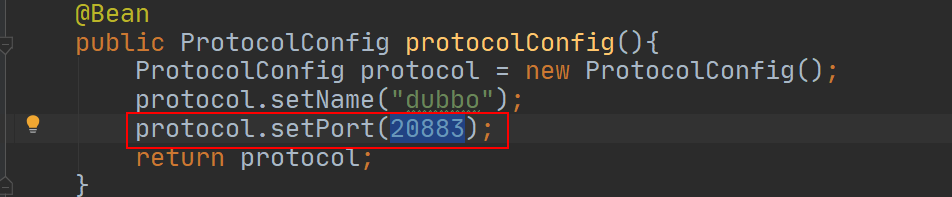

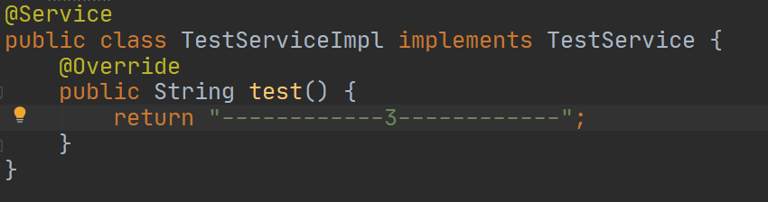

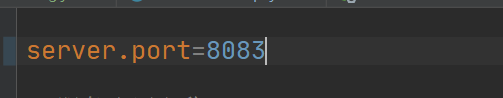

分别启动20881、20882、20883   一个服务，三个提供者

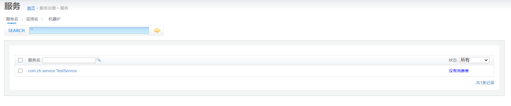

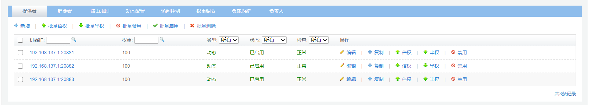

**开启消费者，进行测试**

调用多次，发现是随机调用

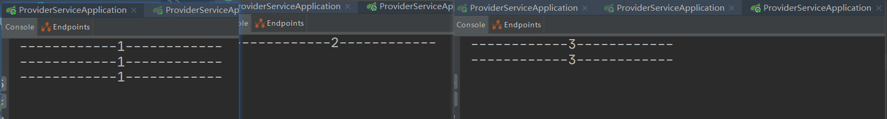

**dubbo：的默认负载均衡策略是：随机（Random ）**

在`LoadBalance`类中查看

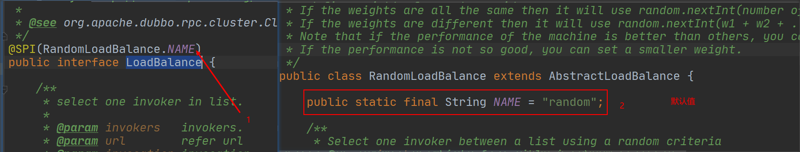

### 12.2.3、配置机制

**参考：http://dubbo.apache.org/zh-cn/docs/user/demos/loadbalance.html**

- 随机（random）
- 伦循（roundrobin）
- 最少活跃调用数（roundrobin）
- 一致性 Hash（consistenthash）

**配置**

- 服务端服务级别	

```xml
<dubbo:service interface="..." loadbalance="roundrobin" />
```

- 客户端服务级别

```xml
<dubbo:reference interface="..." loadbalance="roundrobin" />
```

- 服务端方法级别

```xml
<dubbo:service interface="...">
    <dubbo:method name="..." loadbalance="roundrobin"/>
</dubbo:service>
```

- 客户端方法级别

```xml
<dubbo:reference interface="...">
    <dubbo:method name="..." loadbalance="roundrobin"/>
</dubbo:reference>
```

### 12.2.4、示例

#### 12.2.4.1、随机

**设置权重**

随机可以设置**权重**进行**按权重随机**

权重在服务**提供者通过`weight=x`属性设置权重**

```Java
// 方式一
@DubboService(weight = 1000)
//方式二
ServiceConfig<TestService> config = new ServiceConfig<>();
config.setWeight(500);
//方式三
<dubbo:service
    interface="com.zh.service.DemoService"
    ref="demoServiceImplNew"
    timeout="3000"
    version="2.0.0"
    weight="5000"
/>
```

**权重一般是动态调整，通过dubbo-admin进行动态设置**

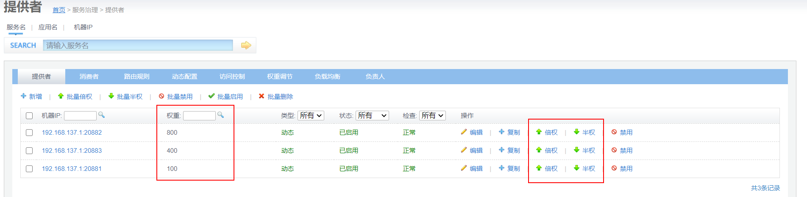

**测试**

刷新多次调用，权重高的被多次调用

```java
@RestController
public class MyController {

    // 随机
    @DubboReference(loadbalance="random")
    private TestService testService;

    @GetMapping("/")
    public String index(){
        return testService.test();
    }
}
```

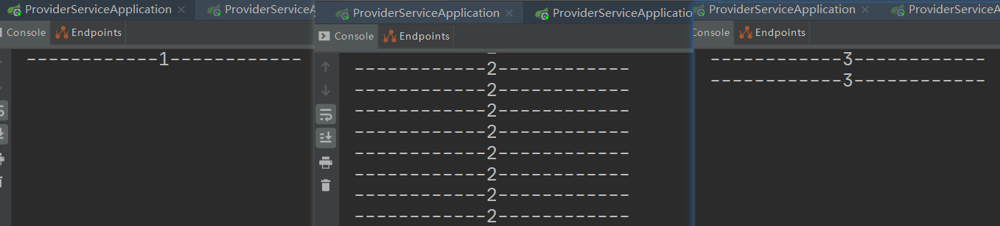

#### 12.2.4.2、伦循

```java
@RestController
public class MyController {

	// 伦循
    @DubboReference(loadbalance="roundrobin")
    private TestService testService;

    @GetMapping("/")
    public String index(){
        return testService.test();
    }
}
```

**多次请求，按顺序执行。但是整体而言还是权重高的被多次调用**

**第一次序号不确定**

## 12.3、降级与容错

### 12.3.1、服务降级

**参考：http://dubbo.apache.org/zh-cn/docs/user/demos/service-downgrade.html**

**什么是服务降级？**

**当服务器压力剧增的情况下，根据实际业务情况及流量，对一些服务和页面有策略的不处理或换种简单的方式处理，从而释放服务器资源以保证核心交易正常运作或高效运作**

可以通过服务降级功能临时屏蔽某个出错的非关键服务，并定义降级后的返回策略

向注册中心写入动态配置覆盖规则：

```java
RegistryFactory registryFactory = ExtensionLoader.getExtensionLoader(RegistryFactory.class).getAdaptiveExtension();
Registry registry = registryFactory.getRegistry(URL.valueOf("zookeeper://10.20.153.10:2181"));
registry.register(URL.valueOf("override://0.0.0.0/com.foo.BarService?category=configurators&dynamic=false&application=foo&mock=force:return+null"));
```

其中：

- `mock=force:return+null` 表示消费方对该服务的方法调用都直接返回 null 值，不发起远程调用。用来屏蔽不重要服务不可用时对调用方的影响。
- 还可以改为 `mock=fail:return+null` 表示消费方对该服务的方法调用在失败后，再返回 null 值，不抛异常。用来容忍不重要服务不稳定时对调用方的影响。

可以直接在dubbo-admin控制台，对消费者进行**屏蔽**或**容错**

- 屏蔽：不发起远程调用，直接在客户端返回空（mock=force:return+null）
- 容错：只有当远程调用出错后，才会返回空（mock=fail:return+null）


### 12.3.2、集群容错

**参考：http://dubbo.apache.org/zh-cn/docs/user/demos/fault-tolerent-strategy.html**

**集群容错模式：**

- Failfast Cluster
  快速失败，只发起一次调用，失败立即报错。通常用于非幂等性的写操作，比如新增记录。

- Failsafe Cluster

  失败安全，出现异常时，直接忽略。通常用于写入审计日志等操作。

- Failback Cluster

  失败自动恢复，后台记录失败请求，定时重发。通常用于消息通知操作。

- Forking Cluster

  并行调用多个服务器，只要一个成功即返回。通常用于实时性要求较高的读操作，但需要浪费更多服务资源。可通过 `forks="2"` 来设置最大并行数。

- Broadcast Cluster

  广播调用所有提供者，逐个调用，任意一台报错则报错 [[2\]](http://dubbo.apache.org/zh-cn/docs/user/demos/fault-tolerent-strategy.html#fn2)。通常用于通知所有提供者更新缓存或日志等本地资源信息。

**集群模式配置：**

按照以下示例在服务提供方和消费方配置集群模式

```xml
<dubbo:service cluster="failsafe" />
```

或

```xml
<dubbo:reference cluster="failsafe" />
```

### 12.3.3、容错整合Hystrix

Hystrix旨在通过控制哪些访问远程系统、服务和第三方库的节点，从而对延迟和故障提供更强大的容错能力。Hystrix具备拥有回退机制和断路器功能的线程和信号隔离，请求缓存和请求打包，以及监控和配置等功能

**导入坐标：**

```xml
<dependency>
    <groupId>org.springframework.cloud</groupId>
    <artifactId>spring-cloud-starter-netflix-hystrix</artifactId>
    <version>2.2.5.RELEASE</version>
</dependency>
```

在启动类上添加**`@EnableHystrix`**注解开启Hystrix服务容错

```java
@EnableDubbo
@EnableHystrix //开启服务容错
@SpringBootApplication
public class ConsumerServiceApplication {

    public static void main(String[] args) {
        SpringApplication.run(ConsumerServiceApplication.class, args);
    }

}
```

在服务提供者的服务实现类上添加**`@HystrixCommand`**注解，让Hystrix接管容错异常

```java
@HystrixCommand // Hystrix接管容错异常
@Override
public String test() {
    // 模拟随机异常
    if (Math.random() > 0.5){
        throw new RuntimeException();
    }
    System.out.println("------------1------------");
    return "------------1------------";
}
```

在服务消费方使用**`@HystrixCommand`**注解，接管容错

`fallbackMethod=`指定异常之后跳转的url

```java
@HystrixCommand(fallbackMethod = "errro")
@GetMapping("/")
public String index(){
    return testService.test();
}

@GetMapping("/errro")
public String errro(){
    return "服务出现异常，已被Hystrix接管";
}
```

测试刷新多次观察返回结果