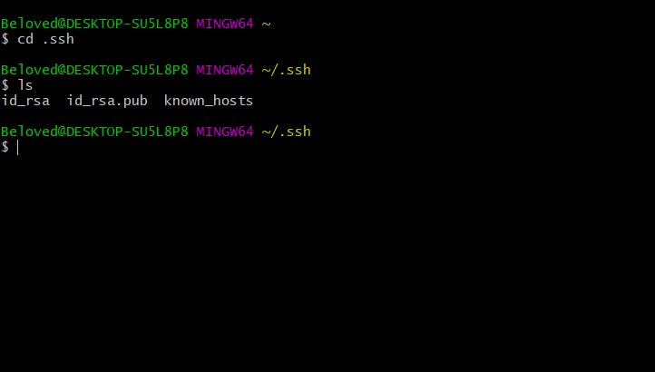
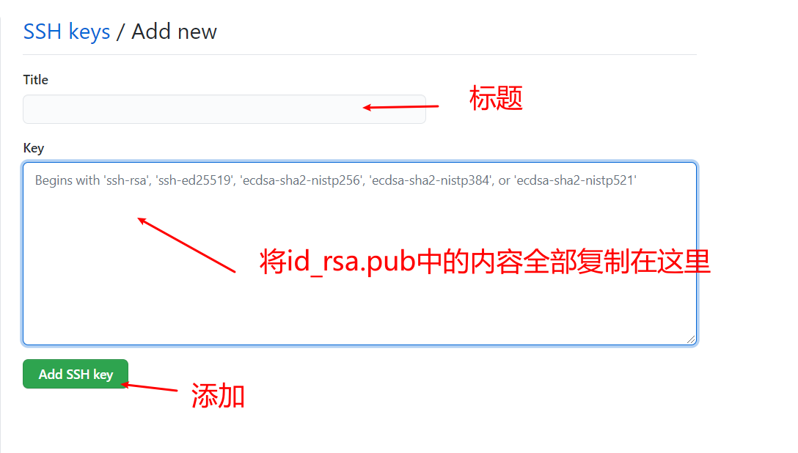

# Git提交文件到GitHub

**使用git命令操作本地文件到GitHub**

## 1、先在GitHub上面创建仓库


## 2、git init

进入要上传的文件夹，鼠标右键，选择Git Bash


**git init    初始化本地git仓库**

**文件夹会有一个.git文件**


## 3、git remote add origin

**Github上复制仓库地址**

**git remote add origin 仓库地址。绑定远程仓库**


## 4、git add

**使用git add 文件名**：将单个文件提交到缓存区

**git add .**   ：将所有文件提交到缓存区


## 5、git commit

**git commit -m“解释说明”**：将文件提交到本地仓库


## 6、git push

第一次要使用**git push -u origin master**：使用此命令登录GitHub账号


==第二次提交不用登录直接git push==

# Git拉去GitHub文件到本地

## 1、git init

**初始化git仓库**

进入文件夹，鼠标右键，选择Git Bash


**git init    初始化本地git仓库**

**文件夹会有一个.git文件**


## 2、git remote add origin

**Github上复制仓库地址**

**git remote add origin 仓库地址。绑定远程仓库**


### 3、git pull

**git pull --rebase origin master**：将远程仓库文件拉去到本地


# 常用命令

## 清空用户名密码

```git
git config --system --unset credential.helper
```

## 分支

```git
# 列出所有本地分支
$ git branch

# 列出所有远程分支
$ git branch -r

# 列出所有本地分支和远程分支
$ git branch -a

# 新建一个分支，但依然停留在当前分支
$ git branch [branch-name]

# 新建一个分支，并切换到该分支
$ git checkout -b [branch]

# 新建一个分支，指向指定commit
$ git branch [branch] [commit]

# 新建一个分支，与指定的远程分支建立追踪关系
$ git branch --track [branch] [remote-branch]

# 切换到指定分支，并更新工作区
$ git checkout [branch-name]

# 切换到上一个分支
$ git checkout - 

# 建立追踪关系，在现有分支与指定的远程分支之间
$ git branch --set-upstream [branch] [remote-branch] 

# 合并指定分支到当前分支
$ git merge [branch] 

# 选择一个commit，合并进当前分支
$ git cherry-pick [commit]

# 删除分支
$ git branch -d [branch-name]

# 删除远程分支
$ git push origin --delete [branch-name]
$ git branch -dr [remote/branch]
```

## 标签

```git
# 列出所有tag
$ git tag

# 新建一个tag在当前commit
$ git tag [tag] 

# 新建一个tag在指定commit
$ git tag [tag] [commit]

# 删除本地tag 

$ git tag -d [tag] 
# 删除远程tag

$ git push origin :refs/tags/[tagName] 
# 查看tag信息

$ git show [tag]
# 提交指定tag 

$ git push [remote] [tag]
# 提交所有tag

$ git push [remote] --tags 
# 新建一个分支，指向某个tag 

$ git checkout -b [branch] [tag]
```

## 查看信息

```git
# 显示有变更的文件
$ git status

# 显示当前分支的版本历史
$ git log

# 显示commit历史，以及每次commit发生变更的文件
$ git log --stat

# 搜索提交历史，根据关键词
$ git log -S [keyword]

# 显示某个commit之后的所有变动，每个commit占据一行
$ git log [tag] HEAD --pretty=format:%s

# 显示某个commit之后的所有变动，其"提交说明"必须符合搜索条件
$ git log [tag] HEAD --grep feature

# 显示某个文件的版本历史，包括文件改名
$ git log --follow [file]
$ git whatchanged [file]

# 显示指定文件相关的每一次diff
$ git log -p [file]

# 显示过去5次提交
$ git log -5 --pretty --oneline 

# 显示所有提交过的用户，按提交次数排序 
$ git shortlog -sn

# 显示指定文件是什么人在什么时间修改过
$ git blame [file]

# 显示暂存区和工作区的差异
$ git diff 

# 显示暂存区和上一个commit的差异
$ git diff --cached [file]

# 显示工作区与当前分支最新commit之间的差异
$ git diff HEAD

# 显示两次提交之间的差异
$ git diff [first-branch]...[second-branch]

# 显示今天你写了多少行代码 
$ git diff --shortstat "@{0 day ago}"

# 显示某次提交的元数据和内容变化
$ git show [commit]

# 显示某次提交发生变化的文件
$ git show --name-only [commit] 

# 显示某次提交时，某个文件的内容
$ git show [commit]:[filename]

# 显示当前分支的最近几次提交
$ git reflog
```

## 远程同步

```git
# 下载远程仓库的所有变动 
$ git fetch [remote] 

# 显示所有远程仓库 
$ git remote -v

# 显示某个远程仓库的信息 
$ git remote show [remote] 

# 增加一个新的远程仓库，并命名
$ git remote add [shortname] [url]

# 取回远程仓库的变化，并与本地分支合并
$ git pull [remote] [branch] 

# 上传本地指定分支到远程仓库
$ git push [remote] [branch] 

# 强行推送当前分支到远程仓库，即使有冲突
$ git push [remote] --force

# 推送所有分支到远程仓库
$ git push [remote] --all
```

## 撤销

```git
# 恢复暂存区的指定文件到工作区
$ git checkout [file]
 
# 恢复某个commit的指定文件到暂存区和工作区
$ git checkout [commit] [file]
 
# 恢复暂存区的所有文件到工作区
$ git checkout .
 
# 重置暂存区的指定文件，与上一次commit保持一致，但工作区不变 
$ git reset [file]
  
# 重置暂存区与工作区，与上一次commit保持一致
$ git reset --hard
 
# 重置当前分支的指针为指定commit，同时重置暂存区，但工作区不变
$ git reset [commit]
 
# 重置当前分支的HEAD为指定commit，同时重置暂存区和工作区，与指定commit一致
$ git reset --hard [commit]
  
# 重置当前HEAD为指定commit，但保持暂存区和工作区不变 
$ git reset --keep [commit]
 
# 新建一个commit，用来撤销指定commit
# 后者的所有变化都将被前者抵消，并且应用到当前分支
$ git revert [commit]
  
# 暂时将未提交的变化移除，稍后再移入
$ git stash
$ git stash pop
```

# 配置ssh

## 查看之前是否配置ssh

打开`git bash`终端运行`cd .ssh`

这里会存在两种情况：

1. 没有提示直接进入文件。为了防止意外，最好删除原来的，重新生成

   

2. 提示没有对应的文件夹或者文件。

   1. 生成ssh文件`ssh-keygen -t rsa -C 'your-email'  `

      > **注意**在用户目录下执行此命令
      >
      > `your-email`是自己绑定的对应邮箱

      全部为空，按回车

      会在用户目录下`.ssh`文件夹里生成三个文件

      

## 配置

在`.ssh`文件夹下找到`id_rsa.pub`文件，可以用记事本打开。复制里面的全部内容

打开github或者gitee配置。找到SSH配置菜单


添加 ssh-key。



配置完成

## 注意

配置完成之后提交代码可能还需要密码

那是因为仓库是使用`https`绑定的

将仓库换成`ssh`绑定即可

```bash
git remote remove origin
git remote add origin git@github.com:Username/Your_Repo_Name.git
```

