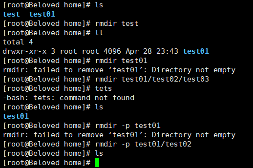
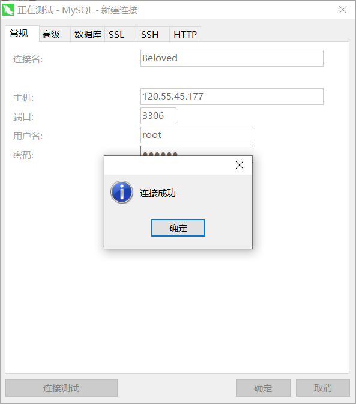

# 1、Linux基础

## 1.1、目录说明

`cd /`：切换到系统根目录

`ls /`：查看目录


详细说明见：https://blog.csdn.net/qq_33858250/article/details/81839619

## 1.2、常用命令

`cd`：切换目录命令

`./`：当前目录

`cd..`：返回上一级目录

`ls`：列出目录

- `-a`：all 查看全部文件包括隐藏文件

- `-l`：列出所有文件，包含文件的属性和权限，没有隐藏文件

- 可以组合使用


`clear`：清屏

`pwd`：显示用户当前所在的目录

`mkdir`：创建目录

- `-p`：创建多级目录


`rmdir`：：删除目录，仅可以删除空的目录，下面有文件，需要先删除文件

- `-p`：删除多个目录



`cp`：复制文件或目录


`rm`：删除文件或目录

- `-f`：忽略不存在的文件，不会出现警告，强制删除
- `-r`：删除多级目录
- `-i`：删除询问是否删除
- **rm -rf /      删除系统中的所有文件**


`mv`：移动或重命名

- `-f`：强制
- `-u`：只替换已经更新过的文件


`ifconfig`：查看网络信息


## 1.3、压缩、解压

- tar命令

  　　解包：tar zxvf FileName.tar

    　　打包：tar czvf FileName.tar DirName

  

- gz命令

  　　解压1：gunzip FileName.gz

    　　解压2：gzip -d FileName.gz

    　　压缩：gzip FileName

    　　.tar.gz 和 .tgz

    　　解压：tar zxvf FileName.tar.gz

    　　压缩：tar zcvf FileName.tar.gz DirName

    压缩多个文件：tar zcvf FileName.tar.gz DirName1 DirName2 DirName3 ...

  

- bz2命令

  　　解压1：bzip2 -d FileName.bz2

    　　解压2：bunzip2 FileName.bz2

    　　压缩： bzip2 -z FileName

    　　.tar.bz2

    　　解压：tar jxvf FileName.tar.bz2

    　　压缩：tar jcvf FileName.tar.bz2 DirName

  

- bz命令

  　　解压1：bzip2 -d FileName.bz

    　　解压2：bunzip2 FileName.bz

    　　压缩：未知

    　　.tar.bz

    　　解压：tar jxvf FileName.tar.bz

  

- Z命令

  　　解压：uncompress FileName.Z

    　　压缩：compress FileName

    　　.tar.Z

    　　解压：tar Zxvf FileName.tar.Z

    　　压缩：tar Zcvf FileName.tar.Z DirName

  

- zip命令

  　　解压：unzip FileName.zip

    　　压缩：zip FileName.zip DirName

## 1.4、文件内容查看

- `cat`：由第一行开始显示文件内容

- `tac`：从最后一行开始显示，是`cat`的倒写

- `nl`：显示的时候，输出行号

  

- `more`：分页显示     空格翻页   Enter下一行   :f显示当前行号

  

- `less`：与`more`类是，可以向前翻页  上下键翻页    q退出

- `head`：只看头几行

  

- `tall`：只看后几行

**`man`可以查看命令的使用文档，如：`man tall`**

## 1.5、进程管理

`ps`：查看当前系统中正在执行的各种进程信息

`ps -xx`:

- `-a` ：显示当前终端运行的所有进程信息（当前的进程一个）
- `-u`：以用户的信息展示进程
- `-x`：显示后台运行进程的参数

`pa -aux`：查看所有的进程

`|`：Linux中是管道符。比如`A|B`：将A查询到的数据给B使用

`grep`：查找文件中符合条件的字符串

```bash
ps -aux|grep java # 查看Java相关的进程
ps -aux|grep mysql # 查看mysql相关的进程
```

**`ps -ef`查看父进程**

比如`ps -ef|grep java`查看java相关的父进程。一般使用文件树查看

`pstree -pu`：

- `-p`：显示父id
- `-u`：显示用户组

**结束进程**

`kill -9  进程id`

## 1.6、防火墙

1.首先查看防火墙状态

```
firewall-cmd --state
```

下图所示为防火墙处于关闭中


2.开启防火墙，启动firewall

```
systemctl start firewalld.service
```

3.设置开机自启

```
systemctl enable firewalld.service
```

4.重启防火墙服务

```
systemctl restart firewalld.service
```

5.检查防火墙状态是否打开

```
firewall-cmd --state
```

如下图显示防火墙已打开：


6.开启特定端口的方法：

```
在开启防火墙之后，我们有些服务就会访问不到，是因为服务的相关端口没有打开。
在此以打开8080端口为例（开放端口+重启防火墙 → 该端口生效）；
命令：
```

开端口命令：firewall-cmd --zone=public --add-port=8080/tcp --permanent
重启防火墙：systemctl restart firewalld.service

命令含义：

--zone #作用域

--add-port=80/tcp #添加端口，格式为：端口/通讯协议

--permanent #永久生效，没有此参数重启后失效

7.查看开启的所有的端口的方法：

```
firewall-cmd --list-all
```

https://www.linuxidc.com/Linux/2019-06/159104.htm

# 2、JDK安装

### jdk下载

https://www.oracle.com/java/technologies/javase/javase-jdk8-downloads.html


2. 在/usr/local中创建Java目录。将下载的压缩包导入

3. 解压到当前目录

   

   

**配置环境变量**

1. 编辑/etc/profile文件
   `vim /etc/profile`

2. 按`Insert`或者`I`键，切换成编辑模式。
   找到export注释掉原来的，按图片输入下面一段话。

   ```bash
   export JAVA_HOME=/usr/local/jdk
   export PATH=$JAVA_HOME/bin:$PATH
   ```
   


3. 按`Esc`退出编辑模式，输入`:wq`保存并退出

4. 输入`source /etc/profile`使刚才修改过的生效

   

**验证**

输入`java -version`


# 3、tomact安装

1. 下载：https://tomcat.apache.org/download-90.cgi

   

2. 在/usr/local中创建tomact目录。将下载的压缩包导入

3. 解压到当前目录

   

## 启动/停止

在`bin`目录下

```bash
./startup.sh   # 启动
./shutdown.sh  # 停止
```


5. **注意**：需要开启8080防火墙端口，配置阿里云安全组开启8080

## 解决tomcat启动慢

**tomact启动的时候开启8005端口。启动慢，在关闭会报错**

**Tocmat的Session ID是通过SHA1算法计算得到的，计算Session ID的时候必须有一个密钥。为了提高安全性Tomcat在启动的时候回通过随机生成一个密钥。将随机函数生成器替换伪随机函数**

在JAVA安装目录/jre/lib/security/java.security这个文件

找到`securerandom.source=file:/dev/urandom`
替换成`securerandom.source=file:/dev/./urandom`


重新启动tomact测试

参考文档：https://blog.csdn.net/Hu_wen/article/details/82908660

## Tomact9安装SSL证书

参考文档：https://help.aliyun.com/document_detail/102939.html?spm=5176.2020520163.0.0.561e56a7k7p3oT#title-hds-sw4-4d5

**注意：**证书每次重新下载，上次的证书就会失效

`server.xml`

```xml
<?xml version="1.0" encoding="UTF-8"?>
<!--
  Licensed to the Apache Software Foundation (ASF) under one or more
  contributor license agreements.  See the NOTICE file distributed with
  this work for additional information regarding copyright ownership.
  The ASF licenses this file to You under the Apache License, Version 2.0
  (the "License"); you may not use this file except in compliance with
  the License.  You may obtain a copy of the License at

      http://www.apache.org/licenses/LICENSE-2.0

  Unless required by applicable law or agreed to in writing, software
  distributed under the License is distributed on an "AS IS" BASIS,
  WITHOUT WARRANTIES OR CONDITIONS OF ANY KIND, either express or implied.
  See the License for the specific language governing permissions and
  limitations under the License.
-->
<!-- Note:  A "Server" is not itself a "Container", so you may not
     define subcomponents such as "Valves" at this level.
     Documentation at /docs/config/server.html
 -->
<Server port="8005" shutdown="SHUTDOWN">
  <Listener className="org.apache.catalina.startup.VersionLoggerListener" />
  <!-- Security listener. Documentation at /docs/config/listeners.html
  <Listener className="org.apache.catalina.security.SecurityListener" />
  -->
  <!--APR library loader. Documentation at /docs/apr.html -->
  <Listener className="org.apache.catalina.core.AprLifecycleListener" SSLEngine="on" />
  <!-- Prevent memory leaks due to use of particular java/javax APIs-->
  <Listener className="org.apache.catalina.core.JreMemoryLeakPreventionListener" />
  <Listener className="org.apache.catalina.mbeans.GlobalResourcesLifecycleListener" />
  <Listener className="org.apache.catalina.core.ThreadLocalLeakPreventionListener" />

  <!-- Global JNDI resources
       Documentation at /docs/jndi-resources-howto.html
  -->
  <GlobalNamingResources>
    <!-- Editable user database that can also be used by
         UserDatabaseRealm to authenticate users
    -->
    <Resource name="UserDatabase" auth="Container"
              type="org.apache.catalina.UserDatabase"
              description="User database that can be updated and saved"
              factory="org.apache.catalina.users.MemoryUserDatabaseFactory"
              pathname="conf/tomcat-users.xml" />
  </GlobalNamingResources>

  <!-- A "Service" is a collection of one or more "Connectors" that share
       a single "Container" Note:  A "Service" is not itself a "Container",
       so you may not define subcomponents such as "Valves" at this level.
       Documentation at /docs/config/service.html
   -->
  <Service name="Catalina">

    <!--The connectors can use a shared executor, you can define one or more named thread pools-->
    <!--
    <Executor name="tomcatThreadPool" namePrefix="catalina-exec-"
        maxThreads="150" minSpareThreads="4"/>
    -->


    <!-- A "Connector" represents an endpoint by which requests are received
         and responses are returned. Documentation at :
         Java HTTP Connector: /docs/config/http.html
         Java AJP  Connector: /docs/config/ajp.html
         APR (HTTP/AJP) Connector: /docs/apr.html
         Define a non-SSL/TLS HTTP/1.1 Connector on port 8080
    -->
    <Connector port="80" protocol="HTTP/1.1"
               connectionTimeout="20000"
               redirectPort="443" />
    <!-- A "Connector" using the shared thread pool-->
    <!--
    <Connector executor="tomcatThreadPool"
               port="8080" protocol="HTTP/1.1"
               connectionTimeout="20000"
               redirectPort="8443" />
    -->
    <!-- Define an SSL/TLS HTTP/1.1 Connector on port 8443
         This connector uses the NIO implementation. The default
         SSLImplementation will depend on the presence of the APR/native
         library and the useOpenSSL attribute of the
         AprLifecycleListener.
         Either JSSE or OpenSSL style configuration may be used regardless of
         the SSLImplementation selected. JSSE style configuration is used below.
    -->
    <!--
    <Connector port="8443" protocol="org.apache.coyote.http11.Http11NioProtocol"
               maxThreads="150" SSLEnabled="true">
        <SSLHostConfig>
            <Certificate certificateKeystoreFile="conf/localhost-rsa.jks"
                         type="RSA" />
        </SSLHostConfig>
    </Connector>
    -->
	<Connector port="443" protocol="org.apache.coyote.http11.Http11NioProtocol"
               maxThreads="150" SSLEnabled="true">
        <SSLHostConfig>
            <Certificate certificateKeystoreFile="/usr/local/tomcat/tomcat9.0.34/cert/3837434_www.beloved.ink.pfx"
						 certificateKeystorePassword="BE2k1FD3"
                          certificateKeystoreType="PKCS12" />
        </SSLHostConfig>
    </Connector>
    <!-- Define an SSL/TLS HTTP/1.1 Connector on port 8443 with HTTP/2
         This connector uses the APR/native implementation which always uses
         OpenSSL for TLS.
         Either JSSE or OpenSSL style configuration may be used. OpenSSL style
         configuration is used below.
    -->
    <!--
    <Connector port="8443" protocol="org.apache.coyote.http11.Http11AprProtocol"
               maxThreads="150" SSLEnabled="true" >
        <UpgradeProtocol className="org.apache.coyote.http2.Http2Protocol" />
        <SSLHostConfig>
            <Certificate certificateKeyFile="conf/localhost-rsa-key.pem"
                         certificateFile="conf/localhost-rsa-cert.pem"
                         certificateChainFile="conf/localhost-rsa-chain.pem"
                         type="RSA" />
        </SSLHostConfig>
    </Connector>
    -->

    <!-- Define an AJP 1.3 Connector on port 8009 -->
    
    <Connector protocol="AJP/1.3"
               port="8009"
               redirectPort="443" />
    

    <!-- An Engine represents the entry point (within Catalina) that processes
         every request.  The Engine implementation for Tomcat stand alone
         analyzes the HTTP headers included with the request, and passes them
         on to the appropriate Host (virtual host).
         Documentation at /docs/config/engine.html -->

    <!-- You should set jvmRoute to support load-balancing via AJP ie :
    <Engine name="Catalina" defaultHost="localhost" jvmRoute="jvm1">
    -->
    <Engine name="Catalina" defaultHost="localhost">

      <!--For clustering, please take a look at documentation at:
          /docs/cluster-howto.html  (simple how to)
          /docs/config/cluster.html (reference documentation) -->
      <!--
      <Cluster className="org.apache.catalina.ha.tcp.SimpleTcpCluster"/>
      -->

      <!-- Use the LockOutRealm to prevent attempts to guess user passwords
           via a brute-force attack -->
      <Realm className="org.apache.catalina.realm.LockOutRealm">
        <!-- This Realm uses the UserDatabase configured in the global JNDI
             resources under the key "UserDatabase".  Any edits
             that are performed against this UserDatabase are immediately
             available for use by the Realm.  -->
        <Realm className="org.apache.catalina.realm.UserDatabaseRealm"
               resourceName="UserDatabase"/>
      </Realm>

      <Host name="localhost"  appBase="webapps"
            unpackWARs="true" autoDeploy="true">

        <!-- SingleSignOn valve, share authentication between web applications
             Documentation at: /docs/config/valve.html -->
        <!--
        <Valve className="org.apache.catalina.authenticator.SingleSignOn" />
        -->

        <!-- Access log processes all example.
             Documentation at: /docs/config/valve.html
             Note: The pattern used is equivalent to using pattern="common" -->
        <Valve className="org.apache.catalina.valves.AccessLogValve" directory="logs"
               prefix="localhost_access_log" suffix=".txt"
               pattern="%h %l %u %t &quot;%r&quot; %s %b" />

      </Host>
    </Engine>
  </Service>
</Server>
```

## 配置Http自动跳转为HTTPS

在web.xml文件中`web-app`标签中最后添加以下内容，实现HTTP自动跳转为HTTPS。

```xml
<security-constraint> 
    <web-resource-collection > 
        <web-resource-name >SSL</web-resource-name>  
        <url-pattern>/*</url-pattern> 
    </web-resource-collection> 
    <user-data-constraint> 
        <transport-guarantee>CONFIDENTIAL</transport-guarantee> 
    </user-data-constraint> 
</security-constraint>
```

# 4、mysql安装

## 4.1、安装

- 下载mysql的源

  ```bash
  wget http://dev.mysql.com/get/mysql57-community-release-el7-7.noarch.rpm 
  ```

- 安装yum库

  ```bash
  yum localinstall -y mysql57-community-release-el7-7.noarch.rpm
  ```

- 安装MySQL

  ```bash
  yum install -y mysql-community-server
  ```

- 启动MySQL服务

  ```bash
  systemctl start mysqld.service
  ```

## 4.2、修改默认密码

MySQL5.7加强了root用户的安全性，因此在第一次安装后会初始化一个随机密码，以下为查看初始随机密码的方式

```bash
grep 'temporary password' /var/log/mysqld.log
```


进入mysql

```ba
mysql -uroot -p
```


修改密码

```mysql
ALTER USER 'root'@'localhost' IDENTIFIED BY '123456';
```

ng)

这是 mysql 初始化时，使用临时密码，修改自定义密码时，由于自定义密码比较简单，就出现了不符合密码策略的问题。

必须修改两个全局参数：
首先，修改`validate_password_policy`参数的值

```mysq
mysql> set global validate_password_policy=0; 
```

再修改密码的长度

```sql
set global validate_password_length=1;
```

再次执行修改密码就可以了

```mysql
ALTER USER 'root'@'localhost' IDENTIFIED BY '123456';
```

授权其他机器登陆

```mysql
GRANT ALL PRIVILEGES ON *.* TO 'root'@'%' IDENTIFIED BY '123456' WITH GRANT OPTION;

FLUSH  PRIVILEGES;
```


**注意mysql的默认端口3306的防火墙和安全组要开启**



# 5、运行jar包

要运行java的项目需要先将项目打包成war包或者jar包，打包成war包需要将war包部署到tomcat服务器上才能运行。而打包成jar包可以直接使用java命令执行。

在linux系统中运行jar包主要有以下几种方式。

一、java -jar XXX.jar

这是最基本的jar包执行方式，但是当我们用ctrl+c中断或者关闭窗口时，程序也会中断执行。

二、java -jar XXX.jar &

&代表在后台运行，使用ctrl+c不会中断程序的运行，但是关闭窗口会中断程序的运行。

三、nohup java -jar XXX.jar &

使用这种方式运行的程序日志会输出到当前目录下的nohup.out文件，使用ctrl+c中断或者关闭窗口都不会中断程序的执行。

三、nohup java -jar XXX.jar >temp.out &

\>temp.out的意思是将日志输出重定向到temp.out文件，使用ctrl+c中断或者关闭窗口都不会中断程序的执行

**关闭jar**

```bash
#列出后台进程
ps -ef | grep java
#杀死进程，-9：无条件终止进程，xxxx：要关闭进程的pid
kill -9 xxxx
```

# 6、配置纯净镜像

## 6.1、配置ping命令

参考文章

https://blog.csdn.net/weixin_38214171/article/details/85330179

**注意：**

配置的ip地址，不一定是在VMware中看的

## 6.2、配置ifconfig命令

https://www.linuxidc.com/Linux/2018-10/154766.htm

## 6.3、虚拟机无法连接宿主机

https://www.cnblogs.com/hanxiaomeng/p/12468921.html