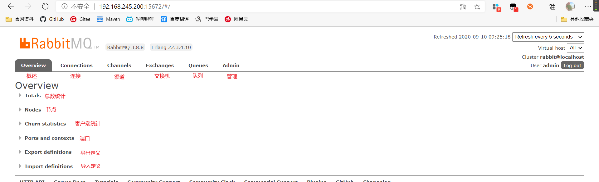
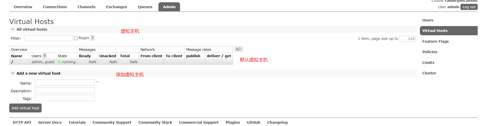
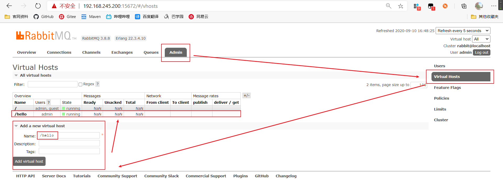

# 1、MQ

## 1.1、什么是MQ

**MQ（Message Queue）消息队列：**，是基础数据结构中“先进先出”的一种数据结构。一般用来解决应用解耦，异步消息，流量削锋等问题，实现高性能，高可用，可伸缩和最终一致性架构。

MQ，通过典型的`生产者`和`消费者`模型，生产者不断向消息队列中生产消息，消费者不断的从队列中获取消息。因为消息的生产和消费都是异步的，而且只关心消息的发送和接收，没有业务逻辑的侵入，轻松的实现系统间解耦。别名为`消息中间件` 通过利用高效可靠的消息传递机制进行平台无关的数据交流，并基于数据通信来进行分布式系统的集成。

## 1.2、主流的MQ

-  **ActiveMQ**
  - ActiveMQ是Apache出品，最流行的，能力强劲的开源消息总线。它是一个完全支持JMS规范的消息中间件。丰富的API，多种集群架构模式让ActiveMQ在业界成为老牌的消息中间件，在中小型企业颇受欢迎
- **Kafka**
  - Kafka是LinkedIn开源的分布式发布-订阅消息系统，目前归属于Apache顶级项目。Kafka主要特点是基于Pull的模式来处理消息消费，追求高吞吐量，一开始的目的就是用于日志收集和传输。0.8版本开始支持复制，不支持事务，对消息的重复、丢失、错误没有严格要求，适合产生大量数据的互联网服务的数据手机业务
- **RocketMQ**
  - RocketMQ是阿里开源的消息中间件，他是纯Java开发，具有高吞吐量、高可用性、适合大规模分布式系统应用的特点。RocketMQ思路起源于Kafka，单并不是Kafka的一个Copy，它对消息的可靠传输及事务性做了优化，目前在阿里集团被广泛应用于交易、充值、流计算、消息推送、日志流式处理、binglog分发等场景
- **RabbitMQ**
  - RabbitMQ是使用**Erlang**语言开发的开源消息队列系统，基于AMQP协议来实现。AMQP的主要特征是面向消息、队列、路由（包括点对点和发布/订阅）、可靠性、安全。AMQP协议更多用在企业系统内对数据一致性、稳定性和可靠性要求很高的场景，对性能和吞吐量的要求还在其次

> RabbitMQ比Kafka可靠，Kafka更适合IO高吞吐的处理，一般应用在大数据日志处理或对实时性（少量延迟）、可靠性（少量丢数据）要求稍低的场景使用，比如ELK日志收集

# 2、RabbitMQ

> 基于AMQP协议，erlang语言开发，是部署最广泛的开源消息中间件，最受欢迎的开源消息中间件之一

**官网：https://www.rabbitmq.com/**

**官方教程：https://www.rabbitmq.com/#getstarted**

**身份信息文档：https://www.rabbitmq.com/access-control.html**

**配置：https://www.rabbitmq.com/configure.html#config-location**

## 2.1、AMQP协议

**AMQP（advanced message queuing protocol）在2003年时被提出，最早用于解决金融领域不同平台之间的消息传递交互问题。顾名思义，AMQP是一种协议，更准确的说是一种binary wire-level protocol（链接协议）。这是其和JMS的本质差别，AMQP不从API层进行限定，而是直接定义网络交换的数据格式。这使得实现了AMQP的provider天然性是跨平台的。**

AMQP协议模型

 

## 2.2、下载安装

### 2.2.1、下载

RabbitMQ下载地址：https://www.rabbitmq.com/download.html


**RabbitMQ基于Erlang开发，所以先要安装Erlang环境**

查看RabbitMQ与Erlang的版本依赖关系：https://www.rabbitmq.com/which-erlang.html


**选择精简版进行安装**


### 2.2.2、安装

- 将下载的rpm包上传到服务器中

- 安装**Erlang**

  - ```bash
    rpm -ivh erlang-22.3.4.10-1.el6.x86_64.rpm 
    ```

  - 查看Erlang版本

    ```bash
    erl –version
    ```

    

- 安装**socat **依赖包

  ```bash
  yum install -y socat
  ```

- 安装**RabbitMQ**

  ```bash
  rpm -ivh rabbitmq-server-3.8.8-1.el7.noarch.rpm 
  ```

- 安装**RabbitMQ的Web界面插件**

  ```bash
  rabbitmq-plugins enable rabbitmq_management 
  ```

- **开启防火墙**

  RabbitMQ需要开启3个端口

  - **5627**：AMQP协议端口
  - **25627**：集群内部通讯端口

  - **15627**：http端口，web界面

  ```bash
  firewall-cmd --zone=public --add-port=5672/tcp --permanent 
  firewall-cmd --zone=public --add-port=25672/tcp --permanent 
  firewall-cmd --zone=public --add-port=15672/tcp --permanent   # 开启端口
  systemctl restart firewalld.service							  # 重启防火墙
  ```

- **开启**

  ```bash
  systemctl start rabbitmq-server
  ```

- **查看状态**

  ```bash
  systemctl status rabbitmq-server
  ```

  

- **外部访问**

  http://192.168.245.200:15672/

  

  

- **关闭**

  ```bash
  systemctl stop rabbitmq-server
  ```

### 2.2.3、常用命令

#### 2.2.3.1、管理命令行

```bash
# 1.服务启动相关
systemctl start|restart|stop|status rabbitmq-server

# 2.管理命令行 用来在不使用web管理界面的情况下命令操作RabbitMQ
rabbitmqctl help  # 可以查看更多命令

# 3.插件管理命令行
rabbitmq-plugins enable|list|disable
```

#### 2.2.3.2、管理账户

```bash
# 在rabbitmq的内部数据库添加用户；
rabbitmqctl add_user <username> <password>  
 
# 删除一个用户；
rabbitmqctl delete_user <username>  
 
# 改变用户密码（也是改变web管理登陆密码）；
rabbitmqctl change_password <username> <newpassword>  
 
# 清除用户的密码，该用户将不能使用密码登陆，但是可以通过SASL登陆如果配置了SASL认证；
rabbitmqctl clear_password <username>
 
# 设置用户tags；
rabbitmqctl set_user_tags <username> <tag> ...
 
# 列出用户；
rabbitmqctl list_users  

# 授权用户远程访问
rabbitmqctl set_permissions -p / <username> "." "." ".*" 
 
# 创建一个vhosts；
rabbitmqctl add_vhost <vhostpath>  
 
# 删除一个vhosts；
rabbitmqctl delete_vhost <vhostpath>  
 
# 列出vhosts；
rabbitmqctl list_vhosts [<vhostinfoitem> ...]  
 
# 针对一个vhosts给用户赋予相关权限；
rabbitmqctl set_permissions [-p <vhostpath>] <user> <conf> <write> <read>  
 
# 清除一个用户对vhosts的权限；
rabbitmqctl clear_permissions [-p <vhostpath>] <username>  
 
# 列出哪些用户可以访问该vhosts；
rabbitmqctl list_permissions [-p <vhostpath>]  
 
# 列出该用户的访问权限；
rabbitmqctl list_user_permissions <username>  
 
rabbitmqctl set_parameter [-p <vhostpath>] <component_name> <name> <value>
rabbitmqctl clear_parameter [-p <vhostpath>] <component_name> <key>
rabbitmqctl list_parameters [-p <vhostpath>]
```

## 2.3、Web管理界面

### 2.3.1、Overview



### 2.3.2、Connections


### 2.3.3、Channels


### 2.3.4、Exchanges


### 2.3.5、Queues


### 2.3.6、Admin

#### 2.3.6.1、Users


#### 2.3.6.2、Virtual Hosts



# 3、消息模型

**RabbitMQ支持七种消息模型**

**官放文档：https://www.rabbitmq.com/getstarted.html**

## 3.1、Hello World

### 3.1.1、介绍

**官网文档：https://www.rabbitmq.com/tutorials/tutorial-one-python.html**

**点对点模式，不经过交换机，只有队列**


- P：生产者。也就是要发送消息的程序
- C：消费者。消息的接收者，会一直等待消息的到来
- queue：消息队列。红色部分，类似一个邮箱，可以缓存消息；生产者向其中投递消息，消费者取出消息

### **3.1.2、引入依赖**

```xml
<!-- RabbitMQ客户端 -->
<dependency>
    <groupId>com.rabbitmq</groupId>
    <artifactId>amqp-client</artifactId>
    <version>5.9.0</version>
</dependency>
```

### **3.1.3、通过Web创建虚拟主机并绑定用户**



绑定用户


### 3.1.4、创建消息生产者

```java
package helloworld;

import com.rabbitmq.client.Channel;
import com.rabbitmq.client.Connection;
import com.rabbitmq.client.ConnectionFactory;
import org.junit.Test;

import java.io.IOException;
import java.util.concurrent.TimeoutException;

/**
 * @author Beloved
 * @date 2020/9/10 15:01
 */
public class Provider {


    /**
     * 生产消息
     */
    @Test
    public void testSendMessage() throws IOException, TimeoutException {

        // 创建连接MQ的连接工厂对象
        ConnectionFactory factory = new ConnectionFactory();
        // 设置连接RabbitMQ主机
        factory.setHost("192.168.245.200");
        // 设置端口
        factory.setPort(5672);
        // 设置连接那个虚拟主机
        factory.setVirtualHost("/hello");
        // 设置访问虚拟主机的用户名密码
        factory.setUsername("admin");
        factory.setPassword("admin");

        // 获取连接对象
        Connection connection = factory.newConnection();

        // 获取连接种通道
        Channel channel = connection.createChannel();

        /*
         * 通道绑定对应的消息队列
         *   1：队列名称 如果队列不存在自动创建
         *   2：用于定义队列是否需要持久化
         *      true：队列信息会持久化到磁盘，关闭重启之后队列也会存在
         *      false：在下一次重启，队列会被删除
         *   3：是否独占队列
         *      true：这个队列只能当前连接使用，其他连接不可以使用
         *      false：可以被其他连接使用
         *   4：是否在消费完成后自动删除队列
         *      true：自动删除
         *      false：不删除
         *   5：额外参数
         */
        channel.queueDeclare("hello",false,false,false,null);

        /*
         * 发布消息
         *  1：交换机名称 这里没有
         *  2：队列名称
         *  3：传递消息额外设置：可配置消息是否持久化等
         *  4：消息的具体内容
         *
         */
        channel.basicPublish("","hello",null,"Hello RabitMQ！".getBytes());

        // 关闭
        channel.close();
        connection.close();
    }

}
```

启动测试。web界面查看，已经自动创建消息队列


### 3.1.5、创建消息消费者

**注意：消费者绑定的消息队列必须和生产者的参数==严格一致==**

```java
package helloworld;

import com.rabbitmq.client.*;
import org.junit.Test;
import utils.RabbitMQUtils;

import java.io.IOException;
import java.util.concurrent.TimeoutException;

/**
 * @author Beloved
 * @date 2020/9/10 15:25
 */
public class Customer {

    public static void main(String[] args) throws IOException, TimeoutException {
        // 创建连接MQ的连接工厂对象
        ConnectionFactory factory = new ConnectionFactory();
        // 设置连接RabbitMQ主机
        factory.setHost("192.168.245.200");
        // 设置端口
        factory.setPort(5672);
        // 设置连接那个虚拟主机
        factory.setVirtualHost("/hello");
        // 设置访问虚拟主机的用户名密码
        factory.setUsername("admin");
        factory.setPassword("admin");

        // 获取连接对象
        Connection connection = factory.newConnection();

        // 获取连接种通道
        Channel channel = connection.createChannel();

        // 通道绑定对象
        channel.queueDeclare("hello",false,false,false,null);

        /*
         * 消费消息
         *   1.队列名称  消费那个队列的消息
         *   2.开启消息的自动确认机制
         *   3.消费消息时的回调接口
         */
        channel.basicConsume("hello",true,new DefaultConsumer(channel){
            /**
             * @param consumerTag 标签
             * @param envelope 信封
             * @param properties 属性
             * @param body  消息队列中取出的消息
             * @throws IOException
             */
            @Override
            public void handleDelivery(String consumerTag, Envelope envelope, AMQP.BasicProperties properties, byte[] body) throws IOException {
                System.out.println("new String(boby) = " + new String(body));
            }
        });

        /*
         * 如果不关闭就会一直监听消息队列
         * 不建议关闭
         * 关闭会发生，子线程还没有处理完，主线程已经关闭，消费被消费但获取不到
         */
        // channel.close();
        // connection.close();
    }
}
```

**注意：这个是多线程的，不建议关闭连接，当关闭连接，消息已经消费，但还没有解析取出，主线程已经关闭，不能取出消息**

启动测试


### 3.1.6、连接工具类封装

```java
package utils;

import com.rabbitmq.client.Channel;
import com.rabbitmq.client.Connection;
import com.rabbitmq.client.ConnectionFactory;

/**
 * @author Beloved
 * @date 2020/9/10 15:48
 */
public class RabbitMQUtils {

    private static ConnectionFactory connectionFactory;

    static {
        // 重量级资源 类加载执行只执行一次
        // 创建连接MQ的连接工厂对象
        connectionFactory = new ConnectionFactory();
        // 设置连接RabbitMQ主机
        connectionFactory.setHost("192.168.245.200");
        // 设置端口
        connectionFactory.setPort(5672);
        // 设置连接那个虚拟主机
        connectionFactory.setVirtualHost("/hello");
        // 设置访问虚拟主机的用户名密码
        connectionFactory.setUsername("admin");
        connectionFactory.setPassword("admin");
    }

    // 定义提供连接对象的方法
    public static Connection getConnection(){
        try {
            return connectionFactory.newConnection();
        } catch (Exception e){
            e.printStackTrace();
        }
        return null;
    }

    // 关闭通道和关闭连接
    public static void close(Channel channel,Connection connection){
        try {
            if(channel != null) channel.close();
            if(connection != null) connection.close();
        } catch (Exception e){
            e.printStackTrace();
        }
    }
}
```

**测试**

```java
====================================生产者=======================================
public class Provider {
    @Test
    public void testSendMessage() throws IOException, TimeoutException {
        // 通过工具类获取连接对象
        Connection connection = RabbitMQUtils.getConnection();
        Channel channel = connection.createChannel();
        channel.queueDeclare("hello",false,false,false,null);
        channel.basicPublish("","hello",null,"Hello RabitMQ！".getBytes());
        // 通过工具关闭连接
        RabbitMQUtils.close(channel,connection);
    }
}
====================================消费者=======================================
public class Customer {
    public static void main(String[] args) throws IOException, TimeoutException {
        // 通过工具类获取连接对象
        Connection connection = RabbitMQUtils.getConnection();
        Channel channel = connection.createChannel();
        channel.queueDeclare("hello",false,false,false,null);
        channel.basicConsume("hello",true,new DefaultConsumer(channel){
            @Override
            public void handleDelivery(String consumerTag, Envelope envelope, AMQP.BasicProperties properties, byte[] body) throws IOException {
                System.out.println("new String(boby) = " + new String(body));
            }
        });
    }
}
```

### 3.1.7、API参数细节

#### **消息队列的持久化**

- true：已创建的消息队列，会在RabbitMQ重启后，将队列持久化到内存，下次开启恢复
- false：已创建的队列，在RabbitMQ重启之后，会删除，不保存

**创建两个消息队列**

- hello：持久化
- test：不持久化

```java
// 第二个参数定义队列持久化
// ......
// hello 持久化：true
channel.queueDeclare("hello",true,false,false,null);
// ========================================================
// test 持久化：false
channel.queueDeclare("test",false,false,false,null);
// ......
```


**重启RabbitMQ**

```bash
systemctl restart rabbitmq-server
```

查看消息队列信息

**只剩hello。但是队列虽然持久化，消息却没有**


#### 消息的持久化

消息的持久化要在发布消息时明确指出，不能只持久化队列

通过`MessageProperties`设置。属性：

参考：https://www.rabbitmq.com/releases/rabbitmq-java-client/v3.1.5/rabbitmq-java-client-javadoc-3.1.5/com/rabbitmq/client/MessageProperties.html

- MINIMAL_BASIC：为空的基本属性，没有设置字段
- MINIMAL_PERSISTENT_BASIC：基本属性为空，只有deliveryMode设置为2(持久性)
- BASIC：内容类型“应用程序/八位字节流”，deliveryMode 1（非持久性），优先级为零
- PERSISTENT_BASIC：内容类型“应用程序/八位字节流”，deliveryMode 2（永久），优先级为零
- TEXT_PLAI：内容类型“文本/纯文本”，deliveryMode 1（非持久性），优先级为零
- PERSISTENT_TEXT_PLAIN：内容类型“文本/纯文本”，deliveryMode 2（永久），优先级为零

**创建两个消息队列**

- hello：持久化、消息持久化
- test：持久化，消息不持久化

```java
// ......
// hello 队列持久化、消息持久化
channel.queueDeclare("hello",true,false,false,null);
channel.basicPublish("","hello", MessageProperties.PERSISTENT_TEXT_PLAIN,"Hello RabitMQ！".getBytes());
// =================================================================================
// test 队列持久化、消息不持久化
channel.queueDeclare("test",true,false,false,null);
channel.basicPublish("","test", MessageProperties.TEXT_PLAIN,"Hello RabitMQ！".getBytes());
// ......
```


**重启RabbitMQ**

```bash
systemctl restart rabbitmq-server
```

查看消息队列信息

**可以看出持久化的消息被恢复了**


**获取消息**


#### 是否自动删除队列

当消费者消费完消息，队列中没有其它消息，是否删除这个队列

**创建两个消息队列**

- hello：自动删除
- test：不自动删除

```java
// ......
// 第四个属性
// hello 自动删除
channel.queueDeclare("hello",false,false,true,null);
// ==================================================================
// test 不自动删除
channel.queueDeclare("test",false,false,false,null);
// ......
```


**分别消费两个队列中的信息**

发现`hello`开启了自动删除，消息已被消费，但没有删除

**这是因为`hello`的消费者，线程还没有关闭，程序在运行**


手动关闭消费者程序，查看

**自动删除的队列已被删除**


## 3.2、Work queues

### 3.2.1、介绍

**官方文档：https://www.rabbitmq.com/tutorials/tutorial-two-java.html**

`work queues`，也被称为（`Task queues`）任务模型。当消息处理比较耗时的时候，可能生产消息的速度会远远大于消息的消费速度。长此以往，消息就会堆积越来越多，无法及时处理。此时就可以使用work模型，**让多个消费者绑定到一个队列，共同消费队列中的消息。**队列中的消息一旦消费，就会消失，因此任务是不会被重复执行的。


角色：

- P：生产者：任务的发布者
- C1：消费者-1，领取任务并且完成任务，假设完成速度较慢
- C2：消费者-2：领取任务并完成任务，假设完成速度快

### 3.2.2、创建消息生产者

循环创建多条消息

```java
/**
 * @author Beloved
 * @date 2020/9/10 22:11
 */
public class Provider {

    public static void main(String[] args) throws IOException {
        // 获取连接对象
        Connection connection = RabbitMQUtils.getConnection();

        // 获取通道对象
        Channel channel = connection.createChannel();

        // 通过通道声明队列
        channel.queueDeclare("work",false,false,true,null);

        for (int i = 0; i < 10; i++) {
            // 生产消息
            channel.basicPublish("","work",null,(i+":hello work").getBytes());
        }

        // 关闭资源
        RabbitMQUtils.close(channel,connection);
    }
}
```

### 3.2.3、创建消息消费者-1

```java
/**
 * @author Beloved
 * @date 2020/9/10 22:21
 * 消费者1
 */
public class Customer1 {

    public static void main(String[] args) throws IOException {
        // 获取连接
        Connection connection = RabbitMQUtils.getConnection();
        Channel channel = connection.createChannel();

        channel.queueDeclare("work",false,false,true,null);

        channel.basicConsume("work",true,new DefaultConsumer(channel){
            @Override
            public void handleDelivery(String consumerTag, Envelope envelope, AMQP.BasicProperties properties, byte[] body) throws IOException {
                System.out.println("消费者-1："+new String(body));
            }
        });
    }
}
```

### 3.2.4、创建消息消费者-2

**使用线程休眠，模拟消息处理速度慢**

```java
/**
 * @author Beloved
 * @date 2020/9/10 22:21
 * 消费者2
 */
public class Customer2 {

    public static void main(String[] args) throws IOException {
        // 获取连接
        Connection connection = RabbitMQUtils.getConnection();
        Channel channel = connection.createChannel();

        channel.queueDeclare("work",false,false,true,null);

        channel.basicConsume("work",true,new DefaultConsumer(channel){
            @Override
            public void handleDelivery(String consumerTag, Envelope envelope, AMQP.BasicProperties properties, byte[] body) throws IOException {
                try {
                    Thread.sleep(2000);
                } catch (InterruptedException e) {
                    e.printStackTrace();
                }
                System.out.println("消费者-2："+new String(body));
            }
        });

    }
}
```

### 3.2.5、启动测试

1. 分别启动两个消息消费者
2. 启动消息生产者


通过观察，消费者-2虽然执行的慢，但是每个消费者消费的消息数都是相同的

官方解释：https://www.rabbitmq.com/tutorials/tutorial-two-java.html


> **总结：默认情况下，RabbitMQ将按顺序将每个消息发送给下一个使用者。平均而言，每个消费者都会收到相同数量的消息。这种分发消息的方式称为循环**

### 3.2.6、消息自动确认机制

> Doing a task can take a few seconds. You may wonder what happens if one of the consumers starts a long task and dies with it only partly done. With our current code, once RabbitMQ delivers a message to the consumer it immediately marks it for deletion. In this case, if you kill a worker we will lose the message it was just processing. We'll also lose all the messages that were dispatched to this particular worker but were not yet handled.

```java
/*
 * 绑定对象
 * 1：队列名称
 * 2：消息自动确认
 *      true：消费者自动向RabbitMQ确认消息
 *      false：不会自动确认消息
*/
channel.queueDeclare("work",false,false,true,null);
```

**如果是自动确认，RabbitMQ会一次性将每个消费者该处理的消息交给消费者，如果消息正在解析时服务宕机，剩余未解析的消息就会丢失。应该设置每一次只消费一个消息**


#### 设置每次消费一个消息

```java
public static void main(String[] args) throws IOException {
        // 获取连接
        Connection connection = RabbitMQUtils.getConnection();
        Channel channel = connection.createChannel();

        // 设置每一次只能消费一个消息
        channel.basicQos(1);

        channel.queueDeclare("work",false,false,true,null);

        /*
         * 绑定对象
         * 1：队列名称
         * 2：消息自动确认
         *      true：消费者自动向RabbitMQ确认消息
         *      false：不会自动确认消息
         */
        channel.basicConsume("work",false,new DefaultConsumer(channel){
            @Override
            public void handleDelivery(String consumerTag, Envelope envelope, AMQP.BasicProperties properties, byte[] body) throws IOException {
                System.out.println("消费者-1："+new String(body));
            }
        });
    }
```

**设置每次只消费一个消息并且关闭消息自动确认**

#### 启动测试


**观察发现，消息并没有消费完，每个消费者只消费一个消息，且web界面显示两个消息未确认**

**关闭了消息自动确认，应该手动去确认消息**

#### 手动确认消息

**通过`channel.basicAck()`设置手动确认消息**

- 参数1：确认队列中那个具体消息
- 参数2：是否开启多个消息同时确认

```java
public static void main(String[] args) throws IOException {
    // 获取连接
    Connection connection = RabbitMQUtils.getConnection();
    final Channel channel = connection.createChannel();

    // 设置每一次只能消费一个消息
    channel.basicQos(1);

    channel.queueDeclare("work",false,false,true,null);

    /*
     * 绑定对象
     * 1：队列名称
     * 2：消息自动确认
     *      true：消费者自动向RabbitMQ确认消息
     *      false：不会自动确认消息
     */
    channel.basicConsume("work",false,new DefaultConsumer(channel){
        @Override
        public void handleDelivery(String consumerTag, Envelope envelope, AMQP.BasicProperties properties, byte[] body) throws IOException {
            System.out.println("消费者-1："+new String(body));
            /*
             * 手动确认消息
             *  1：确认队列中那个具体消息
             *  2：是否开启多个消息同时确认
             */
            channel.basicAck(envelope.getDeliveryTag(),false);
        }
    });
}
```

#### 启动测试

**消费快的消费的消息多，消费慢的消费少，web页面显示以消费完成**


