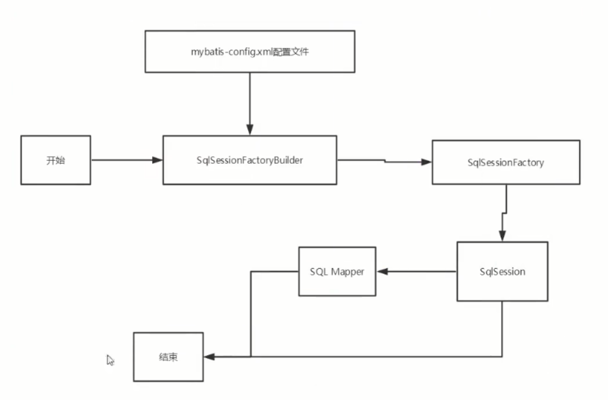
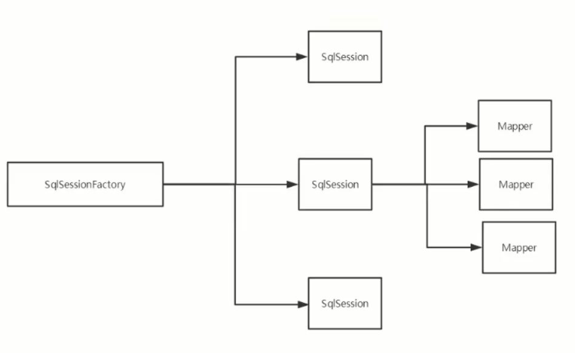
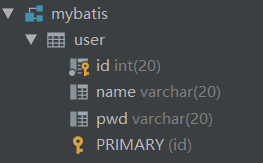
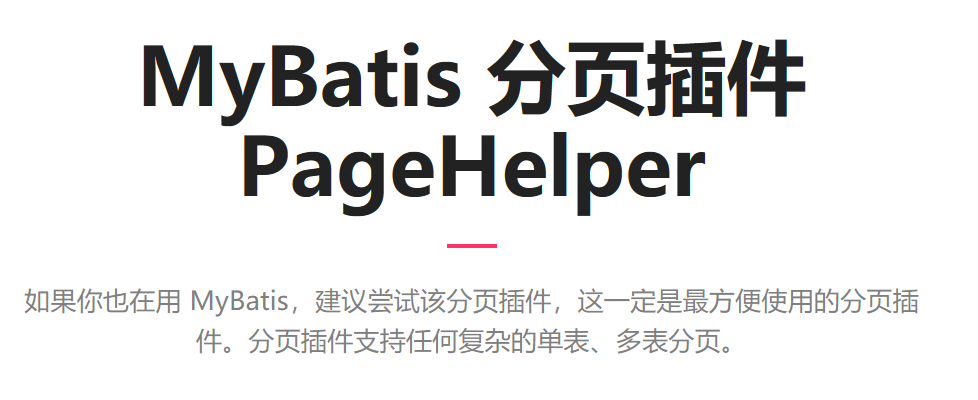
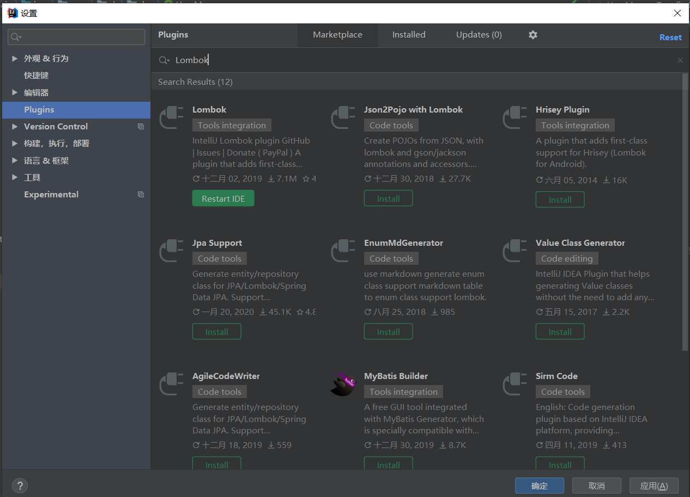
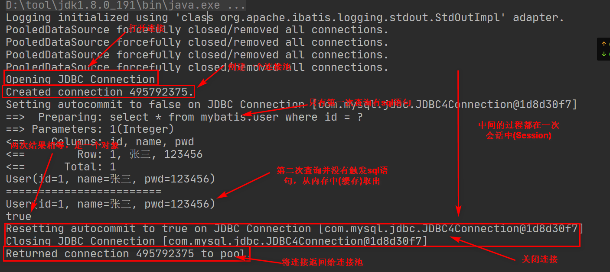
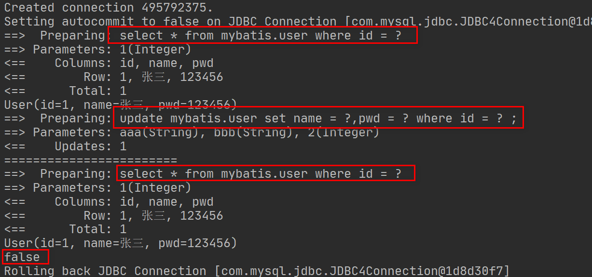
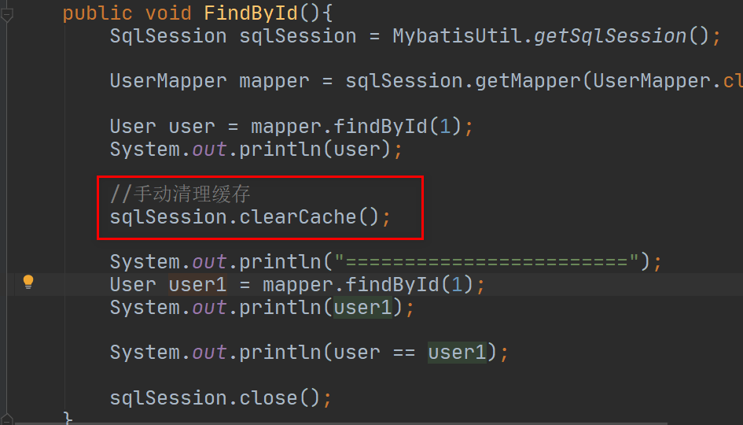
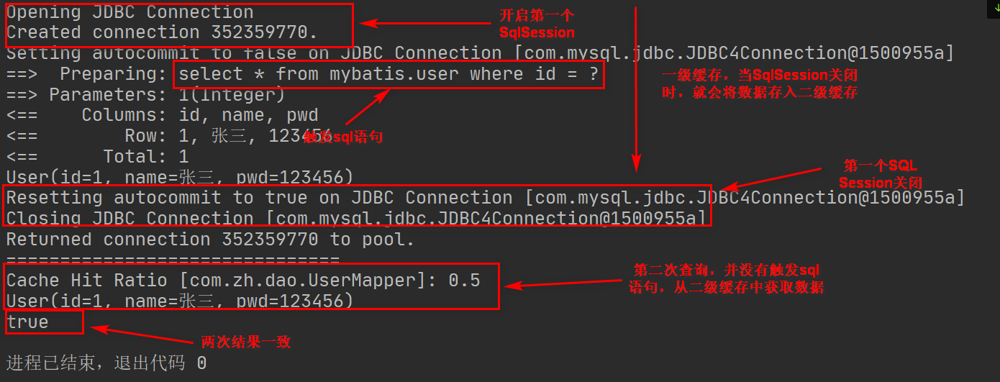
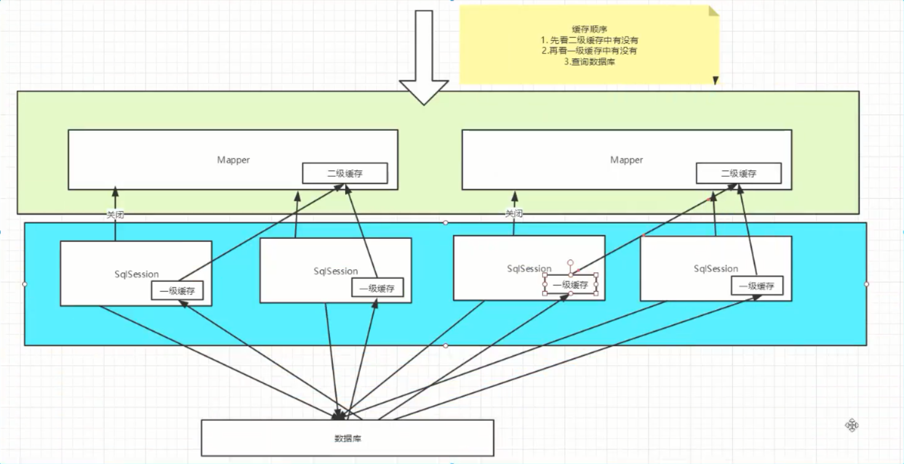

# MyBatis

## 1、简介

### 1.1、什么是Mybatis


- MyBatis 是一款优秀的**持久层框架**
- 它支持定制化 SQL、存储过程以及高级映射。
- MyBatis避免了几乎所有的 JDBC 代码和手动设置参数以及获取结果集。
- MyBatis可以使用简单的 XML 或注解来配置和映射原生类型、接口和 Java 的 POJO（Plain Old        Java Objects，普通老式 Java 对象）为数据库中的记录
- MyBatis 本是[apache](https://baike.baidu.com/item/apache/6265)的一个开源项目[iBatis](https://baike.baidu.com/item/iBatis), 2010年这个项目由apache software foundation 迁移到了google code，并且改名为MyBatis 。
- 2013年11月迁移到Github。

如何获得Mybatis？

- maven

  ```xml
  <!-- https://mvnrepository.com/artifact/org.mybatis/mybatis -->
  <dependency>
      <groupId>org.mybatis</groupId>
      <artifactId>mybatis</artifactId>
      <version>3.4.6</version>
  </dependency>
  ```

- github：https://github.com/mybatis/mybatis-3

- 中文文档：https://mybatis.org/mybatis-3/zh/index.html

### 1.2、持久化

数据持久化

- 持久化就是将程序的数据在持久状态和瞬时状态转化的过程
- 内存：**断电即失**
- 数据库(jdbc)，io文件持久化

**为什么需要持久化？**

- 有一些对象，不能丢失
- 内存贵

### 1.3、持久层

Dao层，Service层，Controller层......

- 完成持久化工作的代码块
- 层界限十分明显

### 1.4、为什么需要Mybatis？

- 帮助程序猿将数据存入到数据库中
- 方便
- 传统的JDBC代码太复杂。简化，框架，自动化
- 优点
  - 简单易学
  - 灵活
  - sql和代码的分离，提高了可维护性。
  - 提供映射标签，支持对象与数据库的orm字段关系映射
  - 提供对象关系映射标签，支持对象关系组建维护
  - 提供xml标签，支持编写动态sql。

## 2、第一个Mybatis程序

思路：搭建环境-->导入Mybatis-->编写代码-->测试

### 2.1、搭建环境

1. 搭建数据库环境

```sql
create database mybatis;

use mybatis;

create table user(
	id int(20) primary key,
	name varchar(20) default null,
	pwd varchar(20) default null
)engine=innodb default charset=utf8;

insert into user(id,name,pwd) values(1,'张三','123456'),(2,'李四','123456'),(3,'王麻子','123456');

select * from user;
```

​	2.导入maven依赖

```xml
<!--导入依赖-->
<dependencies>
    <!--mysql驱动-->
    <dependency>
        <groupId>mysql</groupId>
        <artifactId>mysql-connector-java</artifactId>
        <version>5.1.38</version>
    </dependency>
    <!--mybatis-->
    <dependency>
        <groupId>org.mybatis</groupId>
        <artifactId>mybatis</artifactId>
        <version>3.4.6</version>
    </dependency>
    <!--junit-->
    <dependency>
        <groupId>junit</groupId>
        <artifactId>junit</artifactId>
        <version>4.12</version>
    </dependency>
</dependencies>
```

### 2.2、创建环境

- 编写mybatis核心配置文件：mybatis-config.xml

```xml
<?xml version="1.0" encoding="UTF-8" ?>
<!DOCTYPE configuration
        PUBLIC "-//mybatis.org//DTD Config 3.0//EN"
        "http://mybatis.org/dtd/mybatis-3-config.dtd">

<!--核心配置环境-->
<configuration>
    <environments default="development">
        <environment id="development">
            <transactionManager type="JDBC"/>
            <dataSource type="POOLED">
                <property name="driver" value="com.mysql.jdbc.Driver"/>
                <property name="url" value="jdbc:mysql://localhost:3306/mybatis"/>
                <property name="username" value="root"/>
                <property name="password" value="123456"/>
            </dataSource>
        </environment>
    </environments>

    <!--每一个Mapper.xml都需要在mybatis-config.xml核心配置文件注册-->
    <mappers>
        <mapper resource="com/zh/dao/UserMapper.xml"/>
    </mappers>
</configuration>
```

- 编写mybatis工具类

```java
//SqlSessionFactory  -->  SqlSession
public class MybatisUtil {

    public static SqlSessionFactory sqlSessionFactory;

    static {
        try {
            //使用Mybatis第一步：获取SqlSessionFactory对象
            String resource = "mybatis-config.xml";
            InputStream inputStream  = Resources.getResourceAsStream(resource);
            sqlSessionFactory = new SqlSessionFactoryBuilder().build(inputStream);
        } catch (IOException e) {
            e.printStackTrace();
        }
    }


    /**
     * 既然有了 SqlSessionFactory，顾名思义，我们就可以从中获得 SqlSession 的实例了。
     * SqlSession 完全包含了面向数据库执行 SQL 命令所需的所有方法。你可以通过 SqlSession
     * 实例来直接执行已映射的 SQL 语句
     */
    public static SqlSession getSqlSession(){
        return sqlSessionFactory.openSession();
    }

}
```

### 2.3、编写代码

- 实体类

```java
package com.zh.pojo;

/**
 * User实体类
 */
public class User {

    private int id;
    private String name;
    private String pwd;

    public User() {
    }

    public User(int id, String name, String pwd) {
        this.id = id;
        this.name = name;
        this.pwd = pwd;
    }

    public int getId() {
        return id;
    }

    public void setId(int id) {
        this.id = id;
    }

    public String getName() {
        return name;
    }

    public void setName(String name) {
        this.name = name;
    }

    public String getPwd() {
        return pwd;
    }

    public void setPwd(String pwd) {
        this.pwd = pwd;
    }

    @Override
    public String toString() {
        return "User{" +
                "id=" + id +
                ", name='" + name + '\'' +
                ", pwd='" + pwd + '\'' +
                '}';
    }
}
```

- Dao接口

```java
package com.zh.dao;

import com.zh.pojo.User;

import java.util.List;

public interface UserDao {

    List<User> findAll();

}
```

- 接口实现类：由原来的UserDaoImpl转换为Mapper配置文件

```xml
<?xml version="1.0" encoding="UTF-8" ?>
<!DOCTYPE mapper
        PUBLIC "-//mybatis.org//DTD Mapper 3.0//EN"
        "http://mybatis.org/dtd/mybatis-3-mapper.dtd">

<!--
namespace = 绑定一个对应的Dao/Mapper接口
-->
<mapper namespace="com.zh.dao.UserDao">

    <!--
    select查询语句
        id  对应的方法名
        resultType  返回结果：泛型的全限定路径
    -->
    <select id="findAll" resultType="com.zh.pojo.User">
        select * from mybatis.user
    </select>
</mapper>
```

### 2.4、测试

**注意点**

- org.apache.ibatis.binding.BindingException: Type interface com.zh.dao.UserDao is not known to the MapperRegistry.

  **原因**：mybatis-config.xml中没有配置Mapper.xml

  **解决方法**：每一个Mapper.xml都需要在mybatis-config.xml核心配置文件注册

- Caused by: java.io.IOException: Could not find resource com/zh/dao/UserMapper.xml

  **原因**：maven约定大于配置：配置文件一般要写在resources目录下，不在resources目录下，配置文件无法			导出

  **解决方法**：在maven中添加依赖

  ```xml
  <!--在build中配置resources，防止资源导出失败问题-->
  <build>
      <resources>
          <resource>
              <directory>src/main/java</directory>
              <includes>
                  <include>**/*.xml</include>
                  <include>**/*.properties</include>
              </includes>
              <filtering>true</filtering>
          </resource>
          <resource>
              <directory>src/main/resources</directory>
              <includes>
                  <include>**/*.xml</include>
                  <include>**/*.properties</include>
              </includes>
              <filtering>true</filtering>
          </resource>
      </resources>
  </build>
  ```

- junit测试

  ```java
  @Test
  public void testSelect(){
  
      //1.获取sqlSession对象
      SqlSession sqlSession = MybatisUtil.getSqlSession();
  
      //方式一：getMapper
      UserDao dao = sqlSession.getMapper(UserDao.class);
  
      List<User> list = dao.findAll();
  
      //方式二   不推荐使用
      //        List<User> list = sqlSession.selectList("com.zh.dao.UserDao.findAll");
  
      for (User user : list) {
          System.out.println(user);
      }
  
      //关闭sqlSession
      sqlSession.close();
  
  }
  ```


## 3、增删改查

### 1、namespace	

namespace中的包名要和 Dao/Mapeer 接口的包名一致

### 2、select

- id：就是对应的namespace中的方法名
- resultType：Sql语句的返回值
- parameterType：参数类型


1. 编写接口

   ```java
   User findById(int id);
   ```

2. 编写对应mapper中的sql语句

   ```xml
   <select id="findById" parameterType="int" resultType="com.zh.pojo.User">
       select * from mybatis.user where id = #{id}
   </select>
   ```

3. 测试

   ```java
   @Test
   public void findById(){
       SqlSession sqlSession = MybatisUtil.getSqlSession();
   
       UserMapper mapper = sqlSession.getMapper(UserMapper.class);
   
       User user = mapper.findById(3);
   
       System.out.println(user);
   
       sqlSession.close();
   }
   ```

### 3、Insert

```xml
<insert id="addUser" parameterType="com.zh.pojo.User">
    insert into mybatis.user (id, name, pwd) values (#{id},#{name},#{pwd});
</insert>
```

### 4、update

```xml
<update id="updateUser" parameterType="com.zh.pojo.User">
    update mybatis.user set name = #{name},pwd = #{pwd} where id = #{id};
</update>
```

### 5、delete

```xml
<delete id="deleteUser" parameterType="int">
    delete from mybatis.user where id = #{id};
</delete>
```

- **注意：增删改需要提交事务**

```java
@Test
public void addUser(){
    SqlSession sqlSession = MybatisUtil.getSqlSession();

    UserMapper mapper = sqlSession.getMapper(UserMapper.class);

    mapper.addUser(new User(4, "小明", "123123"));

    //提交事务
    sqlSession.commit();
    sqlSession.close();
}
```

## 4、配置解析

### 1、核心配置文件

- mybatis-config.xml

- MyBatis 的配置文件包含了会深深影响 MyBatis 行为的设置和属性信息

  ```xml
  configuration（配置）
  properties（属性）
  settings（设置）
  typeAliases（类型别名）
  typeHandlers（类型处理器）
  objectFactory（对象工厂）
  plugins（插件）
  environments（环境配置）
  environment（环境变量）
  transactionManager（事务管理器）
  dataSource（数据源）
  databaseIdProvider（数据库厂商标识）
  mappers（映射器）
  ```

### 2、环境配置（environments）

MyBatis 可以配置成适应多种环境

**不过要记住：尽管可以配置多个环境，但每个 SqlSessionFactory实例只能选择一种环境**

```xml
<!--
	例如：两套环境development/test
   		 根据default="xxx"
		 xxx是environment的id值
	事务管理器(transactionManager):[JDBC|MANAGED]
	连接处(dataSource):[UNPOOLED|POOLED|JNDI]
-->
<environments default="test">
    <environment id="development">
        <transactionManager type="JDBC"/>
        <dataSource type="POOLED">
            <property name="driver" value="com.mysql.jdbc.Driver"/>
            <property name="url" value="jdbc:mysql://localhost:3306/mybatis"/>
            <property name="username" value="root"/>
            <property name="password" value="123456"/>
        </dataSource>
    </environment>
    <environment id="test">
        <transactionManager type="JDBC"/>
        <dataSource type="POOLED">
            <property name="driver" value="com.mysql.jdbc.Driver"/>
            <property name="url" value="jdbc:mysql://localhost:3306/mybatis"/>
            <property name="username" value="root"/>
            <property name="password" value="123456"/>
        </dataSource>
    </environment>
</environments>
```

**Mybatis默认的事务管理器是JDBC，连接池POOLED**

### 3、属性（properties）

我们可以通过properties属性来实现引用配置文件

这些属性都是可外部配置且可动态替换的，既可以在典型的 Java 属性文件中配置，亦可通过 properties 元素的子元素来传递。【db.properties】

编写db.properties配置文件

```properties
driver=com.mysql.jdbc.Driver
url=jdbc:mysql://localhost:3306/mybatis
username=root
password=123456
```

在核心配置文件中引入

```xml
<properties resource="db.properties"/>
```

**注意：**

- **properties标签要放在configuration标签内的第一个**

- **configuration标签内的属性，必须严格按照图中的顺序**

  

- 可以直接引入外部文件，也可以在其中增加一些配置

  ```xml
  <properties resource="db.properties">
      <property name="username" value="root"/>
      <property name="password" value="123"/>
  </properties>
  ```

- 如果两个文件有同一个字段，优先使用外部配置文件的

### 4、类型别名（typeAliases）

- 类型别名是为 Java 类型设置一个短的名字。
- 存在的意义仅在于用来减少类完全限定名的冗余。

```xml
<!--可以给实体类起别名-->
<typeAliases>
    <typeAlias type="com.zh.pojo.User" alias="User"/>
</typeAliases>
```

也可以指定一个包名，MyBatis 会在包名下面搜索需要的 Java Bean

扫描实体类的包，它的默认别名就为这个类的类名，首字母小写

```xml
    <!--扫描包-->
    <typeAliases>
        <package name="com.zh.pojo"/>
    </typeAliases>
```

使用环境

- 在实体类比较少的时候，使用第一种
- 如果实体类十分多，使用第二种

区别：第一种可以DIY别名，第二种则**不行**

**解决扫描包，自定义别名：在实体类上加注解**

```java
@Alias("userBean")
public class User {}
```

==常见的 Java 类型内建的相应的类型别名==

| 别名       | 映射的类型 |
| ---------- | ---------- |
| _byte      | byte       |
| _long      | long       |
| _short     | short      |
| _int       | int        |
| _integer   | int        |
| _double    | double     |
| _float     | float      |
| _boolean   | boolean    |
| string     | String     |
| byte       | Byte       |
| long       | Long       |
| short      | Short      |
| int        | Integer    |
| integer    | Integer    |
| double     | Double     |
| float      | Float      |
| boolean    | Boolean    |
| date       | Date       |
| decimal    | BigDecimal |
| bigdecimal | BigDecimal |
| object     | Object     |
| map        | Map        |
| hashmap    | HashMap    |
| list       | List       |
| arraylist  | ArrayList  |
| collection | Collection |
| iterator   | Iterator   |

### 5、设置（settings）

这时Mybatis中极为重要的调整设置，会改变Mybatis的运行时行为

| 设置名                           | 描述                                                         | 有效值                                                       | 默认值                                                |
| -------------------------------- | ------------------------------------------------------------ | ------------------------------------------------------------ | ----------------------------------------------------- |
| cacheEnabled                     | 全局地开启或关闭配置文件中的所有映射器已经配置的任何缓存。   | true \| false                                                | true                                                  |
| lazyLoadingEnabled               | 延迟加载的全局开关。当开启时，所有关联对象都会延迟加载。                特定关联关系中可通过设置 `fetchType`                属性来覆盖该项的开关状态。 | true \| false                                                | false                                                 |
| aggressiveLazyLoading            | 当开启时，任何方法的调用都会加载该对象的所有属性。                否则，每个属性会按需加载（参考 `lazyLoadTriggerMethods`)。 | true \| false                                                | false （在 3.4.1 及之前的版本默认值为 true）          |
| multipleResultSetsEnabled        | 是否允许单一语句返回多结果集（需要驱动支持）。               | true \| false                                                | true                                                  |
| useColumnLabel                   | 使用列标签代替列名。不同的驱动在这方面会有不同的表现，具体可参考相关驱动文档或通过测试这两种不同的模式来观察所用驱动的结果。 | true \| false                                                | true                                                  |
| useGeneratedKeys                 | 允许 JDBC 支持自动生成主键，需要驱动支持。                如果设置为 true 则这个设置强制使用自动生成主键，尽管一些驱动不能支持但仍可正常工作（比如 Derby）。 | true \| false                                                | False                                                 |
| autoMappingBehavior              | 指定 MyBatis 应如何自动映射列到字段或属性。                NONE 表示取消自动映射；PARTIAL 只会自动映射没有定义嵌套结果集映射的结果集。                FULL 会自动映射任意复杂的结果集（无论是否嵌套）。 | NONE, PARTIAL, FULL                                          | PARTIAL                                               |
| autoMappingUnknownColumnBehavior | 指定发现自动映射目标未知列（或者未知属性类型）的行为。                                    `NONE`: 不做任何反应                   `WARNING`:                  输出提醒日志 (`'org.apache.ibatis.session.AutoMappingUnknownColumnBehavior'`                  的日志等级必须设置为 `WARN`)                   `FAILING`: 映射失败 (抛出 `SqlSessionException`) | NONE, WARNING, FAILING                                       | NONE                                                  |
| defaultExecutorType              | 配置默认的执行器。SIMPLE 就是普通的执行器；REUSE 执行器会重用预处理语句（prepared statements）；                BATCH 执行器将重用语句并执行批量更新。 | SIMPLE                REUSE                BATCH             | SIMPLE                                                |
| defaultStatementTimeout          | 设置超时时间，它决定驱动等待数据库响应的秒数。               | 任意正整数                                                   | 未设置 (null)                                         |
| defaultFetchSize                 | 为驱动的结果集获取数量（fetchSize）设置一个提示值。此参数只可以在查询设置中被覆盖。 | 任意正整数                                                   | 未设置 (null)                                         |
| defaultResultSetType             | Specifies a scroll strategy when omit it per statement settings. (Since: 3.5.2) | FORWARD_ONLY \| SCROLL_SENSITIVE \| SCROLL_INSENSITIVE \| DEFAULT(same behavior with 'Not Set') | Not Set (null)                                        |
| safeRowBoundsEnabled             | 允许在嵌套语句中使用分页（RowBounds）。如果允许使用则设置为 false。 | true \| false                                                | False                                                 |
| safeResultHandlerEnabled         | 允许在嵌套语句中使用分页（ResultHandler）。如果允许使用则设置为 false。 | true \| false                                                | True                                                  |
| ==mapUnderscoreToCamelCase==     | 是否开启自动驼峰命名规则（camel case）映射，即从经典数据库列名                A_COLUMN 到经典 Java 属性名 aColumn 的类似映射。 | true \| false                                                | False                                                 |
| localCacheScope                  | MyBatis 利用本地缓存机制（Local Cache）防止循环引用（circular references）和加速重复嵌套查询。                默认值为 SESSION，这种情况下会缓存一个会话中执行的所有查询。                若设置值为 STATEMENT，本地会话仅用在语句执行上，对相同 SqlSession 的不同调用将不会共享数据。 | SESSION \| STATEMENT                                         | SESSION                                               |
| jdbcTypeForNull                  | 当没有为参数提供特定的 JDBC 类型时，为空值指定 JDBC 类型。                某些驱动需要指定列的 JDBC 类型，多数情况直接用一般类型即可，比如 NULL、VARCHAR 或 OTHER。 | JdbcType 常量，常用值：NULL, VARCHAR 或 OTHER。              | OTHER                                                 |
| lazyLoadTriggerMethods           | 指定哪个对象的方法触发一次延迟加载。                         | 用逗号分隔的方法列表。                                       | equals,clone,hashCode,toString                        |
| defaultScriptingLanguage         | 指定动态 SQL 生成的默认语言。                                | 一个类型别名或完全限定类名。                                 | org.apache.ibatis.scripting.xmltags.XMLLanguageDriver |
| defaultEnumTypeHandler           | 指定 Enum 使用的默认 `TypeHandler` 。（新增于 3.4.5）        | 一个类型别名或完全限定类名。                                 | org.apache.ibatis.type.EnumTypeHandler                |
| callSettersOnNulls               | 指定当结果集中值为 null 的时候是否调用映射对象的 setter（map                对象时为 put）方法，这在依赖于 Map.keySet() 或 null                值初始化的时候比较有用。注意基本类型（int、boolean 等）是不能设置成 null 的。 | true \| false                                                | false                                                 |
| returnInstanceForEmptyRow        | 当返回行的所有列都是空时，MyBatis默认返回 `null`。 			        当开启这个设置时，MyBatis会返回一个空实例。 			        请注意，它也适用于嵌套的结果集 （如集合或关联）。（新增于 3.4.2） | true \| false                                                | false                                                 |
| logPrefix                        | 指定 MyBatis 增加到日志名称的前缀。                          | 任何字符串                                                   | 未设置                                                |
| ==logImpl==                      | 指定 MyBatis 所用日志的具体实现，未指定时将自动查找。        | SLF4J \| LOG4J \| LOG4J2 \| JDK_LOGGING \| COMMONS_LOGGING \| STDOUT_LOGGING \| NO_LOGGING | 未设置                                                |
| proxyFactory                     | 指定 Mybatis 创建具有延迟加载能力的对象所用到的代理工具。    | CGLIB \| JAVASSIST                                           | JAVASSIST （MyBatis 3.3 以上）                        |
| vfsImpl                          | 指定 VFS 的实现                                              | 自定义 VFS 的实现的类全限定名，以逗号分隔。                  | 未设置                                                |
| useActualParamName               | 允许使用方法签名中的名称作为语句参数名称。 	            为了使用该特性，你的项目必须采用 Java 8 编译，并且加上 `-parameters` 选项。（新增于 3.4.1） | true \| false                                                | true                                                  |
| configurationFactory             | 指定一个提供 `Configuration` 实例的类。 	            这个被返回的 Configuration 实例用来加载被反序列化对象的延迟加载属性值。 	            这个类必须包含一个签名为`static Configuration getConfiguration()` 的方法。（新增于 3.2.3） | 类型别名或者全类名.                                          | 未设置                                                |

 一个配置完整的 settings 元素的示例如下：        

```xml
<settings>
  <setting name="cacheEnabled" value="true"/>
  <setting name="lazyLoadingEnabled" value="true"/>
  <setting name="multipleResultSetsEnabled" value="true"/>
  <setting name="useColumnLabel" value="true"/>
  <setting name="useGeneratedKeys" value="false"/>
  <setting name="autoMappingBehavior" value="PARTIAL"/>
  <setting name="autoMappingUnknownColumnBehavior" value="WARNING"/>
  <setting name="defaultExecutorType" value="SIMPLE"/>
  <setting name="defaultStatementTimeout" value="25"/>
  <setting name="defaultFetchSize" value="100"/>
  <setting name="safeRowBoundsEnabled" value="false"/>
  <setting name="mapUnderscoreToCamelCase" value="false"/>
  <setting name="localCacheScope" value="SESSION"/>
  <setting name="jdbcTypeForNull" value="OTHER"/>
  <setting name="lazyLoadTriggerMethods" value="equals,clone,hashCode,toString"/>
</settings>
```


### 6、映射器（mappers）

MapperRegistry：注册绑定Mapper文件

方式一：使用相对于类路径【**推荐使用**】

```xml
<!-- 使用相对于类路径的资源引用 -->
<mappers>
    <mapper resource="com/zh/dao/UserMapper.xml"/>
</mappers> 
```

方式二：使用class文件绑定

```xml
<!-- 使用映射器接口实现类的完全限定类名 -->
<mappers>
	<mapper class="com.zh.dao.UserMapper"/>
</mappers>
```

注意点：

- 接口和它的Mapper配置文件必须同名
- 接口和它的Mapper配置文件必须在同一包下

方式三：使用扫描包进行注入绑定

```xml
<!-- 将包内的映射器接口实现全部注册为映射器 -->
<mappers>
    <package name="com.zh.dao"/>
</mappers>
```

注意点：

- 接口和它的Mapper配置文件必须同名
- 接口和它的Mapper配置文件必须在同一包下

### 7、生命周期和作用域



生命周期和作用域是至关重要的，因为错误的使用会导致非常严重的**并发问题**。

**SqlSessionFactoryBuilder：**

- 一旦创建了 SqlSessionFactory，就不再需要它了。
- 局部变量

**SqlSessionFactory：**

- 可以想象为：数据库连接池
- SqlSessionFactory 一旦被创建就应该在应用的运行期间一直存在，**没有任何理由丢弃它或重新创建另一个实例。**
- 引用作用域
- 最简单的就是使用**单例模式**或者**静态单例模式**。

**SqlSession：**

- 连接到连接池的一个请求

- SqlSession的实例不是线程安全的，因此是**不能被共享**的，所以它的最佳的作用域是**请求**或**方法作用域**。

- **用完之后需要赶紧关闭，否则资源被占用**

  

  这里的每一个Mapper都代表一个具体的业务

## 5、ResultMap结果集映射

### 5.1、【问题】：属性名和字段名不一致

数据库中的字段



测试实体类

```java
public class User {
    private int uId;
    private String uName;
    private String pwd;
}
```

**【出现的问题】**


```sql
select * from mybatis.user where id = #{id}
类型处理器        
select id,name,pwd from mybatis.user where id = #{id}
```

### 5.2解决方案

#### 5.2.1、别名

```xml
<select id="findById" parameterType="int" resultType="User">
    select id as uId,name as uName,pwd from mybatis.user where id = #{id}
</select>
```

#### 5.2.2、resultMap

结果集映射

```java
id		name 	pwd
uId		uName	pwd
```

```xml
<!--结果集映射-->
<resultMap id="UserMap" type="User">
    <!--column数据库中的字段，property实体类的属性-->
    <result column="id" property="uId"/>
    <result column="name" property="uName"/>
    <!--<result column="pwd" property="pwd"/>-->
</resultMap>     
```

- **只需要映射属性名与字段名不一致的属性**

## 6、日志

### 6.1、日志工厂

如果一个数据库操作，出现了异常，排错，可以看日志


- SLF4J ：
-  **LOG4J **
-  LOG4J2 
-  JDK_LOGGING ：java自带的日志输出
-  COMMONS_LOGGING ：工具包
- **STDOUT_LOGGING **：控制台输出
-  NO_LOGGING ：  没有日志输出      

在Mybatis中具体使用那个日志实现，在设置中设定

### 6.2、STDOUT_LOGGING标准日志输出

在mybatis-config.xml中配置日志

```xml
<!--日志-->
<settings>
    <!--标准的日志工厂-->
    <setting name="logImpl" value="STDOUT_LOGGING"/>
</settings>
```


### 6.3、LOG4J

- Log4j是[Apache](https://baike.baidu.com/item/Apache/8512995)的一个开源项目，通过使用Log4j，我们可以控制日志信息输送的目的地是控制台、文件、GUI组件
- 可以控制每一条日志的输出格式
- 可以定义每一条日志信息的级别，能够更加细致地控制日志的生成过程
- 可以通过一个配置文件来灵活地进行配置，而不需要修改应用的代码。

1. 先导入log4j的包

   ```xml
   <!-- https://mvnrepository.com/artifact/log4j/log4j -->
   <dependency>
       <groupId>log4j</groupId>
       <artifactId>log4j</artifactId>
       <version>1.2.17</version>
   </dependency>
   ```

2. log4j.properties

   ```properties
   #将等级为DEBUG的日志信息输出到console和file这两个目的地。console和file的定义在下面代码
   log4j.rootLogger=DEBUG,console,file
   
   #控制台输出相关设置
   log4j.appender.console = org.apache.log4j.ConsoleAppender
   log4j.appender.console.Target = System.out
   log4j.appender.console.Threshold = DEBUG
   log4j.appender.console.layout = org.apache.log4j.PatternLayout
   log4j.appender.console.layout.ConversionPattern =[%c]-%m%n
   
   #文件输出相关设置
   log4j.appender.file = org.apache.log4j.ConsoleAppender
   log4j.appender.file.File = ./log/zh.log
   log4j.appender.file.MaxFileSize = 10mb
   log4j.appender.file.Threshold = DEBUG
   log4j.appender.file.layout = org.apache.log4j.PatternLayout
   log4j.appender.file.layout.ConversionPattern = [%p][%d{yy-MM-dd}][%c]-%m%n
   
   #日志输出级别
   log4j.logger.org.mybatis = DEBUG
   log4j.logger.java.sql = DEBUG
   log4j.logger.java.sql.Statement = DEBUG
   log4j.logger.java.sql.ResultSet = DEBUG
   log4j.logger.java.sql.PreparedStatement = DEBUG
   ```

3. 配置log4j日志的实现

   ```xml
   <!--日志-->
   <settings>
       <!--LOG4J-->
       <setting name="logImpl" value="LOG4J"/>
   </settings>
   ```

4. log4j的使用

   

**简单使用**

1. 在使用log4j的类中导入包

   ```java
   import org.apache.log4j.Logger;
   ```

2. 日志对象：参数为当前类的Class

   ```java
   static Logger logger = Logger.getLogger(UserMapperTest.class);
   ```

3. 日志级别

   ```java
   //提示信息
   logger.info("info:进入testLog4j方法");
   //调式
   logger.debug("debug:进入testLog4j方法");
   //严重：紧急错误
   logger.error("error:进入testLog4j方法");
   ```


## 7、分页

### 7.1、Limit分页

```sql
#语法
select * from mybatis.user limit startIndex,pageSize;
select * from mybatis.user limit 3; #[0,n]
```

使用Mybatis分页，核心sql

1. 接口

   ```java
   //分页
   List<User> findByLimit(Map<String,Integer> map);
   ```

2. Mapper.xml

   ```xml
   <!--分页-->
   <select id="findByLimit" parameterType="map" resultMap="UserMap">
       select * from mybatis.user limit #{startIndex},#{pageSize};
   </select>
   ```

3. 测试

   ```java
   @Test
   public void findByLimit(){
   
       SqlSession sqlSession = MybatisUtil.getSqlSession();
   
       UserMapper mapper = sqlSession.getMapper(UserMapper.class);
   
       Map<String, Integer> map = new HashMap<String, Integer>();
       map.put("startIndex",1);
       map.put("pageSize",2);
   
       List<User> list = mapper.findByLimit(map);
   
       for (User user : list) {
           System.out.println(user);
       }
   
       sqlSession.close();
   
   }
   ```

### 7.2、RowBounds分页（不建议使用）

1. 接口

   ```java
   //分页2
   List<User> findByRowBounds();
   ```

2. Mapper.xml

   ```xml
   <!--findByRowBounds分页-->
   <select id="findByRowBounds" resultMap="UserMap">
       select * from mybatis.user;
   </select>
   ```

3. 测试

   ```java
   @Test
   public void findByRowBounds(){
       SqlSession sqlSession = MybatisUtil.getSqlSession();
   
       //RowBounds分页
       RowBounds rowBounds = new RowBounds(1, 2);
   
       //通过java代码实现分页
       List<User> list = sqlSession.selectList("com.zh.dao.UserMapper.findByRowBounds",null,rowBounds);
   
       for (User user : list) {
           System.out.println(user);
       }
   
       sqlSession.close();
   }
   ```

### 7.3、插件



了解即可

## 8、注解开发

### 8.1、使用注解开发

1. 注解在接口上实现

   ```java
   @Select("select * from user")
   List<User> findAll();
   ```

2. 在核心配置文件中绑定接口

   ```xml
   <!--绑定接口-->
   <mappers>
       <mapper class="com.zh.dao.UserMapper"/>
   </mappers>
   ```

3. 测试

   ```java
   @Test
   public void findAll(){
       SqlSession sqlSession = MybatisUtil.getSqlSession();
       //底层主要应用反射
       UserMapper mapper = sqlSession.getMapper(UserMapper.class);
   
       List<User> list = mapper.findAll();
   
       for (User user : list) {
           System.out.println(user);
       }
   
       sqlSession.close();
   }
   ```

本质：反射机制

底层：动态代理

### 8.2、增删改查

在创建工具类的时候要设置自动提交事务

```java
public static SqlSession getSqlSession(){
    //openSession参数为true：自动提交事务
    return sqlSessionFactory.openSession(true);
}
```

编写接口，增加注解

```java
@Select("select * from user")
List<User> findAll();

//方法有多个基本参数，所有参数前必须加上@Param()注解,引用对象不需要
@Select("select * from user where id = #{id}")
User findById(@Param("id") int id);


@Insert("insert into user(id,name,pwd) values(#{id},#{name},#{pwd})")
int addUser(User user);

@Update("update user set name=#{name} where id = #{id}")
int update(User user);

@Delete("delete from user where id = #{uid}")
int delete(@Param("uid") int id);
```

测试

【注意：必须将接口注册绑定核心配置文件中】


**关于@Param()注解**

- 基本类型的参数或者String，需要加上
- 引用类型不需要加
- 如果只有一个基本类型的话，可以忽略，但是建议加上
- 在Sql中引用的就是@Param()中设定的属性名

## 9、Lombok插件

Lombok是是一款Java插件，可以通过简单的注解消除业务中繁琐的代码，尤其是简单的Java模型对象(POJO)

### 9.1、使用Lombok

1. IDEA安装Lombok插件

   

2. 导入依赖

   ```xml
   <!-- lombok -->
   <dependency>
       <groupId>org.projectlombok</groupId>
       <artifactId>lombok</artifactId>
       <version>1.18.8</version>
   </dependency>
   ```

3. 实体类上加注解即可使用

```java
@Data
@AllArgsConstructor
@NoArgsConstructor
public class User {
    private int id;
    private String name;
    private String pwd;
}
```

### 9.2、Lombok注解

```java
@Getter and @Setter		Getter/Setter方法
@FieldNameConstants
@ToString				ToString方法
@EqualsAndHashCode
@AllArgsConstructor		全参数构造方法
@NoArgsConstructor		空参构造
@RequiredArgsConstructor
@Log, @Log4j, @Log4j2, @Slf4j, @XSlf4j, @CommonsLog, @JBossLog, @Flogger, @CustomLog
@Data					在类上加无参构造，get/set，toString，hashCode，canEqual,方法
@Builder
@SuperBuilder
@Singular
@Delegate
@Value
@Accessors
@Wither
@With
@SneakyThrows
@val
@var
experimental @var
@UtilityClass
```

### 9.3、Lombok优缺点

- 优点
  1. 能够通过注解自动生成构造器，getter/setter，equals，hashcode，toString等方法，提高一定开发效率
  2. 让代码更简洁
  3. 属性做修改时，不用修改属性所生成的方法
- 缺点
  1. 不支持多种参数构造器的重载
  2. 虽然省去了手动创建方法的麻烦，但是降低了代码的可读性和完整性

## 10、多对一

### 10.1、环境搭建

学生与老师

1. sql

   ```sql
   create table teacher(
   	id int(11) primary key,
   	name varchar(20) default null
   );
   
   insert into teacher(id,name) values(1,'苏老师');
   
   select * from teacher;
   
   create table student(
   	id int(11) primary key,
   	name varchar(20) default null,
   	tid int(11) not null,
   	foreign key(tid) references teacher(id)
   );
   
   insert into student(id,name,tid) values(1,'张三',1),(2,'李四',1),(3,'王五',1),(4,'王麻子',1),(5,'张恒',1);
   
   select * from student;
   ```

2. 创建实体类

   ```java
   @Data
   @AllArgsConstructor
   @NoArgsConstructor
   public class Teacher {
       private int id;
       private String name;
   }
   ```

   ```java
   @Data
   @AllArgsConstructor
   @NoArgsConstructor
   public class Student {
       private int id;
       private String name;
       //学生需要关联一个老师
       private Teacher teacher;
   }
   ```

3. 创建Mapper接口

   ```java
   public interface TeacherMapper {
   
       @Select("select * from teacher where id = #{tid}")
       Teacher findById(@Param("tid") int id);
   
   }
   ```
   
   ```java
   public interface StudentMapper {
   }
   ```
   
4. 创建Mapper.xml文件

   ```xml
   <?xml version="1.0" encoding="UTF-8" ?>
   <!DOCTYPE mapper
              PUBLIC "-//mybatis.org//DTD Mapper 3.0//EN"
              "http://mybatis.org/dtd/mybatis-3-mapper.dtd">
   
   <mapper namespace="com.zh.dao.TeacherMapper">
   
   
   </mapper>
   ```

      ```xml
   <?xml version="1.0" encoding="UTF-8" ?>
   <!DOCTYPE mapper
              PUBLIC "-//mybatis.org//DTD Mapper 3.0//EN"
              "http://mybatis.org/dtd/mybatis-3-mapper.dtd">
   
   <mapper namespace="com.zh.dao.StudentMapper">
   
   
   </mapper>
      ```

5. 在核心配置文件注册Mapper接口或文件

   ```xml
   <?xml version="1.0" encoding="UTF-8" ?>
   <!DOCTYPE configuration
           PUBLIC "-//mybatis.org//DTD Config 3.0//EN"
           "http://mybatis.org/dtd/mybatis-3-config.dtd">
   
   <!--核心配置环境-->
   <configuration>
       <!--引入外部配置文件-->
       <properties resource="db.properties"/>
   
       <!--扫描包-->
       <typeAliases>
           <package name="com.zh.dao"/>
       </typeAliases>
   
       <environments default="development">
           <environment id="development">
               <transactionManager type="JDBC"/>
               <dataSource type="POOLED">
                   <property name="driver" value="${driver}"/>
                   <property name="url" value="${url}"/>
                   <property name="username" value="${username}"/>
                   <property name="password" value="${password}"/>
               </dataSource>
           </environment>
       </environments>
   
       <!--绑定接口-->
       <mappers>
           <package name="com.zh.dao"/>
       </mappers>
   </configuration>
   ```

6. 测试

   ```java
   public static void main(String[] args) {
   
       SqlSession sqlSession = MybatisUtil.getSqlSession();
   
       TeacherMapper mapper = sqlSession.getMapper(TeacherMapper.class);
   
       Teacher teacher = mapper.findById(1);
   
       System.out.println(teacher);
   
       sqlSession.close();
   }
   ```

### 10.2、查询所有的学生信息，以及对应的老师信息

#### 10.2.1、按照查询嵌套处理

```xml
<!--==========按照查询嵌套处理================-->
<!--
        思路：
            1.查询所有学生的信息
            2.根据查询出来的tid，查询对应的老师
    -->
<select id="findAllStuAndTea" resultMap="StudentAndTeacher">
    select * from student;
</select>

<resultMap id="StudentAndTeacher" type="Student">
    <result property="id" column="id"/>
    <result property="name" column="name"/>
    <!--
            复杂的属性，需要单独处理
            对象：association
            集合：collection
    -->
<association property="teacher" column="tid" javaType="Teacher" select="getTeacher" />
</resultMap>

<select id="getTeacher" resultType="Teacher">
    select * from teacher where id = #{tid};
</select>
```

#### 10.2.2、按照结果嵌套处理

```xml
<!--==========按照结果嵌套处理================-->
<select id="findAllStuAndTea2" resultMap="StudentAndTeacher2">
    select s.id sid,s.name sname,t.name tname
    from student s,teacher t
    where s.tid = t.id;
</select>
<resultMap id="StudentAndTeacher2" type="Student">
    <result property="id" column="sid"/>
    <result property="name" column="sname"/>
    <association property="teacher" javaType="Teacher">
        <result property="name" column="tname"/>
    </association>
</resultMap>
```

## 11、一对多

### 11.1、环境搭建

**实体类**

```java
@Data
@AllArgsConstructor
@NoArgsConstructor
public class Teacher {
    private int id;
    private String name;
    //一个老师有多个学生
    private List<Student> students;
}
```

```java
@Data
@AllArgsConstructor
@NoArgsConstructor
public class Student {
    private int id;
    private String name;
    private int tid;
}
```

### 11.2、获取指定老师下的所有学生及老师信息

#### 11.2.1、按照查询嵌套处理

```xml
<!--===========子查询=================-->
    <select id="findById2" resultMap="teacherStudent2">
        select * from teacher where id = #{tid}
    </select>
    <resultMap id="teacherStudent2" type="Teacher">
        <collection property="students" javaType="ArrayList" ofType="Student" select="getStuByTid" column="id"/>
    </resultMap>
    <select id="getStuByTid" resultType="Student">
        select * from student where tid = #{tid}
    </select>
```

#### 11.2.2、按照结果嵌套处理

```xml
<!--按结果嵌套查询-->
<select id="findById" resultMap="teacherStudent">
    select t.id tid,t.name tname,s.id sid,s.name sname
    from teacher t,student s
    where s.tid = t.id and t.id = #{tid}
</select>
<resultMap id="teacherStudent" type="Teacher">
    <result property="id" column="tid"/>
    <result property="name" column="tname"/>
    <!--
           复杂的属性，需要单独处理
           对象：association
           集合：collection
           javaType=""  指定属性的类型
           集合中的泛型，使用ofType获取
        -->
    <collection property="students" ofType="Student">
        <result property="id" column="sid"/>
        <result property="name" column="sname"/>
        <result property="tid" column="tid"/>
    </collection>
</resultMap>
```

### 11.3、总结

1. 关联  association  **多对一**
2. 集合  collection     **一对多**
3. javaType  &   ofType
   1. javaType：用来指定实体类中属性的类型
   2. ofType：用来指定映射到list或者集合中的pojo类型，泛型中的约束类型

## 12、动态sql

**动态sql就是指根据不同的条件生成不同的sql语句**

**所谓的动态SQL，本质还是SQL语句，只是我们可以在SQL层面执行逻辑代码**

```xml
动态 SQL 元素和 JSTL 或基于类似 XML 的文本处理器相似。在 MyBatis 之前的版本中，有很多元素需要花时间了解。MyBatis 3 大大精简了元素种类，现在只需学习原来一半的元素便可。MyBatis 采用功能强大的基于 OGNL 的表达式来淘汰其它大部分元素。

if
choose (when, otherwise)
trim (where, set)
foreach

```

### 12.1、搭建环境

```sql
create table blog(
	id varchar(50) not null comment '博客ID',
	title varchar(100) not null comment '博客标题',
	author varchar(30) not null comment '博客作者',
	create_time datetime not null comment '创建时间',
	views int(30) not null comment '浏览量'
);
```

**创建基础工程**

1. 导包

2. 编写核心配置文件

   ```xml
   <?xml version="1.0" encoding="UTF-8" ?>
   <!DOCTYPE configuration
           PUBLIC "-//mybatis.org//DTD Config 3.0//EN"
           "http://mybatis.org/dtd/mybatis-3-config.dtd">
   
   <!--核心配置环境-->
   <configuration>
       <!--引入外部配置文件-->
       <properties resource="db.properties"/>
       
       <settings>
           <!--开启驼峰命名转换-->
           <setting name="mapUnderscoreToCamelCase" value="true"/>
       </settings>
       
       <!--扫描包-->
       <typeAliases>
           <package name="com.zh.pojo"/>
       </typeAliases>
   
       <environments default="development">
           <environment id="development">
               <transactionManager type="JDBC"/>
               <dataSource type="POOLED">
                   <property name="driver" value="${driver}"/>
                   <property name="url" value="${url}"/>
                   <property name="username" value="${username}"/>
                   <property name="password" value="${password}"/>
               </dataSource>
           </environment>
       </environments>
   
       <!--绑定接口-->
       <mappers>
           <package name="com.zh.dao"/>
       </mappers>
   </configuration>
   ```

3. 编写实体类

   ```java
   @Data
   @AllArgsConstructor
   @NoArgsConstructor
   public class Blog {
       private String id;
       private String title;
       private String author;
       private Date createTime;
       private int views;
   }
   ```

4. 编写实体类对应的Mapper接口和Mapper.xml文件

   ```java
   public interface BlogMapper {
       //插入数据
       int addBlog(Blog blog);
   }
   ```

   ```xml
   <insert id="addBlog" parameterType="blog">
       insert into mybatis.blog(id, title, author, create_time, views)
       value (#{id},#{title},#{author},#{createTime},#{views});
   </insert>
   ```

5. 测试

   ```java
   @Test
   public void addBlog(){
       SqlSession sqlSession = MybatisUtil.getSqlSession();
   
       BlogMapper mapper = sqlSession.getMapper(BlogMapper.class);
   
       Blog blog = new Blog();
       blog.setId(UUIDUtis.getUUID());
       blog.setTitle("Mybatisrumen");
       blog.setAuthor("张恒");
       blog.setCreateTime(new Date());
       blog.setViews(1200);
   
       mapper.addBlog(blog);
   
       blog.setId(UUIDUtis.getUUID());
       blog.setTitle("java入门");
       mapper.addBlog(blog);
   
       blog.setId(UUIDUtis.getUUID());
       blog.setTitle("sql入门");
       mapper.addBlog(blog);
   
       blog.setId(UUIDUtis.getUUID());
       blog.setTitle("html入门");
       mapper.addBlog(blog);
   
       blog.setId(UUIDUtis.getUUID());
       blog.setTitle("css入门");
       mapper.addBlog(blog);
   
   
       sqlSession.commit();
       sqlSession.close();
   }
   ```

### 12.2、IF

```xml
<select id="findByIF" parameterType="map" resultType="blog">
    select * from mybatis.blog where true
    <if test="title != null">
        and title = #{title}
    </if>
    <if test="id != null">
        and id = #{id}
    </if>
</select>
```

```java
@Test
public void findByIF(){
    SqlSession sqlSession = MybatisUtil.getSqlSession();

    BlogMapper mapper = sqlSession.getMapper(BlogMapper.class);

    HashMap<String, String> map = new HashMap<String, String>();

    map.put("id","868010e884d948b292402bed9544df4d");
    map.put("title","css入门");


    List<Blog> list = mapper.findByIF(map);

    for (Blog blog : list) {
        System.out.println(blog);
    }


    sqlSession.close();
}
```

### 12.3、choose (when, otherwise)

**MyBatis 提供了 choose 元素，它有点像 Java 中的 switch 语句**

```xml
<select id="findByChoose" parameterType="map" resultType="blog">
    select * from mybatis.blog
    <where>
        <choose>
            <!--一次只能选择一个when-->
            <when test="title != null">
                title = #{title}
            </when>
            <when test="author != null">
                and author = #{author}
            </when>
            <when test="id != null">
                and id = #{id}
            </when>
            <!--都不满足-->
            <otherwise>
                and true
            </otherwise>
        </choose>
    </where>
</select>
```

### 12.4、trim (where, set)

#### 12.4.1、where

***where* 元素只会在至少有一个子元素的条件返回 SQL 子句的情况下才去插入“WHERE”子句。而且，若语句的开头为“AND”或“OR”，*where* 元素也会将它们去除。**

```xml
<select id="findByIF" parameterType="map" resultType="blog">
    select * from mybatis.blog
    <where>
        <if test="title != null">
            title = #{title}
        </if>
        <if test="id != null">
            and id = #{id}
        </if>
    </where>
</select>
```

#### 12.4.2、set

**set 元素会动态前置 SET 关键字，同时也会删掉无关的逗号，因为用了条件语句之后很可能就会在生成的 SQL 语句的后面留下这些逗号。（译者注：因为用的是“if”元素，若最后一个“if”没有匹配上而前面的匹配上，SQL 语句的最后就会有一个逗号遗留）**

```xml
<update id="updateBlog" parameterType="map">
    update mybatis.blog
    <set>
        <if test="title != null">
            title = #{title},
        </if>
        <if test="author != null">
            author = #{author},
        </if>
    </set>
    where id = #{id};
</update>
```

#### 12.4.3、trim 

**trim是where和set的定制化。where和set本质上也是trim**

 *where* 或 set元素没有按正常套路出牌，我们可以通过自定义 trim 元素来定制 *where* 元素的功能。比如，和 *where* 元素等价的自定义 trim 元素为：

```xml
<trim prefix="WHERE" prefixOverrides="AND |OR ">
  ...
</trim>
```

```xml
<trim prefix="SET" suffixOverrides=",">
  ...
</trim>
```

### 12.5、SQl片段

**有的时候会把一些公共的代码抽取出来，方便复用**

1. 使用SQL标签抽取公共的部分

   ```xml
   <sql id="sql_choose">
       <choose>
           <when test="title != null">
               title = #{title}
           </when>
           <when test="author != null">
               and author = #{author}
           </when>
           <when test="id != null">
               and id = #{id}
           </when>
           <otherwise>
               and true
           </otherwise>
       </choose>
   </sql>
   ```

2. 在需要使用的地方，使用include标签引用即可

   ```xml
   <select id="findByChoose" parameterType="map" resultType="blog">
       select * from mybatis.blog
       <where>
           <include refid="sql_choose"></include>
       </where>
   </select>
   ```

**注意事项**

- 最好基于单表来定义SQL片段
- 不要将where标签放在SQL标签中

### 12.6、foreach

*foreach* 允许你指定一个集合，声明可以在元素体内使用的集合项（item）和索引（index）变量。它也允许你指定开头与结尾的字符串以及在迭代结果之间放置分隔符。这个元素是很智能的，

**注意 你可以将任何可迭代对象（如 List、Set 等）、Map 对象或者数组对象传递给 *foreach* 作为集合参数。当使用可迭代对象或者数组时，index 是当前迭代的次数，item 的值是本次迭代获取的元素。当使用 Map 对象（或者 Map.Entry 对象的集合）时，index 是键，item 是值。**

```xml
<!--
    select * from mybatis.blog 
    where author = "张恒" and (id = 1 or id = 2)
-->
<select id="findBlogByFoeEach" parameterType="map" resultType="blog">
    select * from mybatis.blog
    <where>
        <if test="author != null">
            author = #{author}
        </if>
        <foreach collection="ids" item="id" open="and (" separator="or" close=")">
            id = #{id}
        </foreach>
    </where>
</select>
```

```Java
@Test
public void findBlogByFoeEach(){

    SqlSession sqlSession = MybatisUtil.getSqlSession();

    BlogMapper mapper = sqlSession.getMapper(BlogMapper.class);

    HashMap map = new HashMap();

    ArrayList<Integer> ids = new ArrayList<Integer>();

    ids.add(1);
    ids.add(2);
    ids.add(3);

    map.put("ids",ids);
    map.put("author","张恒");

    List<Blog> list = mapper.findBlogByFoeEach(map);

    for (Blog blog : list) {
        System.out.println(blog);
    }

    sqlSession.close();
}
```

==动态SQL就是在拼接SQL语句，我们只需要保证SQL的正确性，按照SQL的格式，去排列组合就行==

**建议：先在mysql中写出完整的sql，再对应的修改成动态SQL实现通用即可**

## 13、缓存

### 13.1、简介

1. 什么是缓存[Cache]？
   - 存在内存中的临时数据
   - 将用户经常查询的数据放在缓存(内存)中，用户去查询数据就不用从磁盘上(关系型数据库文件)查询，从缓存中查询，从而提高查询效率，解决了高并发系统性能问题
2. 为什么使用缓存？
   - 减少和数据库的交互次数，减少系统开销，提高系统效率
3. 什么样的数据能使用缓存？
   - 经常查询并且不经常改变的数据【可使用缓存】

### 13.2、Mybatis缓存

- Mybatis包含一个非常强大的查询缓存特性，它可以非常方便的定制和配置缓存。缓存可以极大的提升查询效率
- Mybatis系统中默认定义了两级缓存：**一级缓存**和**二级缓存**
  - 默认情况下，只有一级缓存开启。(SqlSession级别的缓存，也称为本地缓存)
  - 二级缓存需要手动开启和配置，它是基于namespace级别的缓存
  - 为了提高扩展性，Mybatis定义了缓存接口Cache。可以通过实现Cache接口来自定义二级缓存

### 13.3、一级缓存

- 一级缓存也叫本地缓存
  - 与数据库同一次会话期间查询到的数据会放在本地缓存中
  - 以后如果需要获取相同的数据，直接从缓存中拿，没必要再去查询数据库

**测试步骤：**

1. 开启日志

2. 测试在一个Session中查询两次相同的记录

3. 查看日志输出

   

**缓存失效的情况：**

1. 查询不同的东西

2. 增删改操作，可能会改变原来的数据，所以必定会刷新缓存

   

3. 查询不同的Mapper.xml

4. 手动清理缓存

   

   ==小结：一级缓存默认是开启的，只在一次SqlSession中有效，也就是拿到连接到关闭连接这个区间段==

### 13.4、二级缓存

- 二级缓存也叫全局缓存，一级缓存作用域太低了，所以诞生了二级缓存
- 基于namespace级别的缓存，一个名称空间，对应一个二级缓存
- 工作机制
  - 一个会话查询一条数据，这个数据就会被放在当前会话的一级缓存中
  - 如果当前会话关闭了，这个会话对应的一级缓存就没了，但是我们想要的是，会话关闭了，一级缓存中的数据被保存到二级缓存中
  - 新的会话查询信息，就可以从二级缓存中获取内容
  - 不同Mapper查出的数据会放在自己对应的缓存(map)中

**步骤：**

1. 开启全局缓存

   ```xml
   <!--显示的开启全局缓存-->
   <setting name="cacheEnabled" value="true"/>
   ```

2. 在要使用二级缓存的Mapper.xml中开启

   - 默认

     ```xml
     <cache/>
     ```

     **问题：需要将实体类序列化，否则会报错**

     ```java
     Caused by: java.io.NotSerializableException: com.zh.pojo.User
     ```

     ```java
     public class User implements Serializable {
         private int id;
         private String name;
         private String pwd;
     }
     ```

   - 自定义参数

     ```xml
     <!--配置创建了一个 FIFO 缓存，每隔 60 秒刷新，最多可以存储结果对象或列表的 512 个引用，而且返回的对象被认为是只读的，因此对它们进行修改可能会在不同线程中的调用者产生冲突。 -->
     <cache
         eviction="FIFO"
         flushInterval="60000"
         size="512"
         readOnly="true"/>
     ```

3. 测试

   ```xml
   @Test
   public void test02(){
       SqlSession sqlSession = MybatisUtil.getSqlSession();
   
       UserMapper mapper = sqlSession.getMapper(UserMapper.class);
   
       User user = mapper.findById(1);
   
       System.out.println(user);
   
       sqlSession.close();
       System.out.println("===============================");
       SqlSession sqlSession2 = MybatisUtil.getSqlSession();
   
       UserMapper mapper2 = sqlSession2.getMapper(UserMapper.class);
   
       User user2 = mapper2.findById(1);
   
       System.out.println(user2);
   
       System.out.println(user == user2);
   
       sqlSession2.close();
   }
   ```



**小结：**

- 只要开启了二级缓存 ，在同一个Mapper下就有效
- 所有的数据先放在一级缓存中
- 只有当会话提交或者关闭的时候，才会提交到二级缓存中

### 13.5、缓存原理




