# 1、MySQL架构介绍

## 1.1、简介

**官网：https://www.mysql.com/**

MySQL是一个关系性数据库管理系统，由瑞典MySQL AB公司开发，目前属于Oracle公司

MySQL是一种关系型数据库管理系统，关系数据库将数据保存在不同的表中，而不是将所有数据放在一个大仓库内，这样就增加了速度并提高了灵活性。

MySQL所使用的 SQL 语言是用于访问数据库的最常用标准化语言。

MySQL 软件采用了双授权政策，分为社区版和商业版，由于其体积小、速度快、总体拥有成本低，尤其是开放源码这一特点，一般中小型网站的开发都选择 MySQL 作为网站数据库。

## 1.2、安装及配置

**centos7下使用yum源安装mysql5.7**

### 1.2.1、安装

- **下载yum源**

  ```bash
  wget 'https://dev.mysql.com/get/mysql57-community-release-el7-11.noarch.rpm'
  ```

  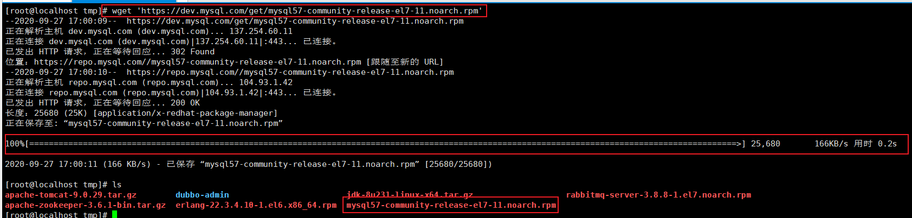

- **安装yum源**

  ```bash
  rpm -Uvh mysql57-community-release-el7-11.noarch.rpm
  ```

  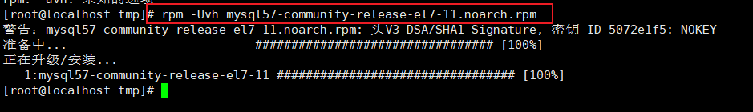

- **查看有哪些mysql版本**

  ```bash
  yum repolist all | grep mysql
  ```

  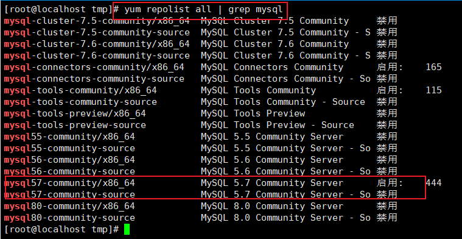

- **安装MySQL**

  默认安装5.7

  ```bash
  yum install -y mysql-community-server
  ```

  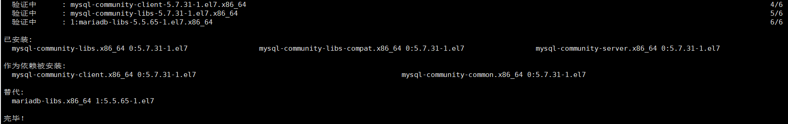

- **查看版本**

  ```bash
  mysqladmin --version
  ```

  

### 1.2.2、启动MySQL服务

**启动服务**

```bash
systemctl start mysqld
```

**设置开机自启动**

```bash
systemctl enable mysqld
systemctl daemon-reload
```

### 1.2.3、设置ROOT密码

mysql5.7的新特性之一就是在初始化的时候会生成一个自定义的密码，然后你需要找到这个密码，登录的时候输入。注意，输入密码的时候是不显示。
找到密码: 红框的地方就是密码

```bash
grep 'temporary password' /var/log/mysqld.log
```


**登录数据库**

```bash
mysql -uroot -p
```


**修改密码**

```bash
ALTER USER 'root'@'localhost' IDENTIFIED BY '123456';
```


修改自定义密码时，由于自定义密码比较简单，就出现了不符合密码策略的问题。

必须修改两个全局参数：

```bash
set global validate_password_policy=0;
set global validate_password_length=1;
```

再次执行修改密码

```bash
ALTER USER 'root'@'localhost' IDENTIFIED BY '123456';
```

### 1.2.4、设置远程登录

现在这样是无法在本地用工具登录访问的，现在要做两件事，一件事是开放3306端口；另一件事是配置远程可以访问。

**先设置刚才的密码可以远程登录，然后使用flush命令使配置立即生效。**

```bash
GRANT ALL PRIVILEGES ON *.* TO 'root'@'%' IDENTIFIED BY '123456' WITH GRANT OPTION;
flush privileges;
```

**开放3306防火墙端口**

```bash
# 开放端口
firewall-cmd --zone=public --add-port=3306/tcp --permanent
# 重启防火墙
systemctl restart firewalld.service
```

**重启数据库**

```bash
systemctl restart mysqld
```

**远程连接测试**

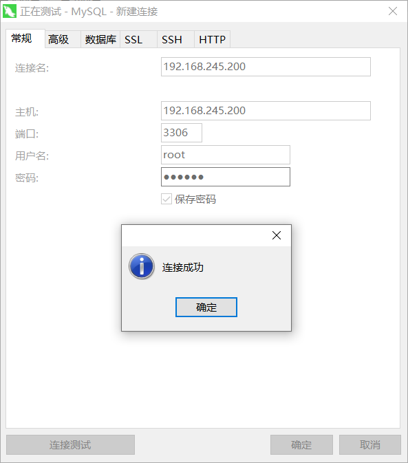

### 1.2.5、修改字符编码集

由于我们是中文系统，而MYSQL默认的字符为latin1，所以容易出现乱码的情况，因此需要修改字符集的编码方式

**进入mysql，查看字符编码集**

```mysql
 show variables like '%char%';
```

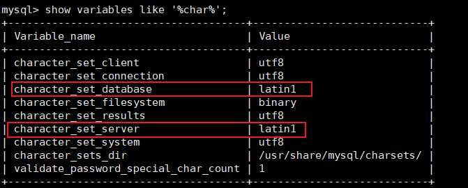

MYSQL 5.7 开始 默认配置文件是：`/etc/my.cng`

```bash
vim /etc/my.cnf
```

**增加这几项**

```bash
[client]
default-character-set=utf8
[mysql]
default-character-set=utf8
[mysqld]
character_set_server = utf8
collation_server = utf8_general_ci
```

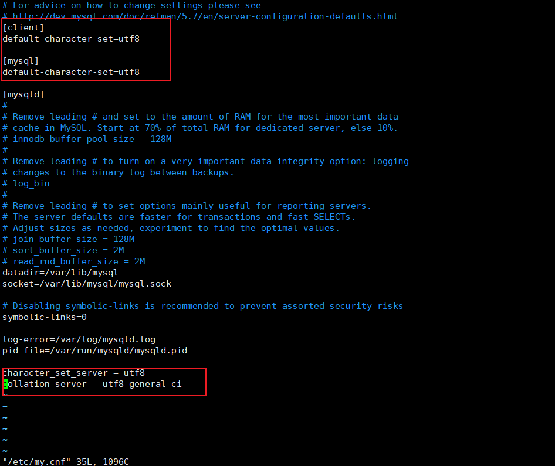

**重启MYSQL服务**

```bash
systemctl restart mysqld
```

**查看字符编码集**

```mysql
 show variables like '%char%';
```


**这里注意的是修改字符集只对之后的数据库生效，之前已经存在的数据库无效，所以建议安装完MYSQL后第一时间修改编码方式**

## 1.3、配置文件

**RPM安装MySql时的默认路径：**

- 数据文件：`/var/lib/mysql/`
- 配置文件模板：`/usr/share/mysql mysql`
- 客户端工具目录：`/usr/bin`
- 日志目录：`/var/log/pid`
- sock文件：`/var/lib/mysql/`
- 配置文件会放置在：`/etc`

**主要配置文件：**

- 二进制日志log-bin：主从复制
- 错误日志log-error：默认是关闭的，记录严重的警告和错误信息，每次启动和关闭的详细信息等。
- 查询日志log：默认关闭，记录查询的SQL语句，如果开启会降低MYSQL的整体性能，因为记录日志也是需要消耗系统资源
- 数据文件：
  - 两系统：
    - Windows：`安装目录\data`
    - Linux：默认路径：`/var/lib/mysql`
  - frm文件：存放表结构
  - myd文件：存放表数据
  - myi文件：存放表索引
- 如何配置：
  - Windows：`my.ini`文件
  - Linux：`/etc/my.cnf`文件

## 1.4、逻辑架构介绍

和其他数据库相比，MySQL它的架构可以在多种不同场景中应用并发挥良好作用。主要体现在存储引擎的架构上

插件式的存储引擎架构将查询处理和其他的系统任务以及数据的存储提取相分离。这种架构可以根据业务的需求和实际需求选择合适的存储引擎

**逻辑架构图：**

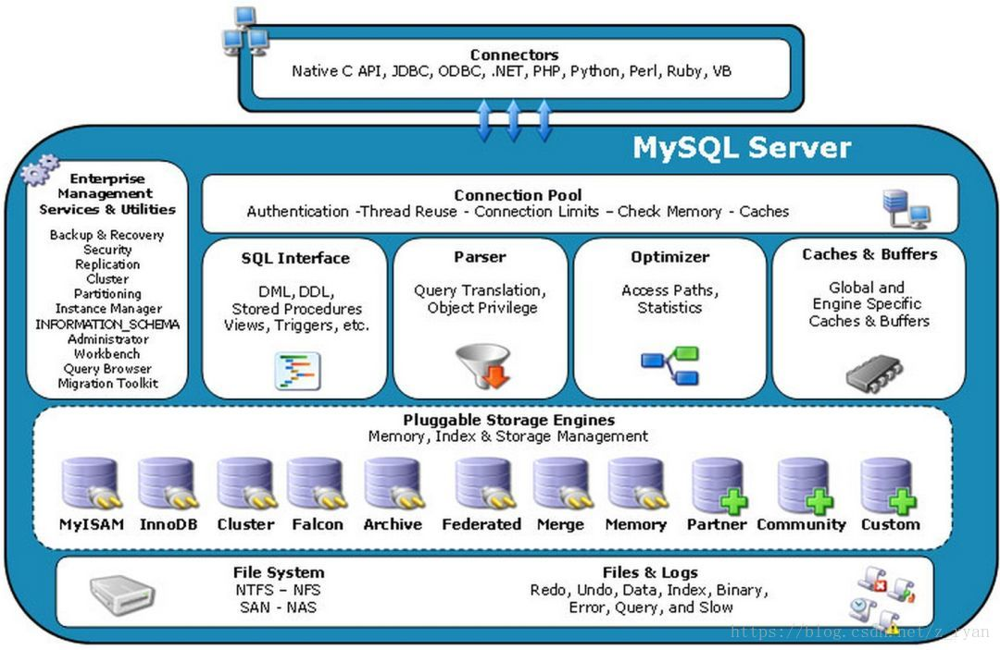

- **连接层：**最上层是一些客户端和连接服务，包含本地sock通信和大多数基于客户端/服务端工具实现的类似于tcp/ip的通信。主要完成一些类似于连接处理，授权认证、及相关的安全方案。在该层上引入了连接池的概念，为通过认证安全接入的客户端提供线程。同样在该层上可以实现基于SSL的安全链接。服务器也会为安全接入的每个客户端验证它所具有的操作权限
- **服务层：**第二层架构主要完成大多少的核心服务功能，如SQL接口，并完成缓存的查询，SQL的分析和优化及部分内置函数的执行。所有跨存储引擎的功能也在这一层实现，如过程、函数等。在该层，服务器会解析查询并创建相应的内部解析数，并对其完成相应的优化如确认查询表的顺序，是否利用索引等，最后生成相应的执行操作。如果是select语句，服务器还会查询内部的缓存。如果缓存空间足够大，这样在解决大量读操作的环境中能够很好的提升系统的性能
- **引擎层：**存储引擎层，存储引擎真正的负责了MYSQL中数据的存储和提取，服务器通过API与存储引擎进行通信。不同的存储引擎具有的功能不同，这样可以根据自己的实际需要进行选取
- **存储层：**数据存储层，主要是将数据存储在运行于设备的文件系统上，并完成与存储引擎的交互

## 1.5、存储引擎

### 1.5.1、查看命令

**查看mysql提供了什么存储引擎**

```mysql
show engines;
```

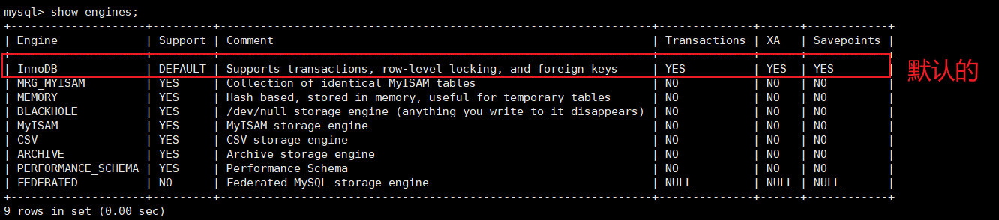

**查看当前默认的存储引擎**

```mysql
show variables like '%storage_engine%';
```

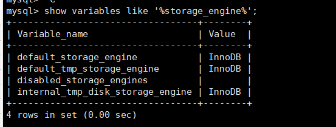

### 1.5.2、MyISAM和InnoDB

| 对比项   | MyISAM                                                 | InnoDB                                                       |
| -------- | ------------------------------------------------------ | ------------------------------------------------------------ |
| 主外键   | 不支持                                                 | 支持                                                         |
| 事务     | 不支持                                                 | 支持                                                         |
| 行表锁   | 表锁，即使操作一条记录也会锁住整个表不适合高并发的操作 | 行锁，操作时只锁某一行，不对其它行有影响，适合高并发操作     |
| 缓存     | 只缓存索引，不缓存真实数据                             | 不仅缓存索引还要缓存真实数据，对内存要求较高，而且内存大小对性能有决定性的影响 |
| 表空间   | 小                                                     | 大                                                           |
| 关注点   | 性能                                                   | 事务                                                         |
| 默认安装 | Y                                                      | Y                                                            |

# 2、索引优化分析

## 2.1、SQL执行加载顺序

**手写**

```mysql
SELECT DISTINCT
	<select_list>
FROM
	<left_table> <join_type> JOIN <right_table> ON <join_condition>
WHERE 
	<where_condition>
GROUP BY
	<group_by_list>
HAVING
	<having_condition>
ORDER BY
	<order_by_condition>
LIMIT <limit_number>
```

**机读**

```mysql
FROM <left_table>
ON <join_condition>
<join_type> JOIN <right_table>
WHERE <where_condition>
GROUP BY <group_by_list>
HAVING <having_condition>
SELECT 
DISTINCT <select_list>
ORDER BY <order_by_condition>
LIMIT <limit_number>
```

**总结**

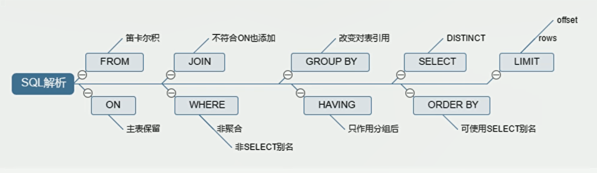

## 2.2、常见JOIN查询

**JOIN图解：**


**创建数据：**

```mysql
CREATE TABLE `tb_dept` (
  `id` int(11) NOT NULL AUTO_INCREMENT COMMENT '部门主键',
  `deptName` varchar(30) DEFAULT NULL COMMENT '部门名称',
  `locAdd` varchar(40) DEFAULT NULL COMMENT '楼层',
  PRIMARY KEY (`id`)
) ENGINE=InnoDB AUTO_INCREMENT=1 DEFAULT CHARSET=utf8;


CREATE TABLE `tb_emp` (
  `id` int(11) NOT NULL AUTO_INCREMENT COMMENT '员工主键',
  `name` varchar(20) DEFAULT NULL COMMENT '员工姓名',
  `deptId` int(11) DEFAULT NULL COMMENT '部门外键',
  PRIMARY KEY (`id`),
  KEY `fk_dept_id` (`deptId`)
  # CONSTRAINT `fk_dept_id` FOREIGN KEY (`deptId`) REFERENCES `tb_dept` (`id`) COMMENT '部门外键设置, 已经注释掉。'
) ENGINE=InnoDB AUTO_INCREMENT=1 DEFAULT CHARSET=utf8;

INSERT INTO tb_dept(deptName,locAdd) VALUES ('开发部', '11');
INSERT INTO tb_dept(deptName,locAdd) VALUES ('人事部', '12');
INSERT INTO tb_dept(deptName,locAdd) VALUES ('销售部', '13');
INSERT INTO tb_dept(deptName,locAdd) VALUES ('研发部', '14');
INSERT INTO tb_dept(deptName,locAdd) VALUES ('市场部', '15');

INSERT INTO tb_emp(name,deptId) VALUES ('张三', '1');
INSERT INTO tb_emp(name,deptId) VALUES ('李四', '1');
INSERT INTO tb_emp(name,deptId) VALUES ('王五', '1');
INSERT INTO tb_emp(name,deptId) VALUES ('小明', '2');
INSERT INTO tb_emp(name,deptId) VALUES ('小马', '2');
INSERT INTO tb_emp(name,deptId) VALUES ('小红', '3');
INSERT INTO tb_emp(name,deptId) VALUES ('小丁', '4');
INSERT INTO tb_emp(name,deptId) VALUES ('小西', '51');
```

### 2.2.1、Inner JOIN


```mysql
select * from tb_dept d inner join tb_emp e on d.id = e.deptId;
```

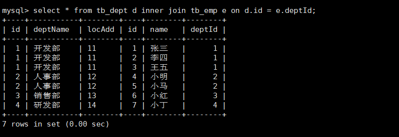

### 2.2.2、Left JOIN


```mysql
 select * from tb_dept d left join tb_emp e on d.id = e.deptId;
```


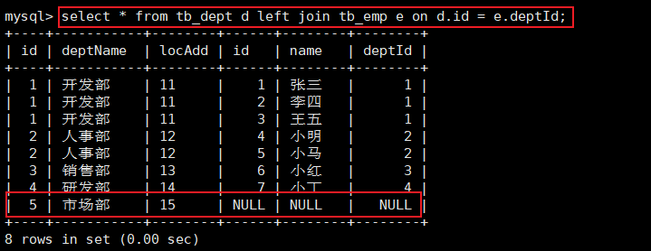

### 2.2.3、Right JOIN


```mysql
select * from tb_dept d right join tb_emp e on d.id = e.deptId;
```

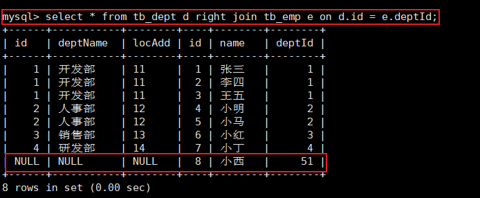

### 2.2.4、Left Excluding JOIN


```mysql
select * from tb_dept d left join tb_emp e on d.id = e.deptId where e.id is null;
```

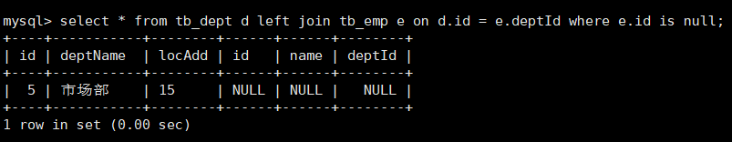

### 2.2.5、Right Excluding JOIN


```mysql
 select * from tb_dept d right join tb_emp e on d.id = e.deptId where d.id is null;
```

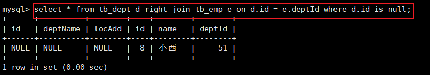

### 2.2.6、Outer JOIN


**MYSQL不支持**`FULL OUTER JOIN`关键字

```mysql
select * from tb_dept d full outer join tb_emp e on d.id = e.deptId;
```

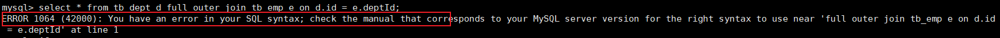

但是可以通过左连接和右连接达到效果

**使用union（合并去重）关键字解决中间公有部分**

```mysql
select * from tb_dept d left join tb_emp e on d.id = e.deptId
union
select * from tb_dept d right join tb_emp e on d.id = e.deptId;
```

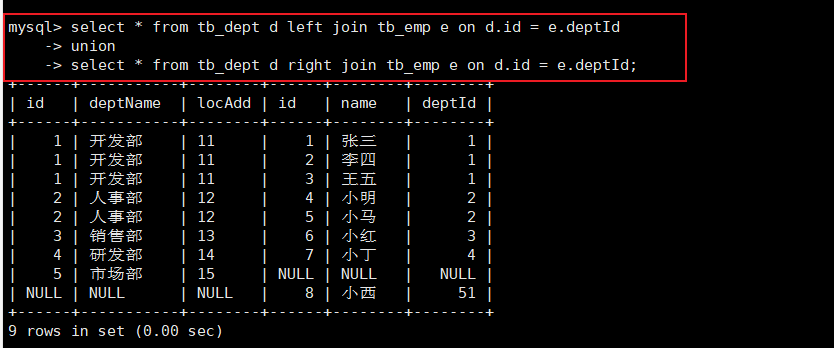

### 2.2.7、Outer Excluding JOIN


```mysql
select * from tb_dept d left join tb_emp e on d.id = e.deptId where e.id is null
union
select * from tb_dept d right join tb_emp e on d.id = e.deptId where d.id is null;
```

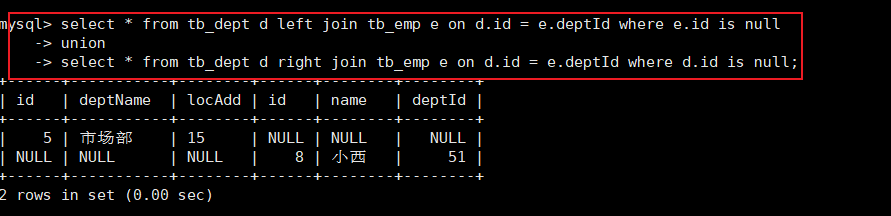

## 2.3、索引简介

### 2.3.1、简介

官方定义：索引（Index）是帮助MYSQL高效获取数据的数据结构。索引的目的是在于提高查询效率，可以类比字典。**索引是数据结构**

**排好序的快速查找数据结构：**

- 在数据之外，**数据库系统还维护着满足特定查找算法的数据结构**，这些数据结构以某种方式引用（指向）数据，这样就可以在数据结构上实现高级查找算法。这种数据结构，就是索引。

  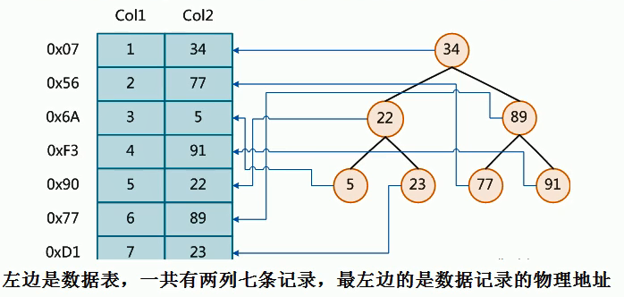

  - 为了加快Col2的查找，可以维护一个右边所示的二叉查找数，每个节点分别包含索引键值和一个指向对应数据记录的物理地址的指针，这样就可以运用二叉查找在一定复杂度内获取到相应数据，快速检索出符合条件的记录

索引本身也很大，不可能全部存储在内存中，因此索引是以索引文件的形式存储在磁盘上

**平常所说的索引，如果没有特别说明，都是指B树（多路搜素树，并不一定是二叉的）结构组织的索引。**其中聚集索引、次要索引、复合索引、前缀索引、唯一索引默认都是使用B+树索引，统称索引

### 2.3.2、优势劣势

**优势：**

- 提高数据检索效率，降低数据量的IO成本
- 通过索引列对数据进行排序，降低数据排序的成本，降低了CPU的消耗

**劣势：**

- 实际上索引也是一张表，该表保存了主键与索引字段，并指向实体表的记录，所以索引列也是要占用空间的
- 虽然索引大大提高了查询速度，同时却会降低更新表的速度，如对表进行INSERT、UPDATE、DELETE。因为更新表时，MYSQL不仅要保存数据，还要保存索引文件每次更新添加了索引列的字段，都会调整用为更新所带来的键值变化后的索引信息
- 索引只是提高效率的一个因素，如果有大数据量的表，就要花时间研究建立合适的索引，或优化

### 2.3.3、索引分类和创建

- **普通索引(normal)：**没有任何约束，主要用于提高查询效率
- **唯一索引(UNIQUE)：**在普通索引的基础上增加了数据唯一性的约束，可以有多个
- **主键索引(primary key)：**主键索引在唯一索引的基础上增加了不为空的约束，也就是 NOT NULL+UNIQUE，只能有一个
- **全文索引(FULLTEXT)：**MySQL 自带的全文索引只支持英文。

**基本语法：**

- **创建：**

  ```mysql
  -- 方式一
  CREATE [UNIQUE] INDEX 索引名 ON 表名(column_list);
  -- 方式二
  ALTER TABLE 表名 ADD [UNIQUE] INDEX 索引名 ON (column_list);
  ```

- **删除：**

  ```mysql
  DROP INDEX 索引名 ON 表名
  ```

- **查看：**

  ```mysql
  SHOW INDEX FROM 表名
  ```

- **ALTER命令：**

  ```mysql
  -- 添加一个主键，索引值必须是唯一的且不能为NULL
  ALTER TABLE 表名 ADD PRIMARY KEY(column_list);
  
  -- 创建索引的值必须是唯一的（除了NULL外，NULL可能会出现多次）
  ALTER TABLE 表名 ADD UNIQUE 索引名 (column_list);
  
  -- 添加普通索引，索引值可出现多次
  ALTER TABLE 表名 ADD INDEX 索引名 (column_list);
  
  -- 指定索引为FULLTEXT，用于全文检索
  ALTER TABLE 表名 ADD FULLTEXT 索引名 (column_list);
  ```

### 2.3.4、索引结构

- Hash索引

- full-text全文索引

- R-Tree索引

- BTree索引

  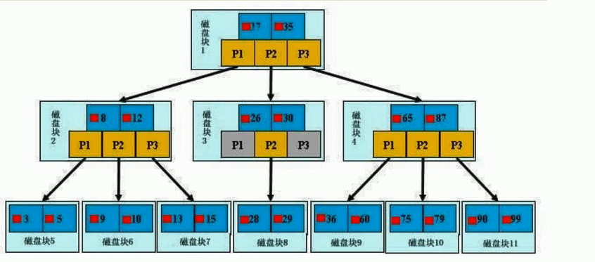

初始化介绍：

一颗b+树，浅蓝色的块称之为一个磁盘块，每个磁盘块包含几个数据项（深蓝色所示）和指示（黄色所示），如磁盘块1包含数据项17和35，包含指针P1、P2、P3

P1表示小于17的磁盘块，P2表示在17和35之间的磁盘块，P3表示大于35的磁盘块

真实的数据存在于叶子节点，即3、5、9、10、13、15、28、19、29、36、60、75、79、90、99

非叶子节点不存储真实数据，只存储指引搜索方向的数据项，如17、35并不真实存在于数据表中。

查找过程：

如果要查找数据项29，那么首先会把磁盘1由磁盘加载到内存，此时发生一次IO，在内存中用二分查找确定29在17和35之间，锁定磁盘块1的P2指针，内存时间因为非常短（相比磁盘的IO）可以忽略不计，通过磁盘块1的P2指针的磁盘地址吧磁盘块3由磁盘加载到内存，发生第二次IO，29在26和30之间，磁盘锁定块3的P2指针，通过指针加载磁盘块8到内存，发生第三次IO，同时内存中做二分查找找到29，结束查询，总计三次IO

真实的情况是，3层的b+树可以表示上百万的数据，如果上百万的数据查找只需要三次IO，性能提高将是巨大的，如果没有索引，每个数据项都要发生一次IO，那么总共需要百万次IO，成本是非常高的

### 2.3.5、索引创建的情况

**适合条件：**

- 主键自动建立唯一索引
- 频繁作为查询条件的字段应该创建索引
- 查询中与其它表关联的字段，外键关系建立索引
- WHERE条件里用不到的字段不创建索引
- 单键/组合索引的选择：在高并发下创建组合索引
- 查询中排序的字段，排序字段若通过索引去访问将大大提高排序速度
- 查询中统计或者分组字段

**不适合条件：**

- 表记录太少
- 频繁更新的字段不适合创建索引。因为每次更新不单单是更新了记录还会更新索引
- 经常增删改的表
  - 提高了查询速度，同时却会降低更新表的速度，如对表进行INSERT、UPDATE、DELETE。因为更新表时，MYSQL不仅要保存数据，还要保存索引文件
- 数据重复且分布平均的表字段。如果某个数据列包含许多重复的内容，建立索引就没有太大的实际效果
  - 假如一个表由10万行记录，有一个字段A只有T和F两种值，且每个值的分布概率不约为50%，那么对这种表A字段建索引一般不会提高数据库的查询速度
  - 索引的选择性是指索引列中不同值的数目与表中记录数的比，如果一个表中有2000条记录，表索引列有1980个不同的值，那么这个索引的选择性就是1980/2000=0.99。一个索引的选择性接近于1，这个索引的效率就是越高 vcf

## 2.4、性能分析


## 2.5、索引优化

# 3、查询截取分析

## 3.1、查询优化

## 3.2、慢查询日志

## 3.3、批量数据脚本

## 3.4、Show Profile

## 3.5、全局查询日志

# 4、MySQL锁机制

## 4.1、概述

## 4.2、表锁

## 4.3、行锁

## 4.4、页锁

# 5、主从复制