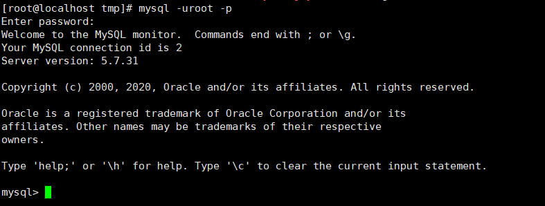
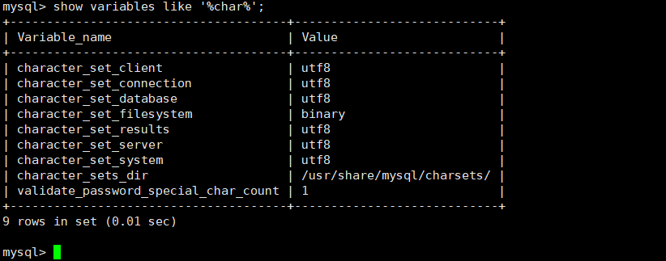

# 1、MySQL架构介绍

## 1.1、简介

**官网：https://www.mysql.com/**

MySQL是一个关系性数据库管理系统，由瑞典MySQL AB公司开发，目前属于Oracle公司

MySQL是一种关系型数据库管理系统，关系数据库将数据保存在不同的表中，而不是将所有数据放在一个大仓库内，这样就增加了速度并提高了灵活性。

MySQL所使用的 SQL 语言是用于访问数据库的最常用标准化语言。

MySQL 软件采用了双授权政策，分为社区版和商业版，由于其体积小、速度快、总体拥有成本低，尤其是开放源码这一特点，一般中小型网站的开发都选择 MySQL 作为网站数据库。

## 1.2、安装及配置

**centos7下使用yum源安装mysql5.7**

### 1.2.1、安装

- **下载yum源**

  ```bash
  wget 'https://dev.mysql.com/get/mysql57-community-release-el7-11.noarch.rpm'
  ```

  

- **安装yum源**

  ```bash
  rpm -Uvh mysql57-community-release-el7-11.noarch.rpm
  ```

  

- **查看有哪些mysql版本**

  ```bash
  yum repolist all | grep mysql
  ```

  

- **安装MySQL**

  默认安装5.7

  ```bash
  yum install -y mysql-community-server
  ```

  

- **查看版本**

  ```bash
  mysqladmin --version
  ```

  

### 1.2.2、启动MySQL服务

**启动服务**

```bash
systemctl start mysqld
```

**设置开机自启动**

```bash
systemctl enable mysqld
systemctl daemon-reload
```

### 1.2.3、设置ROOT密码

mysql5.7的新特性之一就是在初始化的时候会生成一个自定义的密码，然后你需要找到这个密码，登录的时候输入。注意，输入密码的时候是不显示。
找到密码: 红框的地方就是密码

```bash
grep 'temporary password' /var/log/mysqld.log
```


**登录数据库**

```bash
mysql -uroot -p
```



**修改密码**

```bash
ALTER USER 'root'@'localhost' IDENTIFIED BY '123456';
```


修改自定义密码时，由于自定义密码比较简单，就出现了不符合密码策略的问题。

必须修改两个全局参数：

```bash
set global validate_password_policy=0;
set global validate_password_length=1;
```

再次执行修改密码

```bash
ALTER USER 'root'@'localhost' IDENTIFIED BY '123456';
```

### 1.2.4、设置远程登录

现在这样是无法在本地用工具登录访问的，现在要做两件事，一件事是开放3306端口；另一件事是配置远程可以访问。

**先设置刚才的密码可以远程登录，然后使用flush命令使配置立即生效。**

```bash
GRANT ALL PRIVILEGES ON *.* TO 'root'@'%' IDENTIFIED BY '123456' WITH GRANT OPTION;
flush privileges;
```

**开放3306防火墙端口**

```bash
# 开放端口
firewall-cmd --zone=public --add-port=3306/tcp --permanent
# 重启防火墙
systemctl restart firewalld.service
```

**重启数据库**

```bash
systemctl restart mysqld
```

**远程连接测试**


### 1.2.5、修改字符编码集

由于我们是中文系统，而MYSQL默认的字符为latin1，所以容易出现乱码的情况，因此需要修改字符集的编码方式

**进入mysql，查看字符编码集**

```mysql
 show variables like '%char%';
```


MYSQL 5.7 开始 默认配置文件是：`/etc/my.cng`

```bash
vim /etc/my.cnf
```

**增加这几项**

```bash
[client]
default-character-set=utf8
[mysql]
default-character-set=utf8
[mysqld]
character_set_server = utf8
collation_server = utf8_general_ci
```


**重启MYSQL服务**

```bash
systemctl restart mysqld
```

**查看字符编码集**

```mysql
 show variables like '%char%';
```



**这里注意的是修改字符集只对之后的数据库生效，之前已经存在的数据库无效，所以建议安装完MYSQL后第一时间修改编码方式**

## 1.3、配置文件

**RPM安装MySql时的默认路径：**

- 数据文件：`/var/lib/mysql/`
- 配置文件模板：`/usr/share/mysql mysql`
- 客户端工具目录：`/usr/bin`
- 日志目录：`/var/log/pid`
- sock文件：`/var/lib/mysql/`
- 配置文件会放置在：`/etc`

**主要配置文件：**

- 二进制日志log-bin：主从复制
- 错误日志log-error：默认是关闭的，记录严重的警告和错误信息，每次启动和关闭的详细信息等。
- 查询日志log：默认关闭，记录查询的SQL语句，如果开启会降低MYSQL的整体性能，因为记录日志也是需要消耗系统资源
- 数据文件：
  - 两系统：
    - Windows：`安装目录\data`
    - Linux：默认路径：`/var/lib/mysql`
  - frm文件：存放表结构
  - myd文件：存放表数据
  - myi文件：存放表索引
- 如何配置：
  - Windows：`my.ini`文件
  - Linux：`/etc/my.cnf`文件

## 1.4、逻辑架构介绍

和其他数据库相比，MySQL它的架构可以在多种不同场景中应用并发挥良好作用。主要体现在存储引擎的架构上

插件式的存储引擎架构将查询处理和其他的系统任务以及数据的存储提取相分离。这种架构可以根据业务的需求和实际需求选择合适的存储引擎

## 1.5、存储引擎

# 2、索引优化分析

## 2.1、常见JOIN查询

## 2.2、索引简介

## 2.3、性能分析

## 2.4、索引优化

# 3、查询截取分析

## 3.1、查询优化

## 3.2、慢查询日志

## 3.3、批量数据脚本

## 3.4、Show Profile

## 3.5、全局查询日志

# 4、MySQL锁机制

## 4.1、概述

## 4.2、表锁

## 4.3、行锁

## 4.4、页锁

# 5、主从复制