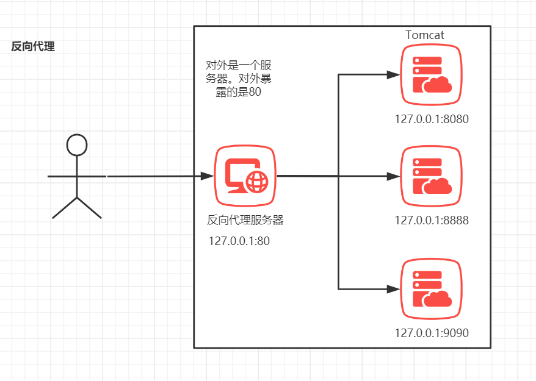
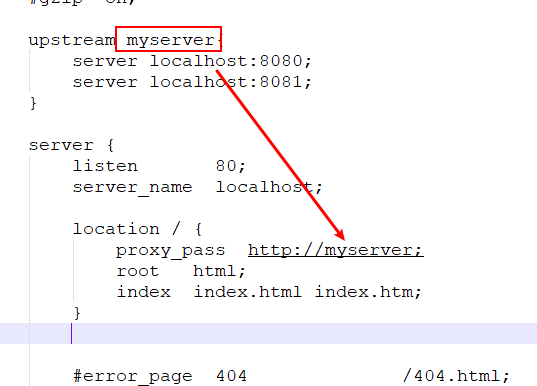

# 1、Nginx简介

## 1.1、概述

官网：http://nginx.org/

Nginx是一个高性能的**HTTP**和**反向代理**web服务器，同时也提供了IMAP/POP3/SMTP服务。

Nginx是一款**轻量级的Web服务器,反向代理服务器及电子邮件**（IMAP/POP3）代理服务器，在BSD-like 协议下发行。其特点是占有内存少，**并发能力强**，事实上nginx的并发能力在同类型的网页服务器中表现较好。

nginx做为HTTP服务器，有以下几项基本特性：

- 处理静态文件，索引文件以及自动索引；打开文件描述符缓冲．
- 无缓存的反向代理加速，简单的负载均衡和容错．
- FastCGI，简单的负载均衡和容错．
- 模块化的结构。包括gzipping, byte ranges, chunked responses,以及 SSI-filter等filter。如果由FastCGI或其它代理服务器处理单页中存在的多个SSI，则这项处理可以并行运行，而不需要相互等待。
- 支持SSL 和 TLSSNI．

参考文章：https://lnmp.org/nginx.html

## 1.2、正向代理

Nginx不仅可以做反向代理，实现负载均衡。还能用作正向代理来进行上网等功能。

正向代理：客户端访问服务器，通过代理服务器访问来访问服务器，这种代理服务称为反向代理

**在客户端配置代理服务器，通过代理服务器进行互联网访问**


## 1.3、反向代理

反向代理，其实客户端对代理是无感知的，因为客户端不需要任何配置就可以访问，我们只需要将请求发送到反向代理服务器，由反向代理服务器去选择目标服务器获取数据后，在返回给客户端，此时反向代理服务器和目标服务器对外就是一个服务器，**暴露代理服务器地址，隐藏了真实服务器IP地址**



## 1.4、负载均衡

客户端发送多个请求到服务器，服务器处理请求，有一些可能要与数据库交互，服务器处理完毕后，再将结果返回给客户端 。这种架构模式对于早期的系统相对单一，并发请求相对较少的情况下是比较合适，成本也低，但随着 数量的不断增长，访问量和数据量飞速增长，以及系统业务的复杂度增加，这种架构会造成服务器相应客户端的请求日益缓慢，并发量特别大的时候，容易造成服务器直接崩溃。单个服务器解决不了，可以增加服务器的数量(集群)，将请求分发到各个服务器上，将原先请求集中到单个服务器上的情况改为将请求分发到多个服务器，将负载分发到不同的服务器，这就是**负载均衡**

**将多个请求，分发到不同服务器。减轻服务器压力**


## 1.5、动静分离

为了加快网站的解析速度，可以吧动态页面和静态页面由不停服务器解析，加快解析速度。降低原来单个服务器压力


# 2、Nginx在Linux安装

参考文档：https://www.runoob.com/linux/nginx-install-setup.html

## 2.1、安装编译工具及库文件

```bash
yum -y install make zlib zlib-devel gcc-c++ libtool  openssl openssl-devel
```


## 2.2、安装 PCRE

PCRE 作用是让 Nginx 支持 Rewrite 功能。

- 下载 PCRE 安装包，下载地址： http://downloads.sourceforge.net/project/pcre/pcre/8.35/pcre-8.35.tar.gz

- 解压安装包

  ```bash
  tar zxvf pcre-8.35.tar.gz
  ```

  

- 进入安装包目录

  ```bash
  cd pcre-8.35
  ```

  

- 编译安装 

  ```bash
  ./configure
  make && make install
  ```

- 查看pcre版本

  ```bash
  pcre-config --version
  ```

  

## 2.3、安装Nginx

- 下载 Nginx，下载地址：http://nginx.org/download/nginx-1.6.2.tar.gz

- 解压安装包

  ```bash
  tar zxvf nginx-1.6.2.tar.gz
  ```

  

- 进入安装包目录

  ```bash
  cd nginx-1.6.2
  ```

- 编译安装

  ```bash
  ./configure
  make && make install
  ```

- 安装完成后会在 `/usr/local/`下有一个`nginx`目录

- 查看版本

  

- 启动测试

  **Nginx启动在sbin目录下有一个`./nginx`脚本**

  

  **注意：默认端口是80，需要开启防火墙，和安全组**

- 测试访问

  

# 3、Nginx常用命令

Nginx命令亲提条件要进入`/usr/local/nginx/sbin`

## 3.1、查看版本号

`./nginx -v`


## 3.2、启动

`./nginx`


## 3.3、停止

`./nginx -s stop`


## 3.4、重新加载

修改配置之后，不用停止，重新加载即可生效

`./nginx -s reload`


# 4、Nginx配置文件

## 4.1、位置

`/usr/local/nginx/conf/nginx.conf`


## 4.2、配置文件的组成

### 4.2.1、第一部分：全局块

```
#user  nobody;
worker_processes  1;

#error_log  logs/error.log;
#error_log  logs/error.log  notice;
#error_log  logs/error.log  info;

#pid        logs/nginx.pid;
```

从配置文件开始到events块之间的内容，主要会设置一些影响nginx服务器整体运行的配置指令，主要包括配置运行Nginx服务器的用户（组），允许生成worker process数，进程PID存放路径，日志存放路径和类型以及配置文件的引入等

```bash
worker_processes  1;
```

这时Nginx服务器并发处理服务的关键配置，**值越大，可以支持的并发处理也越多**，但是会受到硬件，软件等设备的限制

### 4.2.2、第二部分：events块

```bash
events {
    worker_connections  1024;
}
```

events块涉及的指令主要影响Nginx服务器与用户网络的连接，常用的设备包括是否开启对多并发下的网络连接进行序列化，是否允许同时接收多个网络连接，选取那种事件驱动模型类处理连接请求，每个word process可以支持的最大连接数等

上述表示为：work process支持的最大连接数为1024

这部分对Nginx性能影响较大，实际开发中应该灵活配置

### 4.2.2、第三部分：http块

```bash
http {
    include       mime.types;
    default_type  application/octet-stream;

    #log_format  main  '$remote_addr - $remote_user [$time_local] "$request" '
    #                  '$status $body_bytes_sent "$http_referer" '
    #                  '"$http_user_agent" "$http_x_forwarded_for"';

    #access_log  logs/access.log  main;

    sendfile        on;
    #tcp_nopush     on;

    #keepalive_timeout  0;
    keepalive_timeout  65;

    #gzip  on;

    server {
        listen       80;
        server_name  localhost;

        #charset koi8-r;

        #access_log  logs/host.access.log  main;

        location / {
            root   html;
            index  index.html index.htm;
        }

        #error_page  404              /404.html;

        # redirect server error pages to the static page /50x.html
        #
        error_page   500 502 503 504  /50x.html;
        location = /50x.html {
            root   html;
        }

        # proxy the PHP scripts to Apache listening on 127.0.0.1:80
        #
        #location ~ \.php$ {
        #    proxy_pass   http://127.0.0.1;
        #}

        # pass the PHP scripts to FastCGI server listening on 127.0.0.1:9000
        #
        #location ~ \.php$ {
        #    root           html;
        #    fastcgi_pass   127.0.0.1:9000;
        #    fastcgi_index  index.php;
        #    fastcgi_param  SCRIPT_FILENAME  /scripts$fastcgi_script_name;
        #    include        fastcgi_params;
        #}

        # deny access to .htaccess files, if Apache's document root
        # concurs with nginx's one
        #
        #location ~ /\.ht {
        #    deny  all;
        #}
    }


    # another virtual host using mix of IP-, name-, and port-based configuration
    #
    #server {
    #    listen       8000;
    #    listen       somename:8080;
    #    server_name  somename  alias  another.alias;

    #    location / {
    #        root   html;
    #        index  index.html index.htm;
    #    }
    #}


    # HTTPS server
    #
    #server {
    #    listen       443 ssl;
    #    server_name  localhost;

    #    ssl_certificate      cert.pem;
    #    ssl_certificate_key  cert.key;

    #    ssl_session_cache    shared:SSL:1m;
    #    ssl_session_timeout  5m;

    #    ssl_ciphers  HIGH:!aNULL:!MD5;
    #    ssl_prefer_server_ciphers  on;

    #    location / {
    #        root   html;
    #        index  index.html index.htm;
    #    }
    #}

}
```

这是Nginx服务器中配置最频繁的部分，代理，缓存，日志等大多数功能和第三方模块都配置在这里

**http块又包含：http全局块，server块**

#### 4.2.2.1、http全局块

```bash
    include       mime.types;
    default_type  application/octet-stream;

    #log_format  main  '$remote_addr - $remote_user [$time_local] "$request" '
    #                  '$status $body_bytes_sent "$http_referer" '
    #                  '"$http_user_agent" "$http_x_forwarded_for"';

    #access_log  logs/access.log  main;

    sendfile        on;
    #tcp_nopush     on;

    #keepalive_timeout  0;
    keepalive_timeout  65;

    #gzip  on;
```

http全局块配置的指令包括文件引入，MIME-TYPE定义，日志自定义，连接超时时间，单链接请求数上限等

#### 4.2.2.1、server块

每个http块可以包括多个server块，而每个server块相当一个虚拟主机

而每个server块也分为全局server块，以及可以同时包含多个location块

- 全局server块

  最常见的配置是主机的监听配置和主机的名称或IP配置

- location块

  一个server块可以配置多个location块

  这块的主要作用是基于Nginx服务器收到的请求字符串（例如：server_name/uri-string）,对主机名称（IP）之外的字符串进行匹配，对特定的请求进行处理，地址定向，数据缓存和应答控制等功能，还有第三方模块也配置在这里

# 5、反向代理

实现效果：访问http://localhost:80/跳转到tomcat

修改nginx.cong配置文件


测试：

Nginx反向代理


Tomcat地址


## 根据不同url转发不同的服务器


**location指令说明：**

- `=`：用于不含正则表达式的url前，要请求字符串与url**严格匹配**，如果匹配成功，就停止继续向下搜索，并立即处理该请求
- `~`：用于表示url包含正则表达式，并**区分大小写**
- `~*`：用于表示url包含正则表达式，并且**不区分大小写**
- `^~`：用于不包含正则表达式的url前，要求Nginx服务器找到标识url和请求字符串匹配度最高的location后，立即使用此location处理请求，而不在使用location块中的正则url和请求字符串匹配

**注意：如果url包含正则表达式，则必须要有`~`或者`~*`标识**

# 6、负载均衡

**实现效果：**

在浏览器输入beloved.ink,平均将请求分配到各个服务器

在nginx.conf中配置



```bash
http {
	upstream myserver{
		server localhost:8080;
		server localhost:8081;
	}
	
	...

    server {
        listen       80;
        server_name  localhost; 

        location / {
			proxy_pass  http://myserver;
			root   html;
            index  index.html index.htm;
        }

}
```

## Nginx负载均衡策略

### 1、轮询（默认）

每个请求按时间顺序逐一分配到不同的后端服务器，如果后端服务器down掉，可以自动剔除

即上面的默认策略方法，一个一个轮流

### 2、weight

**weight代表权重：默认为1，权重越高被分配的客户端越多**

```bash
upstream myserver{
    server localhost:8080 weight=5;
    server localhost:8081 weight=10;
}
```


### 3、ip_hash

每个请求按访问IP的hash结果分配，这样每个客户端固定访问一个服务器，可以解决session共享问题

即客户第一次访问那个服务器以后都是访问这个服务器

```bash
upstream myserver{
    ip_hash;
    server localhost:8080;
    server localhost:8081;
}
```

### 4、fair(第三方)

按后端服务器响应时间来分配请求，响应时间短的优先分配

```bash
upstream myserver{
	server localhost:8080;
	server localhost:8081;
	fair;
}
```

# 7、Nginx安装SSL证书

参考文章：https://help.aliyun.com/document_detail/98728.html?spm=5176.2020520163.0.0.467256a74qa47M

- 在Nginx的安装目录下(默认目录`/usr/local/nginx/cong`)创建`cert`文件夹，将ssl证书文件拷贝进去

- 修改`nginx.conf`配置文件

```bash
# HTTPS server
server {
	listen 443 ssl;   #SSL协议访问端口号为443。此处如未添加ssl，可能会造成Nginx无法启动。
	server_name beloved.ink;  #将localhost修改为您证书绑定的域名，例如：www.example.com。
	root html;
	index index.html index.htm;
	ssl_certificate cert/3837434_www.beloved.ink.pem;   #将domain name.pem替换成您证书的文件名。
	ssl_certificate_key cert/3837434_www.beloved.ink.key;   #将domain name.key替换成您证书的密钥文件名。
	ssl_session_timeout 5m;
	ssl_ciphers ECDHE-RSA-AES128-GCM-SHA256:ECDHE:ECDH:AES:HIGH:!NULL:!aNULL:!MD5:!ADH:!RC4;  #使用此加密套件。
	ssl_protocols TLSv1 TLSv1.1 TLSv1.2;   #使用该协议进行配置。
	ssl_prefer_server_ciphers on;   
	location / {
		proxy_pass  http://answer;   #站点目录。
		index index.html index.htm;   
	}
}
```
- 重启Nginx

**错误问题**


**可能是ssl模块未安装。默认情况下ssl模块并未被安装，如果要使用该模块则需要在编译nginx时指定–with-http_ssl_module参数**

**解决方案：**

- 切换到源码包

  ```bash
  cd /usr/local/src/nginx-1.6.2
  ```

- 查看nginx原有的模块

  ```bash
  /usr/local/nginx/sbin/nginx -V
  ```

  在`configure arguments:`后面显示的就是安装的模块。查看有无ssl模块

- 安装ssl模块

  ```bash
  ./configure --prefix=/usr/local/nginx --with-http_stub_status_module --with-http_ssl_module
  ```

- 配置完成后，运行命令

  ```bash
  make
  ```

  **这里不要进行make install，否则就是覆盖安装**

- 备份原有已安装好的Nginx

  ```bash
  cp /usr/local/nginx/sbin/nginx /usr/local/nginx/sbin/nginx.bak
  ```

- 将刚刚编译好的nginx覆盖掉原有的nginx（**这个时候nginx要停止状态。如果不能正常关闭，查看进程，杀pid**）

  ```bash
  cp ./objs/nginx /usr/local/nginx/sbin/
  ```

- 然后启动nginx，查看是否加入成

  ```bash
  /usr/local/nginx/sbin/nginx -V
  ```

  

- 测试访问

  

# 8、配置Http自动跳转Https

**在需要跳转的HTTP站点下添加以下rewrite语句，实现HTTP访问自动跳转到HTTPS页面**

```bash
server {
        listen       80;
        server_name  beloved.ink;  #  #将localhost修改为证书绑定的域名

        location / {
			rewrite ^(.*)$ https://$host$1 permanent;   #将所有http请求通过rewrite重定向到https。
			proxy_pass  http://answer;
        }
}
```

# 9、nginx代理后刷新显示404

通过首页进入访问页面正常，F5刷新之后出现404错误

原因是因为web单页面开发模式，只有一个index.html入口，其他路径是前端路由去跳转的，nginx没有对应这个路径，当然就是404了。
配置如下

```bash
server {
    listen          80;
    server_name     beloved.ink;

    location / {
    	root    /usr/local/tmp/BXY/BXY_WEB;
        index   index.html index.htm;
    	try_files $uri $uri/ /index.html;
    }
}
```
在每个server块，添加`try_files $uri $uri/ /index.html;`配置可解决