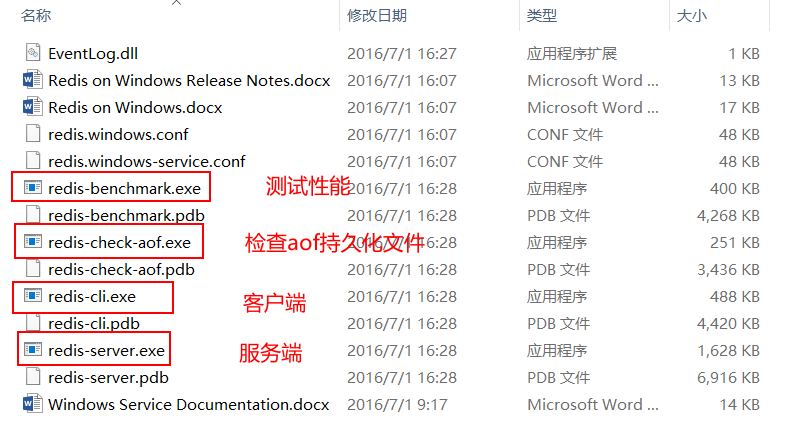
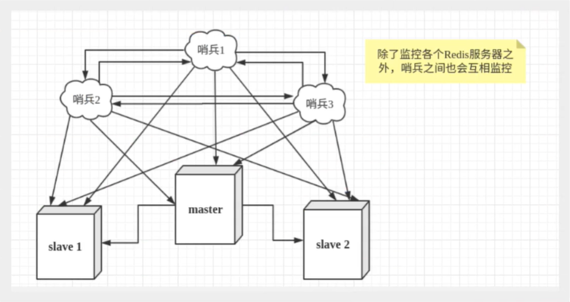

# 1、概述

REmote DIctionary Server(Redis) 是一个由Salvatore Sanfilippo写的key-value存储系统。

Redis是一个开源的使用ANSI C语言编写、遵守BSD协议、支持网络、可基于内存亦可持久化的日志型、Key-Value数据库，并提供多种语言的API。

它通常被称为数据结构服务器，因为值（value）可以是 字符串(String), 哈希(Hash), 列表(list), 集合(sets) 和 有序集合(sorted sets)等类型。

> Redis可以干什么？

- 内存存储，持久化
- 效率高，可以用于高速缓存
- 发布订阅系统
- 地图信息分析
- 计时器，计数器
- ......

> 特性

- 多样的数据类型
- 持久化
- 集群
- 事务
- ......

官网：https://redis.io/

中文网：http://www.redis.cn/

Github：https://github.com/antirez/redis

**官方不推荐在Window上使用。window版本需要在GitHub上下载**

# 2、Windows安装

- 下载地址：https://github.com/microsoftarchive/redis/releases

  

- 解压下载的安装包即可

  

- 开启Redis。允许服务即可

  

- 使用客户端连接Redis

  

# 3、Linux安装

- 下载地址：https://redis.io/


- 上传压缩文件并解压

  我是准备安装在`/usr/local/redis`下，文件上传在此目录

  

- **注意：安装redis需要gcc环境**

  ```bash
  gcc -v  # 查看版本
  
  yum -y install gcc  # 安装
  ```

- 进入解压文件目录使用make对解压的Redis文件进行编译

  

  编译后的文件

  

- 编译成功后，进入src文件夹，执行`make install`进行Redis安装。

  **报错**

  

  **解决办法：**

  ```bash
# 查看gcc版本是否在5.3以上，centos7.6默认安装4.8.5
  gcc -v
  # 升级gcc到5.3及以上,如下：
  升级到gcc 9.3：
  yum -y install centos-release-scl
  yum -y install devtoolset-9-gcc devtoolset-9-gcc-c++ devtoolset-9-binutils
  scl enable devtoolset-9 bash
  需要注意的是scl命令启用只是临时的，退出shell或重启就会恢复原系统gcc版本。
  如果要长期使用gcc 9.3的话：
  
  echo "source /opt/rh/devtoolset-9/enable" >>/etc/profile
  这样退出shell重新打开就是新版的gcc了
  以下其他版本同理，修改devtoolset版本号即可。
  ```
  
  **重新安装，如果所示安装成功**

  

- **为了方便管理，将Redis文件中的conf配置文件和常用命令移动到统一文件中**

  在`redis`创建`bin`和`etc`文件

  

- 回到刚刚安装目录，找到`redis.conf`，将其复制移动到` /usr/local/redis/ect` 下

  ```bash
  cp redis.conf /usr/local/redis/etc/
  ```

  

- 进入src目录,将常用命令移动到`bin`目录下

  ```bash
  mv mkreleasehdr.sh redis-benchmark redis-check-aof redis-check-rdb redis-cli redis-server redis-sentinel redis-trib.rb /usr/local/redis/bin/
  ```

  

- 修改配置文件

  **Redis默认不是后台启动**

  使用`vim`命令修改`redis.cong`配置文件

  

  

- 进入`bin`目录通过指定配置文件启动

  ```bash
  ./redis-server /usr/local/redis/etc/redis.conf
  ```

  

- 使用客户端连接测试

  ```bash
  ./redis-cli -p 6379
  ```

  

- 查看redis进程是否开启

  ```bash
  ps -ef|grep redis
  ```

  

- 关闭Redis

  ```bash
  shutdown # 关闭
  exit     # 退出
  ```

  

  


# 4、测试性能

**redis-benchmark**：是一个官方自带的压力测试工具

redis 性能测试工具可选参数如下所示：

| 序号 | 选项      | 描述                                       | 默认值    |
| :--- | :-------- | :----------------------------------------- | :-------- |
| 1    | **-h**    | 指定服务器主机名                           | 127.0.0.1 |
| 2    | **-p**    | 指定服务器端口                             | 6379      |
| 3    | **-s**    | 指定服务器 socket                          |           |
| 4    | **-c**    | 指定并发连接数                             | 50        |
| 5    | **-n**    | 指定请求数                                 | 10000     |
| 6    | **-d**    | 以字节的形式指定 SET/GET 值的数据大小      | 2         |
| 7    | **-k**    | 1=keep alive 0=reconnect                   | 1         |
| 8    | **-r**    | SET/GET/INCR 使用随机 key, SADD 使用随机值 |           |
| 9    | **-P**    | 通过管道传输 <numreq> 请求                 | 1         |
| 10   | **-q**    | 强制退出 redis。仅显示 query/sec 值        |           |
| 11   | **--csv** | 以 CSV 格式输出                            |           |
| 12   | **-l**    | 生成循环，永久执行测试                     |           |
| 13   | **-t**    | 仅运行以逗号分隔的测试命令列表。           |           |
| 14   | **-I**    | Idle 模式。仅打开 N 个 idle 连接并等待。   |           |

**测试**

```bash
# 测试：100个并发请求 100000请求
redis-benchmark -h localhost -p 6379 -c 100 -n 100000
```


**查看分析：SET**


# 5、基础知识

**Redis默认有16个数据库，默认使用第0个。可以在配置文件查看**


**可以使用Select切换数据库**

```bash
127.0.0.1:6379> select 6   # 切换数据库
OK 
127.0.0.1:6379[6]> dbsize  # 查看数据库大小
(integer) 0
```


**查看所得key**

```
keys *
```


**清除当前数据库**

```
flushdb
```


**清除全部数据库的内容**

```
flushall
```


> 为什么Redis是单线程还这么块？

redis是单线程，线程安全

redis可以能够快速执行的原因：

- 绝大部分请求是纯粹的内存操作（非常快速）
-  采用单线程,避免了不必要的上下文切换和竞争条件
-  非阻塞IO - IO多路复用（[IO 多路复用是什么意思？](https://www.zhihu.com/question/32163005)）

IO多路复用中有三种方式：select,poll,epoll。需要注意的是，select,poll是线程不安全的，epoll是线程安全的

redis内部实现采用epoll，采用了epoll+自己实现的简单的事件框架。epoll中的读、写、关闭、连接都转化成了事件，然后利用epoll的多路复用特性，绝不在io上浪费一点时间 这3个条件不是相互独立的，特别是第一条，如果请求都是耗时的，采用单线程吞吐量及性能可想而知了。应该说redis为特殊的场景选择了合适的技术方案。

# 6、五大数据类型

**官方介绍：**


Redis 是一个开源（BSD许可）的，内存中的数据结构存储系统，它可以用作==数据库==、==缓存==和==消息中间件==。 它支持多种类型的数据结构，如 [字符串（strings）](http://www.redis.cn/topics/data-types-intro.html#strings)， [散列（hashes）](http://www.redis.cn/topics/data-types-intro.html#hashes)， [列表（lists）](http://www.redis.cn/topics/data-types-intro.html#lists)， [集合（sets）](http://www.redis.cn/topics/data-types-intro.html#sets)， [有序集合（sorted sets）](http://www.redis.cn/topics/data-types-intro.html#sorted-sets) 与范围查询， [bitmaps](http://www.redis.cn/topics/data-types-intro.html#bitmaps)， [hyperloglogs](http://www.redis.cn/topics/data-types-intro.html#hyperloglogs) 和 [地理空间（geospatial）](http://www.redis.cn/commands/geoadd.html) 索引半径查询。 Redis 内置了 [复制（replication）](http://www.redis.cn/topics/replication.html)，[LUA脚本（Lua scripting）](http://www.redis.cn/commands/eval.html)， [LRU驱动事件（LRU eviction）](http://www.redis.cn/topics/lru-cache.html)，[事务（transactions）](http://www.redis.cn/topics/transactions.html) 和不同级别的 [磁盘持久化（persistence）](http://www.redis.cn/topics/persistence.html)， 并通过 [Redis哨兵（Sentinel）](http://www.redis.cn/topics/sentinel.html)和自动 [分区（Cluster）](http://www.redis.cn/topics/cluster-tutorial.html)提供高可用性（high availability）。

## 6.1、Redis-Key

```bash
127.0.0.1:6379> keys *  # 查看当前数据库中的key
1) "name"
2) "age"
127.0.0.1:6379> exists name  # 判断是否存在某个值   返回1存在0不存在
(integer) 1
127.0.0.1:6379> exists name2
(integer) 0
127.0.0.1:6379> del name  # 移除当前key
(integer) 1
127.0.0.1:6379> move name 1  # 移动当前值到指定数据库
(integer) 1
127.0.0.1:6379> expire age 10  # 设置key的过期时间 单位是秒
(integer) 1
127.0.0.1:6379> ttl age  # 查看当前key的剩余时间
(integer) 6
127.0.0.1:6379> ttl age  # 返回负数已经过期
(integer) -2
127.0.0.1:6379> type age  # 查看当前key的类型
string
127.0.0.1:6379> type name
string

```

**更多命令可以在Redis官网查看**


## 6.2、String

```bash
####################################################################################
127.0.0.1:6379> set k1 v1      # 设置值
OK
127.0.0.1:6379> get k1         # 获取值
"v1"
127.0.0.1:6379> keys *         # 获取当前所有的key
1) "k1"
127.0.0.1:6379> exists k1      # 判断某个key是否存在
(integer) 1
127.0.0.1:6379> append k1 v2   # 追加字符串
(integer) 4
127.0.0.1:6379> get k1
"v1v2"
127.0.0.1:6379> append k2 v2   # 追加字符串，如果当前的key不存在，就新建
(integer) 2
127.0.0.1:6379> keys *
1) "k1"
2) "k2"
127.0.0.1:6379> strlen k1      # 获取字符串长度
(integer) 4
127.0.0.1:6379> append k1 v3
(integer) 6
127.0.0.1:6379> strlen k1
(integer) 6
127.0.0.1:6379> get k1
"v1v2v3"
####################################################################################
127.0.0.1:6379> set i 1       # 设置初始值 1
OK
127.0.0.1:6379> get i
"1"
127.0.0.1:6379> incr i        # 自增1
(integer) 2
127.0.0.1:6379> incr i
(integer) 3
127.0.0.1:6379> get i
"3"
127.0.0.1:6379> decr i       # 自减1
(integer) 2
127.0.0.1:6379> get i
"2"
127.0.0.1:6379> incrby i 10  # 自增 步长10
(integer) 12
127.0.0.1:6379> get i
"12"
127.0.0.1:6379> decrby i 5   # 自建 步长 5
(integer) 7
127.0.0.1:6379> get i
"7"
####################################################################################
# 字符串范围range
127.0.0.1:6379> set k1 abcdefg   # 设置初始值
OK
127.0.0.1:6379> get k1
"abcdefg"
127.0.0.1:6379> getrange k1 0 3  # 截取字符串[0,3]
"abcd"
127.0.0.1:6379> getrange k1 0 -1 # 尾数负数 获取整个值
"abcdefg"
127.0.0.1:6379> setrange k1 1 xxx  # 替换指定位置开始的字符串
(integer) 7
127.0.0.1:6379> get k1
"axxxefg"
####################################################################################
# setex  设置key-value并设置过期时间 单位：秒
# setnx  当key不存在时在设置  (在分布式锁中经常使用)
127.0.0.1:6379> setex k1 10 abc # 设置k1的值abc  10秒后过期
OK
127.0.0.1:6379> ttl k1  		# 查看剩余时间
(integer) 7
127.0.0.1:6379> get k1
"abc"
127.0.0.1:6379> get k1
(nil)
127.0.0.1:6379> setnx k1 abc 	# 如果k1不存在  创建k1
(integer) 1
127.0.0.1:6379> get k1
"abc"
127.0.0.1:6379> setnx k1 aaa   # 如果k1存在    创建失败
(integer) 0
127.0.0.1:6379> get k1
"abc"
####################################################################################
# mset  批量创建
# mget  批量获取
127.0.0.1:6379> mset k1 v1 k2 v2 k3 v3   # 同时创建多个值
OK
127.0.0.1:6379> keys *
1) "k1"
2) "k2"
3) "k3"
127.0.0.1:6379> mget k1 k2 k3            # 同时获取多个值
1) "v1"
2) "v2"
3) "v3"
127.0.0.1:6379> msetnx k1 v1 k4 v4		# 如果不存在同时创建多个值
(integer) 0								# 原子性，要么一起成功，要么一起失败
127.0.0.1:6379> msetnx k4 v4 k5 v5		
(integer) 1
127.0.0.1:6379> keys *
1) "k4"
2) "k1"
3) "k5"
4) "k2"
5) "k3"

# 对象
set user:1:{name:张三,age:20}   # 设置一个user:1对象，值为json字符串保存对象
# user:id:{filed}
127.0.0.1:6379> mset user:1:name aaa user:1:age 20 
OK
127.0.0.1:6379> mget user:1:name user:1:age
1) "aaa"
2) "20"
127.0.0.1:6379> keys *
1) "user:1:name"
2) "user:1:age"
####################################################################################
getste # 先get然后set
127.0.0.1:6379> getset k1 aaa  # 如果不存在则返回nil，然后创建新的k-v
(nil)
127.0.0.1:6379> get k1
"aaa"
127.0.0.1:6379> getset k1 bbb  # 如果存在，则先返回原来的值，然后更新为新的值
"aaa"
127.0.0.1:6379> get k1
"bbb"
127.0.0.1:6379> 
```

## 6.3、List

在redis里可以吧list实现为：栈、队列、阻塞队列

**所有的list命令都是以：l开头的**

```bash
####################################################################################
127.0.0.1:6379> lpush list a   		# 将一个值或多个值，插入到列表的头部（左）
(integer) 1
127.0.0.1:6379> lpush list b c
(integer) 3
127.0.0.1:6379> keys *
1) "list"
127.0.0.1:6379> lrange list 0 -1	# 获取list中的值
1) "c"
2) "b"
3) "a"
127.0.0.1:6379> lrange list 0 1     # 通过区间获取指定的值
1) "c"
2) "b"
127.0.0.1:6379> rpush list 1 2 3
(integer) 6
127.0.0.1:6379> lrange list 0 -1	# 将一个值或多个值，插入到列表的尾部（右）
1) "c"
2) "b"
3) "a"
4) "1"
5) "2"
6) "3"
####################################################################################
# 移除  
127.0.0.1:6379> lrange list 0 -1
1) "c"
2) "b"
3) "a"
4) "1"
5) "2"
6) "3"
127.0.0.1:6379> lpop list 	# 移除列表的第一个元素
"c"
127.0.0.1:6379> rpop list   # 移除列表的最后一个元素
"3"
127.0.0.1:6379> lrange list 0 -1
1) "b"
2) "a"
3) "1"
4) "2"
####################################################################################
# lindex 通过下标获取值
127.0.0.1:6379> lrange list 0 -1
1) "b"
2) "a"
3) "1"
4) "2"
127.0.0.1:6379> lindex list 0		# 获取第一个值
"b"
127.0.0.1:6379> lindex list 1		# 获取指定的值
"a"
127.0.0.1:6379> lindex list -1		# 获取最后一个值
"2"
####################################################################################
# llen  获取列表的长度
127.0.0.1:6379> lrange list 0 -1
1) "b"
2) "a"
3) "1"
4) "2"
127.0.0.1:6379> llen list		# 获取列表的长度
(integer) 4
####################################################################################
# lrem 移除指定的值
127.0.0.1:6379> RPUSH list a a a b c 
(integer) 5
127.0.0.1:6379> lrange list 0 -1     	# 列表是可以存在重复值
1) "a"
2) "a"
3) "a"
4) "b"
5) "c"
127.0.0.1:6379> lrem list 1 a			# 移除list中指定个数的values
(integer) 1
127.0.0.1:6379> lrange list 0 -1
1) "a"
2) "a"
3) "b"
4) "c"
127.0.0.1:6379> lrem list 2 a
(integer) 2
127.0.0.1:6379> lrange list 0 -1
1) "b"
2) "c"
127.0.0.1:6379> lrem list 2 b			# 如果大于最大数量，就移除这个值全部
(integer) 1
127.0.0.1:6379> lrange list 0 -1
1) "c"
####################################################################################
# ltrim 截断
127.0.0.1:6379> rpush list a b c d e f g
(integer) 7
127.0.0.1:6379> lrange list 0 -1
1) "a"
2) "b"
3) "c"
4) "d"
5) "e"
6) "f"
7) "g"
127.0.0.1:6379> ltrim list 1 3          # 通过下标截取指定长度
OK
127.0.0.1:6379> lrange list 0 -1        # list被改变了，只剩下截取的部分
1) "b"
2) "c"
3) "d"
127.0.0.1:6379>
####################################################################################
# rpoplpush 移除列表的最后一个元素，并移动到新的列表中
127.0.0.1:6379> rpush list a b c
(integer) 3
127.0.0.1:6379> lrange list 0 -1
1) "a"
2) "b"
3) "c"
127.0.0.1:6379> rpoplpush list list2   # 移除列表的最后一个元素，并移动到新的列表中
"c"
127.0.0.1:6379> lrange list 0 -1   	   # 查看原来的列表 
1) "a"
2) "b"
127.0.0.1:6379> lrange list2 0 -1		# 查看目标列表
1) "c"
####################################################################################
# lset   将列表中指定下标的值替换成另外一个值，更新操作
127.0.0.1:6379> keys *
(empty array)
127.0.0.1:6379> exists list            # 判断列表是否存在
(integer) 0
127.0.0.1:6379> lset list 0 a		   # 如果不存在列表，更新会报错
(error) ERR no such key
127.0.0.1:6379> rpush list a
(integer) 1
127.0.0.1:6379> exists list 			# 判断列表是否存在
(integer) 1
127.0.0.1:6379> lset list 0 b			# 如果存在，更新指定下标的值
OK
127.0.0.1:6379> lrange list 0 0
1) "b"
127.0.0.1:6379> lset list 1 a			# 下标不存在，报错
(error) ERR index out of range
####################################################################################
# linsert   将某个值插入到列表中某个元素的前面或后面
127.0.0.1:6379> rpush list a b c 
(integer) 3
127.0.0.1:6379> lrange list 0 -1
1) "a"
2) "b"
3) "c"
127.0.0.1:6379> linsert list before b 1      # 插入到前面
(integer) 4
127.0.0.1:6379> lrange list 0 -1
1) "a"
2) "1"
3) "b"
4) "c"
127.0.0.1:6379> linsert list after b 2		# 插入到后面
(integer) 5
127.0.0.1:6379> lrange list 0 -1
1) "a"
2) "1"
3) "b"
4) "2"
5) "c"
####################################################################################
```

- list实际上是一个链表，before/after、left、right都可以插入值
- 如果key不存在，创建新的链表
- 如果key存在，新增内容
- 如果移除了所有的值，空链表，也代表不存在
- 在两边插入或改代值，效率最高！中间元素，相对效率会低

## 6.4、Set

**set的值不能重复**

```bash
####################################################################################
127.0.0.1:6379> sadd set a        # 将一个或多个值添加到set集合中
(integer) 1
127.0.0.1:6379> sadd set b c
(integer) 2
127.0.0.1:6379> sadd set a        # 如果存在，则返回0
(integer) 0
127.0.0.1:6379> smembers set	  # 查看set集合中的所有值
1) "c"
2) "a"
3) "b"
127.0.0.1:6379> sismember set d   # 判断某个值是否存在在set集合中
(integer) 0						  # 0不存在
127.0.0.1:6379> sismember set a
(integer) 1						  # 1存在
127.0.0.1:6379> scard set  		  # 获取set集合中元素内容的个数
(integer) 3
####################################################################################
# srem 移除元素
127.0.0.1:6379> smembers set
1) "c"
2) "a"
3) "b"
127.0.0.1:6379> srem set a b     # 移除一个或多个元素
(integer) 2
127.0.0.1:6379> smembers set
1) "c"
####################################################################################
# 随机
127.0.0.1:6379> sadd set a b c d
(integer) 4
127.0.0.1:6379> smembers set
1) "c"
2) "a"
3) "d"
4) "b"
127.0.0.1:6379> srandmember set      # 随机抽选一个元素
"c"
127.0.0.1:6379> srandmember set
"b"
127.0.0.1:6379> srandmember set
"a"
127.0.0.1:6379> srandmember set 2    # 随机抽选指定个数元素
1) "b"
2) "d"
127.0.0.1:6379> srandmember set 2
1) "c"
2) "b"
####################################################################################
127.0.0.1:6379> smembers set
1) "c"
2) "a"
3) "d"
4) "b"
127.0.0.1:6379> spop set           # 随机删除一个元素
"a"
127.0.0.1:6379> smembers set
1) "c"
2) "d"
3) "b"
127.0.0.1:6379> spop set 2		   # 随机删除指定个数的元素
1) "c"
2) "b"
127.0.0.1:6379> smembers set
1) "d"
####################################################################################
# smove 将一个指定的值移动到另一个set集合
127.0.0.1:6379> sadd set a b
(integer) 2
127.0.0.1:6379> sadd set2 c d
(integer) 2
127.0.0.1:6379> smove set set2 a    # 将一个指定的值移动到另一个set集合
(integer) 1
127.0.0.1:6379> smembers set
1) "b"
127.0.0.1:6379> smembers set2
1) "c"
2) "a"
3) "d"
####################################################################################
数字集合类:
 - 差集 sdiff    以前面的最基准
 - 交集 sinter
 - 并集 sunion
127.0.0.1:6379> sadd set1 a b c
(integer) 3
127.0.0.1:6379> sadd set2 c d e
(integer) 3
127.0.0.1:6379> sdiff set1 set2   # 差集
1) "a"
2) "b"
127.0.0.1:6379> sdiff set2 set1
1) "e"
2) "d"
127.0.0.1:6379> sinter set1 set2  # 交集
1) "c"
127.0.0.1:6379> sunion set1 set2  # 并集
1) "a"
2) "b"
3) "d"
4) "c"
5) "e"
127.0.0.1:6379>
####################################################################################
```

## 6.5、Hash

Map集合：key-map   value是map集合

```bash
####################################################################################
127.0.0.1:6379> hset user name Beloved   # set一个具体的值
(integer) 1
127.0.0.1:6379> hget user name			 # 获取以一个字段值
"Beloved"
127.0.0.1:6379> keys *
1) "user"
127.0.0.1:6379> hmset user name Beloved age 20	# set多个key-value  如果存在则覆盖
OK
127.0.0.1:6379> hmget user name age				# 获取多个字段值
1) "Beloved"
2) "20"
127.0.0.1:6379> hgetall user					# 获取某个key的全部字段值
1) "name"										# key
2) "Beloved"									# value
3) "age"
4) "20"
127.0.0.1:6379> hdel user age     			    # 删除指定的key的字段key  value页就删除
(integer) 1
127.0.0.1:6379> hgetall user
1) "name"
2) "Beloved"
####################################################################################
# hlen	 获取hash表的字段数量
127.0.0.1:6379> hmset user name Beloved age 20
OK
127.0.0.1:6379> hgetall user
1) "name"
2) "Beloved"
3) "age"
4) "20"
127.0.0.1:6379> hlen user    # 获取hash表的字段数量
(integer) 2
####################################################################################
127.0.0.1:6379> hgetall user
1) "name"
2) "Beloved"
3) "age"
4) "20"
127.0.0.1:6379> hexists user age   # 判断hash的key中指定字段是否存在
(integer) 1
127.0.0.1:6379> hexists user tel
(integer) 0
####################################################################################
# hkeys 获取key中所有的field
# hvals 获取key中所有的value
127.0.0.1:6379> hkeys user
1) "name"
2) "age"
127.0.0.1:6379> hvals user
1) "Beloved"
2) "20"
###################################################################################
127.0.0.1:6379> hget user age
"20"
127.0.0.1:6379> hincrby user age 2       # 可以只等增量   如果是负数，就减
(integer) 22
127.0.0.1:6379> hincrby user age -2
(integer) 20
127.0.0.1:6379> hsetnx user tel 110		 # 如果不存在则可以设置
(integer) 1
127.0.0.1:6379> hsetnx user tel 120      # 如果存在不能设置
(integer) 0
###################################################################################
```

## 6.6、Zset

**Zset有序集合**

在set的基础上，增加了一个排序set k v      zset k score v

```bash
###################################################################################
127.0.0.1:6379> zadd zset 1 a                      	# 添加一个值
(integer) 1
127.0.0.1:6379> zadd zset 2 b 3 c 4 d				# 添加多个值
(integer) 3
127.0.0.1:6379> zrange zset 0 -1 					# 指定区间获取值
1) "a"
2) "b"
3) "c"
4) "d"
127.0.0.1:6379> zrange zset 0 -1 withscores			# 指定区间获取值，带上序号
1) "a"
2) "1"
3) "b"
4) "2"
5) "c"
6) "3"
7) "d"
8) "4"
###################################################################################
# 排序   
# zrangebyscore  key min max   升序
# zrevrange key start stop 降序   不能使用 inf
# -inf无穷小   +inf无穷大
127.0.0.1:6379> zadd salary 2500 zhangsan 3000 lisi 1500 xiaoming 1800 xiaohong
(integer) 4
127.0.0.1:6379> zrangebyscore salary -inf +inf   # 显示全部，从小到大
1) "xiaoming"
2) "xiaohong"
3) "zhangsan"
4) "lisi"
127.0.0.1:6379> zrevrange salary 0 -1         # 从大到小排序
1) "lisi"
2) "zhangsan"
3) "xiaohong"
4) "xiaoming"
127.0.0.1:6379> zrangebyscore salary -inf +inf withscores   # 显示全部，并附带参数
1) "xiaoming"
2) "1500"
3) "xiaohong"
4) "1800"
5) "zhangsan"
6) "2500"
7) "lisi"
8) "3000"
127.0.0.1:6379> zrangebyscore salary 1800 3000       # 指定区间
1) "xiaohong"
2) "zhangsan"
3) "lisi"
###################################################################################
# zrem 删除元素   一个或多个
# zcard 获取集合中的元素个数
127.0.0.1:6379> zrange salary 0 -1
1) "xiaoming"
2) "xiaohong"
3) "zhangsan"
4) "lisi"
127.0.0.1:6379> zrem salary xiaohong xiaoming    # 删除元素   一个或多个
(integer) 2
127.0.0.1:6379> zrange salary 0 -1
1) "zhangsan"
2) "lisi"
127.0.0.1:6379> zcard salary					# 获取集合中的元素个数
(integer) 2
###################################################################################
# zcount key min max  获取成员数量
127.0.0.1:6379> zadd zset 1 a 2 b 3 c 4 d 5 e 6 f
(integer) 6
127.0.0.1:6379> zcount zset -inf +inf   # 获取全部的成员数量
(integer) 6
127.0.0.1:6379> zcount zset +inf -inf 
(integer) 0
127.0.0.1:6379> zcount zset 2 5         # 获取指定区间的成员数量
(integer) 4
###################################################################################
```

# 7、三种特殊数据类型

## 7.1、geospatial地理位置

Redis的Geo在Redis3.2版本退出

可以用于计算地理位置的信息，两地之间的距离，周围的人

官方文档：http://www.redis.cn/commands/geoadd.html

查询城市坐标：http://www.hao828.com/chaxun/zhongguochengshijingweidu/


### geoadd

```bash
# geoadd 添加地理位置
# 规则：两级无法添加
# 参数 key value(纬度、经度、名称)
# 有效的经度从-180度到180度。
# 有效的纬度从-85.05112878度到85.05112878度。
# 当坐标位置超出上述指定范围时，该命令将会返回一个错误。
127.0.0.1:6379> geoadd china:city 116.408 39.904 beijing
(integer) 1
127.0.0.1:6379> geoadd china:city 121.445 31.213 shanghai
(integer) 1
127.0.0.1:6379> geoadd china:city 114.109 22.544 shenzhen 108.969 34.285 xian
(integer) 2
127.0.0.1:6379> geoadd china:city 120.165 30.319 hangzhou 114.279 30.573 wuhan
(integer) 2
127.0.0.1:6379> 
```

### geopos

```bash
127.0.0.1:6379> geopos china:city xian    # 获取指定城市的经纬度
1) 1) "108.96899789571762085"
   2) "34.28499959898385896"
127.0.0.1:6379> geopos china:city beijing shanghai 
1) 1) "116.40800267457962036"
   2) "39.90399988166036138"
2) 1) "121.44499808549880981"
   2) "31.213001199663303"
127.0.0.1:6379>
```

### geodist

返回两个给定位置之间的距离。

 如果两个位置之间的其中一个不存在, 那么命令返回空值。

 指定单位的参数 unit 必须是以下单位的其中一个: 

- m 表示单位为米 
- km 表示单位为千米 
- mi 表示单位为英里 
- ft 表示单位为英尺 

如果用户没有显式地指定单位参数, 那么 GEODIST 默认使用米作为单位

```bash
127.0.0.1:6379> geodist china:city beijing xian km   # 查看北京到西安的直线距离
"908.2962"
127.0.0.1:6379> geodist china:city beijing shanghai km   # 查看北京到上海的直线距离
"1068.2320"
```

### georadius

**以给定的经纬度为中心，找出某一半径内的元素**

以给定的经纬度为中心， 返回键包含的位置元素当中， 与中心的距离不超过给定最大距离的所有位置元素。

范围可以使用以下其中一个单位：

- **m** 表示单位为米。
- **km** 表示单位为千米。
- **mi** 表示单位为英里。
- **ft** 表示单位为英尺。

在给定以下可选项时， 命令会返回额外的信息：

- `WITHDIST`: 在返回位置元素的同时， 将位置元素与中心之间的距离也一并返回。 距离的单位和用户给定的范围单位保持一致。
- `WITHCOORD`: 将位置元素的经度和维度也一并返回。
- `WITHHASH`: 以 52 位有符号整数的形式， 返回位置元素经过原始 geohash 编码的有序集合分值。 这个选项主要用于底层应用或者调试， 实际中的作用并不大。

命令默认返回未排序的位置元素。 通过以下两个参数， 用户可以指定被返回位置元素的排序方式：

- `ASC`: 根据中心的位置， 按照从近到远的方式返回位置元素。
- `DESC`: 根据中心的位置， 按照从远到近的方式返回位置元素。

在默认情况下， GEORADIUS 命令会返回所有匹配的位置元素。 虽然用户可以使用 **COUNT ``** 选项去获取前 N 个匹配元素， 但是因为命令在内部可能会需要对所有被匹配的元素进行处理， 所以在对一个非常大的区域进行搜索时， 即使只使用 `COUNT` 选项去获取少量元素， 命令的执行速度也可能会非常慢。 但是从另一方面来说， 使用 `COUNT` 选项去减少需要返回的元素数量， 对于减少带宽来说仍然是非常有用的。

**返回值**

[bulk-string-reply](http://www.redis.cn/topics/protocol.html#bulk-string-reply), 具体的:

- 在没有给定任何 `WITH` 选项的情况下， 命令只会返回一个像 [“New York”,”Milan”,”Paris”] 这样的线性（linear）列表。
- 在指定了 `WITHCOORD` 、 `WITHDIST` 、 `WITHHASH` 等选项的情况下， 命令返回一个二层嵌套数组， 内层的每个子数组就表示一个元素。

在返回嵌套数组时， 子数组的第一个元素总是位置元素的名字。 至于额外的信息， 则会作为子数组的后续元素， 按照以下顺序被返回：

1. 以浮点数格式返回的中心与位置元素之间的距离， 单位与用户指定范围时的单位一致。
2. geohash 整数。
3. 由两个元素组成的坐标，分别为经度和纬度

```bash
127.0.0.1:6379> georadius china:city 110 30 500 km   # 以100，30经纬度为中心，获取半径500km内的城市
1) "xian"
2) "wuhan"
127.0.0.1:6379> georadius china:city 110 30 500 km withdist   # 显示到中心距离的直线距离
1) 1) "xian"
   2) "486.3850"
2) 1) "wuhan"
   2) "415.8636"
127.0.0.1:6379> georadius china:city 110 30 500 km withcoord  # 显示目标的经纬度
1) 1) "xian"
   2) 1) "108.96899789571762085"
      2) "34.28499959898385896"
2) 1) "wuhan"
   2) 1) "114.27899926900863647"
      2) "30.57299931525717795"
127.0.0.1:6379> georadius china:city 110 30 500 km withdist withcoord  # 显示目标的经纬度和到中心的直线距离
1) 1) "xian"
   2) "486.3850"
   3) 1) "108.96899789571762085"
      2) "34.28499959898385896"
2) 1) "wuhan"
   2) "415.8636"
   3) 1) "114.27899926900863647"
      2) "30.57299931525717795"
127.0.0.1:6379> georadius china:city 110 30 500 km withdist withcoord count 1  # 数量查询
1) 1) "wuhan"
   2) "415.8636"
   3) 1) "114.27899926900863647"
      2) "30.57299931525717795"
127.0.0.1:6379> 
```

### georadiusbymember

**和georadius差不多，只不过是将坐标换成元素**

```bash
# 找出指定元素周围的其他元素
127.0.0.1:6379> georadiusbymember china:city beijing 1000 km
1) "beijing"
2) "xian"
127.0.0.1:6379> 
```

### geoHash

**返回一个或多个位置元素的geoHash表示**

**该命令返回11个字符的geoHash字符串**

```bash
# 将二维的经纬度转换为一维的字符串  如果字符串越接近越精确
127.0.0.1:6379> geohash china:city beijing 
1) "wx4g0bm9xh0"
127.0.0.1:6379> geohash china:city beijing xian
1) "wx4g0bm9xh0"
2) "wqj7p9ku9e0"
127.0.0.1:6379> 
```

### 原理

**geo的底层实现原理就是Zset，可以使用Zset命令操作geo**

```bash
127.0.0.1:6379> zrange china:city 0 -1    # 查询所有元素
1) "xian"
2) "shenzhen"
3) "wuhan"
4) "hangzhou"
5) "shanghai"
6) "beijing"
127.0.0.1:6379> zrem china:city xian     # 删除某一个元素
(integer) 1
127.0.0.1:6379> zrange china:city 0 -1
1) "shenzhen"
2) "wuhan"
3) "hangzhou"
4) "shanghai"
5) "beijing"
127.0.0.1:6379> 
```

## 7.2、Hyperloglogs

**官网介绍：**

HyperLogLog是一种概率数据结构，用于对唯一事物进行计数（从技术上讲，这是指估计集合的基数）。 通常，对唯一项目进行计数需要使用与要计数的项目数量成比例的内存量，因为您需要记住过去已经看到的元素，以避免多次对其进行计数。 但是，有一组算法会以内存换取精度：以Redis实施为例，您得出的带有标准误差的估计度量最终会小于1％。 该算法的神奇之处在于，您不再需要使用与计数的项目数量成比例的内存量，而是可以使用恒定数量的内存！ 在最坏的情况下为==12k字节==，如果您的HyperLogLog（从现在开始将它们称为HLL）看到的元素很少，则少得多。

Redis中的HLL尽管在技术上是不同的数据结构，但被编码为Redis字符串，因此您可以调用GET来序列化HLL，然后调用SET来将其反序列化回服务器。

从概念上讲，HLL API就像使用Set来执行相同的任务。 您可以将每个观察到的元素添加到集合中，并使用SCARD检查集合中的元素数量，这是唯一的，因为SADD不会重新添加现有元素。

尽管您并未真正将项目添加到HLL中，但由于数据结构仅包含不包含实际元素的状态，因此API相同：

每次看到新元素时，都可以使用PFADD将其添加到计数中。

到目前为止，每次您要检索添加到PFADD中的唯一元素的当前近似值时，都使用PFCOUNT。

> 简介

Redis 2.8.9 版本更新了Hyperloglog数据结构

Redis Hyperloglog 基数统计的算法

优点：占用内存是固定的，2^64不同的元素的基数，只需要12kb内存

```bash
127.0.0.1:6379> pfadd key a b c d e f b       # 创建第一组元素
(integer) 1
127.0.0.1:6379> pfcount key 				  # 统计基数数量
(integer) 6
127.0.0.1:6379> pfadd key2 f c q w r t
(integer) 1
127.0.0.1:6379> pfcount key2
(integer) 6
127.0.0.1:6379> pfmerge key3 key key2		  # 合并两组基数为新的一组基数 ，并集
OK
127.0.0.1:6379> pfcount key3
(integer) 10
127.0.0.1:6379>
```

## 7.3、Bitmaps

**位存储**

可以用来统计用户信息，活跃、不活跃、登录、未登录、打卡.......两个状态的，都可以使用Bitmaps

Bitmaps位图，数据结构。都是操作二进制位进行记录，只有0、1两个状态

**练习：做一个一周打卡系统。可以使用Bitmaps**


```bash
127.0.0.1:6379> setbit sign 0 1  		# 周一 打卡
(integer) 0
127.0.0.1:6379> setbit sign 1 1			# 周二 打卡
(integer) 0
127.0.0.1:6379> setbit sign 2 0			# 周三 未打卡
(integer) 0
127.0.0.1:6379> setbit sign 3 0			# 周四 未打卡
(integer) 0
127.0.0.1:6379> setbit sign 4 1 		# 周五 打卡
(integer) 0
127.0.0.1:6379> setbit sign 5 1			# 周六 打卡
(integer) 0
127.0.0.1:6379> setbit sign 6 0			# 周天 未打卡
(integer) 0
#####################################################################################
# 查看某一天是否有打卡
127.0.0.1:6379> getbit sign 0  			# 查看周一是否打卡
(integer) 1
127.0.0.1:6379> getbit sign 2			# 查看周三是否打卡
(integer) 0
#####################################################################################
# 统计操作     
127.0.0.1:6379> bitcount sign           # 统计一周内的打卡天数
(integer) 4
```

# 8、事务

Redis事务本质：一组命令集合。一个事务中所有命令都会被序列化，在事务执行过程中，会按照顺序执行

一次性、顺序性、排他性

所有的命令在事务中，并没有直接被执行，只有发起执行命令的时候才会执行

==Redis事务没有隔离级别的概念==

==Redis单条命令是保证原子性的，但事务不保证原子性==

Redis的事务：

- 开始事务（multi）
- 命令入队（.........）
- 执行事务（exec）

## 8.1、正常执行事务

```bash
127.0.0.1:6379> multi				# 开启事务
OK
# 命令入队
127.0.0.1:6379> set k1 v1
QUEUED
127.0.0.1:6379> set k2 v2 
QUEUED
127.0.0.1:6379> get k2
QUEUED
127.0.0.1:6379> set k3 v3
QUEUED
127.0.0.1:6379> exec				# 执行事务
1) OK
2) OK
3) "v2"
4) OK
127.0.0.1:6379> 
```

## 8.2、取消事务  **discard**

```bash
127.0.0.1:6379> multi			# 开始事务
OK
127.0.0.1:6379> set k1 v1
QUEUED
127.0.0.1:6379> set k4 v4
QUEUED
127.0.0.1:6379> discard			# 取消事务
OK
127.0.0.1:6379> get k4			# 事务队列中的命令没有被执行
(nil)
127.0.0.1:6379> 
```

## 8.3、异常

### 8.3.1、编译型异常

**代码有问题。事务中的所有命令都不会执行**

```bash
127.0.0.1:6379> multi				# 开启事务
OK
127.0.0.1:6379> set k1 v1
QUEUED
127.0.0.1:6379> getste k2 v2		# 错误命令
(error) ERR unknown command `getste`, with args beginning with: `k2`, `v2`, 
127.0.0.1:6379> set k3 v3
QUEUED
127.0.0.1:6379> exec				# 执行事务时报错
(error) EXECABORT Transaction discarded because of previous errors.
127.0.0.1:6379> get k1				# 事务中正确的命令也没有执行
(nil)
```

### 8.3.2、运行时异常

比如：1/0

**事务执行时，只有错误的报错，其余命令正常执行，抛出错误异常**

```bash
127.0.0.1:6379> set k1 v1     # 初始化字符串
OK
127.0.0.1:6379> multi		  # 开启事务
OK
127.0.0.1:6379> incr k1		  # 对字符串自增   这里会失败
QUEUED
127.0.0.1:6379> set k2 v2
QUEUED
127.0.0.1:6379> set k3 v3
QUEUED	
127.0.0.1:6379> exec		  # 执行事务   只有失败的命令抛出异常，其余命令执行成功
1) (error) ERR value is not an integer or out of range
2) OK
3) OK
127.0.0.1:6379> get k2
"v2"
```

## 8.4、监控Watch

**悲观锁：**

- 很悲观，认为什么时候都会出问题，无论做什么都上锁

**乐观锁：**

- 很乐观，认为什么时候都不会出问题，不上锁，更新数据的时候去判断一下，在此期间是否有人修改过数据
- 获取version
- 更新的时候比较 version

**测试：**

正常执行成功

**事务正常执行完毕，监控自动取消**

```bash
127.0.0.1:6379> set money 100
OK
127.0.0.1:6379> set out 0
OK
127.0.0.1:6379> watch money			# 监视money
OK
127.0.0.1:6379> multi				# 开启事务
OK
127.0.0.1:6379> decrby money 20
QUEUED
127.0.0.1:6379> 
127.0.0.1:6379> incrby out 20
QUEUED
127.0.0.1:6379> exec				# 事务正常结束，期间数据没有发生改变，正常执行成功
1) (integer) 80
2) (integer) 20
```

模拟多线程，另一个线程修改值。

**使用watch可以当作redis的乐观锁操作**

```bash
127.0.0.1:6379> watch money			# 监视 money
OK
127.0.0.1:6379> multi
OK
127.0.0.1:6379> decrby money 20
QUEUED
127.0.0.1:6379> incrby out 20
QUEUED
127.0.0.1:6379> exec				# 执行之前，另外一个线程修改了money，导致事务执行失败
(nil)
127.0.0.1:6379> 
```

如果修改失败，获取最新的值，重新监视

**取消监视：unwatch**

```bash
127.0.0.1:6379> unwatch     		# 取消监视
OK
127.0.0.1:6379> watch money			# 获取最新的值，重新监视
OK
127.0.0.1:6379> multi
OK
127.0.0.1:6379> decrby money 20
QUEUED
127.0.0.1:6379> incrby out 20
QUEUED
127.0.0.1:6379> exec			# 对比监视的值，是否发生改变，如果没有改变执行成功，变则失败
1) (integer) 980
2) (integer) 40
```

# 9、Jedis

**Jedis是Redis官方推荐的Java连接开发工具！使用Java操作Redis的中间件**

- 导入对应的依赖

  ```xml
  <dependencies>
      <!--jedis -->
      <dependency>
          <groupId>redis.clients</groupId>
          <artifactId>jedis</artifactId>
          <version>3.1.0</version>
      </dependency>
      <dependency>
          <groupId>com.alibaba</groupId>
          <artifactId>fastjson</artifactId>
          <version>1.2.60</version>
      </dependency>
  </dependencies>
  ```

- 编码测试

  1. 连接数据库
  2. 操作命令
  3. 断开连接

```java
package com.zh;
import redis.clients.jedis.Jedis;
public class TestPing {

    public static void main(String[] args) {
        // 1. 创建Jedis对象   new Jedis()
        Jedis jedis = new Jedis("127.0.0.1", 6379);

        System.out.println(jedis.ping());
        
        //关闭连接
        jedis.close();
    }
}
```


**所有的API用法和客户端指令都一样，将指令换为方法**

**String**

```java
public static void main(String[] args) {

    Jedis jedis = new Jedis("127.0.0.1",6379);

    System.out.println(jedis.ping());

    //请空数据库
    jedis.flushDB();

    //设置值
    System.out.println(jedis.set("name", "Beloved"));
    //取值
    System.out.println(jedis.get("name"));
    //查看所有key
    System.out.println(jedis.keys("*"));
    //判断某个key是否存在
    System.out.println(jedis.exists("k1"));
    System.out.println(jedis.exists("name"));

    System.out.println(jedis.set("k1", "1"));
    //自增
    System.out.println(jedis.incr("k1"));
    //自减
    System.out.println(jedis.decr("k1"));
    //设置k2十秒后过期
    System.out.println(jedis.setex("k2", 10, "abc"));

    // 休眠十秒
    for (int i = 0;i < 10;i++){
        try {
            //查询剩余时间
            System.out.println(jedis.ttl("k2"));
            Thread.sleep(1000);  //1000毫秒就是1秒
        } catch (InterruptedException e) {
            e.printStackTrace();
        }
    }

    System.out.println(jedis.get("k2"));

    //批量创建获取
    System.out.println(jedis.mset("k3", "v3", "k4", "v4"));
    System.out.println(jedis.mget("k3", "k4"));

    jedis.close();

}
```

**List**

```java
public static void main(String[] args) {
    Jedis jedis = new Jedis("127.0.0.1",6379);

    jedis.flushDB();

    //存值
    System.out.println(jedis.lpush("list", "a", "b", "c"));
    System.out.println(jedis.rpush("list", "1", "2", "3"));
    //取值
    System.out.println(jedis.lrange("list", 0, -1));
    //移除
    System.out.println(jedis.lpop("list"));
    System.out.println(jedis.rpop("list"));
    System.out.println(jedis.lrange("list", 0, -1));

    //取指定下标值
    System.out.println(jedis.lindex("list", 1));
    //替换指定下标的值
    System.out.println(jedis.lset("list", 1, "aa"));
    //获取长度
    System.out.println(jedis.llen("list"));
    //删除指定的值
    System.out.println(jedis.lrem("list", 1, "b"));
    System.out.println(jedis.lrange("list", 0, -1));

    jedis.close();
}
```

**Set**

```java
public static void main(String[] args) {

    Jedis jedis = new Jedis("127.0.0.1",6379);

    jedis.flushDB();

    //存值取值
    System.out.println(jedis.sadd("set", "a", "b", "c", "a"));
    System.out.println(jedis.smembers("set"));

    //判断某个值是否存在在set集合中
    System.out.println(jedis.sismember("set", "a"));
    System.out.println(jedis.sismember("set", "d"));

    //获取set内容个数
    System.out.println(jedis.scard("set"));
    //随机一个或多个元素
    System.out.println(jedis.srandmember("set", 1));

    //删除指定
    System.out.println(jedis.srem("set", "a"));
    //随机删除
    System.out.println(jedis.spop("set", 1));

    System.out.println(jedis.smembers("set"));

    jedis.flushDB();
    System.out.println(jedis.sadd("set1", "a", "b", "c"));
    System.out.println(jedis.sadd("set2", "c", "d" ,"e"));
    //差集
    System.out.println(jedis.sdiff("set1", "set2"));
    System.out.println(jedis.sdiff("set2", "set1"));
    //交集
    System.out.println(jedis.sinter("set1", "set2"));
    //并集
    System.out.println(jedis.sunion("set1", "set2"));

    jedis.close();

}
```

**Hash**

```java
public static void main(String[] args) {

    Jedis jedis = new Jedis("127.0.0.1", 6379);

    jedis.flushDB();

    Map<String,String> map = new HashMap<String, String>();
    map.put("k1","v1");
    map.put("k2","v2");
    map.put("k3","v3");

    System.out.println(jedis.hmset("hash", map));
    System.out.println(jedis.hmget("hash", "k1"));
    System.out.println(jedis.hgetAll("hash"));
    System.out.println(jedis.hlen("hash"));
    System.out.println(jedis.hexists("hash", "k1"));
    System.out.println(jedis.hexists("hash", "k4"));

    System.out.println(jedis.hkeys("hash"));
    System.out.println(jedis.hvals("hash"));

    jedis.close();

}
```

**Zset**

```java
public static void main(String[] args) {

        Jedis jedis = new Jedis("127.0.0.1", 6379);

        jedis.flushDB();

        System.out.println(jedis.zadd("zset", 5, "a"));
        System.out.println(jedis.zadd("zset", 4, "b"));
        System.out.println(jedis.zadd("zset", 6, "c"));
        System.out.println(jedis.zadd("zset", 8, "d"));

        System.out.println(jedis.zrange("zset", 0, -1));

        System.out.println(jedis.zrangeByScore("zset", "-inf", "+inf"));

        jedis.close();

    }

}
```

**事务**

```java
public static void main(String[] args) {
    Jedis jedis = new Jedis("127.0.0.1", 6379);

    jedis.flushDB();

    JSONObject json = new JSONObject();
    json.put("name","Beloved");
    json.put("age","20");
    String s = json.toString();

    Transaction multi = jedis.multi();    // 开启事务

    try {

         multi.set("user1",s);
        multi.set("user2",s);

        int i = 1/0;    //抛出异常

        multi.exec();                      //执行事务

    }catch (Exception e){
        multi.discard();                    //放弃事务
        e.printStackTrace();
    }finally {
        System.out.println(jedis.get("user1"));
        System.out.println(jedis.get("user2"));

        jedis.close();                      //关闭连接
    }
}
```

# 10、SpringBoot整合

**在SpringBoot2.x之后，原来使用的Jedis被替换成了Lettuce**

Jedis：采用的直连，多个线程操作，是不安全的，如果想要避免需要使用Jedis pool连接池！更像 BIO

Lettuce：采用entty，实例可以在多个线程中进行共享，不存在线程不安全的情况，可以减少线程数据，更像 NIO

**源码分析：**

`RedisAutoConfiguration.java`

```java
@Bean
@ConditionalOnMissingBean(name = "redisTemplate") //可以自定义redisTemplate来替换默认的
public RedisTemplate<Object, Object> redisTemplate(RedisConnectionFactory redisConnectionFactory)
      throws UnknownHostException {
    //默认的RedisTemplate没有过的设置，redis对象都是需要序列化的
    //两个泛型都是<Object, Object>的类型，使用的时候要强制转化<String, Object>
   RedisTemplate<Object, Object> template = new RedisTemplate<>();                 
   template.setConnectionFactory(redisConnectionFactory);
   return template;
}

@Bean
@ConditionalOnMissingBean	//由于String 是Redis中常用的类型，所以单独设置一个Bean
public StringRedisTemplate stringRedisTemplate(RedisConnectionFactory redisConnectionFactory)
      throws UnknownHostException {
   StringRedisTemplate template = new StringRedisTemplate();
   template.setConnectionFactory(redisConnectionFactory);
   return template;
}
```

> 整合测试

- 导入依赖

  ```xml
  <!--Redis-->
  <dependency>
      <groupId>org.springframework.boot</groupId>
      <artifactId>spring-boot-starter-data-redis</artifactId>
  </dependency>
  ```

- 配置连接

  **相关配置可以在`RedisProperties`类中查看**

  ```properties
  # 配置Redis
  spring.redis.host=127.0.0.1
  spring.redis.port=6379
  ```

- 连接测试

  ```java
  @SpringBootTest
  class Redis02SpringbootApplicationTests {
  
      @Autowired
      private RedisTemplate redisTemplate;
  
      @Test
      void contextLoads() {
          /*
           *  redisTemplate  操作不同的数据类型，api和指令是一样的
           *  opsForValue    操作字符串，类似String
           *  opsForList     操作list，类型list
           *  opsForSet
           *  opsForHash
           *  opsForZSet
           *  opsForGeo
           *  opsForHyperLogLog
           *
           *  常用方法可以直接通过redisTemplate操作。比如：事务、CRUD
           */
          //获取Redis连接对象
          RedisConnection connection = redisTemplate.getConnectionFactory().getConnection();
          System.out.println(connection.ping());
          connection.flushDb();
  
          //redisTemplate.opsForValue().set("name","Beloved");
          redisTemplate.opsForValue().set("name","张三");
          System.out.println(redisTemplate.opsForValue().get("name"));
  
      }
  
  }
  ```


## 关于序列化 

**Redis存入所以的对象都要序列化，否则会产生中文乱码**


## 编写RedisTemplate

```java
//编写RedisTemplate
@Bean
@SuppressWarnings("all")
public RedisTemplate<String, Object> redisTemplate(RedisConnectionFactory factory){

    //一般使用<String, Object>类型
    RedisTemplate<String, Object> template = new RedisTemplate<String, Object>();
    template.setConnectionFactory(factory);

    //Json序列化配置
    Jackson2JsonRedisSerializer jackson2JsonRedisSerializer = new Jackson2JsonRedisSerializer(Object.class);
    ObjectMapper om = new ObjectMapper();
    om.setVisibility(PropertyAccessor.ALL, JsonAutoDetect.Visibility.ANY);
    om.enableDefaultTyping(ObjectMapper.DefaultTyping.NON_FINAL);
    jackson2JsonRedisSerializer.setObjectMapper(om);

    //String序列化配置
    StringRedisSerializer stringRedisSerializer = new StringRedisSerializer();

    //key采用String的序列化方式
    template.setKeySerializer(stringRedisSerializer);
    //hash的key采用String的序列化
    template.setHashKeySerializer(stringRedisSerializer);
    //value采用jackson序列化方式
    template.setValueSerializer(jackson2JsonRedisSerializer);
    //hash的value采用jackson序列化方式
    template.setHashValueSerializer(jackson2JsonRedisSerializer);
    template.afterPropertiesSet();

    return template;
}
```

**测试**


## 编写Redis工具类

**开发中一般不使用原生的，使用工具类**

```java
package com.zh.utils;


import java.util.List;
import java.util.Map;
import java.util.Set;
import java.util.concurrent.TimeUnit;

import org.springframework.beans.factory.annotation.Autowired;
import org.springframework.data.redis.core.RedisTemplate;
import org.springframework.stereotype.Component;
import org.springframework.util.CollectionUtils;

/**
 * Redis工具类
 */
@Component
public final class RedisUtil {


    @Autowired
    private RedisTemplate<String, Object> redisTemplate;


    // =============================common============================
    /**
     * 指定缓存失效时间
     * @param key 键
     * @param time 时间(秒)
     * @return
     */
    public boolean expire(String key, long time) {
        try {
            if (time > 0) {
                redisTemplate.expire(key, time, TimeUnit.SECONDS);
            }
            return true;
        } catch (Exception e) {
            e.printStackTrace();
            return false;
        }
    }

    /**
     * 根据key 获取过期时间
     * @param key 键 不能为null
     * @return 时间(秒) 返回0代表为永久有效
     */
    public long getExpire(String key) {
        return redisTemplate.getExpire(key, TimeUnit.SECONDS);
    }

    /**
     * 判断key是否存在
     * @param key 键
     * @return true 存在 false不存在
     */
    public boolean hasKey(String key) {
        try {
            return redisTemplate.hasKey(key);
        } catch (Exception e) {
            e.printStackTrace();
            return false;
        }
    }

    /**
     * 删除缓存
     * @param key 可以传一个值 或多个
     */
    @SuppressWarnings("unchecked")
    public void del(String... key) {
        if (key != null && key.length > 0) {
            if (key.length == 1) {
                redisTemplate.delete(key[0]);
            } else {
                redisTemplate.delete(CollectionUtils.arrayToList(key));
            }
        }
    }

    // ============================String=============================
    /**
     * 普通缓存获取
     * @param key 键
     * @return 值
     */
    public Object get(String key) {
        return key == null ? null : redisTemplate.opsForValue().get(key);
    }

    /**
     * 普通缓存放入
     * @param key 键
     * @param value 值
     * @return true成功 false失败
     */
    public boolean set(String key, Object value) {
        try {
            redisTemplate.opsForValue().set(key, value);
            return true;
        } catch (Exception e) {
            e.printStackTrace();
            return false;
        }
    }

    /**
     * 普通缓存放入并设置时间
     * @param key 键
     * @param value 值
     * @param time 时间(秒) time要大于0 如果time小于等于0 将设置无限期
     * @return true成功 false 失败
     */
    public boolean set(String key, Object value, long time) {
        try {
            if (time > 0) {
                redisTemplate.opsForValue().set(key, value, time, TimeUnit.SECONDS);
            } else {
                set(key, value);
            }
            return true;
        } catch (Exception e) {
            e.printStackTrace();
            return false;
        }
    }

    /**
     * 递增
     * @param key 键
     * @param delta 要增加几(大于0)
     * @return
     */
    public long incr(String key, long delta) {
        if (delta < 0) {
            throw new RuntimeException("递增因子必须大于0");
        }
        return redisTemplate.opsForValue().increment(key, delta);
    }

    /**
     * 递减
     * @param key 键
     * @param delta 要减少几(小于0)
     * @return
     */
    public long decr(String key, long delta) {
        if (delta < 0) {
            throw new RuntimeException("递减因子必须大于0");
        }
        return redisTemplate.opsForValue().increment(key, -delta);
    }

    // ================================Map=================================
    /**
     * HashGet
     * @param key 键 不能为null
     * @param item 项 不能为null
     * @return 值
     */
    public Object hget(String key, String item) {
        return redisTemplate.opsForHash().get(key, item);
    }

    /**
     * 获取hashKey对应的所有键值
     * @param key 键
     * @return 对应的多个键值
     */
    public Map<Object, Object> hmget(String key) {
        return redisTemplate.opsForHash().entries(key);
    }

    /**
     * HashSet
     * @param key 键
     * @param map 对应多个键值
     * @return true 成功 false 失败
     */
    public boolean hmset(String key, Map<String, Object> map) {
        try {
            redisTemplate.opsForHash().putAll(key, map);
            return true;
        } catch (Exception e) {
            e.printStackTrace();
            return false;
        }
    }

    /**
     * HashSet 并设置时间
     * @param key 键
     * @param map 对应多个键值
     * @param time 时间(秒)
     * @return true成功 false失败
     */
    public boolean hmset(String key, Map<String, Object> map, long time) {
        try {
            redisTemplate.opsForHash().putAll(key, map);
            if (time > 0) {
                expire(key, time);
            }
            return true;
        } catch (Exception e) {
            e.printStackTrace();
            return false;
        }
    }

    /**
     * 向一张hash表中放入数据,如果不存在将创建
     * @param key 键
     * @param item 项
     * @param value 值
     * @return true 成功 false失败
     */
    public boolean hset(String key, String item, Object value) {
        try {
            redisTemplate.opsForHash().put(key, item, value);
            return true;
        } catch (Exception e) {
            e.printStackTrace();
            return false;
        }
    }

    /**
     * 向一张hash表中放入数据,如果不存在将创建
     * @param key 键
     * @param item 项
     * @param value 值
     * @param time 时间(秒) 注意:如果已存在的hash表有时间,这里将会替换原有的时间
     * @return true 成功 false失败
     */
    public boolean hset(String key, String item, Object value, long time) {
        try {
            redisTemplate.opsForHash().put(key, item, value);
            if (time > 0) {
                expire(key, time);
            }
            return true;
        } catch (Exception e) {
            e.printStackTrace();
            return false;
        }
    }

    /**
     * 删除hash表中的值
     * @param key 键 不能为null
     * @param item 项 可以使多个 不能为null
     */
    public void hdel(String key, Object... item) {
        redisTemplate.opsForHash().delete(key, item);
    }

    /**
     * 判断hash表中是否有该项的值
     * @param key 键 不能为null
     * @param item 项 不能为null
     * @return true 存在 false不存在
     */
    public boolean hHasKey(String key, String item) {
        return redisTemplate.opsForHash().hasKey(key, item);
    }

    /**
     * hash递增 如果不存在,就会创建一个 并把新增后的值返回
     * @param key 键
     * @param item 项
     * @param by 要增加几(大于0)
     * @return
     */
    public double hincr(String key, String item, double by) {
        return redisTemplate.opsForHash().increment(key, item, by);
    }

    /**
     * hash递减
     * @param key 键
     * @param item 项
     * @param by 要减少记(小于0)
     * @return
     */
    public double hdecr(String key, String item, double by) {
        return redisTemplate.opsForHash().increment(key, item, -by);
    }

    // ============================set=============================
    /**
     * 根据key获取Set中的所有值
     * @param key 键
     * @return
     */
    public Set<Object> sGet(String key) {
        try {
            return redisTemplate.opsForSet().members(key);
        } catch (Exception e) {
            e.printStackTrace();
            return null;
        }
    }

    /**
     * 根据value从一个set中查询,是否存在
     * @param key 键
     * @param value 值
     * @return true 存在 false不存在
     */
    public boolean sHasKey(String key, Object value) {
        try {
            return redisTemplate.opsForSet().isMember(key, value);
        } catch (Exception e) {
            e.printStackTrace();
            return false;
        }
    }

    /**
     * 将数据放入set缓存
     * @param key 键
     * @param values 值 可以是多个
     * @return 成功个数
     */
    public long sSet(String key, Object... values) {
        try {
            return redisTemplate.opsForSet().add(key, values);
        } catch (Exception e) {
            e.printStackTrace();
            return 0;
        }
    }

    /**
     * 将set数据放入缓存
     * @param key 键
     * @param time 时间(秒)
     * @param values 值 可以是多个
     * @return 成功个数
     */
    public long sSetAndTime(String key, long time, Object... values) {
        try {
            Long count = redisTemplate.opsForSet().add(key, values);
            if (time > 0)
            expire(key, time);
            return count;
        } catch (Exception e) {
            e.printStackTrace();
            return 0;
        }
    }

    /**
     * 获取set缓存的长度
     * @param key 键
     * @return
     */
    public long sGetSetSize(String key) {
        try {
            return redisTemplate.opsForSet().size(key);
        } catch (Exception e) {
            e.printStackTrace();
            return 0;
        }
    }

    /**
     * 移除值为value的
     * @param key 键
     * @param values 值 可以是多个
     * @return 移除的个数
     */
    public long setRemove(String key, Object... values) {
        try {
            Long count = redisTemplate.opsForSet().remove(key, values);
            return count;
        } catch (Exception e) {
            e.printStackTrace();
            return 0;
        }
    }

    // ===============================list=================================
    /**
     * 获取list缓存的内容
     * @param key 键
     * @param start 开始
     * @param end 结束 0 到 -1代表所有值
     * @return
     */
    public List<Object> lGet(String key, long start, long end) {
        try {
            return redisTemplate.opsForList().range(key, start, end);
        } catch (Exception e) {
            e.printStackTrace();
            return null;
        }
    }

    /**
     * 获取list缓存的长度03
     * @param key 键
     * @return
     */
    public long lGetListSize(String key) {
        try {
            return redisTemplate.opsForList().size(key);
        } catch (Exception e) {
            e.printStackTrace();
            return 0;
        }
    }

    /**
     * 通过索引 获取list中的值
     * @param key 键
     * @param index 索引 index>=0时， 0 表头，1 第二个元素，依次类推；index<0时，-1，表尾，-2倒数第二个元素，依次类推
     * @return
     */
    public Object lGetIndex(String key, long index) {
        try {
            return redisTemplate.opsForList().index(key, index);
        } catch (Exception e) {
            e.printStackTrace();
            return null;
        }
    }

    /**
     * 将list放入缓存
     * @param key 键
     * @param value 值
     * @return
     */
    public boolean lSet(String key, Object value) {
        try {
            redisTemplate.opsForList().rightPush(key, value);
            return true;
        } catch (Exception e) {
            e.printStackTrace();
            return false;
        }
    }

    /**
     * 将list放入缓存
     * @param key 键
     * @param value 值
     * @param time 时间(秒)
     * @return
     */
    public boolean lSet(String key, Object value, long time) {
        try {
            redisTemplate.opsForList().rightPush(key, value);
            if (time > 0)
                expire(key, time);
            return true;
        } catch (Exception e) {
            e.printStackTrace();
            return false;
        }
    }

    /**
     * 将list放入缓存
     * @param key 键
     * @param value 值
     * @return
     */
    public boolean lSet(String key, List<Object> value) {
        try {
            redisTemplate.opsForList().rightPushAll(key, value);
            return true;
        } catch (Exception e) {
            e.printStackTrace();
            return false;
        }
    }

    /**
     * 将list放入缓存
     *
     * @param key 键
     * @param value 值
     * @param time 时间(秒)
     * @return
     */
    public boolean lSet(String key, List<Object> value, long time) {
        try {
            redisTemplate.opsForList().rightPushAll(key, value);
            if (time > 0)
                expire(key, time);
            return true;
        } catch (Exception e) {
            e.printStackTrace();
            return false;
        }
    }

    /**
     * 根据索引修改list中的某条数据
     * @param key 键
     * @param index 索引
     * @param value 值
     * @return
     */
    public boolean lUpdateIndex(String key, long index, Object value) {
        try {
            redisTemplate.opsForList().set(key, index, value);
            return true;
        } catch (Exception e) {
            e.printStackTrace();
            return false;
        }
    }

    /**
     * 移除N个值为value
     * @param key 键
     * @param count 移除多少个
     * @param value 值
     * @return 移除的个数
     */
    public long lRemove(String key, long count, Object value) {
        try {
            Long remove = redisTemplate.opsForList().remove(key, count, value);
            return remove;
        } catch (Exception e) {
            e.printStackTrace();
            return 0;
        }
    }
}

```

**测试使用：**

```java
@Test
void test02(){

    System.out.println(redisUtil.set("name", "张恒"));

    System.out.println(redisUtil.get("name"));

}
```

# 11、Redis.cong详解

## 单位

**配置文件units单位对大小写不敏感**


## 包含

**可以引入别的配置文件**


## 网络

```bash
bind 127.0.0.1			# 绑定的ip 目前只有本机可以使用，如果需要远程连接，改为*或者指定ip
protected-mode yes		# 是否受保护   远程连接需要改为no
port 6379				# 端口配置
```

## 通用配置

```bash
daemonize yes			# 以守护进程运行 默认是no 需要改为yes
pidfile /var/run/redis_6379.pid   # 如果为yes以后台运行，需要指定pid文件

# 日志
# Specify the server verbosity level.
# This can be one of:
# debug (a lot of information, useful for development/testing)
# verbose (many rarely useful info, but not a mess like the debug level)
# notice (moderately verbose, what you want in production probably)  生产环境
# warning (only very important / critical messages are logged)
loglevel notice

logfile ""				# 生成的日志文件位置名

databases 16			# 数据库的数量  默认16个

always-show-logo yes	# 是否显示logo
```

## 快照

**持久化，在规定的时间内，执行了多少次操作，则会持久化到文件`.rdb`、`.aof`**

**Redis是内存数据库，如果没有持久化，那么数据断电即失**

```bash
# 如果900秒内，至少有1个key进行了修改，进行持久化操作
save 900 1
save 300 10
save 60 10000

stop-writes-on-bgsave-error yes     	# 持久化出错，是否继续进行操作

rdbcompression yes						# 是否压缩rdb文件，需要消耗一些cpu资源

rdbchecksum yes							# 保存rdb文件的时候，进行错误校验

dir ./									# rdb文件的保存目录
```

## 安全

**设置密码：**

- 通过配置文件修改修改之后需要重启

  

- 通过命令修改

  ```bash
  127.0.0.1:6379> config get requirepass			# 查询密码
  1) "requirepass"
  2) ""
  127.0.0.1:6379> config set requirepass 123456	# 设置密码
  OK
  127.0.0.1:6379> auth 123456						# 权限认证 否则所以的指令没有权限
  OK
  ```

## 限制

```bash
maxclients 10000		# 设置能连接redis最大客户端的数量
maxmemory <bytes>		# 设置redis的最大内存容量
maxmemory-policy noeviction		# 内存到达上限的处理策略
    1、volatile-lru：只对设置了过期时间的key进行LRU（默认值） 
    2、allkeys-lru ： 删除lru算法的key   
    3、volatile-random：随机删除即将过期key   
    4、allkeys-random：随机删除   
    5、volatile-ttl ： 删除即将过期的   
    6、noeviction ： 永不过期，返回错误
```

## aof

```bash
appendonly no	# 默认是不开启aof，默认使用rdb方式持久化
appendfilename "appendonly.aof"	# 持久化文件名

# appendfsync always	 # 每次修改都会同步
appendfsync everysec     # 每秒执行一次sync，可能会丢失最后一秒的数据
# appendfsync no		 # 不执行sync，这时操作系统自己同步数据
```

# 12、持久化

Redis是内存数据库，如果不将内存中的数据保存到磁盘，那么一旦都武器进程退出，服务器中的数据也会消失

## RDB（Redis DataBase）


在指定的时间间隔内将内存中的数据集快照写入磁盘，也就是Snapshot快照，它恢复时是将快照文件直接读到内存里。

Redis会单独创建（fork）一个进程来进行持久化，会先将数据写入到一个临时文件中，待持久化过程都结束了，在用这个临时文件替换上次持久化好的文件。整个过程中，主进程是不进行任何IO操作的。这就确保了极高的性能。如果需要进行大规模数据恢复，且对于数据恢复的完整性不是非常敏感，那么RDB方式比AOF方式更加高效。RDB的缺点是最后一次持久化后的数据可能丢失。默认就是RDB方式

==RDB默认保存的文件是：dump.rdb==


**触发机制：**

- save的规则满足的情况下，会触发RDB规则
- 执行flushall命令，也会触发RDB规则
- 退出redis，也会产生RDB文件

备份就会自动在redis启动目录生成dump.rdb文件


**数据恢复：**

- 只需要将rdb文件放到redis启动目录即可，redis启动的时候会自动检查dump.rdb恢复其中的数据

- 查看需要存放的目录

  ```bash
  127.0.0.1:6379> config get dir
  1) "dir"
  2) "/usr/local/redis/bin"   # 如果在这个目录存在rdb文件，启动的时候自动恢复rdb的数据
  ```

**优点：**

- 适合大规模的数据恢复
- 对数据的完整性要求不高

**缺点：**

- 需要一定的时间间隔进行操作！如果redis意外宕机，这个最后一次修改的数据就没有了
- fork进程的时候，会占用一定的内存空间

## AOF（Append Only File）

将所有写的命令以文件的方式记录下来，恢复的时候全部执行一遍


以日志的形式来==记录每个写操作==，将Redis执行过程中的所有指令记录下来，只许追加文件但不可以改写文件，Redis启动之初会读取该文件重新构建数据。就是，Redis启动的时候根据日志文件的内容将写指令从前到后全部执行一次，以恢复数据

==AOF保存的是 appendonly.aof文件==

**配置：**


一般只需要开启就可以。将appendonly设置为yes，其余默认配置

**aof文件生成在redis启动目录下。里面保存的是写的指令**


**如果aof文件被损坏。连接Redis的时候会报错。这时要修复aof文件**


**Redis提供了aof修复工具**


```bash
./redis-check-aof --fix appendonly.aof
```


文件正常重启就可以直接恢复


**重写规则说明：**aof默认是文件的无限追加，文件会越来越大


如果aof文件大于64mb，太大了！fork一个新的进程来将文件重写 

**优点：**

-  每一次修改都会同步，文件的完整性更好
- 每秒同步一次，肯会丢失一秒的数据
- 从不同步，效率最高

**缺点：**

- 相对于数据文件来说，aof远远大于rdb，修复的速度也比rdb慢
- Aof运行效率要比rdb慢

## 扩展

1. RDB持久化方式能够在指定的时间间隔内对数据进行快照存储
2. AOF持久化方式记录每次对服务器写的操作，当服务器重启的时候会重新执行这些命令来恢复原始的数据，AOF命令以Redis协议追加保存每次写的操作到文件末尾，Redis还能对AOF文件进行后台重写，是AOF文件的体积不至于过大
3. 只做缓存，如果只希望数据在服务器运行的时候存在，可以使用持久化
4. 同时开启两种持久化方式
   - 在这种情况下,当redis重启的时候会优先载入AOF件来恢复原始的数据,因为在通常情况下AOF件保存的数据集要RDB文件保存的数据集要完整。
   - RDB的数据不实时,同时使用两者时服务器重启也只会找AOF文件,那要不要只使用AOF呢?作者建议不要,因为RDB更适合用于备份数据库(AOF在不断变化不好备份),快速重启,而且不会有AOF可能潜在的Bug。留着作为一个万一的手段
5. 性能建议
   - 因为RDB文件只用作后备用途,建议只在Slave上持久化RDB文件,而且只要15分钟备份一次就够了,只保留save  900  1这条规则。
   - 如果Enable AOF,好处是在最恶劣情况下也只会丢失不超过两秒数据,启动脚本较简单只load自己的AOF文件就可以了，代价一是带来了持续的IO,二是AOF rewrite的最后将rewrte过程中产生的新数据写到新文件造成的阻塞几乎是不可避免的。只要硬盘许可,应该尽量减少AOF rewrte的频率,AOF重写的基础大小默认值64M太小了,可以设到5G以、默以超过原大小100%重与可以放到适当的数值。
   - 如果不Enabl AOF ,仅靠Master-Ssave Replcaton实现高可用性也可以,能省掉一大笔IO,也减少了rewrite时带来的系统波动。代价是如果Master/Slave 同时倒掉,会丢失十几分钟的数据,启动脚本也要比较两个Master/Save 中的RDB文件,载入较新的那个,微博就是这种架构。


# 13、Redis发布订阅 

Redis发布订阅（pub/sub）是一种==消息通信模式==：发送者(pub)发送消息，订阅者(sub)接收消息

Redis客户端可以订阅任意数量的频道

订阅/发布消息图：


下表列出了 redis 发布订阅常用命令：https://www.runoob.com/redis/redis-pub-sub.html


**订阅端：**

```bash
127.0.0.1:6379> subscribe Beloved				# 订阅一个频道  Beloved
Reading messages... (press Ctrl-C to quit)
1) "subscribe"
2) "Beloved"
3) (integer) 1
# 等待读取推送的消息
1) "message"	# 消息
2) "Beloved"	# 那个频道的消息
3) "hello"		# 消息的具体内容

1) "message"
2) "Beloved"
3) "hello redis"
```

**发布端：**

```bash
127.0.0.1:6379> publish Beloved hello		# 发布者发送消息到频道
(integer) 1
127.0.0.1:6379> publish Beloved "hello redis"
(integer) 1
127.0.0.1:6379>
```

**原理：**

Redis是使用C实现的,通过分析 Redis 源码里的pubsub.c文件,了解发布和订阅机制的底层实现,籍此加深对Redis的理解。

Redis通过PUBLISH、SUBSCRIBE和PSUBSCRIBE等命令实现发布和订阅功能。

通过SUBSCREE命令订阅某频道后, redis-server里维护了一个字典,字典的键就是一个个频道,而字典的值则是一个链表,链表中保存了所有订阅这个channel 的客户端。 SUBSCRIBE命令的关键,就是将客户端添加到给定channel 的订阅链表中。

通过PUBLISH命令向订阅者发送消息,redis-server 会使用给定的频道作为键,在它所维护的channel字典中查找记录了订阅这个频道的所有客户端的链表,遍历这个链表,将消息发布给所有订阅者。

Pub/Sub从字面上理解就是发布(Publish)与订阅(Suscribe),在Redis中,你可以设定对某一个Key值进行消息发布及消息订阅,当一个key值上进行了消息发布后,所有订阅它的客户端都会收到相应的消息。这一功能最明显的用法就是用就是用作实时消息系统，比如普通的即时聊天，群聊等功能

# 14、主从复制

## **概念**

主从复制,是指将一台 Redis服务器的数据,复制到其他的 Redis服务器。前者称为主节点( master/ leader),后者称为从节点( slave/follower);==数据的复制是单向的,只能由主节点到从节点。== Master以写为主,Save以读为主。

==默认情况下,每台 Redis服务器都是主节点==;

且一个主节点可以有多个从节点(或没有从节点),但一个从节点只能有一个主节点。

主从复制的作用主要包括:

-  数据冗余:主从复制实现了数据的热备份,是持久化之外的一种数据冗余方式。
- 故障恢复:当主节点岀现问题时,可以由从节点提供服务,实现快速的故障恢复;实际上是一种服务的冗余。
- 负载均衡:在主从复制的基础上,配合读写分离,可以由主节点提供写服务,由从节点提供读服务(即写 Redis数据时应用连接主节点,读Reds数据时应用连接从节点),分担服务器负载;尤其是在写少读多的场景下,通过多个从节点分担读负载,可以大大提高 Redis服务器的并发量。
- 高可用基石:除了上述作用以外,主从复制还是哨兵和集群能够实施的基础,因此说主从复制是 Redis高可用的基础

一般来说,要将 Redis运用于工程项目中,只使用一台 Redis是万万不能的,原因如下:

- 从结构上,单个 Redis服务器会发生单点故障,并且一台服务器需要处理所有的请求负载,压力较大
- 从容量上，单个Redis服务器内存容量有限，就算一台Redis服务器内存容量为256G，也不能将所有内存用作Redis存储内存，一般来说，==单台Redis最大使用内存不超过20G==

## **环境配置**

复制3个配置文件，修改对应的配置信息

- 端口

- pid名

- log文件名

- dump.rdb 文件名

  ```bash
  port 6380
  pidfile /var/run/redis_6380.pid
  logfile "6380.log"
  dbfilename dump6380.rdb	
  ```

修改之后启动3个服务


**主从复制：**

只需要配置从库，不需要配置主库

```bash
127.0.0.1:6379> info replication		# 查看当前库的信息
# Replication
role:master								# 角色	master
connected_slaves:0						# 从机的数量
master_replid:511cfb933738c2454f7b467ecd3c5a74b9d9b2d0
master_replid2:0000000000000000000000000000000000000000
master_repl_offset:0
master_repl_meaningful_offset:0
second_repl_offset:-1
repl_backlog_active:0
repl_backlog_size:1048576
repl_backlog_first_byte_offset:0
repl_backlog_histlen:0
127.0.0.1:6379> 
```

**==默认情况下，每台Redis服务器都是主节点。一般情况下只需要配置从机==**

测试：一主（9379）二从（6380、6381）

`slaveof host port`

```bash
#####################################################################################
# 从机
127.0.0.1:6380> slaveof 127.0.0.1 6379     # slaveof host port  找谁做主机
OK
127.0.0.1:6380> info replication
# Replication
role:slave									# 当前角色   slave 从机
master_host:127.0.0.1						# 主机的地址
master_port:6379							# 主机的端口
master_link_status:up
master_last_io_seconds_ago:9
master_sync_in_progress:0
slave_repl_offset:14
slave_priority:100
slave_read_only:1
connected_slaves:0
master_replid:df30e103cd21885c12cf052412c9dfa961da13d1
master_replid2:0000000000000000000000000000000000000000
master_repl_offset:14
master_repl_meaningful_offset:0
second_repl_offset:-1
repl_backlog_active:1
repl_backlog_size:1048576
repl_backlog_first_byte_offset:1
repl_backlog_histlen:14
#####################################################################################
# 在主机中查看
127.0.0.1:6379> info replication
# Replication
role:master
connected_slaves:2												# 从机的数量
slave0:ip=127.0.0.1,port=6380,state=online,offset=84,lag=0		# 从机的信息
slave1:ip=127.0.0.1,port=6381,state=online,offset=84,lag=0
master_replid:df30e103cd21885c12cf052412c9dfa961da13d1
master_replid2:0000000000000000000000000000000000000000
master_repl_offset:84
master_repl_meaningful_offset:0
second_repl_offset:-1
repl_backlog_active:1
repl_backlog_size:1048576
repl_backlog_first_byte_offset:1
repl_backlog_histlen:84
127.0.0.1:6379>
```

**这里时命令配置，是暂时的，真实的环境应该在配置文件中配置，那是永久配置**


## 测试

**主机可以写，从机不能写只能读！主机中所有的信息和数据，都会自动被从机保存**

主机写：


从机只能读，不能写：


**主机断开连接，从机依旧连接着主机，但是这时候没有写的操作。如果主机回来了，从机依旧可以直接获取到主机写的信息**

**如果使用命令行配置从机，如果从机断开，有重新连接，就会变为主机。但是重新配置为从机，主机的数据可以马上读取到**

## 复制原理

Slave启动成功连接到Master之后发送一个sync命令

Master接到命令，启动后台的存盘进程，同时手机所有接收到的用于修改数据集命令，在后台进程执行完毕之后，==master将传送整个数据文件到slave，并完成一次完全同步==

==全量复制==：slave服务在接收到数据库文件数据后，将其存盘并加载到内存中

==增量复制==：master继续将新的所有收集到的修改命令依次传递给slave，完成同步

但是只要是重新连接master，一次完成同步（全量复制）将自动执行

## 层层连接

上一个M连接下一个S


**如果主机断开了连接，这时候可以使用`slaveof no one`是自己变为主机，其他的节点可以手动连接到最新的主机上**

**如果原来的主机重新连接上，那么就需要重新配置**

```bash
127.0.0.1:6380> slaveof no one			# 是自己成为主机
OK
127.0.0.1:6380> info replication
# Replication
role:master								# 身份信息
connected_slaves:1
slave0:ip=127.0.0.1,port=6381,state=online,offset=1135,lag=1
master_replid:99ce99c5b5cb707d8b4d74916436a2934b027b19
master_replid2:df30e103cd21885c12cf052412c9dfa961da13d1
master_repl_offset:1135
master_repl_meaningful_offset:1121
second_repl_offset:3278
repl_backlog_active:1
repl_backlog_size:1048576
repl_backlog_first_byte_offset:1
repl_backlog_histlen:1135
```

# 15、哨兵模式

**自动选取主机**

## 概述

主从切换技术的方法是：当主服务器宕机后，需要手动吧一台从服务器切换到主服务器，这就需要人工干预，费时费力，还会造成一段时间内服务器不可用。这不是一种推荐的方式，更多的时候，优先考虑哨兵模式。Redis从2.8开始提供了Sentinel（哨兵模式）架构解决这个问题。

能够监控主机是否故障，如果故障了根据投票数自动将从库变为主库。

哨兵模式是一种特殊的模式，首先Redis提供了哨兵的命令，哨兵是一个独立的进程，作为进程，它会独立运行，其原理是**哨兵通过发送命令，等待Redis服务器响应，从而监控运行的多个Redis实例**


这里的哨兵两个作用：

- 通过发送命令，让Redis服务器返回监控其运行状态，包括主服务器和从服务器
- 当哨兵监测到master宕机，会自动将slave切换为master，然后通过**发布订阅模式**通知其他的从服务器，修改配置文件，让它们切换到主机

然而一个哨兵进程对Redis服务器进行监控，可能会出现问题，为此，可以使用多哨兵进行监控，各个哨兵之间还会进行监控，形成多哨兵模式



假设主服务器宕机，哨兵1先检测到这个结果，系统并不会马上进行failover过程，仅仅是哨兵1主观认为主服务器不可用，这个现象称为**主观下线**，当后面的哨兵也检测到主服务器不可用，并且数量达到一定值时，那么哨兵之间就进行一次投票，投票的结果由一个哨兵发起，进行failover[故障转移]操作，切换成功后，就会通过发布订阅模式，让各个哨兵吧自己监控的从服务器实现切换主机，这个过程称为**客观下线**

## 测试

目前的状态是一主二从

- 在`etc`目录下配置哨兵配置文`sentinel.conf`

  ```bash
  # sentinel monitor 哨兵名 host port 1
  sentinel monitor myredis 127.0.0.1 6379 1
  ```

  后面的1，代表主机挂了，slave投票看让谁接替成为主机，票数最多，就会成为主机

- 启动哨兵

  通过启动目录下的`redis-sentinel`启动哨兵模式

  ```bash
  # 通过配置文件启动
  [root@Beloved bin]# ./redis-sentinel /usr/local/redis/etc/sentinel.conf 
  ```

  

**如果主机宕机了，这时候会自动选取一个从节点切换为主机（投票算法）**


**哨兵日志**


**如果原来的主机重新连接，那么将自动归并到新的主机下，成为从机**


## 优缺点

**优点：**

- 哨兵集群，基于主从复制模式，所有的主从配置优点，它都有
- 主从可以切换，故障可以转移，系统的可用性就会更好
- 哨兵模式就是主从模式的升级，手动到自动

**缺点：**

- Redis不好在线扩容，集群容量一旦到达上限，在线扩容十分麻烦
- 实现哨兵模式的配置十分麻烦

**哨兵模式的全部配置**

在redis的解压目录下有`sentinel.conf`里面有所有的哨兵模式的配置

最主要的是配置哨兵集群的端口和上面的那个


# 16、Redis缓存穿透和雪崩

Redis缓存的作用，极大的提高了应用程序的性能和效率，特别是数据查询方面。但同时，它也带来了一些问题。最要害的问题，就是数据的一致性问题，从严格意义上讲，这个问题无解。如果对数据的一致性要求很高，那么就不能使用缓存

另外的一些典型问题就是，缓存穿透，缓存雪崩和缓存击穿

## 缓存穿透

**概念**

缓存穿透的概念：用户想要查询一个数据，发现Redis数据库没有，也就是缓存没有命中，于是向持久层数据库查询。发现也没有，于是查询失败。当用户很多的时候，缓存都没有命中，于是都去请求持久层数据库，这会给持久层数据库造成很大的压力，这时候就相当于出现了缓存穿透

**解决方案**

**布隆过滤器**

布隆过滤器是一种数据结构，对所有可能查询的参数以hash形式存储，在控制层先进行校验，不符合则丢弃，从而避免了对底层存储系统的查询压力


**缓存空对象**

当存储层不命中后，即使返回的是空对象也将其缓存起来，同时会设置一个过期时间，之后在访问这个数据将会从缓存中获取，保护了后端数据源


但是这种方法会存在两个问题：

- 如果空值能够被缓存起来，这就意味着缓存需要更多的空间存储更多的键，因为这当中肯会有很多的空值的键
- 即使对空值设置了过期时间，还是会存在缓存层和存储层的数据会有一段时间窗口的不一致，这对于需要保持一致性的业务会有影响

## 缓存击穿

**概念**

缓存击穿：是指一个key非常热点，在不断的扛着大并发，大并发集中对这一个点进行访问，当这个key在失效的瞬间，持续的大并发就穿破缓存，直接请求数据库，就像在一个屏障上凿开一个洞

当某个key在过期的瞬间，有大量的请求并发访问，这类数据一般是热点数据，由于缓存过期，会同时访问数据库来查询最新数据，并且回写缓存，会导致数据库瞬间压力过大

**解决方案**

- 设置热点数据永不过期

  从缓存层面来看，没有设置过期时间，所以不会出现热点key过期后产生的问题

- 相互斥锁

  分布式锁：使用分布式锁，保证对于每个key同时只有一个线程去查询后端服务，其他线程没有获得分布式锁的权限，因此只需要等待即可。这种方式将高并发的压力转移到分布式锁，因此对分布式锁的考验很大

## 缓存雪崩

**概念**

产生雪崩的原因之一,比如在写本文的时候,马上就要到双十二零点,很快就会迎来一波抢购,这波商品时间比较集中的放入了缓存,假设缓存一个小时。那么了凌晨一点钟的时候,这批商品的缓存就都过期了。而对这批商品的访问査询,都落到了数据库上,对于数据库而言,就会产生周期性的压力波峰。于是所有的请求都会达到存储层,存储层的调用量会暴增,造成存储层也会挂掉的情况。


其实集中过期,倒不是非常致命,比较致命的缓存雪崩,是缓存服务器某个节点宕机或断网。因为自然形成的缓存雪崩,一定是在某个时间段集中创建缓存,这个时候,数据库也是可以顶住压力的。无非就是对数据库产生周期性的压力而已。而缓存服务节点的宕机,对数据库服务器造成的压力是不可预知的,很有可能瞬间就把数据库压垮。

**解决方案**

**Redis高可用**

这个思想的含义是,既然 redis有可能挂掉,那我多増设几台 redis,这样一台挂掉之后其他的还可以继续工作,其实就是搭建的集（异地多活）

**限流降级**
这个解决方案的思想是,在缓存失效后,通过加锁或者队列来控制读数据库写缓存的线程数量。比如对某个key只允许一个线程査询数据和写缓存,其他线程等待。

**数据预热**
数据加热的含义就是在正式部署之前,我先把可能的数据先预先访问一遍,这样部分可能大量访问的数据就会加载到缓存中。在即将发生大并发访问前手动触发加载缓存不同的key,设置不同的过期时间,让缓存失效的时间点尽量均匀