# 1、微服务概述

## 1.1、微服务

**百度百科：**https://baike.baidu.com/item/%E5%BE%AE%E6%9C%8D%E5%8A%A1/18758759?fr=aladdin

**微服务（Microservice Architecture）：**一种软件开发技术- 面向服务的体系结构（SOA）架构样式的一种变体，将应用程序构造为一组松散耦合的服务。在微服务体系结构中，服务是细粒度的，协议是轻量级的。

微服务（或微服务架构）是一种云原生架构方法，其中单个应用程序由许多松散耦合且可独立部署的较小组件或服务组成。这些服务通常

- 有自己的堆栈，包括数据库和数据模型；
- 通过REST API，事件流和消息代理的组合相互通信；
- 和它们是按业务能力组织的，分隔服务的线通常称为有界上下文。

尽管有关微服务的许多讨论都围绕体系结构定义和特征展开，但它们的价值可以通过相当简单的业务和组织收益更普遍地理解：

- 可以更轻松地更新代码。
- 团队可以为不同的组件使用不同的堆栈。
- 组件可以彼此独立地进行缩放，从而减少了因必须缩放整个应用程序而产生的
- 浪费和成本，因为单个功能可能面临过多的负载。

微服务化的核心就是将传统的一站式应用，根据业务拆分成一个一个的服务，彻底的去耦合，每一个微服务提供单个业务功能的服务，一个服务就做一件事，从技术角度看就是一种小而独立的处理过程，类似进程的概念，能够自行单独启动或销毁，拥有自己独立的数据库。

## 1.2、微服务与微服务架构

**微服务**

强调的是服务大小，他关注的是一个点，是具体解决某一个问题/提供落地对应服务的一个服务应用，狭义的看，可以当作是IDEA中的一个个微服务工程或者Moudel

**微服务架构**

一种新的架构形式，Matrin Fowler 2014提出

**原文：**https://martinfowler.com/articles/microservices.html

**汉化：**https://www.cnblogs.com/liuning8023/p/4493156.html

微服务架构是一种架构模式，他提倡将单一应用程序划分成一组小的服务，服务之间互相协调，互相配合，为用户提供最终价值。每个服务运行在其独立的进程，服务于服务之间采用轻量级的通信机制互相协作，每个服务都围绕者具体的业务进行构建，并且能够被独立的部署到生产环境中，另外，应用尽量避免统一的，集中式的服务管理机制，对具体的一个服务而言，应根据业务上下文，选择合适的语言，工具对其进行构建（服务之间可以使用不同的语言，只要进行统一的通信机制）

## 1.3、微服务优缺点

**优点：**

- 单一职责原则
- 每个服务足够内聚，足够小，代码容易理解，这样能聚焦一个指定的业务功能或业务需求
- 开发简单，开发效率高，一个服务可能就是单一只干一件事
- 微服务是松耦合的，是有功能意义的服务，无论是在开发阶段或者部署阶段都是独立的
- 微服务可以使用不同语言开发
- 易于和第三方集成，微服务允许容易且灵活的方式集成自动部署，通过持续集成工具
- 微服务已于理解、修改和维护
- 微服务允许利用融合最新技术
- **微服务只是业务逻辑代码，不和HTML，CSS或者其他界面融合**
- **每个微服务都有自己的存储能力，可以有自己的数据库，也可以有统一数据库**
- ......

**缺点：**

- 开发人员要处理分布式系统的复杂性
- 多服务运维艰难，随着服务的增加，运维的压力也在增大
- 系统部署依赖
- 服务间通信成本
- 数据一致性
- 系统集成测试
- 性能监控
- ......

# 2、SpringCloud

## 2.1、SpringCloud

**官网：https://spring.io/projects/spring-cloud**

**微服务架构图**

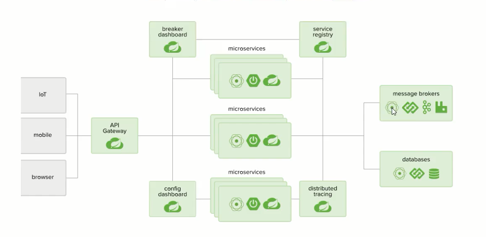

**SpringCloud**：基于SpringBoot提供了一套微服务解决方案，包括服务注册与发现、配置中心、全链路监控、服务网关、负载均衡、熔断器等组件，除了基于NetFlix的开源组件做高度抽象封装之外，还有一些选择型中立的开源组件。

SpringCloud利用SpringBoot的开发便利性，巧妙的简化了分布式系统基础设施的开发，SpringCloud为开发人员提供了快速构建分布式的一些工具，**包括配置管理、服务发现、断路器、路由、微代理、事件总线、全局锁、决策竞选、分布式会话等等，**他们都可以使用SpringBoot的开发风格做到一键启动和部署

SpringBoot并没有重复造轮子，他只是将目前各家公司开发的比较成熟，经得起实际考研的服务框架组合起来，通过SpringBoot风格进行再次封装，屏蔽掉了复杂的配置和实现原理，**最终给开发者留出了一套简单易懂，易部署和易维护的分布式系统开发工具包**

SpringCloud是分布式微服务框架下的一站式解决方案，是各个微服务框架落地技术的集合体，俗称微服务全家桶

##  2.2、SpringCloud和SpringBoot

- SpringBoot专注于快速方便的开发单个个体微服务
- SpringCloud是关注全局微服务协调整理治理框架，他将SpringBoot开发的一个个单体微服务整合并管理起来，为各个微服务之间提供：配置管理、服务发现、断路器、路由、微代理、事件总线、全局锁、决策竞选、分布式会话等等集成服务
- SpringBoot可以离开SpringCloud独立使用，开发项目，但是SpringCloud离不开SpringBoot，属于依赖关系
- **SpringBoot专注于快熟、方便的开发单个个体微服务，SpringCloud关注全局的服务治理框架**

## 2.3、Dubbo和SpringCloud技术选型

|              | Dubbo         | Spring                        |
| :----------- | :------------ | ----------------------------- |
| 服务注册中心 | Zookeeper     | Spring Cloud Netfilx Eureka   |
| 服务调用方式 | RPC           | REST API                      |
| 服务监控     | Dubbo-monitor | Spring Boot Admin             |
| 断路器       | 不完善        | Spring Cloud Netfilx  Hystrix |
| 服务网关     | 无            | Spring Cloud Netfilx Zuul     |
| 分布式配置   | 无            | Spring Cloud Config           |
| 服务跟踪     | 无            | Spring Cloud Sleuth           |
| 消息总线     | 无            | Spring Cloud Bus              |
| 数据流       | 无            | Spring Cloud Stream           |
| 批量任务     | 无            | Spring Cloud Task             |

**最大区别：SpringCloud抛弃了Dubbo的RPC通信，采用地是基于HTTP的REST方式**

HTTP相对于RPC来说牺牲了服务调用的性能，但也避免了上面提到的原生RPC带来的问题，而且REST相比RPC更为灵活，服务提供方和调用方的依赖只依靠一纸契约，不存在代码级别的强依赖

**SpringCloud相对于Dubbo的生态更为完全**

**Dubbo的定位是一款RPC框架**

**Spring Cloud的目标是微服务架构下的一站式解决方案**

## 2.4、版本说明

**参考文档：https://blog.csdn.net/chen497147884/article/details/79896141**

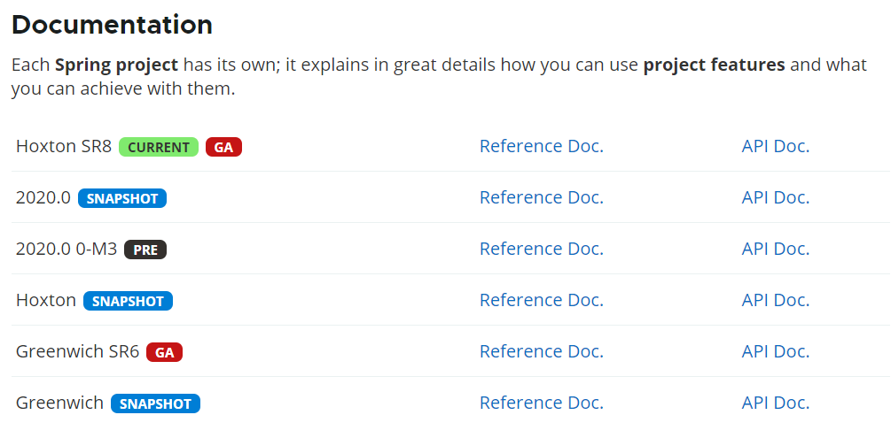

Spring Cloud是一个由众多独立子项目组成的大型综合项目，每个子项目有不同的发行节奏，都维护着自己的发布版本号。Spring Cloud通过一个资源清单BOM（Bill of Materials）来管理每个版本的子项目清单。为避免与子项目的发布号混淆，所以没有采用版本号的方式，而是通过命名的方式。

这些版本名称的命名方式采用了伦敦地铁站的名称，同时根据字母表的顺序来对应版本时间顺序，比如：最早的Release版本：Angel，第二个Release版本：Brixton，然后是Camden、Dalston、Edgware，目前最新的是Finchley版本。

当一个版本的Spring Cloud项目的发布内容积累到临界点或者解决了一个严重bug后，就会发布一个“service releases”版本，简称SRX版本，其中X是一个递增数字。当前官网上最新的稳定版本是Edgware.SR3，里程碑版本是Finchley.M9。下表列出了这两个版本所包含的子项目及各子项目的版本号

**SpringCloud与SpringBoot版本依赖**

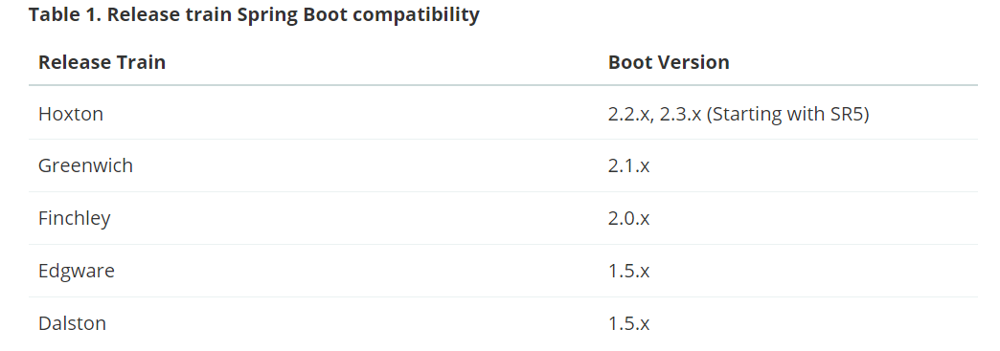

## 2.5、参考文档

**Spring Cloud Netflix中文文档：**https://www.springcloud.cc/spring-cloud-netflix.html

**中文API文档：**https://www.springcloud.cc/spring-cloud-dalston.html

**SpringCloud中国社区：**https://springcloud.cn/

**SpringCloud中文网：**https://www.springcloud.cc/

# 4、基础环境搭建

**注意：所有的工程都是maven项目**

## 4.1、创建父工程

创建`SpringCloud`父工程

定义`pom`文件，统一管理jar包

**打包方式选择pom**

```xml
<?xml version="1.0" encoding="UTF-8"?>
<project xmlns="http://maven.apache.org/POM/4.0.0"
         xmlns:xsi="http://www.w3.org/2001/XMLSchema-instance"
         xsi:schemaLocation="http://maven.apache.org/POM/4.0.0 http://maven.apache.org/xsd/maven-4.0.0.xsd">
    <modelVersion>4.0.0</modelVersion>

    <groupId>com.zh</groupId>
    <artifactId>SpringCloud</artifactId>
    <version>1.0-SNAPSHOT</version>

    <!--打包方式-->
    <packaging>pom</packaging>

    <!--版本-->
    <properties>
        <mysql.version>8.0.21</mysql.version>
        <druid.version>1.1.21</druid.version>
        <mybatis.version>2.1.2</mybatis.version>
        <logback.version>1.2.3</logback.version>
        <junit.version>4.13</junit.version>
        <log4j.version>1.2.17</log4j.version>
        <lombok.version>1.18.12</lombok.version>
    </properties>

    <!--管理依赖，并不引入子项目-->
    <dependencyManagement>
        <dependencies>
            <!-- SpringCloud依赖 -->
            <dependency>
                <groupId>org.springframework.cloud</groupId>
                <artifactId>spring-cloud-dependencies</artifactId>
                <version>Hoxton.SR8</version>
                <type>pom</type>
                <scope>import</scope>
            </dependency>
            <!--SpringBoot-->
            <dependency>
                <groupId>org.springframework.boot</groupId>
                <artifactId>spring-boot-dependencies</artifactId>
                <version>2.3.3.RELEASE</version>
                <type>pom</type>
                <scope>import</scope>
            </dependency>
            <!--数据库-->
            <dependency>
                <groupId>mysql</groupId>
                <artifactId>mysql-connector-java</artifactId>
                <version>${mysql.version}</version>
            </dependency>
            <dependency>
                <groupId>com.alibaba</groupId>
                <artifactId>druid</artifactId>
                <version>${druid.version}</version>
            </dependency>
            <dependency>
                <groupId>org.mybatis.spring.boot</groupId>
                <artifactId>mybatis-spring-boot-starter</artifactId>
                <version>${mybatis.version}</version>
            </dependency>
            <!--日志测试-->
            <dependency>
                <groupId>ch.qos.logback</groupId>
                <artifactId>logback-core</artifactId>
                <version>${logback.version}</version>
            </dependency>
            <dependency>
                <groupId>junit</groupId>
                <artifactId>junit</artifactId>
                <version>${junit.version}</version>
            </dependency>
            <dependency>
                <groupId>log4j</groupId>
                <artifactId>log4j</artifactId>
                <version>${log4j.version}</version>
            </dependency>
            <dependency>
                <groupId>org.projectlombok</groupId>
                <artifactId>lombok</artifactId>
                <version>${lombok.version}</version>
            </dependency>
        </dependencies>
    </dependencyManagement>
</project>
```

## 4.2、创建数据库

创建`db01`数据库

```sql
create table dept(
    id int(11) primary key auto_incerment,
    dname varchar(60),
    db_source varchar(60)
);

-- DATABASE()：获取当前数据库名
insert into dept(dname,db_source) values('开发部',DATABASE());
insert into dept(dname,db_source) values('人事部',DATABASE());
insert into dept(dname,db_source) values('财务部',DATABASE());
insert into dept(dname,db_source) values('市场部',DATABASE());
insert into dept(dname,db_source) values('运维部',DATABASE());

select * from dept
```

## 4.3、创建SpringCloud-api模块

**用于存放公共的pojo，server....**

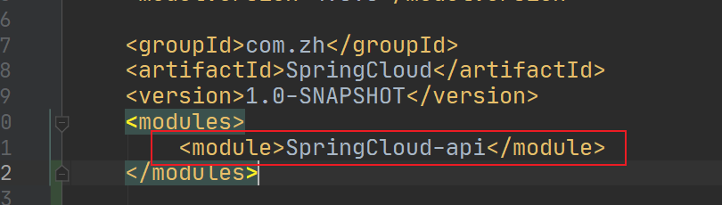

### 4.3.1、pom

导入所需`jar`包

```xml
<!--当前的Module自己需要的依赖，如果父依赖已经配置了版本，这里不需要写版本-->
<dependencies>
    <dependency>
        <groupId>org.projectlombok</groupId>
        <artifactId>lombok</artifactId>
    </dependency>
</dependencies>
```

### 4.3.2、创建实体类

**注意：微服务各个服务之间通信，实体类需要实例化**

```java
package com.zh.pojo;
import lombok.AllArgsConstructor;
import lombok.Data;
import lombok.NoArgsConstructor;
import java.io.Serializable;

/**
 * @author Beloved
 * @date 2020/9/13 17:01
 */
@Data
@AllArgsConstructor
@NoArgsConstructor
public class Dept implements Serializable {

    private Long id;
    private String dname;

    // 标识数据库 有可能一个服务对应一个数据库 同一信息在不同数据库
    private String db_source;

}
```

## 4.4、创建服务提供者

**创建`SpringCloud-provider-dept-8000`模块**

### 4.4.1、pom

```xml
<!--引入自定义的模块，我们就可以使用这个模块中的类了-->
<dependency>
    <groupId>com.zh</groupId>
    <artifactId>SpringCloud-api</artifactId>
    <version>1.0-SNAPSHOT</version>
</dependency>

<dependency>
    <groupId>junit</groupId>
    <artifactId>junit</artifactId>
</dependency>

<dependency>
    <groupId>mysql</groupId>
    <artifactId>mysql-connector-java</artifactId>
</dependency>

<dependency>
    <groupId>com.alibaba</groupId>
    <artifactId>druid</artifactId>
</dependency>

<dependency>
    <groupId>ch.qos.logback</groupId>
    <artifactId>logback-core</artifactId>
</dependency>

<dependency>
    <groupId>org.mybatis.spring.boot</groupId>
    <artifactId>mybatis-spring-boot-starter</artifactId>
</dependency>

<dependency>
    <groupId>org.springframework.boot</groupId>
    <artifactId>spring-boot-test</artifactId>
</dependency>

<dependency>
    <groupId>org.springframework.boot</groupId>
    <artifactId>spring-boot-starter-web</artifactId>
</dependency>

<dependency>
    <groupId>org.springframework.boot</groupId>
    <artifactId>spring-boot-devtools</artifactId>
</dependency>
```

### 4.4.2、application.yml

```yaml
server:
  port: 8000

# mybatis配置
mybatis:
  type-aliases-package: com.zh.pojo
  mapper-locations: classpath:mybatis/mapper/*.xml

# spring配置
spring:
  application:
    name: SpringCloud-provider-dept
  datasource:
    type: com.alibaba.druid.pool.DruidDataSource
    driver-class-name: com.mysql.cj.jdbc.Driver
    url: jdbc:mysql://localhost:3306/db01?useUnicode=true&characterEncoding=utf-8
    username: root
    password: 123456
```

### 4.4.3、Mapper接口

```java
package com.zh.mapper;

import com.zh.pojo.Dept;
import org.apache.ibatis.annotations.Mapper;
import org.springframework.stereotype.Repository;

import java.util.List;

@Mapper
@Repository
public interface DeptMapper {

    Dept findById(Long id);

    List<Dept> findAll();

}
```

### 4.4.4、Mapper.xml

**文件路径：**`mybatis/mapper/DeptMapper.xml`

```xml
<?xml version="1.0" encoding="UTF-8" ?>
<!DOCTYPE mapper
        PUBLIC "-//mybatis.org//DTD Mapper 3.0//EN"
        "http://mybatis.org/dtd/mybatis-3-mapper.dtd">
<mapper namespace="com.zh.mapper.DeptMapper">

    <select id="findById" resultType="Dept" parameterType="Long">
        select *
        from db01.dept
        where id = #{id}
    </select>

    <select id="findAll" resultType="Dept">
        select * from db01.dept;
    </select>
    
</mapper>
```

### 4.4.5、Service服务层接口

```java
package com.zh.service;

import com.zh.pojo.Dept;

import java.util.List;

public interface DeptService {

    Dept findById(Long id);

    List<Dept> findAll();

}
```

### 4.4.6、Service接口实现类

```java
package com.zh.service.impl;

import com.zh.mapper.DeptMapper;
import com.zh.pojo.Dept;
import com.zh.service.DeptService;
import org.springframework.beans.factory.annotation.Autowired;
import org.springframework.stereotype.Service;

import java.util.List;

/**
 * @author Beloved
 * @date 2020/9/13 17:26
 */
@Service
public class DeptServiceImpl implements DeptService {

    @Autowired
    private DeptMapper deptMapper;

    public Dept findById(Long id) {
        return deptMapper.findById(id);
    }

    public List<Dept> findAll() {
        return deptMapper.findAll();
    }
}
```

### 4.4.7、Controller

**使用Rest服务，SpringCloud使用的通信机制基于Rest**

```java
/**
 * @author Beloved
 * @date 2020/9/13 17:29
 */
@RestController
public class DeptController {

    @Autowired
    private DeptService deptService;

    @GetMapping("/dept/get/{id}")
    public Dept findById(@PathVariable("id") Long id){
        return deptService.findById(id);
    }

    @GetMapping("/dept/list")
    public List<Dept> findAll(){
        return deptService.findAll();
    }

}
```

### 4.4.8、主启动类

```java
/**
 * @author Beloved
 * @date 2020/9/13 17:33
 */
@SpringBootApplication
public class DeptProvider_8000 {

    public static void main(String[] args) {
        SpringApplication.run(DeptProvider_8000.class,args);
    }
}
```

### 4.4.9、启动测试

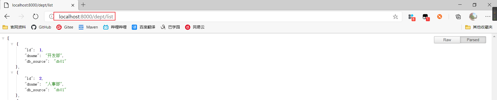

## 4.5、创建服务消费者

**创建`SpringCloud-consumer-dept-8080`模块**

**注意：消费者是没有server接口，消费者只是提供最终接口**

### 4.5.1、pom

```xml
<dependency>
    <groupId>com.zh</groupId>
    <artifactId>SpringCloud-api</artifactId>
    <version>1.0-SNAPSHOT</version>
</dependency>

<dependency>
    <groupId>org.springframework.boot</groupId>
    <artifactId>spring-boot-starter-web</artifactId>
</dependency>

<dependency>
    <groupId>org.springframework.boot</groupId>
    <artifactId>spring-boot-devtools</artifactId>
</dependency>
```

### 4.5.2、application.yml

```yaml
server:
  port: 8080
```

### 4.5.3、RestTemplate

**参考文章：https://www.cnblogs.com/javazhiyin/p/9851775.html**

**RestTemplate**提供了多种便捷访问远程Http服务的方法，是一种简单便捷的访问restful服务模板 类，是Spring提供的用于访问Rest服务的客户端模板工具集

**配置RestTemplate**

```java
/**
 * @author Beloved
 * @date 2020/9/13 17:37
 */
@Configuration
public class ConfigBean {

    @Bean
    public RestTemplate getRestTemplate(){
        return new RestTemplate();
    }

}
```

### 4.5.4、Controller

```java
/**
 * @author Beloved
 * @date 2020/9/13 17:39
 */
@RestController
public class DeptConsumerController {

    // 消费者，直接调用生产者

    @Autowired
    private RestTemplate restTemplate; // 提供多种便携访问http服务的方法

    // 配置生产者地址
    private static final String REST_URL_PREFIX = "http://localhost:8000";

    @GetMapping("/consumer/dept/list")
    public List<Dept> list(){
        // 通过RestTemplate使用restful风格调用生产者接口
        return restTemplate.getForObject(REST_URL_PREFIX+"/dept/list/",List.class);
    }

    @GetMapping("/consumer/dept/get/{id}")
    public Dept get(@PathVariable("id") Long id){
        return restTemplate.getForObject(REST_URL_PREFIX+"/dept/get/"+id,Dept.class);
    }
}
```

### 4.5.5、主启动类

```java
/**
 * @author Beloved
 * @date 2020/9/13 17:50
 */
@SpringBootApplication
public class DeptConsumer_8080 {

    public static void main(String[] args) {
        SpringApplication.run(DeptConsumer_8080.class,args);
    }

}
```

### 4.5.6、测试

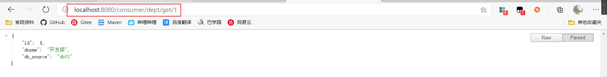

# 5、Eureka

## 5.1、原理讲解

Eureka是Netfix的一个子模块，也是核心模块之一。Eureka是一个基于REST的服务，用于定位服务，以实现云端中间层服务发现和故障转移，服务注册与发现对于微服务来说非常重要的，有了服务发现与注册，只需要使用服务的标识符，就可以访问到服务，而不需要修改服务调用的配置文件，类似于Zookeeper。

**Eureka的基本架构：**

Eureka采用了C-S的架构设计，EurekaServer作为服务注册功能的服务器，他是服务注册中心

系统中的其他微服务，使用Eureka的客户端连接到EurekaServer并维持心跳连接。可以通过EurekaServer来监控系统中各个微服务是否正常运行，SpringCloud的一些其他模块（比如Zull）就可以通过EurekaServer来发现系统中的其他微服务，并执行相关的逻辑

**Eureka与Dubbo架构对比图：**

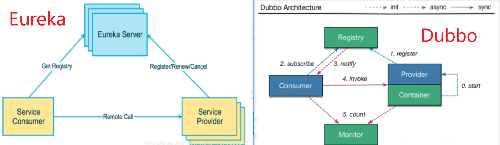

EurekaServer提供服务注册服务，各个节点启动后，会在EurekaServer中进行注册，这样EurekaServer中的服务注册表中将会存储所有可用服务节点的信息，服务节点的信息可以在界面中直观的看到。

EurekaClient是一个Java客户端，用于简化EurekaServer的交互，客户端同时也具备一个内置的，使用伦循负载算法的负载均衡器。在应用启动后，将会向EurekaServer发送心跳（默认周期为30秒）。如果EurekaServer在多个心跳周期内没有接收到某个节点的心跳，EurekaServer将会从服务注册表中吧这个服务节点移除调（默认周期为90秒）

**三大角色：**

- **Eureka Server**：提供服务的注册与发现
- **Server Provider**：将自身注册到Eureka中，从而使消费方能够找到
- **Server Consumer**：服务消费方从Eureka获取注册服务列表，从而找到消费者

## 5.2、创建Eureka工程

创建`SpringCloud-eureka-7001`子工程

### 5.2.1、pom

**Eureka服务端**

```xml
<!-- eureka-server  eureka服务端 -->
<dependency>
    <groupId>org.springframework.cloud</groupId>
    <artifactId>spring-cloud-starter-eureka-server</artifactId>
    <version>1.4.7.RELEASE</version>
</dependency>
```

### 5.2.2、application.yml

```yaml
server:
  port: 7001
# Eureka配置
eureka:
  instance:
    hostname: localhost # Eureka服务端的实例名称
  client:
    register-with-eureka: false # 是否向Eureka注册中心注册自己
    fetch-registry: false # 为false：表示自己为注册中心
    service-url: # 配置web监控页面
      defaultZone: http://${eureka.instance.hostname}:${server.port}/eureka/ # 单机版
```

### 5.2.3、主启动

**添加Eureka服务端注解**

```java
/**
 * @author Beloved
 * @date 2020/9/13 18:10
 */
@SpringBootApplication
@EnableEurekaServer // 服务端的启动类，可以接收别人注册进来
public class EurekaServer_7001 {

    public static void main(String[] args) {
        SpringApplication.run(EurekaServer_7001.class,args);
    }

}
```

### 5.2.4、启动测试

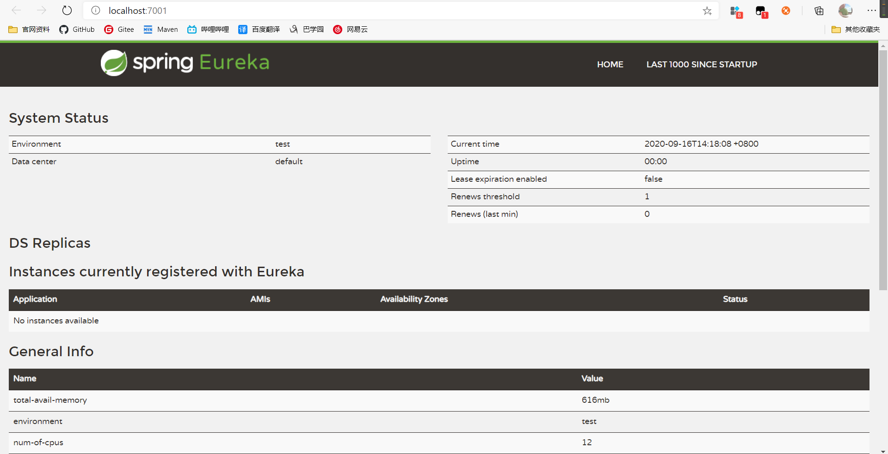

**System Status**：系统信息

**DS Replicas**：服务器副本（集群，别的Eureka主机）

**General Info**：一般信息

**Instance Info**：实例信息

## 5.3、将服务提供者注册到Eureka

**SpringCloud-provider-dept-8000**

### 5.3.1、pom

在服务提供者添加Eureka客户端依赖

```xml
<!-- Eureka -->
<dependency>
    <groupId>org.springframework.cloud</groupId>
    <artifactId>spring-cloud-starter-eureka</artifactId>
    <version>1.4.7.RELEASE</version>
</dependency>
```

### 5.3.2、添加Eureka配置

```yaml
# Eureka配置 注册服务
eureka:
  client:
    service-url: # web监控页面，Eureka服务的地址
      defaultZone: http://localhost:7001/eureka/
```

### 5.3.3、启动类添加Eureka启动注解

**添加Eureka客户端注解**

```java
/**
 * @author Beloved
 * @date 2020/9/13 17:33
 */
@SpringBootApplication
@EnableEurekaClient // 在服务启动后自动注册到Eureka中
public class DeptProvider_8000 {
    public static void main(String[] args) {
        SpringApplication.run(DeptProvider_8000.class,args);
    }
}
```

### 5.3.4、启动测试

先启动Eureka服务端，在启动8000服务提供者，查看Eureka注册中心的web界面，查看服务已被注册到Eureka

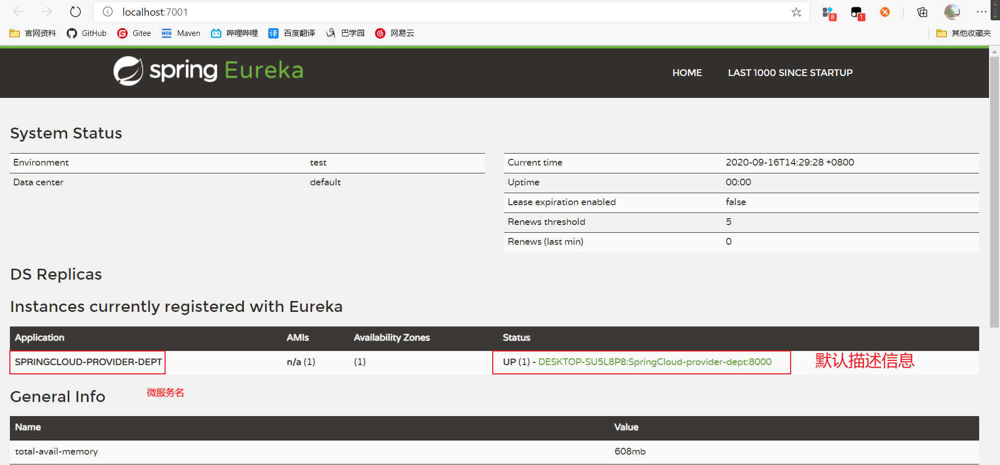

## 5.4、Eureka默认信息修改

### 5.4.1、修改服务默认信息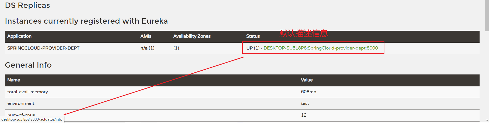

默认的服务信息是可以修改的，和调转连接的ip显示

在yaml中修改信息配置

```yaml
# Eureka配置 注册服务
eureka:
  client:
    service-url: # web监控页面
      defaultZone: http://localhost:7001/eureka/
  instance:
    instance-id: SpringCloud-provider-dept-8000 # 修改Eureka上的默认描述信息
    prefer-ip-address: true # 为true可以显示服务的ip地址
```

启动测试

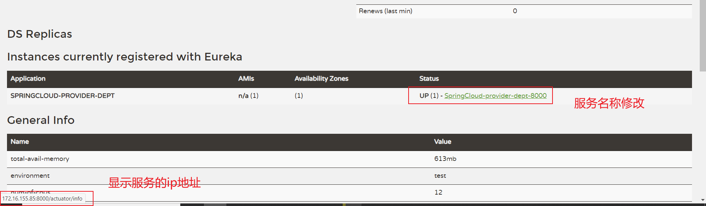

### 5.4.2、info信息

访问服务信息页面

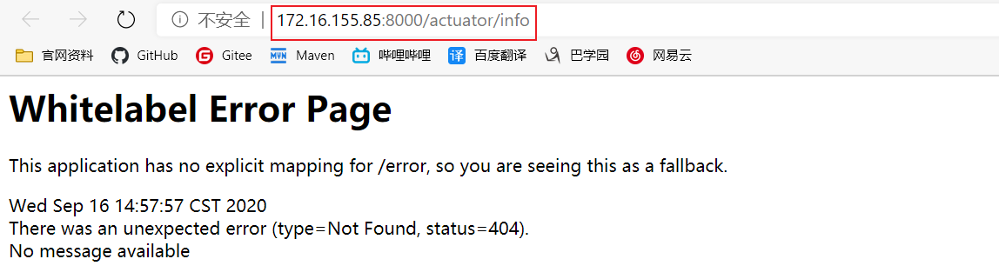

错误页面

修改8000的pom文件，新增依赖！

```xml
<!--actuator完善监控信息-->
<dependency>
    <groupId>org.springframework.boot</groupId>
    <artifactId>spring-boot-starter-actuator</artifactId>
</dependency>
```

增加yaml文件信息

**Info的配置是K-V键值对，K没有强制要求**

```yaml
# info信息
info:
  app.name: SpringCloud-provider-dept
  user:
    name: zhh
    email: 1425279634@qq.com
```

启动测试：重新启动。访问服务详情信息页面

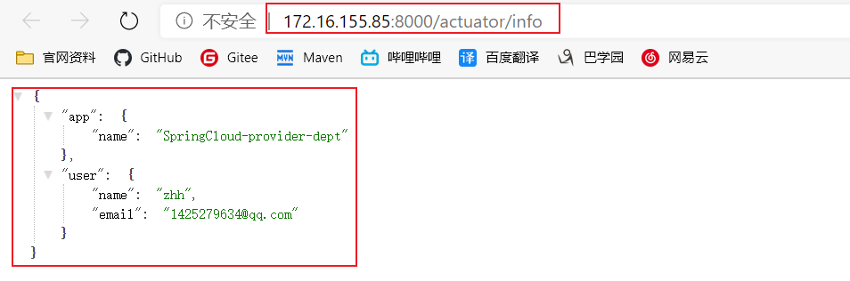

## 5.5、Eureka自我保护机制

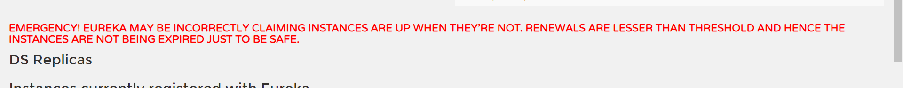

当某个服务宕掉的时候，Eureka会启动自我保护机制。Eureka不会立刻清除，依旧会对该服务的信息进行保存

默认情况下，如果EurekaServer在一定时间内没有接收到某个微服务实例的**心跳**，EurekaServer将会注销该实例（**默认90秒**）。但是当网络分区故障发生时，微服务与Eureka之间无法正常通行，但是微服务本身是没有问题的，**此时不应该注销这个服务。**Eureka通过**自我保护机制**来解决这个问题。

当EurekaServer节点在短时间内丢失过多客户端时（可能网络发生故障），那么这个节点就进入自我保护模式。一旦进入该模式，EurekaServer就会保护服务注册表中的信息，不再删除服务注册表中的数据（也就是不会注销任何微服务）。当网络故障恢复后，该EurekaServer节点就会自动退出自我保护模式。

在自我保护模式中，EurekaServer会保护服务注册表中的信息，不在注销任何服务实例。当它收到心跳数重新恢复到阈值以上时，该EurekaServer节点就会自动退出自我保护模式。它的设计哲学就是宁可保留错误的服务注册信息，也不盲目注销任何可能健康的服务实列，可以让Eureka集群更加的健壮和稳定

可以使用`eureka.server.enable-self-preservation = false`关闭自我保护机制

## 5.6、服务发现

对于注册进eureka里面的微服务，可以通过服务发现来获得该服务的信息。【对外暴露服务】

### 5.6.1、新增Controller

```java
/**
 * @author Beloved
 * @date 2020/9/13 17:29
 */
@RestController
public class DeptController {

    @Autowired
    private DeptService deptService;

    // 获取配置信息，得到具体的微服务
    @Autowired
    private DiscoveryClient client;

    @GetMapping("/dept/discovery")
    public Object discovery(){
        //获取微服务列表的清单
        List<String> services = client.getServices();
        System.out.println("discovery=>services："+services);

        //得到一个具体的微服务信息，通过具体的微服务id，applicationName
        List<ServiceInstance> instances = client.getInstances("SPRINGCLOUD-PROVIDER-DEPT");
        for (ServiceInstance instance : instances) {
            System.out.println(
                    instance.getHost()+"\t"+
                    instance.getPort()+"\t"+
                    instance.getUri()+"\t"+
                    instance.getServiceId()
            );
        }

        return this.client;
    }
}
```

### 4.6.2、主启动类增加注解

```java
/**
 * @author Beloved
 * @date 2020/9/13 17:33
 */
@SpringBootApplication
@EnableEurekaClient // 在服务启动后自动注册到Eureka中
@EnableDiscoveryClient // 服务发现
public class DeptProvider_8000 {

    public static void main(String[] args) {
        SpringApplication.run(DeptProvider_8000.class,args);
    }

}
```

### 4.6.3、启动测试

启动Eureka服务，启动8000提供者 

访问测试 http://localhost:8000/dept/discovery

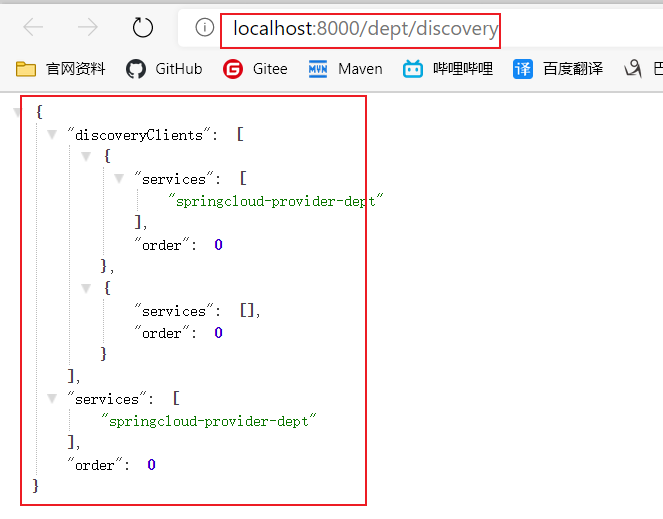

## 5.7、Eureka集群搭建

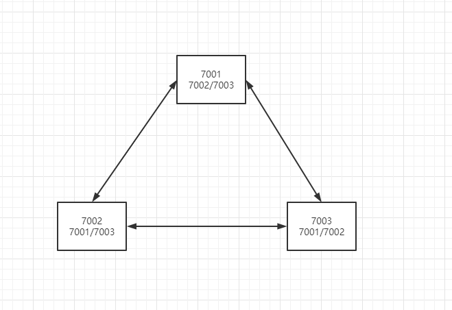

复制Eureka7001、分别创建7002/7003


修改yaml配置文件

**7001：**

```yaml
server:
  port: 7001
  
# Eureka配置
eureka:
  instance:
    hostname: Eureka7001 # Eureka服务端的实例名称
  client:
    register-with-eureka: false # 表示是否向Eureka注册中心注册自己
    fetch-registry: false # 为false：表示自己为注册中心
    service-url: # web监控页面
      # 单机
      # defaultZone: http://${eureka.instance.hostname}:${server.port}/eureka/
      # 集群
      defaultZone: http://localhost:7002/eureka/,http://127.0.0.1:7003/eureka/
```

**7002：**

```yaml
server:
  port: 7002

# Eureka配置
eureka:
  instance:
    hostname: Eureka7002 # Eureka服务端的实例名称
  client:
    register-with-eureka: false # 表示是否向Eureka注册中心注册自己
    fetch-registry: false # 为false：表示自己为注册中心
    service-url: # web监控页面
      defaultZone: http://localhost:7001/eureka/,http://127.0.0.1:7003/eureka/
```

**7003：**

```yaml
server:
  port: 7003
  
# Eureka配置
eureka:
  instance:
    hostname: Eureka7003 # Eureka服务端的实例名称
  client:
    register-with-eureka: false # 表示是否向Eureka注册中心注册自己
    fetch-registry: false # 为false：表示自己为注册中心
    service-url: # web监控页面
      defaultZone: http://localhost:7001/eureka/,http://127.0.0.1:7002/eureka/
```

**注意：集群中`defaultZone`并不配置自己，只需配置其余Eureka服务器**

**服务提供者发布服务到集群：**

服务提供者发布服务到任意一台Eureka服务器，在其他Eureka中也可以看到，但是为了安全起见，一般会发布到所有Eureka服务器

8000服务yaml配置

```yaml
# Eureka配置 注册服务
eureka:
  client:
    service-url: # web监控页面
      defaultZone: http://localhost:7001/eureka/,http://localhost:7002/eureka/,http://localhost:7003/eureka/
  instance:
    instance-id: SpringCloud-provider-dept-8000 # 修改Eureka上的默认描述信息
    prefer-ip-address: true # 为true可以显示服务的ip地址
```

**分别启动Eureka服务器，和8000服务，查看每个Eureka的Web监视界面**

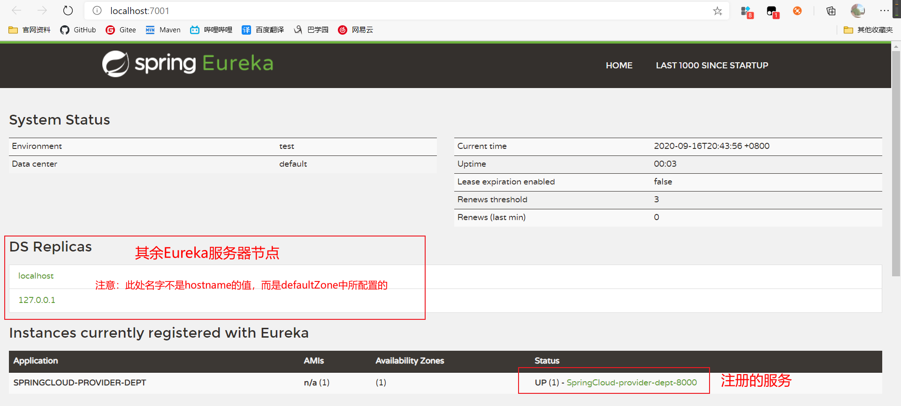

## 5.8、Eureka对比Zookeeper

### 5.8.1、回顾CAP原则

RDBMS（MySql、Oracle、SqlServer）===> ACID

NoSql（Redis、MongDB） ===> CAP

**ACID：**

- A（Atomicity）原子性
- C（Consistency）一致性
- I（Isolation）隔离性
- D（Durability）持久性

**CAP：**

- C（Consistency）强一致性
- A（Availability）可用性
- P（Partition tolerance）分区容错性

**CAP理论核心：**

- 一个分布式系统不可能同时很好的满足一致性，可用性和分区容错性三个需求
- 根据CAP原理，将NoSql数据库分成了三大类
  - **CA**：单点集群，满足一致性，可用性的系统，通常可扩展性较差
  - **CP**：满足一致性，分区容错性的系统，通常性能不是特别高
  - **AP**：满足可用性，分区容错性的系统，通常可能对一致性要求低一些

### 5.8.2、对比

CAP理论指出，一个分布式系统不可能满足C（一致性）、A（可用性）、P（容错性）

**Zookeeper保证的是CP**

当向注册中心查询服务列表时，可以容忍注册中心返回的是几分钟以前的注册信息，但不能接受服务直接宕掉不可用。也就是说，服务注册功能对可用性的要求要高于一致性。但是zookeeper会出现这样一种情况，当master节点因为网络故障与其他节点失去联系时，剩余节点会重新进行leader选举。问题在于，当选举leader的时间太长，30~120s，且选举期间整个zookeeper集群都是不可用的，这就导致在选举期间注册服务瘫痪。在云部署的环境下，因为网络问题使得zookeeper集群失去master节点是较大概率会发生的事件，虽然服务最终能够恢复，但是漫长的选举时间导致的注册长期不可用时不能容忍的。

**Eureka保证的时AP**

Eureka在设计的时候就优先保证可用性。**Eureka各个节点都是平等的**，几个节点挂掉不会影响正常节点的工作，剩余的节点依然可以提供注册和查询服务。而Eureka的客户端在向某个Eureka注册时，如果发现连接失败，则会自动切换其他节点，只要有一台Eureka还在，就能保住注册服务的可用性，只不过查到的信息可能不是最新的，除此之外，Eureka还有一种自我保护机制，如果在15分钟内超过85%的节点都没有正常的心跳，那么Eureka就认为客户端与注册中心出现了网络故障，此时会出现以下几种情况：

- Eureka不在从注册列表中移除因为长时间没收到心跳而因该过期的服务
- Eureka任然能够接受新服务的注册和查询请求，但是不会同步到其他节点上（既保证当前节点依然可用）
- 当网络稳定时，当前实例新注册的注册信息会被同步到其他节点中

**Eureka可以很好的因对网络故障导致部分节点失去联系的情况，而不会像zookeeper使整个注册服务瘫痪**

# 6、Ribbon

## 6.1、概述

**Spring Cloud Ribbon**是基于Netfix Ribbon实现的一套**客户端负载均衡的工具**

Ribbon是Netfix发布的开源项目，主要功能是提供客户端的软件负载均衡算法，将Netfix的中间层服务连接在一起。Ribbon的客户端组件提供一系列完整的配置项如：连接超时、重试等。简单的说，就是在配置文件中列出LoadBalancer（简称LB：负载均衡）后面所有的机器，Ribbon会自动的帮助你基于某种规则（伦循、随机连接.....）去连接机器。

负载均衡简单的说就是将用户的请求平摊的分配到多个服务器，从而达到系统的HA（高可用）

**Spring Cloud的负载均衡算法可以自定义**

负载均衡简单分类：

- 集中式LB：
  - 即在服务的消费方和提供方之间使用独立的LB设施
  - 比如：Nginx，由该设施负责吧访问请求通过某种策略转发至服务的提供方
- 进程式LB：
  - 将LB逻辑集成到消费方，消费方从服务注册中心获知有哪些地址可用，然后自己再从这些地址中选出一个合适的服务器
  - **Ribbon就属于进程内LB**，他只是一个类库，集成于消费方进程，消费方通过它来获取到服务提供方的地址

Ribbon的GitHub地址：https://github.com/NetFlix/ribbon

## 6.2、环境搭建

复制`db01`数据库`db02`、`db03`

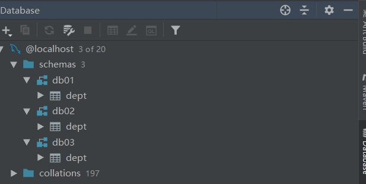

复制`8000`服务创建`8001`、`8002`。分别对应数据库`db01`、`db02`、`db03`


修改各自对应的yaml文件

- 端口

  ```yaml
  # =========================8000=============================
  server:
    port: 8000
  # =========================8001=============================
  server:
    port: 8001
  # =========================8002=============================
  server:
    port: 8002
  ```

- 数据库连接

  ```yaml
  # =========================8000=============================
  url: jdbc:mysql://localhost:3306/db01?useUnicode=true&characterEncoding=utf-8
  # =========================8001=============================
  url: jdbc:mysql://localhost:3306/db02?useUnicode=true&characterEncoding=utf-8
  # =========================8002=============================
  url: jdbc:mysql://localhost:3306/db03?useUnicode=true&characterEncoding=utf-8
  ```

- 实例名称

  ```yaml
  # =========================8000=============================
  instance-id: SpringCloud-provider-dept-8000 # 修改Eureka上的默认描述信息
  # =========================8001=============================
  instance-id: SpringCloud-provider-dept-8001 # 修改Eureka上的默认描述信息
  # =========================8002=============================
  instance-id: SpringCloud-provider-dept-8002 # 修改Eureka上的默认描述信息
  ```

- 对外暴露统一的服务名（三个服务名称必须一致）

  ```yaml
  spring:
    application:
      name: SpringCloud-provider-dept
  ```

## 6.3、Ribbon配置

**Ribbon是配置服务消费者的（SpringCloud-consumer-dept-8080）**

### 6.3.1、修改pom

添加所需依赖`Ribbon`、`Eureka`客户端依赖

```xml
<!-- Eureka -->
<dependency>
    <groupId>org.springframework.cloud</groupId>
    <artifactId>spring-cloud-starter-eureka</artifactId>
    <version>1.4.7.RELEASE</version>
</dependency>

<!-- Ribbon -->
<dependency>
    <groupId>org.springframework.cloud</groupId>
    <artifactId>spring-cloud-starter-ribbon</artifactId>
    <version>1.4.7.RELEASE</version>
</dependency>
```

### 6.3.2、application.yml 

添加Eureka连接。**连接Eureka集群**

```yaml
server:
  port: 8080

# Eureka配置
eureka:
  client:
    register-with-eureka: false # 不向Eureka注册自己
    service-url:
      defaultZone: http://localhost:7001/eureka/,http://localhost:7002/eureka/,http://localhost:7003/eureka/
```

### 6.3.3、主启动

**添加Eureka客户端注解**

```java
/**
 * @author Beloved
 * @date 2020/9/13 17:50
 */
@SpringBootApplication
@EnableEurekaClient
public class DeptConsumer_8080 {

    public static void main(String[] args) {
        SpringApplication.run(DeptConsumer_8080.class,args);
    }

}
```

### 6.3.4、配置负载均衡策略

对ConfigBean方法加上注解**@LoadBalanced**，使Rest加入Ribbon的配置

默认的只需要加上注解即可

```java
/**
 * @author Beloved
 * @date 2020/9/13 17:37
 */
@Configuration
public class ConfigBean {

    @Bean
    @LoadBalanced //Ribbon 配置此注解自动实现负载均衡
    public RestTemplate getRestTemplate(){
        return new RestTemplate();
    }
}
```

### 6.3.5、修改客户端访问类

之前的写的地址是写死的，现在需要变化！

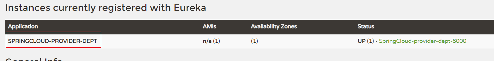

将之前的ip地址改为微服务名

```java
// 这里的地址，应该是一个变量，通过服务名访问，服务的调用不用关心ip和端口
// private static final String REST_URL_PREFIX = "http://localhost:8000";
private static final String REST_URL_PREFIX = "http://SPRINGCLOUD-PROVIDER-DEPT";
```

### 6.3.6、启动测试

1. 启动3个Eureka集群

2. 启动三个服务提供者（8000、8001、8002）将服务注册到Eureka

   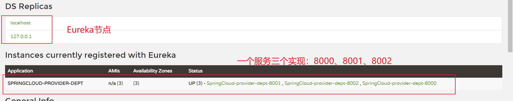

3. 测试三个服务提供者。分别访问：

   - http://localhost:8000/dept/list 
   - http://localhost:8001/dept/list 
   - http://localhost:8002/dept/list

4. 启动服务消费者（SpringCloud-consumer-dept-8080）。访问：http://localhost:8080/consumer/dept/list

5. 多次刷新观察：每次请求都是按顺序访问不同的服务实现（伦循）

### 6.3.7、总结

**Ribbon和Eureka整合后Consumer可以直接调用服务而不用再关心地址和端口号！**

**Ribbon其实就是一个软负载均衡的客户端组件，他可以和其他所需请求的客户端结合使用，和 Eureka结合只是其中的一个实例。**

Ribbon在工作时分成两步：

- 第一步先选择EurekaServer，它优先选择在同一个区域内负载均衡较少的Server。 
- 第二步在根据用户指定的策略，在从server去到的服务注册列表中选择一个地址。 

其中Ribbon提供了多种策略，比如轮询（默认），随机和根据响应时间加权重,,,等等

## 6.4、IRule

### 6.4.1、源码解析

**IRule：根据特定算法从服务列表中选取一个要访问的服务**

- RoundRobinRule【轮询】 
- RandomRule【随机】 
- AvailabilityFilterRule【会先过滤掉由于多次访问故障而处于断路器跳闸的服务，还有并发的连接 数量超过阈值的服务，然后对剩余的服务列表按照轮询策略进行访问】 
- WeightedResponseTimeRule【根据平均响应时间计算所有服务的权重，响应时间越快服务权重越 大，被选中的概率越高，刚启动时如果统计信息不足，则使用RoundRobinRule策略，等待统计信 息足够，会切换到WeightedResponseTimeRule】 
- RetryRule【先按照RoundRobinRule的策略获取服务，如果获取服务失败，则在指定时间内会进行 重试，获取可用的服务】 
- BestAvailableRule【会先过滤掉由于多次访问故障而处于断路器跳闸状态的服务，然后选择一个并 发量最小的服务】 
- ZoneAvoidanceRule【默认规则，复合判断server所在区域的性能和server的可用性选择服务器】

**注意源码**

- IRule
- ILoadBalancer
- AbstractLoadBalancer
- AbstractLoadBalancerRule：这个抽象父类十分重要！核心
- RoundRobinRule

### 6.4.2、切换策略

**切换随机策略，在ConfigBean中添加方法**

```java
/**
 * @author Beloved
 * @date 2020/9/13 17:37
 */
@Configuration
public class ConfigBean {

    /*
     * 配置负载均衡实现RestTemplate
     * IRule：负载均衡规则的接口
     *      RoundRobinRule：伦循
     *      RandomRule：随机
     *      AvailabilityFilteringRule：会先过滤掉，崩溃的服务，对剩下的进行伦循
     *      RetryRule：会先按照伦循获取服务，如果服务获取失败，则在指定时间内进行重试
     *      ......
     */
    @Bean
    @LoadBalanced //Ribbon 配置此注解自动实现负载均衡
    public RestTemplate getRestTemplate(){
        return new RestTemplate();
    }

    // 使用随机的负载均衡机制
    @Bean
    public IRule iRule(){
        return new RandomRule();
    }
}
```

重新启动（SpringCloud-consumer-dept-8080）服务，访问：http://localhost:8080/consumer/dept/list

观察每次请求都是不固定的

### 6.4.3、自定义负载均衡策略

#### 6.4.3.1、主启动类添加@RibbonClient注解

在启动该微服务的时候就能去加载我们自定义的Ribbon配置类，从而使配置类生效，例如：

**在启动时加载ZHRule自定义策略实现类**

```java
@SpringBootApplication
@EnableEurekaClient
// 在微服务启动的时候就能加载自定义的负载均衡策略 name服务名
@RibbonClient(name = "SPRINGCLOUD-PROVIDER-DEPT",configuration = ZHRule.class)
public class DeptConsumer_8080 {

    public static void main(String[] args) {
        SpringApplication.run(DeptConsumer_8080.class,args);
    }

}
```

**注意：**

官方文档明确给出了警告： 这个自定义配置类不能放在@ComponentScan所扫描的当前包以及子包下，否则我们自定义的这个配置 类就会被所有的Ribbon客户端所共享，也就是说达不到特殊化定制的目的了！

**自定义配置不能放在主启动同一级目录或子目录**

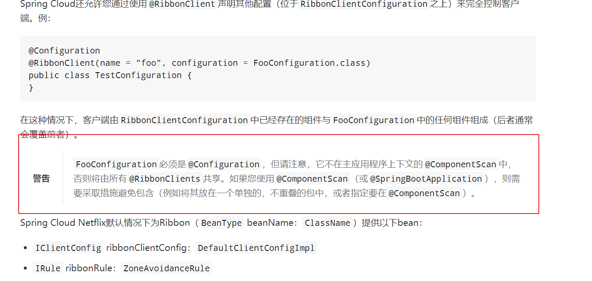

#### 6.4.3.2、创建自定义策略配置

**创建自定义配置类。注意位置**

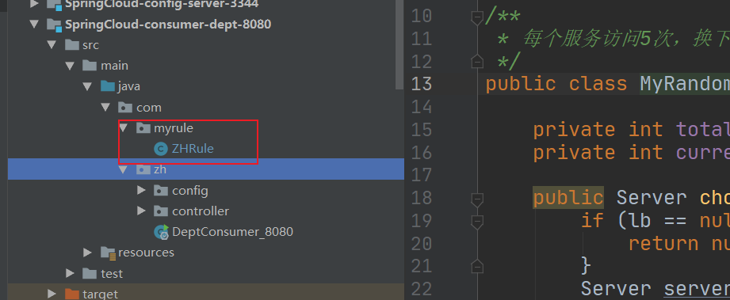

```java
/**
 * @author Beloved
 * @date 2020/9/13 22:56
 *
 * 自定义的负载均衡必须是Configuration且不能和启动类在同一级目录，负责就与RibbonClients共享
 */
@Configuration
@Component
public class ZHRule {

    @Bean
    public IRule iRule(){
        return new RandomRule();
    }

}
```

删除原来在ConfigBean中配置的随机策略，在这里使用随机进行测试

#### 6.4.3.3、创建自定义策略实现

- **问题**：依旧轮询策略，但是加上新需求，每个服务器要求被调用5次，就是以前每一个机器一次，现 在每个机器5次；
- **解析源码**：RandomRule.java ， IDEA直接点击进去，复制出来，变成我们自己的类 MyRandomRule

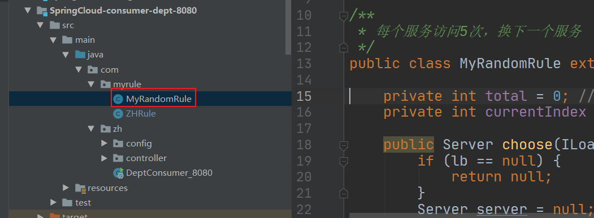

```java
package com.myrule;
import com.netflix.client.config.IClientConfig;
import com.netflix.loadbalancer.AbstractLoadBalancerRule;
import com.netflix.loadbalancer.ILoadBalancer;
import com.netflix.loadbalancer.Server;

import java.util.List;
import java.util.concurrent.ThreadLocalRandom;

/**
 * 每个服务访问5次，换下一个服务
 */
public class MyRandomRule extends AbstractLoadBalancerRule {

    private int total = 0; // 被调用的次数
    private int currentIndex = 0; // 当前是谁在提供服务

    public Server choose(ILoadBalancer lb, Object key) {
        if (lb == null) {
            return null;
        }
        Server server = null;

        while (server == null) {
            if (Thread.interrupted()) {
                return null;
            }
            List<Server> upList = lb.getReachableServers(); // 获得活着的服务
            List<Server> allList = lb.getAllServers();  // 获得全部的服务

            int serverCount = allList.size();
            if (serverCount == 0) {
                return null;
            }

            // int index = chooseRandomInt(serverCount); // 生成区间随机数
            // server = upList.get(index); // 从活着的服务中，随机获取一个

            // ================================================
            if (currentIndex > upList.size()){
                currentIndex = 0;
            }
            if (total < 5){
                server = upList.get(currentIndex);
                total++;
            }else {
                total = 0;
                currentIndex++;
                server = upList.get(currentIndex); // 从活着的服务中，获取指定的服务来进行操作
            }

            // ================================================

            if (server == null) {

                Thread.yield();
                continue;
            }

            if (server.isAlive()) {
                return (server);
            }

            server = null;
            Thread.yield();
        }

        return server;

    }

    protected int chooseRandomInt(int serverCount) {
        return ThreadLocalRandom.current().nextInt(serverCount);
    }

    @Override
    public Server choose(Object key) {
        return choose(getLoadBalancer(), key);
    }

    @Override
    public void initWithNiwsConfig(IClientConfig clientConfig) {
        // TODO Auto-generated method stub

    }
}
```

#### 6.4.3.4、调用自定义的IRule方法中返回刚才我们写好的随机算法类

```java
@Configuration
@Component
public class ZHRule {

    @Bean
    public IRule iRule(){
        return new MyRandomRule(); // 默认是伦循的，现在使用自己的
    }

}
```

# 7、Feign

## 7.1、简介

Feign时声明式的web server客户端，它让微服务之间的调用变得更加简单，类似于controller调用server

Spring Cloud集成了Ribbon和Eureka，可在使用Feign时提供负载均衡的http客户端。 

只需要创建一个接口，然后添加注解即可！

- Feign旨在使编写Java HTTP客户端变得更加容易
- 前面使用Ribbon + RestTemplate时，利用RestTemplate对Http请求的封装处理，形成一套模板化的调用方法。但在实际开发中，由于对服务依赖的调用不止一处，往往一个接口会被多出调用，所以通常都会针对每个微服务自行封装一些客户端来包装这些依赖服务的调用。所以，Feign再次基础上做了进一步封装，由他来帮助我们定义和实现依赖服务接口的定义
- 在Feign的实现下，只需要创建一个接口并使用注解的方式来配置（类似于Dao接口标注Mapper注解，现在是在一个微服务接口上标注一个Feign注解即可）

## 7.2、项目搭建

- 参考SpringCloud-consumer-dept-8080
- 新建SpringCloud-consumer-dept-feign-8080
  - 修改主启动类名称
  - 将内容拷贝到feign项目中
  - 删除myrule内容

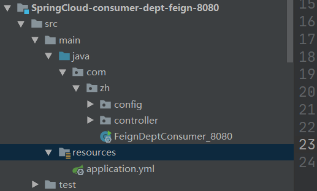

## 7.3、pom

分别对`SpringCloud-api`、`SpringCloud-consumer-dept-feign-8080`添加对Feign的依赖支持

```xml
<!-- feign -->
<dependency>
    <groupId>org.springframework.cloud</groupId>
    <artifactId>spring-cloud-starter-feign</artifactId>
    <version>1.4.7.RELEASE</version>
</dependency>
```

## 7.4、修改springcloud-api工程

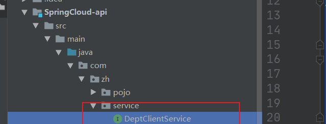

**新建DeptClientService接口使用@FeignClient注解：value时服务的服务名**

```java
/*
 * @FeignClient
 *  value：服务名
 */
@Component
@FeignClient(value = "SPRINGCLOUD-PROVIDER-DEPT")
public interface DeptClientService {

    @RequestMapping("/dept/get/{id}")
    Dept findById(@PathVariable("id") Long id);

    @RequestMapping("/dept/list")
    List<Dept> findAll();

}
```

## 7.5、修改Controlle

使用DeptClientService接口

```java
/**
 * @author Beloved
 * @date 2020/9/13 17:39
 */
@RestController
public class DeptConsumerController {

    @Autowired
    private DeptClientService deptClientService;

    @RequestMapping(value = "/consumer/dept/list", method = RequestMethod.GET)
    public List<Dept> list(){
        return this.deptClientService.findAll();
    }

    @RequestMapping("/consumer/dept/get/{id}")
    public Dept get(@PathVariable("id") Long id){
        return this.deptClientService.findById(id);
    }
}
```

## 7.6、主启动

**添加对Feign的支持**

**@EnableFeignClients(basePackages = {"com.zh.service"}) // 扫描Feign的service的包**

```java
package com.zh;

import org.springframework.boot.SpringApplication;
import org.springframework.boot.autoconfigure.SpringBootApplication;
import org.springframework.cloud.netflix.eureka.EnableEurekaClient;
import org.springframework.cloud.openfeign.EnableFeignClients;
import org.springframework.context.annotation.ComponentScan;

/**
 * @author Beloved
 * @date 2020/9/13 17:50
 */
@SpringBootApplication
@EnableEurekaClient
@EnableFeignClients(basePackages = {"com.zh.service"}) // 扫描Feign的service的包
public class FeignDeptConsumer_8080 {

    public static void main(String[] args) {
        SpringApplication.run(FeignDeptConsumer_8080.class,args);
    }

}
```

## 7.7、测试 

1. 启动eureka集群
2. 启动8001，8002，8003 
3. 启动feign客户端
4.  测试： http://localhost/consumer/dept/list 
5. 结论：Feign自带负载均衡配置项

## 7.8、小结

Feign通过接口的方法调用Rest服务 ( 之前是Ribbon+RestTemplate ) 

该请求发送给Eureka服务器 （http://MICROSERVICECLOUD-PROVIDER-DEPT/dept/list） 

通过Feign直接找到服务接口，由于在进行服务调用的时候融合了Ribbon技术，所以也支持负载均衡作 用！ 

feign其实不是做负载均衡的,负载均衡是ribbon的功能,feign只是集成了ribbon而已,但是负载均衡的功能 还是feign内置的ribbon再做,而不是feign。 

feign的作用的替代RestTemplate,性能比较低，但是可以使代码可读性很强。

# 8、Hystrix断路器

## 8.1、概述

**官网资料 https://github.com/Netflix/Hystrix/wiki**

**分布式系统面临的问题**

复杂分布式系统结构中的应用程序有数十个依赖关系，每个依赖关系在某些时候将不可避免的失败！

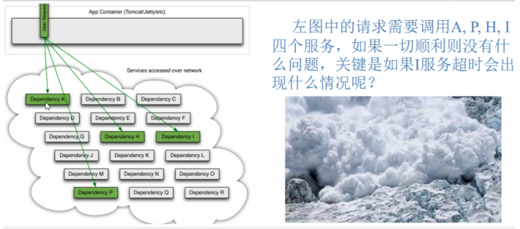

**服务雪崩**

多个微服务之间调用的时候，假设微服务A调用微服务B和微服务C，微服务B和微服务C又调用其他的微服务，这就是所谓的**扇出**，如果扇出的链路上某个微服务的调用响应时间过长或者不可用，对微服务A的调用就会占用越来越多的系统资源，进而引起系统崩溃，所谓的“雪崩效应”

对于高流量的应用来说，单一的后端依赖可能会导致所有服务器上的所有资源都在几秒内饱和。比失败更糟糕的时，这些应用程序还可能导致服务之间的延迟增加，备份队列，线程和其他系统资源紧张，导致整个系统发生更多的级联故障，这些都表示需要对故障和延迟就行隔离和管理，以便单个依赖关系的失败，不能取消整个应用程序或系统

**什么是Hystrix**

Hystrix是一个用于处理分布式系统的延迟和容错的开源库，在分布式系统里，许多依赖不可避免的会调用失败，比如超时，异常等，Hystrix能够保证在一个依赖出问题的情况下，不会导致整体服务失败，避免级联故障，以提高分布式系统的弹性

“断路器”本身是一种开关装置，当某个服务单元发生故障之后，通过断路器的故障监控（类似熔断保险丝），**向调用方返回一个服务预期的，可处理的备选响应（FallBack），而不是长时间的等待或者抛出调用方法无法处理的异常，这样就可以保证了服务调用方的线程不会被长时间**，不必要的占用，从而避免了故障在分布式系统中的蔓延，乃至雪崩

 