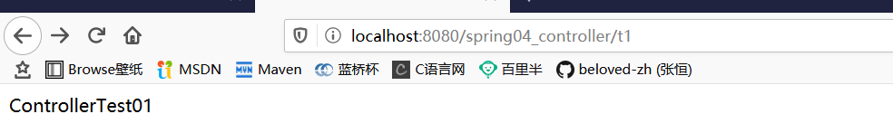
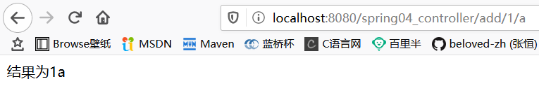

# 1、理解MVC

- MVC是模型(Model)、视图(View)、控制器(Controller)的简写，是一种软件设计规范。
- 是将业务逻辑、数据、显示分离的方法来组织代码。
- MVC主要作用是**降低了视图与业务逻辑间的双向偶合**。
- MVC不是一种设计模式，**MVC是一种架构模式**。当然不同的MVC存在差异。

**Model（模型）：**数据模型，提供要展示的数据，因此包含数据和行为，可以认为是领域模型或JavaBean组件（包含数据和行为），不过现在一般都分离开来：Value Object（数据Dao） 和 服务层（行为Service）。也就是模型提供了模型数据查询和模型数据的状态更新等功能，包括数据和业务。

**View（视图）：**负责进行模型的展示，一般就是我们见到的用户界面，客户想看到的东西。

**Controller（控制器）：**接收用户请求，委托给模型进行处理（状态改变），处理完毕后把返回的模型数据返回给视图，由视图负责展示。 也就是说控制器做了个调度员的工作。

**最典型的MVC就是JSP + servlet + javabean的模式。**

# 2、回顾Servlet

## 2.1、创建SpringMVC空Maven项目

**导入pom依赖**

```xml
<dependencies>
    <dependency>
        <groupId>junit</groupId>
        <artifactId>junit</artifactId>
        <version>4.12</version>
    </dependency>
    <!--spring-->
    <dependency>
        <groupId>org.springframework</groupId>
        <artifactId>spring-webmvc</artifactId>
        <version>5.1.9.RELEASE</version>
    </dependency>
    <!--servlet-->
    <dependency>
        <groupId>javax.servlet</groupId>
        <artifactId>servlet-api</artifactId>
        <version>2.5</version>
    </dependency>
    <!--jsp-->
    <dependency>
        <groupId>javax.servlet.jsp</groupId>
        <artifactId>jsp-api</artifactId>
        <version>2.2</version>
    </dependency>
    <!--jsp中的el表达式-->
    <dependency>
        <groupId>javax.servlet</groupId>
        <artifactId>jstl</artifactId>
        <version>1.2</version>
    </dependency>
</dependencies>
```

## 2.2、创建spring01_servlet空Maven项目

**添加Web框架支持**


## 2.3、编写一个Servlet类，用来处理用户的请求

```java
public class HelloServlet extends HttpServlet {

    @Override
    protected void doGet(HttpServletRequest req, HttpServletResponse resp) throws ServletException, IOException {
        //1.获取前端参数
        String method = req.getParameter("method");
        System.out.println(method);
        if (method.equals("add")){
            req.getSession().setAttribute("msg","执行了add方法");
        }
        if (method.equals("delete")){
            req.getSession().setAttribute("msg","执行了delete方法");
        }
        //2.调用业务层
        //3.视图转发或重定向
        //转发
        req.getRequestDispatcher("/jsp/hello.jsp").forward(req,resp);
        //重定向
        //resp.sendRedirect();
    }

    @Override
    protected void doPost(HttpServletRequest req, HttpServletResponse resp) throws ServletException, IOException {
        doGet(req,resp);
    }
}
```

## 2.4、编写jsp页面

**index.jsp**

```html
<%@ page contentType="text/html;charset=UTF-8" language="java" %>
<html>
  <head>
    <title>$Title$</title>
  </head>
  <body>
  <form action="/hello" method="post">
    <input type="text" name="method">
    <input type="submit">
  </form>
  </body>
</html>
```

**hello.jsp**

```html
<%@ page contentType="text/html;charset=UTF-8" language="java" %>
<html>
<head>
    <title>Title</title>
</head>
<body>
${msg}
</body>
</html>
```

## 2.5、在web.xml中注册Servlet

```xml
<?xml version="1.0" encoding="UTF-8"?>
<web-app xmlns="http://xmlns.jcp.org/xml/ns/javaee"
         xmlns:xsi="http://www.w3.org/2001/XMLSchema-instance"
         xsi:schemaLocation="http://xmlns.jcp.org/xml/ns/javaee http://xmlns.jcp.org/xml/ns/javaee/web-app_4_0.xsd"
         version="4.0">
    <servlet>
        <servlet-name>hello</servlet-name>
        <servlet-class>com.zh.servlet.HelloServlet</servlet-class>
    </servlet>
    <servlet-mapping>
        <servlet-name>hello</servlet-name>
        <url-pattern>/hello</url-pattern>
    </servlet-mapping>


    <!--设置session的超时时间-->
<!--    <session-config>-->
<!--        <session-timeout>15</session-timeout>-->
<!--    </session-config>-->

    <!--欢迎页  首页-->
<!--    <welcome-file-list>-->
<!--        <welcome-file>index.jsp</welcome-file>-->
<!--    </welcome-file-list>-->
</web-app>
```

## 2.6、配置Tomcat，并启动测试


- localhost:8080/hello?method=add
- localhost:8080/hello?method=delete

# 3、SpringMVC

**Spring MVC是Spring Framework的一部分，是基于Java实现MVC的轻量级Web框架。**

**官方文档：**https://docs.spring.io/spring/docs/5.2.0.RELEASE/spring-framework-reference/web.html#spring-web

## 3.1、特点

1. 轻量级，简单易学
2. 高效 , 基于请求响应的MVC框架
3. 与Spring兼容性好，无缝结合
4. 约定优于配置
5. 功能强大：RESTful、数据验证、格式化、本地化、主题等
6. 简洁灵活

## 3.2、DispatcherServlet

Spring的web框架围绕DispatcherServlet设计。 DispatcherServlet的作用是将请求分发到不同的处理器。从Spring 2.5开始，使用Java 5或者以上版本的用户可以采用基于注解的controller声明方式。

 Spring MVC框架像许多其他MVC框架一样, **以请求为驱动** , **围绕一个中心Servlet分派请求及提供其他功能**，**DispatcherServlet是一个实际的Servlet (它继承自HttpServlet 基类)**。


SpringMVC的原理如下图所示：

 当发起请求时被前置的控制器拦截到请求，根据请求参数生成代理请求，找到请求对应的实际控制器，控制器处理请求，创建数据模型，访问数据库，将模型响应给中心控制器，控制器使用模型与视图渲染视图结果，将结果返回给中心控制器，再将结果返回给请求者。


## 3.3、执行原理


图为SpringMVC的一个较完整的流程图，实线表示SpringMVC框架提供的技术，不需要开发者实现，虚线表示需要开发者实现。

**简要分析执行流程**

1. DispatcherServlet表示前置控制器，是整个SpringMVC的控制中心。用户发出请求，DispatcherServlet接收请求并拦截请求。
   - 我们假设请求的url为 : [http://localhost](http://localhost/):8080/SpringMVC/hello
   - **如上url拆分成三部分：**
   - [http://localhost](http://localhost/):8080服务器域名
   - SpringMVC部署在服务器上的web站点
   - hello表示控制器
   - 通过分析，如上url表示为：请求位于服务器localhost:8080上的SpringMVC站点的hello控制器。
2. HandlerMapping为处理器映射。DispatcherServlet调用HandlerMapping,HandlerMapping根据请求url查找Handler。
3. HandlerExecution表示具体的Handler,其主要作用是根据url查找控制器，如上url被查找控制器为：hello。
4. HandlerExecution将解析后的信息传递给DispatcherServlet,如解析控制器映射等。
5. HandlerAdapter表示处理器适配器，其按照特定的规则去执行Handler。
6. Handler让具体的Controller执行。
7. Controller将具体的执行信息返回给HandlerAdapter,如ModelAndView。
8. HandlerAdapter将视图逻辑名或模型传递给DispatcherServlet。
9. DispatcherServlet调用视图解析器(ViewResolver)来解析HandlerAdapter传递的逻辑视图名。
10. 视图解析器将解析的逻辑视图名传给DispatcherServlet。
11. DispatcherServlet根据视图解析器解析的视图结果，调用具体的视图。
12. 最终视图呈现给用户。

# 4、HelloSpringMVC

## 4.1、配置版

1. 新建一个Moudle ， 添加web的支持！

2. 确定导入了SpringMVC 的依赖！

3. 配置web.xml ， 注册DispatcherServlet

   ```xml
   <?xml version="1.0" encoding="UTF-8"?>
   <web-app xmlns="http://xmlns.jcp.org/xml/ns/javaee"
            xmlns:xsi="http://www.w3.org/2001/XMLSchema-instance"
            xsi:schemaLocation="http://xmlns.jcp.org/xml/ns/javaee http://xmlns.jcp.org/xml/ns/javaee/web-app_4_0.xsd"
            version="4.0">
   
       <!--配置DispatcherServlet 这个是SpringMVC的核心：请求分发器，前端控制器-->
       <servlet>
           <servlet-name>springmvc</servlet-name>
           <servlet-class>org.springframework.web.servlet.DispatcherServlet</servlet-class>
           <!--DispatcherServlet要绑定SpringMVC的配置文件-->
           <init-param>
               <param-name>contextConfigLocation</param-name>
               <param-value>classpath:springmvc-servlet.xml</param-value>
           </init-param>
           <!--
           启动级别：1
           服务器启动，请求启动
           -->
           <load-on-startup>1</load-on-startup>
       </servlet>
       <!--
       SpringMVC中/和/*的区别
       /：只匹配所有的请求，不会去匹配jsp页面
       /*：匹配所有的请求，包含jsp页面
       -->
       <servlet-mapping>
           <servlet-name>springmvc</servlet-name>
           <url-pattern>/</url-pattern>
       </servlet-mapping>
   </web-app>
   ```

4. 编写SpringMVC 的 配置文件！名称：springmvc-servlet.xml 。头文件与spring的一样

   ```xml
   <?xml version="1.0" encoding="UTF-8"?>
   <beans xmlns="http://www.springframework.org/schema/beans"
         xmlns:xsi="http://www.w3.org/2001/XMLSchema-instance"
         xsi:schemaLocation="http://www.springframework.org/schema/beans
          http://www.springframework.org/schema/beans/spring-beans.xsd">
   
   </beans>
   ```

5. 添加处理映射器

   ```xml
   <!--处理器映射器-->
   <bean class="org.springframework.web.servlet.handler.BeanNameUrlHandlerMapping"/>
   ```

6. 添加处理器适配器

   ```xml
   <!--处理器适配器-->
   <bean class="org.springframework.web.servlet.mvc.SimpleControllerHandlerAdapter"/>
   ```

7. 添加视图解析器

   ```xml
   <!--
   视图解析器:DispatcherServlet给他的ModelAndView
   1.获取ModelAndView的数据
   2.解析ModelAndView的视图名字
   3.拼接视图名，找到对应的视图
   4.将数据渲染到这个视图
   -->
   <bean class="org.springframework.web.servlet.view.InternalResourceViewResolver" id="internalResourceViewResolver">
       <!--前缀-->
       <property name="prefix" value="/jsp/"/>
       <!--后缀-->
       <property name="suffix" value=".jsp"/>
   </bean>
   ```

8. 编写我们要操作业务Controller ，要么实现Controller接口，要么增加注解；需要返回一个ModelAndView，装数据，封视图；

   ```java
   public class HelloController implements Controller {
       public ModelAndView handleRequest(HttpServletRequest httpServletRequest, HttpServletResponse httpServletResponse) throws Exception {
   
           ModelAndView mv = new ModelAndView();
   
           //业务代码
           mv.addObject("msg","HelloSpringMVC");
   
           //视图跳转
           mv.setViewName("main"); // /jsp/main.jsp
           return mv;
       }
   }
   ```

9. 将自己的类交给SpringIOC容器，注册bean

   ```xml
   <!--BeanNameUrlHandlerMapping:bean-->
   <bean id="/hello" class="com.zh.controller.HelloController"/>
   ```

10. 写要跳转的jsp页面，显示ModelandView存放的数据，以及我们的正常页面；

    ```html
    <%@ page contentType="text/html;charset=UTF-8" language="java" %>
    <html>
    <head>
        <title>Title</title>
    </head>
    <body>
    ${msg}
    </body>
    </html>
    ```

11. 测试

    

==**可能遇到的问题：访问出现404，排查步骤：**==


1. 查看控制台输出，看一下是不是缺少了什么jar包。
2. 如果jar包存在，显示无法输出，就在IDEA的项目发布中，添加lib依赖！
3. 重启Tomcat 即可解决！


==保存，重启tomcat==


## 4.2、注解版

**第一步:新建一个Moudle , 添加web支持！**建立包结构 com.zh.controller

**第二步:由于Maven可能存在资源过滤的问题，我们将配置完善**

```xml
<!--资源过滤-->
<build>
    <resources>
        <resource>
            <directory>src/main/java</directory>
            <includes>
                <include>**/*.properties</include>
                <include>**/*.xml</include>
            </includes>
            <filtering>false</filtering>
        </resource>
        <resource>
            <directory>src/main/resources</directory>
            <includes>
                <include>**/*.properties</include>
                <include>**/*.xml</include>
            </includes>
            <filtering>false</filtering>
        </resource>
    </resources>
</build>
```

**第三步:在pom.xml文件引入相关的依赖**：
主要有Spring框架核心库、Spring MVC、servlet , JSTL等。在父依赖中已经引入了！

**第四步:配置web.xml**

注意点：

- 注意web.xml版本问题，要最新版！
- 注册DispatcherServlet
- 关联SpringMVC的配置文件
- 启动级别为1
- 映射路径为 / 【不要用/*，会404】

```xml
<?xml version="1.0" encoding="UTF-8"?>
<web-app xmlns="http://xmlns.jcp.org/xml/ns/javaee"
         xmlns:xsi="http://www.w3.org/2001/XMLSchema-instance"
         xsi:schemaLocation="http://xmlns.jcp.org/xml/ns/javaee http://xmlns.jcp.org/xml/ns/javaee/web-app_4_0.xsd"
         version="4.0">

    <!--配置DispatcherServlet 这个是SpringMVC的核心：请求分发器，前端控制器-->
    <servlet>
        <servlet-name>springmvc</servlet-name>
        <servlet-class>org.springframework.web.servlet.DispatcherServlet</servlet-class>
        <!--DispatcherServlet要绑定SpringMVC的配置文件-->
        <init-param>
            <param-name>contextConfigLocation</param-name>
            <param-value>classpath:springmvc-servlet.xml</param-value>
        </init-param>
        <!--
        启动级别：1
        服务器启动，请求启动
        -->
        <load-on-startup>1</load-on-startup>
    </servlet>
    <!--
    SpringMVC中/和/*的区别
    /：只匹配所有的请求，不会去匹配jsp页面
    /*：匹配所有的请求，包含jsp页面
    -->
    <servlet-mapping>
        <servlet-name>springmvc</servlet-name>
        <url-pattern>/</url-pattern>
    </servlet-mapping>
</web-app>
```

```xml
**/ 和 /\* 的区别：**
< url-pattern > / </ url-pattern > 不会匹配到.jsp， 只针对我们编写的请求；
即：.jsp 不会进入spring的 DispatcherServlet类 。
< url-pattern > /* </ url-pattern > 会匹配 *.jsp，
会出现返回 jsp视图 时再次进入spring的DispatcherServlet 类，导致找不到对应的controller所以报404错。
```

**第五步:添加Spring MVC配置文件**

- 让IOC的注解生效
- 静态资源过滤 ：HTML . JS . CSS . 图片 ， 视频 .....
- MVC的注解驱动
- 配置视图解析器

在resource目录下添加springmvc-servlet.xml配置文件，配置的形式与Spring容器配置基本类似，为了支持基于注解的IOC，设置了自动扫描包的功能，具体配置信息如下：

```xml
<?xml version="1.0" encoding="UTF-8"?>
<beans xmlns="http://www.springframework.org/schema/beans"
       xmlns:xsi="http://www.w3.org/2001/XMLSchema-instance"
       xmlns:context="http://www.springframework.org/schema/context"
       xmlns:mvc="http://www.springframework.org/schema/mvc"
       xsi:schemaLocation="http://www.springframework.org/schema/beans
        http://www.springframework.org/schema/beans/spring-beans.xsd
        http://www.springframework.org/schema/context
        https://www.springframework.org/schema/context/spring-context.xsd
        http://www.springframework.org/schema/mvc
        https://www.springframework.org/schema/mvc/spring-mvc.xsd">

    <!-- 自动扫描包，让指定包下的注解生效,由IOC容器统一管理 -->
    <context:component-scan base-package="com.zh.controller"/>
    <!-- 让Spring MVC不处理静态资源  .css .js .html -->
    <mvc:default-servlet-handler />
    <!--
    支持mvc注解驱动
        在spring中一般采用@RequestMapping注解来完成映射关系
        要想使@RequestMapping注解生效
        必须向上下文中注册DefaultAnnotationHandlerMapping
        和一个AnnotationMethodHandlerAdapter实例
        这两个实例分别在类级别和方法级别处理。
        而annotation-driven配置帮助我们自动完成上述两个实例的注入。
     -->
    <mvc:annotation-driven />

    <!-- 视图解析器 -->
    <bean class="org.springframework.web.servlet.view.InternalResourceViewResolver"
          id="internalResourceViewResolver">
        <!-- 前缀 -->
        <property name="prefix" value="/jsp/" />
        <!-- 后缀 -->
        <property name="suffix" value=".jsp" />
    </bean>

</beans>
```

在视图解析器中我们把所有的视图都存放在/WEB-INF/目录下，这样可以保证视图安全，因为这个目录下的文件，客户端不能直接访问。

**第六步:创建Controller**

编写一个Java控制类： com.kuang.controller.HelloController , 注意编码规范

```java
@Controller
@RequestMapping("HelloController")
public class HelloController {

    //真实访问地址，可以存在两个，具有父子关系
    //locatlhost:8080/项目名/HelloController/hello
    @RequestMapping("/hello")
    public String hello(Model model){

        //封装数据    向模型中添加属性msg与值，可以在JSP页面中取出并渲染
        model.addAttribute("msg","HelloSpringMVCAnnotation");

        //会被视图解析器处理  /jsp/main.jsp
        return "main";
    }

}
```

- @Controller是为了让Spring IOC容器初始化时自动扫描到；
- @RequestMapping是为了映射请求路径，这里因为类与方法上都有映射所以访问时应该是/HelloController/hello；
- 方法中声明Model类型的参数是为了把Action中的数据带到视图中；
- 方法返回的结果是视图的名称main，加上配置文件中的前后缀变成WEB-INF/jsp/main.jsp。

**第七步:创建视图层**

在 jsp目录中创建main.jsp ， 视图可以直接取出并展示从Controller带回的信息；

可以通过EL表示取出Model中存放的值，或者对象；

```jsp
<%@ page contentType="text/html;charset=UTF-8" language="java" %>
<html>
<head>
    <title>Title</title>
</head>
<body>
${msg}
</body>
</html>
```

**第八步:配置Tomcat运行**

配置Tomcat ， 开启服务器 ， 访问 对应的请求路径！


## 4.3、小结

实现步骤其实非常的简单：

1. 新建一个web项目
2. 导入相关jar包
3. 编写web.xml , 注册DispatcherServlet
4. 编写springmvc配置文件
5. 接下来就是去创建对应的控制类 , controller
6. 最后完善前端视图和controller之间的对应
7. 测试运行调试.

使用springMVC必须配置的三大件：

**处理器映射器、处理器适配器、视图解析器**

通常，我们只需要**手动配置视图解析器**，而**处理器映射器**和**处理器适配器**只需要开启**注解驱动**即可，而省去了大段的xml配置

# 5、Controller 及 RestFul风格

## 5.1、控制器Controller

- 控制器复杂提供访问应用程序的行为，通常通过接口定义或注解定义两种方法实现。
- 控制器负责解析用户的请求并将其转换为一个模型。
- 在Spring MVC中一个控制器类可以包含多个方法
- 在Spring MVC中，对于Controller的配置方式有很多种

我们来看看有哪些方式可以实现：

### 5.1.1、实现Controller接口

Controller是一个接口，在org.springframework.web.servlet.mvc包下，接口中只有一个方法；

```java
//实现该接口的类获得控制器功能
public interface Controller {
    //处理请求且返回一个模型与视图对象
    ModelAndView handleRequest(HttpServletRequest var1, HttpServletResponse var2) throws Exception;
}
```

**测试**

1. 新建一个Moudle，springmvc-04-controller 。 将刚才的03 拷贝一份, 我们进行操作！

   - 删掉HelloController
   - mvc的配置文件只留下 视图解析器！

   ```xml
   <?xml version="1.0" encoding="UTF-8"?>
   <beans xmlns="http://www.springframework.org/schema/beans"
          xmlns:xsi="http://www.w3.org/2001/XMLSchema-instance"
          xmlns:context="http://www.springframework.org/schema/context"
          xmlns:mvc="http://www.springframework.org/schema/mvc"
          xsi:schemaLocation="http://www.springframework.org/schema/beans
          http://www.springframework.org/schema/beans/spring-beans.xsd http://www.springframework.org/schema/context https://www.springframework.org/schema/context/spring-context.xsd http://www.springframework.org/schema/mvc https://www.springframework.org/schema/mvc/spring-mvc.xsd">
       <bean class="org.springframework.web.servlet.view.InternalResourceViewResolver" id="internalResourceViewResolver">
           <!--前缀-->
           <property name="prefix" value="/WEB-INF/jsp/"/>
           <!--后缀-->
           <property name="suffix" value=".jsp"/>
       </bean>
   
   </beans>
   ```

2. 编写一个Controller类，ControllerTest01

   ```java
   //只要实现Controller接口的类，就是一个控制器
   public class ControllerTest01 implements Controller {
       public ModelAndView handleRequest(HttpServletRequest httpServletRequest, HttpServletResponse httpServletResponse) throws Exception {
           ModelAndView mv = new ModelAndView();
   
           mv.addObject("msg","ControllerTest01");
           mv.setViewName("main");
   
           return mv;
       }
   }
   ```

3. 编写完毕后，去Spring配置文件中注册请求的bean；name对应请求路径，class对应处理请求的类

   ```xml
   <bean id="/t1" class="com.zh.controller.ControllerTest01"/>
   ```

4. 编写前端test.jsp，注意在WEB-INF/jsp目录下编写，对应我们的视图解析器

   ```jsp
   <%@ page contentType="text/html;charset=UTF-8" language="java" %>
   <html>
   <head>
       <title>Title</title>
   </head>
   <body>
   ${msg}
   </body>
   </html>
   ```

5. 配置Tomcat运行测试，我这里没有项目发布名配置的就是一个 / ，所以请求不用加项目名，OK！



**说明：**

- 实现接口Controller定义控制器是较老的办法
- 缺点是：一个控制器中只有一个方法，如果要多个方法则需要定义多个Controller；定义的方式比较麻烦；5.

### 5.1.2、用注解@Controller

- @Controller注解类型用于声明Spring类的实例是一个控制器（在讲IOC时还提到了另外3个注解）；

- Spring可以使用扫描机制来找到应用程序中所有基于注解的控制器类，为了保证Spring能找到你的控制器，需要在配置文件中声明组件扫描。

  ```xml
  <!-- 自动扫描指定的包，下面所有注解类交给IOC容器管理 -->
  <context:component-scan base-package="com.zh.controller"/>
  ```

- 增加一个ControllerTest2类，使用注解实现；

  ```java
  @Controller
  //代表这个类被spring接管，被这个注释的类，中的所有方法，
  // 且过返回值是string，并且有具体的页面可以跳转，就会被视图解析器解析
  public class ControllerTest02 {
      //映射访问路径
      @RequestMapping("/t2")
      public String test01(Model model){
          //Spring MVC会自动实例化一个Model对象用于向视图中传值
          model.addAttribute("msg","ControllerTest02");
  		//返回视图位置
          return "main";
      }
  
      @RequestMapping("/t3")
      public String test02(Model model){
  
          model.addAttribute("msg","ControllerTest02/test02");
  
          return "main";
      }
  
  }
  ```

- 运行tomcat测试


**可以发现，我们的两个请求都可以指向一个视图，但是页面结果的结果是不一样的，从这里可以看出视图是被复用的，而控制器与视图之间是弱偶合关系。**

## 5.2、RequestMapping

**@RequestMapping**

- @RequestMapping注解用于映射url到控制器类或一个特定的处理程序方法。可用于类或方法上。用于类上，表示类中的所有响应请求的方法都是以该地址作为父路径。

- 为了测试结论更加准确，我们可以加上一个项目名测试 myweb

- 只注解在方法上面

  ```java
  @Controller
  public class TestController {
      @RequestMapping("/h1")
      public String test(){
          return "test";
      }
  }
  ```

  访问路径：[http://localhost](http://localhost/):8080 / 项目名 / h1

- 同时注解类与方法

  ```java
  @Controller
  @RequestMapping("/admin")
  public class TestController {
      @RequestMapping("/h1")
      public String test(){
          return "test";
      }
  }
  ```

  访问路径：[http://localhost](http://localhost/):8080 / 项目名/ admin /h1 , 需要先指定类的路径再指定方法的路径；

## 5.3、RestFul 风格

**概念**

Restful就是一个资源定位及资源操作的风格。不是标准也不是协议，只是一种风格。基于这个风格设计的软件可以更简洁，更有层次，更易于实现缓存等机制。

**功能**

- 资源：互联网所有的事物都可以被抽象为资源
- 资源操作：使用POST、DELETE、PUT、GET，使用不同方法对资源进行操作。
- 分别对应 添加、 删除、修改、查询。

**传统方式操作资源** ：通过不同的参数来实现不同的效果！方法单一，post 和 get

- http://127.0.0.1/item/queryItem.action?id=1 查询,GET
- http://127.0.0.1/item/saveItem.action 新增,POST
- http://127.0.0.1/item/updateItem.action 更新,POST
- http://127.0.0.1/item/deleteItem.action?id=1 删除,GET或POST

**使用RESTful操作资源** ： 可以通过不同的请求方式来实现不同的效果！如下：请求地址一样，但是功能可以不同！

- http://127.0.0.1/item/1 查询,GET
- http://127.0.0.1/item 新增,POST
- http://127.0.0.1/item 更新,PUT
- http://127.0.0.1/item/1 删除,DELETE

**学习测试**

1. 在新建一个类 RestFulController

   ```java
   @Controller
   public class RestFulController {
   
   }
   ```

2. 在Spring MVC中可以使用 @PathVariable 注解，让方法参数的值对应绑定到一个URI模板变量上。

   ```java
   @Controller
   public class RestFulController {
   
       //原来的：http://localhost:8080/spring04_controller/add?a=1&b=2
       //RestFul http://localhost:8080/spring04_controller/add/a/b
       @RequestMapping("/add/{a}/{b}")
       public String test01(@PathVariable int a,@PathVariable int b, Model model){
   
           int sum = a+b;
           model.addAttribute("msg","结果为"+sum);
   
           return "main";
       }
   
   }
   ```

3. 我们来测试请求查看下


**使用路径变量的好处？**

- 使路径变得更加简洁；
- 获得参数更加方便，框架会自动进行类型转换。
- 通过路径变量的类型可以约束访问参数，如果类型不一样，则访问不到对应的请求方法，如这里访问是的路径是/add/1/a，则路径与方法不匹配，而不会是参数转换失败。


1. 我们来修改下对应的参数类型，再次测试

   ```java
   @Controller
   public class RestFulController {
   
       //原来的：http://localhost:8080/spring04_controller/add?a=1&b=2
       //RestFul http://localhost:8080/spring04_controller/add/1/2
       @RequestMapping("/add/{a}/{b}")
       public String test01(@PathVariable int a,@PathVariable String b, Model model){
   
           String sum = a+b;
           model.addAttribute("msg","结果为"+sum);
   
           return "main";
       }
   
   }
   ```

   

**使用method属性指定请求类型**

用于约束请求的类型，可以收窄请求范围。指定请求谓词的类型如GET, POST, HEAD, OPTIONS, PUT, PATCH, DELETE, TRACE等

我们来测试一下：

- 增加一个方法

  ```java
  @Controller
  public class RestFulController {
  
      //映射访问路径,必须是POST请求
      @RequestMapping(value = "/add/{a}/{b}",method = {RequestMethod.POST})
      public String test01(@PathVariable int a,@PathVariable String b, Model model){
  
          String sum = a+b;
          model.addAttribute("msg","结果为"+sum);
  
          return "main";
      }
  
  }
  ```

- 我们使用浏览器地址栏进行访问默认是Get请求，会报错405：
  

- 如果将POST修改为GET则正常了；

  ```java
  @Controller
  public class RestFulController {
  
      //映射访问路径,必须是POST请求
      @RequestMapping(value = "/add/{a}/{b}",method = {RequestMethod.GET})
      public String test01(@PathVariable int a,@PathVariable String b, Model model){
  
          String sum = a+b;
          model.addAttribute("msg","结果为"+sum);
  
          return "main";
      }
  
  }
  ```

  

**小结：**

Spring MVC 的 @RequestMapping 注解能够处理 HTTP 请求的方法, 比如 GET, PUT, POST, DELETE 以及 PATCH。

**所有的地址栏请求默认都会是 HTTP GET 类型的。**

方法级别的注解变体有如下几个： 组合注解

```java
@GetMapping
@PostMapping
@PutMapping
@DeleteMapping
@PatchMapping
```

@GetMapping 是一个组合注解

它所扮演的是 @RequestMapping(method =RequestMethod.GET) 的一个快捷方式。

平时使用的会比较多！

```java
@Controller
public class RestFulController {

    //@RequestMapping(value = "/add/{a}/{b}",method = {RequestMethod.GET})
    @GetMapping("/add/{a}/{b}")
    public String test01(@PathVariable int a,@PathVariable String b, Model model){

        String sum = a+b;
        model.addAttribute("msg","结果为"+sum);

        return "main";
    }

}
```



# 6、结果跳转方式

## 6.1、ModelAndView

设置ModelAndView对象 , 根据view的名称 , 和视图解析器跳到指定的页面 .

页面 : {视图解析器前缀} + viewName +{视图解析器后缀}

```xml
<!-- 视图解析器 -->
<bean class="org.springframework.web.servlet.view.InternalResourceViewResolver"
      id="internalResourceViewResolver">
    <!-- 前缀 -->
    <property name="prefix" value="/WEB-INF/jsp/" />
    <!-- 后缀 -->
    <property name="suffix" value=".jsp" />
</bean>
```

对应的controller类

```java
public class ControllerTest1 implements Controller {

    public ModelAndView handleRequest(HttpServletRequest httpServletRequest, HttpServletResponse httpServletResponse) throws Exception {
        //返回一个模型视图对象
        ModelAndView mv = new ModelAndView();
        mv.addObject("msg","ControllerTest1");
        mv.setViewName("test");
        return mv;
    }
}
```

## 6.2、ServletAPI

通过设置ServletAPI , 不需要视图解析器 .

1. 通过HttpServletResponse进行输出
2. 通过HttpServletResponse实现重定向
3. 通过HttpServletResponse实现转发

```java
@Controller
public class ResultGo {

    @RequestMapping("/result/t1")
    public void test1(HttpServletRequest req, HttpServletResponse rsp) throws IOException {
        rsp.getWriter().println("Hello,Spring BY servlet API");
    }

    @RequestMapping("/result/t2")
    public void test2(HttpServletRequest req, HttpServletResponse rsp) throws IOException {
        rsp.sendRedirect("/index.jsp");
    }

    @RequestMapping("/result/t3")
    public void test3(HttpServletRequest req, HttpServletResponse rsp) throws Exception {
        //转发
        req.setAttribute("msg","/result/t3");
        req.getRequestDispatcher("/WEB-INF/jsp/test.jsp").forward(req,rsp);
    }

}
```

## 6.3、SpringMVC

**通过SpringMVC来实现转发和重定向 - 无需视图解析器；**

测试前，需要将视图解析器注释掉

```java
@Controller
public class ModelTest01 {

    @RequestMapping("/m1/t1")
    public String test01(Model model){

        model.addAttribute("msg","无视图解析器，隐式转发");
       
        //隐式转发
        return "/WEB-INF/jsp/main.jsp";
    }

    @RequestMapping("/m1/t2")
    public String test02(Model model){

        model.addAttribute("msg","无视图解析器，显示转发");
        
        //显示转发
        return "forward:/WEB-INF/jsp/main.jsp";
    }

    @RequestMapping("/m1/t3")
    public String test03(Model model){

        model.addAttribute("msg","无视图解析器，重定向");

        //重定向
        return "redirect:/index.jsp";
    }
}
```

**通过SpringMVC来实现转发和重定向 - 有视图解析器；**

重定向 , 不需要视图解析器 , 本质就是重新请求一个新地方嘛 , 所以注意路径问题.

可以重定向到另外一个请求实现 .

```java
@Controller
public class ModelTest02 {

    @RequestMapping("/m2/t1")
    public String test01(Model model){

        model.addAttribute("msg","视图解析器，转发是默认的，隐式的");

        return "main";
    }

    @RequestMapping("/m2/t2")
    public String test02(Model model){

        model.addAttribute("msg","视图解析器，重定向页面");

        return "redirect:/index.jsp";
    }

    @RequestMapping("/m2/t3")
    public String test03(){

        //视图解析器，重定向请求

        return "redirect:/m2/t1";
    }
    
}
```

# 7、数据处理

## 7.1、处理提交数据

**1、提交的域名称和处理方法的参数名一致**

处理方法 :

```java
@Controller
@RequestMapping("/user")
public class UserController {
    @RequestMapping("/t1")
    public String test01(String name, Model model){
        //1.接受前端参数
        System.out.println("接受的前端参数为"+name);
        //2.将参数返回给前端
        model.addAttribute("msg",name);
        //3.跳转试图
        return "main";
    }
}
```

提交数据 :http://localhost:8080/spring04_controller/user/t1?name=zhangheng

后台输出 :接受的前端参数为zhangheng

提交数据 :http://localhost:8080/spring04_controller/user/t1?name1=zhangheng

后台输出 :接受的前端参数为null

**2、提交的域名称和处理方法的参数名不一致**

==使用：@RequestParam("xxxx")==

处理方法 :

```java
@Controller
@RequestMapping("/user")
public class UserController {
    @RequestMapping("/t2")
    public String test02(@RequestParam("userName") String name, Model model){
        //1.接受前端参数
        System.out.println("接受的前端参数为"+name);
        //2.将参数返回给前端
        model.addAttribute("msg",name);
        //3.跳转试图
        return "main";
    }
}
```

提交数据 :http://localhost:8080/spring04_controller/user/t2?userName=zhangheng

后台输出 :接受的前端参数为zhangheng

提交数据 :http://localhost:8080/spring04_controller/user/t1?name=zhangheng


**3、提交的是一个对象**

==要求提交的表单域和对象的属性名一致 , 参数使用对象即可==

1. 实体类

   ```Java
   @Data
   @AllArgsConstructor
   @NoArgsConstructor
   public class User {
       private int id;
       private String name;
       private int age;
   }
   ```

2. 处理方法 :

   ```java
   //前端传递对象
       /*
       1.接收前端用户传递的参数，判断参数的名字，如果名字直接在方法上，可以直接使用
       2.如果传递的是一个对象User，匹配对象User中的字段名，如果名字一致OK，否则为null
        */
       @RequestMapping("/t3")
       public String test03(User user, Model model){
           //1.接受前端参数
           System.out.println(user);
           //2.将参数返回给前端
           model.addAttribute("msg",user);
           //3.跳转试图
           return "main";
       }
   ```

   提交数据 :http://localhost:8080/spring04_controller/user/t3?id=1&name=zhangheng&age=18

   后台输出 :User(id=1, name=zhangheng, age=18)

   提交数据 :http://localhost:8080/spring04_controller/user/t3?uid=1&name=zhangheng&age=18

   后台输出 :User(id=0, name=zhangheng, age=18)

   

**说明：如果使用对象的话，前端传递的参数名和对象名必须一致，否则就是null。**

## 7.2、数据显示到前端

### 7.2.1、通过ModelAndView

```java
public class ControllerTest1 implements Controller {

    public ModelAndView handleRequest(HttpServletRequest httpServletRequest, HttpServletResponse httpServletResponse) throws Exception {
        //返回一个模型视图对象
        ModelAndView mv = new ModelAndView();
        mv.addObject("msg","ControllerTest1");
        mv.setViewName("test");
        return mv;
    }
}
```

### 7.2.2、第二种 : 通过ModelMap

```java
@Controller
@RequestMapping("/user")
public class UserController {

    @RequestMapping("/t4")
    public String test04(ModelMap map){
        map.addAttribute("msg","ModelMap");
        return "main";
    }
}
```

### 7.2.3、第三种 : 通过Model

```java
@Controller
@RequestMapping("/user")
public class UserController {
    @RequestMapping("/t1")
    public String test01(String name, Model model){
        
        System.out.println("接受的前端参数为"+name);
        //model
        model.addAttribute("msg",name);
        
        return "main";
    }
}
```

### 7.2.4、对比

就对于新手而言简单来说使用区别就是：

```
Model 只有寥寥几个方法只适合用于储存数据，简化了新手对于Model对象的操作和理解；

ModelMap 继承了 LinkedMap ，除了实现了自身的一些方法，同样的继承 LinkedMap 的方法和特性；

ModelAndView 可以在储存数据的同时，可以进行设置返回的逻辑视图，进行控制展示层的跳转。
```

## 7.3、乱码问题

### 7.3.1、测试

测试步骤：

1. 我们可以在首页编写一个提交的表单

   ```html
   <%@ page contentType="text/html;charset=UTF-8" language="java" %>
   <html>
     <head>
       <title>$Title$</title>
     </head>
     <body>
     <form action="/e/t1" method="post">
       <input type="text" name="name">
       <input type="submit">
     </form>
     </body>
   </html>
   ```

2. 后台编写对应的处理类

   ```java
   @Controller
   public class EncodingController {
   
       @PostMapping("/e/t1")
       public String test01(String name, Model model){
           System.out.println("==========================");
           System.out.println(name);
   
           model.addAttribute("msg",name);
   
           return "main";
       }
   }
   ```

3. 输入中文测试，发现乱码
   

### 7.3.2、遇到的坑（路径问题）

**==---------------------------------------------------------------注意---------------------------------------------------------------------------==**


**发现请求地址出现问题**

**原因：action中地址以 / 开头，那么代表根目录就是Tomcat服务器，也就是localhost：8080
不以斜杠开头，那么根目录就是当前目录**

**解决方法：**

1. action中不以 / 开始。也可以访问

   ```html
   <form action="e/t1" method="post">
       <input type="text" name="name">
       <input type="submit">
   </form>
   ```

   

2. 修改tomact服务器路径。==建议使用，如果服务器部署多个项目可能会出问题==

   

   ```html
   <form action="/e/t1" method="post">
       <input type="text" name="name">
       <input type="submit">
   </form>
   ```

   

3. ==绝对路径：推荐使用==

   ==${pageContext.request.contextPath}  获取当前项目的路径==

   ```html
   <form action="${pageContext.request.contextPath}/e/t1" method="post">
     <input type="text" name="name">
     <input type="submit">
   </form>
   ```

   

### 7.3.3、SpringMVC自带过滤器

以前乱码问题通过过滤器解决 , 而SpringMVC给我们提供了一个过滤器 , 可以在web.xml中配置 .

修改了xml文件需要重启服务器！

```xml
<!--SpringMVC自带过滤器，解决字符乱码-->
<filter>
    <filter-name>encoding</filter-name>
    <filter-class>org.springframework.web.filter.CharacterEncodingFilter</filter-class>
    <init-param>
        <param-name>encoding</param-name>
        <param-value>utf-8</param-value>
    </init-param>
</filter>
<filter-mapping>
    <filter-name>encoding</filter-name>
    <url-pattern>/*</url-pattern>
</filter-mapping>
```

**有些极端情况下.这个过滤器对get的支持不好 .**

### 7.3.4、极端

处理方法 :

1. 修改tomcat配置文件 ： 设置编码！tomcat-7.0.85\conf\server.xml

   ```xml
   <Connector URIEncoding="utf-8" port="8080" protocol="HTTP/1.1"
              connectionTimeout="20000"
              redirectPort="8443" />
   ```

2. 自定义过滤器

   ```java
   package com.zh.filter;
   
   import javax.servlet.*;
   import javax.servlet.http.HttpServletRequest;
   import javax.servlet.http.HttpServletRequestWrapper;
   import javax.servlet.http.HttpServletResponse;
   import java.io.IOException;
   import java.io.UnsupportedEncodingException;
   import java.util.Map;
   
   /**
    * 解决get和post请求 全部乱码的过滤器
    */
   public class GenericEncodingFilter implements Filter {
   
       public void destroy() {
       }
   
       public void doFilter(ServletRequest request, ServletResponse response, FilterChain chain) throws IOException, ServletException {
           //处理response的字符编码
           HttpServletResponse myResponse=(HttpServletResponse) response;
           myResponse.setContentType("text/html;charset=UTF-8");
   
           // 转型为与协议相关对象
           HttpServletRequest httpServletRequest = (HttpServletRequest) request;
           // 对request包装增强
           HttpServletRequest myrequest = new MyRequest(httpServletRequest);
           chain.doFilter(myrequest, response);
       }
   
       public void init(FilterConfig filterConfig) throws ServletException {
       }
   
   }
   
   //自定义request对象，HttpServletRequest的包装类
   class MyRequest extends HttpServletRequestWrapper {
   
       private HttpServletRequest request;
       //是否编码的标记
       private boolean hasEncode;
       //定义一个可以传入HttpServletRequest对象的构造函数，以便对其进行装饰
       public MyRequest(HttpServletRequest request) {
           super(request);// super必须写
           this.request = request;
       }
   
       // 对需要增强方法 进行覆盖
       @Override
       public Map getParameterMap() {
           // 先获得请求方式
           String method = request.getMethod();
           if (method.equalsIgnoreCase("post")) {
               // post请求
               try {
                   // 处理post乱码
                   request.setCharacterEncoding("utf-8");
                   return request.getParameterMap();
               } catch (UnsupportedEncodingException e) {
                   e.printStackTrace();
               }
           } else if (method.equalsIgnoreCase("get")) {
               // get请求
               Map<String, String[]> parameterMap = request.getParameterMap();
               if (!hasEncode) { // 确保get手动编码逻辑只运行一次
                   for (String parameterName : parameterMap.keySet()) {
                       String[] values = parameterMap.get(parameterName);
                       if (values != null) {
                           for (int i = 0; i < values.length; i++) {
                               try {
                                   // 处理get乱码
                                   values[i] = new String(values[i]
                                           .getBytes("ISO-8859-1"), "utf-8");
                               } catch (UnsupportedEncodingException e) {
                                   e.printStackTrace();
                               }
                           }
                       }
                   }
                   hasEncode = true;
               }
               return parameterMap;
           }
           return super.getParameterMap();
       }
   
       //取一个值
       @Override
       public String getParameter(String name) {
           Map<String, String[]> parameterMap = getParameterMap();
           String[] values = parameterMap.get(name);
           if (values == null) {
               return null;
           }
           return values[0]; // 取回参数的第一个值
       }
   
       //取所有值
       @Override
       public String[] getParameterValues(String name) {
           Map<String, String[]> parameterMap = getParameterMap();
           String[] values = parameterMap.get(name);
           return values;
       }
   }
   ```

这个是网上大神写的，一般情况下，SpringMVC默认的乱码处理就已经能够很好的解决了！

**然后在web.xml中配置这个过滤器即可！**

```xml
<filter>
    <filter-name>encoding</filter-name>
    <filter-class>com.zh.filter.GenericEncodingFilter</filter-class>
</filter>
<filter-mapping>
    <filter-name>encoding</filter-name>
    <url-pattern>/*</url-pattern>
</filter-mapping>
```

乱码问题，需要平时多注意，在尽可能能设置编码的地方，都设置为统一编码 UTF-8！

# 8、JSON

## 8.1、什么是JSON？

- JSON(JavaScript Object Notation, JS 对象标记) 是一种轻量级的数据交换格式，目前使用特别广泛。
- 采用完全独立于编程语言的**文本格式**来存储和表示数据。
- 简洁和清晰的层次结构使得 JSON 成为理想的数据交换语言。
- 易于人阅读和编写，同时也易于机器解析和生成，并有效地提升网络传输效率。

在 JavaScript 语言中，一切都是对象。因此，任何JavaScript 支持的类型都可以通过 JSON 来表示，例如字符串、数字、对象、数组等。看看他的要求和语法格式：

- 对象表示为键值对，数据由逗号分隔
- 花括号保存对象
- 方括号保存数组

**JSON 键值对**是用来保存 JavaScript 对象的一种方式，和 JavaScript 对象的写法也大同小异，键/值对组合中的键名写在前面并用双引号 "" 包裹，使用冒号 : 分隔，然后紧接着值：

```json
{"name": "张恒"}
{"age": "3"}
{"sex": "男"}
```

- JSON 是 JavaScript 对象的字符串表示法，它使用文本表示一个 JS 对象的信息，本质是一个字符串。

  ```javascript
  var obj = {a: 'Hello', b: 'World'}; //这是一个对象，注意键名也是可以使用引号包裹的
  var json = '{"a": "Hello", "b": "World"}'; //这是一个 JSON 字符串，本质是一个字符串
  ```

**JSON 和 JavaScript 对象互转**

- 要实现从JSON字符串转换为JavaScript 对象，使用 JSON.parse() 方法：

  ```javascript
  var obj = JSON.parse('{"a": "Hello", "b": "World"}'); 
  //结果是 {a: 'Hello', b: 'World'}
  ```

- 要实现从JavaScript 对象转换为JSON字符串，使用 JSON.stringify() 方法：

  ```javascript
  var json = JSON.stringify({a: 'Hello', b: 'World'});
  //结果是 '{"a": "Hello", "b": "World"}'
  ```

**代码测试**

1. 新建一个module ，spring05_json ， 添加web的支持

2. 在web目录下新建一个 jsonTest.html ， 编写测试内容

   ```html
   <!DOCTYPE html>
   <html lang="en">
   <head>
       <meta charset="UTF-8">
       <title>Title</title>
       <script type="text/javascript">
   
           //创建js对象
           var user = {
               name : "张恒",
               age : 18,
               sex : "男"
           };
   
           console.log(user);
   
           //将js对象转换为json
           var json = JSON.stringify(user);
           console.log(json);
   
           //将json转换为js对象
           var obj = JSON.parse(json);
           console.log(obj);
       </script>
   </head>
   <body>
   </body>
   </html>
   ```

3. 在IDEA中使用浏览器打开，查看控制台输出！

## 8.2、Controller返回JSON数据

- Jackson应该是目前比较好的json解析工具了

- 当然工具不止这一个，比如还有阿里巴巴的 fastjson 等等。

- 我们这里使用Jackson，使用它需要导入它的jar包；

  ```xml
  <!-- https://mvnrepository.com/artifact/com.fasterxml.jackson.core/jackson-core -->
  <dependency>
      <groupId>com.fasterxml.jackson.core</groupId>
      <artifactId>jackson-databind</artifactId>
      <version>2.9.8</version>
  </dependency>
  ```

- 配置SpringMVC需要的配置
  **web.xml**

  ```xml
  <?xml version="1.0" encoding="UTF-8"?>
  <web-app xmlns="http://xmlns.jcp.org/xml/ns/javaee"
           xmlns:xsi="http://www.w3.org/2001/XMLSchema-instance"
           xsi:schemaLocation="http://xmlns.jcp.org/xml/ns/javaee http://xmlns.jcp.org/xml/ns/javaee/web-app_4_0.xsd"
           version="4.0">
  
      <!--1.注册servlet-->
      <servlet>
          <servlet-name>SpringMVC</servlet-name>
          <servlet-class>org.springframework.web.servlet.DispatcherServlet</servlet-class>
          <!--通过初始化参数指定SpringMVC配置文件的位置，进行关联-->
          <init-param>
              <param-name>contextConfigLocation</param-name>
              <param-value>classpath:springmvc-servlet.xml</param-value>
          </init-param>
          <!-- 启动顺序，数字越小，启动越早 -->
          <load-on-startup>1</load-on-startup>
      </servlet>
  
      <!--所有请求都会被springmvc拦截 -->
      <servlet-mapping>
          <servlet-name>SpringMVC</servlet-name>
          <url-pattern>/</url-pattern>
      </servlet-mapping>
  
      <filter>
          <filter-name>encoding</filter-name>
          <filter-class>org.springframework.web.filter.CharacterEncodingFilter</filter-class>
          <init-param>
              <param-name>encoding</param-name>
              <param-value>utf-8</param-value>
          </init-param>
      </filter>
      <filter-mapping>
          <filter-name>encoding</filter-name>
          <url-pattern>/*</url-pattern>
      </filter-mapping>
  
  </web-app>
  ```

**springmvc-servlet.xml**

```xml
<?xml version="1.0" encoding="UTF-8"?>
<beans xmlns="http://www.springframework.org/schema/beans"
       xmlns:xsi="http://www.w3.org/2001/XMLSchema-instance"
       xmlns:context="http://www.springframework.org/schema/context"
       xmlns:mvc="http://www.springframework.org/schema/mvc"
       xsi:schemaLocation="http://www.springframework.org/schema/beans
        http://www.springframework.org/schema/beans/spring-beans.xsd
        http://www.springframework.org/schema/context
        https://www.springframework.org/schema/context/spring-context.xsd
        http://www.springframework.org/schema/mvc
        https://www.springframework.org/schema/mvc/spring-mvc.xsd">

    <!-- 自动扫描指定的包，下面所有注解类交给IOC容器管理 -->
    <context:component-scan base-package="com.zh.controller"/>

    <!-- 视图解析器 -->
    <bean class="org.springframework.web.servlet.view.InternalResourceViewResolver"
          id="internalResourceViewResolver">
        <!-- 前缀 -->
        <property name="prefix" value="/WEB-INF/jsp/" />
        <!-- 后缀 -->
        <property name="suffix" value=".jsp" />
    </bean>

</beans>
```

- 我们随便编写一个User的实体类，然后我们去编写我们的测试Controller；

  ```java
  package com.zh.pojo;
  
  import lombok.AllArgsConstructor;
  import lombok.Data;
  import lombok.NoArgsConstructor;
  
  @Data
  @AllArgsConstructor
  @NoArgsConstructor
  public class User {
  
      private String name;
      private int age;
      private String sex;
  
  }
  ```

- 这里我们需要两个新东西，一个是@ResponseBody，一个是ObjectMapper对象，我们看下具体的用法

编写一个Controller；

```java
@Controller
public class UserController {

    @RequestMapping("j1")
    @ResponseBody  //不会走视图解析器，会直接返回一个字符串
    public String json01() throws JsonProcessingException {

        //创建一个jackson的对象映射器，用来解析数据
        ObjectMapper mapper = new ObjectMapper();

        //创建一个对象
        User user = new User("张恒",18,"男");

        //将我们的对象解析成为json格式
        String str = mapper.writeValueAsString(user);

        return str;
    }

}
```

- 配置Tomcat ， 启动测试一下！

http://localhost:8080/spring05_json/j1

- 发现出现了乱码问题，我们需要设置一下他的编码格式为utf-8，以及它返回的类型；

- 通过@RequestMaping的produces属性来实现，修改下代码

  ```java
  //produces:指定响应体返回类型和编码
  @RequestMapping(value = "j1",produces = "application/json;charset=utf-8")
  ```

- 再次测试， http://localhost:8080/spring05_json/j1， 乱码问题OK！

==【注意：使用json记得处理乱码问题】==

## 8.3、代码优化

**乱码统一解决**

 上一种方法比较麻烦，如果项目中有许多请求则每一个都要添加，可以通过Spring配置统一指定，这样就不用每次都去处理了！

 我们可以在springmvc的配置文件上添加一段消息StringHttpMessageConverter转换配置！

```xml
<!--json乱码问题-->
<mvc:annotation-driven>
    <mvc:message-converters register-defaults="true">
        <bean class="org.springframework.http.converter.StringHttpMessageConverter">
            <constructor-arg value="UTF-8"/>
        </bean>
        <bean class="org.springframework.http.converter.json.MappingJackson2HttpMessageConverter">
            <property name="objectMapper">
                <bean class="org.springframework.http.converter.json.Jackson2ObjectMapperFactoryBean">
                    <property name="failOnEmptyBeans" value="false"/>
                </bean>
            </property>
        </bean>
    </mvc:message-converters>
</mvc:annotation-driven>
```

**返回json字符串统一解决**

在类上直接使用 **@RestController** ，这样子，里面所有的方法都只会返回 json 字符串了，不用再每一个都添加@ResponseBody ！我们在前后端分离开发中，一般都使用 @RestController ，十分便捷！

```java
// @Controller 走视图解析器
@RestController //整个类中的所以方法都不走视图解析器
public class UserController {

    @RequestMapping("j1")
    //@ResponseBody  //不会走视图解析器，会直接返回一个字符串
    public String json01() throws JsonProcessingException {

        //创建一个jackson的对象映射器，用来解析数据
        ObjectMapper mapper = new ObjectMapper();

        //创建一个对象
        User user = new User("张恒",18,"男");

        //将我们的对象解析成为json格式
        String str = mapper.writeValueAsString(user);

        return str;
    }

}
```

启动tomcat测试，结果都正常输出！

## 8.4、测试集合输出

增加一个新的方法

```java
@RequestMapping("j2")
public String json02() throws JsonProcessingException {
    ObjectMapper mapper = new ObjectMapper();

    List<User> list = new ArrayList<User>();

    User user1 = new User("张恒1",18,"男");
    User user2 = new User("张恒2",18,"男");
    User user3 = new User("张恒3",18,"男");
    User user4 = new User("张恒4",18,"男");
    list.add(user1);
    list.add(user2);
    list.add(user3);
    list.add(user4);

    String str = mapper.writeValueAsString(list);

    return str;
}
```

运行结果 : [{"name":"张恒1","age":18,"sex":"男"},{"name":"张恒2","age":18,"sex":"男"},{"name":"张恒3","age":18,"sex":"男"},{"name":"张恒4","age":18,"sex":"男"}]

## 8.5、输出时间对象

增加一个新的方法

```java
@RequestMapping("j3")
public String json03() throws JsonProcessingException {
    ObjectMapper mapper = new ObjectMapper();

    //创建时间一个对象，java.util.Date
    Date date = new Date();

    String str = mapper.writeValueAsString(date);

    return str;
}
```

运行结果 :

- 默认日期格式会变成一个数字，是1970年1月1日到当前日期的毫秒数！
- Jackson 默认是会把时间转成时间戳形式

**解决方案：取消timestamps形式 ， 自定义时间格式**

**方法一：纯java工具类**

```java
@RequestMapping("j3")
public String json03() throws JsonProcessingException {
    ObjectMapper mapper = new ObjectMapper();

    //创建时间一个对象，java.util.Date
    Date date = new Date();

    SimpleDateFormat sdf = new SimpleDateFormat("yyyy-MM-dd HH:mm:ss");

    String str = mapper.writeValueAsString(sdf.format(date));

    return str;
}
```

**方法二：ObjectMapper**

```java
@RequestMapping("j3")
public String json03() throws JsonProcessingException {
    ObjectMapper mapper = new ObjectMapper();

    //使用ObjectMapper来格式化输出
    //不使用时间戳的方式     默认情况下时间戳是开启的
    mapper.configure(SerializationFeature.WRITE_DATES_AS_TIMESTAMPS, false);

    //自定义日期格式
    SimpleDateFormat sdf = new SimpleDateFormat("yyyy-MM-dd HH:mm:ss");
    //指定日期格式
    mapper.setDateFormat(sdf);

    //创建时间一个对象，java.util.Date
    Date date = new Date();


    String str = mapper.writeValueAsString(sdf.format(date));

    return str;
}
```

## 8.6、抽取为工具类

**如果要经常使用的话，这样是比较麻烦的，我们可以将这些代码封装到一个工具类中；我们去编写下**

```java
package com.zh;

import com.fasterxml.jackson.core.JsonProcessingException;
import com.fasterxml.jackson.databind.ObjectMapper;
import com.fasterxml.jackson.databind.SerializationFeature;

import java.text.SimpleDateFormat;

public class JsonUtils {

    //重载
    public static String getJson(Object object){
        return getJson(object,"yyyy-MM-dd HH:mm:ss");
    }

    public static String getJson(Object object,String dateFormat){
        ObjectMapper mapper = new ObjectMapper();

        //不使用时间戳
        mapper.configure(SerializationFeature.WRITE_DATES_AS_TIMESTAMPS, false);
        //自定义日期格式
        SimpleDateFormat sdf = new SimpleDateFormat(dateFormat);
        //指定日期格式
        mapper.setDateFormat(sdf);

        try {
            return  mapper.writeValueAsString(object);
        } catch (JsonProcessingException e) {
            e.printStackTrace();
        }
        return null;
    }

}
```

使用工具类，代码就更加简洁了！

```java
@RequestMapping("j3")
public String json03(){

    Date date = new Date();

    return JsonUtils.getJson(date,"yyyy-MM-dd HH:mm:ss");
}
```

## 8.7、FastJson

 fastjson.jar是阿里开发的一款专门用于Java开发的包，可以方便的实现json对象与JavaBean对象的转换，实现JavaBean对象与json字符串的转换，实现json对象与json字符串的转换。实现json的转换方法很多，最后的实现结果都是一样的。

fastjson 的 pom依赖！

```xml
<dependency>
    <groupId>com.alibaba</groupId>
    <artifactId>fastjson</artifactId>
    <version>1.2.60</version>
</dependency>
```

**==注意：使用FastJson处理json数据乱码与jackson方式不一样==**

```xml
<!--json乱码问题-->
<mvc:annotation-driven>
    <mvc:message-converters register-defaults="true">
        <ref bean="stringHttpMessageConverter" />
        <ref bean="fastJsonHttpMessageConverter" />
    </mvc:message-converters>
</mvc:annotation-driven>

<bean id="stringHttpMessageConverter"
      class="org.springframework.http.converter.StringHttpMessageConverter">
    <constructor-arg value="UTF-8" index="0"></constructor-arg>
    <property name="supportedMediaTypes">
        <list>
            <value>text/plain;charset=UTF-8</value>
        </list>
    </property>
</bean>

<bean id="fastJsonHttpMessageConverter" class="com.alibaba.fastjson.support.spring.FastJsonHttpMessageConverter4">
    <property name="supportedMediaTypes">
        <list>
            <value>text/html;charset=UTF-8</value>
            <value>application/json;charset=UTF-8</value>
        </list>
    </property>
    <property name="fastJsonConfig">
        <bean class="com.alibaba.fastjson.support.config.FastJsonConfig">
            <property name="features">
                <list>
                    <value>AllowArbitraryCommas</value>
                    <value>AllowUnQuotedFieldNames</value>
                    <value>DisableCircularReferenceDetect</value>
                </list>
            </property>
            <property name="dateFormat" value="yyyy-MM-dd HH:mm:ss"></property>
        </bean>
    </property>
</bean>
```

fastjson 三个主要的类：

- 【JSONObject 代表 json 对象 】
  - JSONObject实现了Map接口, 猜想 JSONObject底层操作是由Map实现的。
  - JSONObject对应json对象，通过各种形式的get()方法可以获取json对象中的数据，也可利用诸如size()，isEmpty()等方法获取"键：值"对的个数和判断是否为空。其本质是通过实现Map接口并调用接口中的方法完成的。
- 【JSONArray 代表 json 对象数组】
  - 内部是有List接口中的方法来完成操作的。
- 【JSON 代表 JSONObject和JSONArray的转化】
  - JSON类源码分析与使用
  - 仔细观察这些方法，主要是实现json对象，json对象数组，javabean对象，json字符串之间的相互转化。

**代码测试，我们新建一个FastJsonDemo 类**

```java
import com.alibaba.fastjson.JSON;
import com.alibaba.fastjson.JSONObject;
import com.zh.pojo.User;

import java.util.ArrayList;
import java.util.List;

public class FastJsonDemo {

    public static void main(String[] args) {
        //创建一个对象
        User user1 = new User("张恒1", 3, "男");
        User user2 = new User("张恒2", 3, "男");
        User user3 = new User("张恒3", 3, "男");
        User user4 = new User("张恒4", 3, "男");
        List<User> list = new ArrayList<User>();
        list.add(user1);
        list.add(user2);
        list.add(user3);
        list.add(user4);

        System.out.println("*******Java对象 转 JSON字符串*******");
        String str1 = JSON.toJSONString(list);
        System.out.println("JSON.toJSONString(list)==>"+str1);
        String str2 = JSON.toJSONString(user1);
        System.out.println("JSON.toJSONString(user1)==>"+str2);

        System.out.println("\n****** JSON字符串 转 Java对象*******");
        User jp_user1=JSON.parseObject(str2,User.class);
        System.out.println("JSON.parseObject(str2,User.class)==>"+jp_user1);

        System.out.println("\n****** Java对象 转 JSON对象 ******");
        JSONObject jsonObject1 = (JSONObject) JSON.toJSON(user2);
        System.out.println("(JSONObject) JSON.toJSON(user2)==>"+jsonObject1.getString("name"));

        System.out.println("\n****** JSON对象 转 Java对象 ******");
        User to_java_user = JSON.toJavaObject(jsonObject1, User.class);
        System.out.println("JSON.toJavaObject(jsonObject1, User.class)==>"+to_java_user);
    }

}

```

# 9、Ajax

## 9.1、简介

- **AJAX = Asynchronous JavaScript and XML（异步的 JavaScript 和 XML）。**
- AJAX 是一种在无需重新加载整个网页的情况下，能够更新部分网页的技术。
- **Ajax 不是一种新的编程语言，而是一种用于创建更好更快以及交互性更强的Web应用程序的技术。**
- 在 2005 年，Google 通过其 Google Suggest 使 AJAX 变得流行起来。Google Suggest能够自动帮你完成搜索单词。
- Google Suggest 使用 AJAX 创造出动态性极强的 web 界面：当您在谷歌的搜索框输入关键字时，JavaScript 会把这些字符发送到服务器，然后服务器会返回一个搜索建议的列表。
- 就和国内百度的搜索框一样：
  

- 传统的网页(即不用ajax技术的网页)，想要更新内容或者提交一个表单，都需要重新加载整个网页。
- 使用ajax技术的网页，通过在后台服务器进行少量的数据交换，就可以实现异步局部更新。
- 使用Ajax，用户可以创建接近本地桌面应用的直接、高可用、更丰富、更动态的Web用户界面。

## 9.2、iframe伪造Ajax

我们可以使用前端的一个标签来伪造一个ajax的样子。 iframe标签

1. 新建一个module ：spring06_ajax ， 导入web支持！

2. 编写一个 iframeTest.html 使用 iframe 测试，感受下效果

   ```html
   <!DOCTYPE html>
   <html lang="en">
   <head>
       <meta charset="UTF-8">
       <title>Title</title>
       <script>
           
           function go() {
               var url = document.getElementById("url").value;
               document.getElementById("iframe1").src="https://"+url;
           }
           
       </script>
   </head>
   <body>
   <div>
       <p>请输入地址：</p>
       <p>
           <input type="text" id="url" value="www.baidu.com">
           <input type="button" value="提交" onclick="go()">
       </p>
   </div>
   <div>
       <iframe id="iframe1" style="width: 100%;height: 500px"/>
   </div>
   
   </body>
   </html>
   ```

3. 使用IDEA开浏览器测试一下！

**利用AJAX可以做：**

- 注册时，输入用户名自动检测用户是否已经存在。
- 登陆时，提示用户名密码错误
- 删除数据行时，将行ID发送到后台，后台在数据库中删除，数据库删除成功后，在页面DOM中将数据行也删除。
- ....等等

## 9.3、jQuery.ajax

- 纯JS原生实现Ajax我们不去讲解这里，直接使用jquery提供的，方便学习和使用，避免重复造轮子，有兴趣的同学可以去了解下JS原生XMLHttpRequest ！
- Ajax的核心是XMLHttpRequest对象(XHR)。XHR为向服务器发送请求和解析服务器响应提供了接口。能够以异步方式从服务器获取新数据。
- jQuery 提供多个与 AJAX 有关的方法。
- 通过 jQuery AJAX 方法，您能够使用 HTTP Get 和 HTTP Post 从远程服务器上请求文本、HTML、XML 或 JSON – 同时您能够把这些外部数据直接载入网页的被选元素中。
- jQuery 不是生产者，而是大自然搬运工。
- jQuery Ajax本质就是 XMLHttpRequest，对他进行了封装，方便调用！
- 官网：https://jquery.com/

```
jQuery.ajax(...)
       部分参数：
              url：请求地址
             type：请求方式，GET、POST（1.9.0之后用method）
          headers：请求头
             data：要发送的数据
      contentType：即将发送信息至服务器的内容编码类型(默认: "application/x-www-form-urlencoded; charset=UTF-8")
            async：是否异步
          timeout：设置请求超时时间（毫秒）
       beforeSend：发送请求前执行的函数(全局)
         complete：完成之后执行的回调函数(全局)
          success：成功之后执行的回调函数(全局)
            error：失败之后执行的回调函数(全局)
          accepts：通过请求头发送给服务器，告诉服务器当前客户端课接受的数据类型
         dataType：将服务器端返回的数据转换成指定类型
            "xml": 将服务器端返回的内容转换成xml格式
           "text": 将服务器端返回的内容转换成普通文本格式
           "html": 将服务器端返回的内容转换成普通文本格式，在插入DOM中时，如果包含JavaScript标签，则会尝试去执行。
         "script": 尝试将返回值当作JavaScript去执行，然后再将服务器端返回的内容转换成普通文本格式
           "json": 将服务器端返回的内容转换成相应的JavaScript对象
          "jsonp": JSONP 格式使用 JSONP 形式调用函数时，如 "myurl?callback=?" jQuery 将自动替换 ? 为正确的函数名，以执行回调函数
```

### 9.3.1、HttpServletResponse

1. 配置web.xml 和 springmvc的配置文件，复制上面案例的即可 【记得静态资源过滤和注解驱动配置上】

   ```xml
   <?xml version="1.0" encoding="UTF-8"?>
   <beans xmlns="http://www.springframework.org/schema/beans"
          xmlns:xsi="http://www.w3.org/2001/XMLSchema-instance"
          xmlns:context="http://www.springframework.org/schema/context"
          xmlns:mvc="http://www.springframework.org/schema/mvc"
          xsi:schemaLocation="http://www.springframework.org/schema/beans
           http://www.springframework.org/schema/beans/spring-beans.xsd
           http://www.springframework.org/schema/context
           https://www.springframework.org/schema/context/spring-context.xsd
           http://www.springframework.org/schema/mvc
           https://www.springframework.org/schema/mvc/spring-mvc.xsd">
   
       <!-- 自动扫描指定的包，下面所有注解类交给IOC容器管理 -->
       <context:component-scan base-package="com.zh.controller"/>
       <!--静态资源过滤-->
       <mvc:default-servlet-handler/>
       <!--json乱码问题-->
       <mvc:annotation-driven>
           <mvc:message-converters register-defaults="true">
               <bean class="org.springframework.http.converter.StringHttpMessageConverter">
                   <constructor-arg value="UTF-8"/>
               </bean>
               <bean class="org.springframework.http.converter.json.MappingJackson2HttpMessageConverter">
                   <property name="objectMapper">
                       <bean class="org.springframework.http.converter.json.Jackson2ObjectMapperFactoryBean">
                           <property name="failOnEmptyBeans" value="false"/>
                       </bean>
                   </property>
               </bean>
           </mvc:message-converters>
       </mvc:annotation-driven>
   
       <!-- 视图解析器 -->
       <bean class="org.springframework.web.servlet.view.InternalResourceViewResolver"
             id="internalResourceViewResolver">
           <!-- 前缀 -->
           <property name="prefix" value="/WEB-INF/jsp/" />
           <!-- 后缀 -->
           <property name="suffix" value=".jsp" />
       </bean>
   
   </beans>
   ```

2. 编写一个AjaxController

   ```java
   @RestController
   public class AjavController {
       @RequestMapping("/a1")
       public void a1(String name, HttpServletResponse response) throws IOException {
           if ("admin".equals(name)){
               response.getWriter().print("true");
           }else {
               response.getWriter().print("false");
           }
       }
   }
   
   ```

3. 导入jquery ， 可以使用在线的CDN ， 也可以下载导入

   ```html
   <script src="${pageContext.request.contextPath}/statics/js/jquery-3.4.1.js"></script>
   ```

4. 编写index.jsp测试

   ```jsp
   <%@ page contentType="text/html;charset=UTF-8" language="java" %>
   <html>
     <head>
       <title>$Title$</title>
   
       <script src="${pageContext.request.contextPath}/statics/js/jquery-3.4.1.js"></script>
   
       <script type="text/javascript">
         function a() {
           $.post(
                   "${pageContext.request.contextPath}/a1",
                   {"name":$("#userName").val()},
                   function (data) {
                     alert(data);
                   }
           );
         };
       </script>
   
     </head>
     <body>
   
     <%--失去焦点发送一个请求到后台--%>
     <input type="text" id="userName" onblur="a()">
     </body>
   </html>
   
   ```

5. 启动tomcat测试！ 打开浏览器的控制台，当我们鼠标离开输入框的时候，可以看到发出了一个ajax的请求！是后台返回给我们的结果！测试成功！

------

## 9.4、Springmvc实现

==@RestController注解会自带将属性转换为json格式==

实体类user

```java
@Data
@AllArgsConstructor
@NoArgsConstructor
public class User {
    private int id;
    private String name;
    private int age;
    private String sex;
}
```

我们来获取一个集合对象，展示到前端页面

```java
@RequestMapping("/a2")
public List<User> a2(){
    List<User> list = new ArrayList<User>();

    list.add(new User(1,"张恒1",20,"男"));
    list.add(new User(2,"张恒2",20,"女"));
    list.add(new User(3,"张恒3",20,"男"));
    list.add(new User(4,"张恒4",20,"女"));

    return list;
}
```

前端页面

```jsp
<%@ page contentType="text/html;charset=UTF-8" language="java" %>
<html>
<head>
    <title>Title</title>
    <script src="${pageContext.request.contextPath}/statics/js/jquery-3.4.1.js"></script>

    <script>
        $(function () {

            $("#but").click(function () {
                
                $.post(
                    "${pageContext.request.contextPath}/a2",
                    function (data) {

                        var html = "";

                        for (let i = 0; i < data.length; i++) {
                            html += "<tr>" +
                                "<td>"+data[i].id+"</td>" +
                                "<td>"+data[i].name+"</td>" +
                                "<td>"+data[i].age+"</td>" +
                                "<td>"+data[i].sex+"</td>" +
                                "</tr>";
                        }
                        
                        $("#content").html(html);
                    }
                );
                
            });

        });
    </script>
</head>
<body>
<input type="button" id="but" value="加载数据">
<table border="1" cellspacing="0" cellpadding="0" width="500px">
    <tr>
        <td>id</td>
        <td>姓名</td>
        <td>年龄</td>
        <td>性别</td>
    </tr>
    <tbody id="content">

    </tbody>
</table>

</body>
</html>

```

**成功实现了数据回显！可以体会一下Ajax的好处！**

## 9.5、注册登录提示效果

Controller

```java
@RequestMapping("/a3")
public String a3(String name,String pwd){
    String msg = "";

    if (name != null){
        if ("admin".equals(name)){
            msg = "ok";
        }else {
            msg = "用户名有误";
        }
    }

    if (pwd != null){
        if ("123456".equals(pwd)){
            msg = "ok";
        }else {
            msg = "密码有误";
        }
    }

    return msg;
}
```

前端页面 login.jsp

```jsp
<%@ page contentType="text/html;charset=UTF-8" language="java" %>
<html>
<head>
    <title>Title</title>

    <script src="${pageContext.request.contextPath}/statics/js/jquery-3.4.1.js"></script>

    <script>
        function a1() {
            $.post(
                "${pageContext.request.contextPath}/a3",
                {
                    "name":$("#name").val()
                },
                function (data) {
                    console.log(data);
                    
                    if (data.toString() == "ok"){
                        $("#userInfo").css("color","green");
                    }else {
                        $("#userInfo").css("color","red");
                    }
                    $("#userInfo").html(data);
                }
            );
        };

        function a2() {
            $.post(
                "${pageContext.request.contextPath}/a3",
                {
                    "pwd":$("#pwd").val()
                },
                function (data) {
                    console.log(data);

                    if (data.toString() == "ok"){
                        $("#pwdInfo").css("color","green");
                    }else {
                        $("#pwdInfo").css("color","red");
                    }
                    $("#pwdInfo").html(data);
                }
            );
        };
    </script>
</head>
<body>
<p>
    用户名：<input type="text" id="name" onblur="a1()">
    <span id="userInfo"></span>
</p>
<p>
    密码：<input type="text" id="pwd" onblur="a2()">
    <span id="pwdInfo"></span>
</p>
</body>
</html>

```

==【记得处理json乱码问题】==

测试一下效果，动态请求响应，局部刷新，就是如此！


## 9.6、获取baidu接口Demo

```html
<!DOCTYPE HTML>
<html>
<head>
    <meta http-equiv="Content-Type" content="text/html; charset=utf-8">
    <title>JSONP百度搜索</title>
    <style>
        #q{
            width: 500px;
            height: 30px;
            border:1px solid #ddd;
            line-height: 30px;
            display: block;
            margin: 0 auto;
            padding: 0 10px;
            font-size: 14px;
        }
        #ul{
            width: 520px;
            list-style: none;
            margin: 0 auto;
            padding: 0;
            border:1px solid #ddd;
            margin-top: -1px;
            display: none;
        }
        #ul li{
            line-height: 30px;
            padding: 0 10px;
        }
        #ul li:hover{
            background-color: #f60;
            color: #fff;
        }
    </style>
    <script>

        // 2.步骤二
        // 定义demo函数 (分析接口、数据)
        function demo(data){
            var Ul = document.getElementById('ul');
            var html = '';
            // 如果搜索数据存在 把内容添加进去
            if (data.s.length) {
                // 隐藏掉的ul显示出来
                Ul.style.display = 'block';
                // 搜索到的数据循环追加到li里
                for(var i = 0;i<data.s.length;i++){
                    html += '<li>'+data.s[i]+'</li>';
                }
                // 循环的li写入ul
                Ul.innerHTML = html;
            }
        }

        // 1.步骤一
        window.onload = function(){
            // 获取输入框和ul
            var Q = document.getElementById('q');
            var Ul = document.getElementById('ul');

            // 事件鼠标抬起时候
            Q.onkeyup = function(){
                // 如果输入框不等于空
                if (this.value != '') {
                    // ☆☆☆☆☆☆☆☆☆☆☆☆☆☆☆☆☆☆JSONPz重点☆☆☆☆☆☆☆☆☆☆☆☆☆☆☆☆☆☆☆☆
                    // 创建标签
                    var script = document.createElement('script');
                    //给定要跨域的地址 赋值给src
                    //这里是要请求的跨域的地址 我写的是百度搜索的跨域地址
                    script.src = 'https://sp0.baidu.com/5a1Fazu8AA54nxGko9WTAnF6hhy/su?wd='+this.value+'&cb=demo';
                    // 将组合好的带src的script标签追加到body里
                    document.body.appendChild(script);
                }
            }
        }
    </script>
</head>

<body>
<input type="text" id="q" />
<ul id="ul">

</ul>
</body>
</html>
```

# 10、拦截器

## 10.1概述

SpringMVC的处理器拦截器类似于Servlet开发中的过滤器Filter,用于对处理器进行预处理和后处理。开发者可以自己定义一些拦截器来实现特定的功能。

**过滤器与拦截器的区别：**拦截器是AOP思想的具体应用。

**过滤器**

- servlet规范中的一部分，任何java web工程都可以使用
- 在url-pattern中配置了/*之后，可以对所有要访问的资源进行拦截

**拦截器**

- 拦截器是SpringMVC框架自己的，只有使用了SpringMVC框架的工程才能使用
- 拦截器==只会拦截访问的控制器方法==， 如果访问的是==jsp/html/css/image/js是不会进行拦截的==

## 10.2、自定义拦截器

那如何实现拦截器呢？

想要自定义拦截器，必须==实现 HandlerInterceptor 接口。==

1. 新建一个Moudule ， spring07_Interceptor ， 添加web支持

2. 配置web.xml 和applicationContext.xml 文件

3. 编写一个拦截器

   ```java
   package com.zh.config;
   
   import org.springframework.web.servlet.HandlerInterceptor;
   import org.springframework.web.servlet.ModelAndView;
   
   import javax.servlet.http.HttpServletRequest;
   import javax.servlet.http.HttpServletResponse;
   
   public class MyInterceptor implements HandlerInterceptor {
       
       //在请求处理的方法之前执行
       //return true;      执行下一个拦截器，放行
       //return false;     不执行下一个拦截器
       public boolean preHandle(HttpServletRequest request, HttpServletResponse response, Object handler) throws Exception {
   
           System.out.println("==============处理前==============");
   
           return true;
       }
   
       //在请求处理方法执行之后执行
       public void postHandle(HttpServletRequest request, HttpServletResponse response, Object handler, ModelAndView modelAndView) throws Exception {
           System.out.println("==============处理后==============");
       }
   
       //在dispatcherServlet处理后执行,做清理工作.
       public void afterCompletion(HttpServletRequest request, HttpServletResponse response, Object handler, Exception ex) throws Exception {
           System.out.println("===============清理===============");
       }
   }
   
   ```

4. 在springmvc的配置文件中配置拦截器

   ```xml
   <!--拦截器配置-->
   <mvc:interceptors>
       <mvc:interceptor>
           <!--/** 包括路径及其子路径-->
           <!--/admin/* 拦截的是/admin/add等等这种 , /admin/add/user不会被拦截-->
           <!--/admin/** 拦截的是/admin/下的所有-->
           <mvc:mapping path="/**"/>
           <!--bean配置的就是拦截器-->
           <bean class="com.zh.config.MyInterceptor"/>
       </mvc:interceptor>
   </mvc:interceptors>
   ```

5. 编写一个Controller，接收请求

   ```java
   @RestController
   public class TestController {
       @RequestMapping("/t1")
       public String test01(){
           System.out.println("test01执行了");
           return "ok";
      }
   }
   ```

6. 启动tomcat 测试

   

   

## 10.3、验证用户是否登录 (认证用户)

**实现思路**

1. 有一个登陆页面，需要写一个controller访问页面。
2. 登陆页面有一提交表单的动作。需要在controller中处理。判断用户名密码是否正确。如果正确，向session中写入用户信息。*返回登陆成功。*
3. 拦截用户请求，判断用户是否登陆。如果用户已经登陆。放行， 如果用户未登陆，跳转到登陆页面

**代码编写**

1. 编写一个登陆页面 login.jsp

   ```jsp
   <%@ page contentType="text/html;charset=UTF-8" language="java" %>
   <html>
   <head>
       <title>Title</title>
   </head>
   <body>
   <h1>用户登录</h1>
   <form action="${pageContext.request.contextPath}/user/login" method="post">
       <p>
           用户名<input type="text" name="username"/>
       </p>
       <p>
           密码<input type="text" name="pwd" />
       </p>
       <p>
           <input type="submit" value="登录" />
       </p>
   </form>
   </body>
   </html>
   ```

2. 编写一个Controller处理请求

   ```java
   package com.zh.controller;
   
   import org.springframework.stereotype.Controller;
   import org.springframework.web.bind.annotation.RequestMapping;
   
   import javax.servlet.http.HttpSession;
   
   @Controller
   @RequestMapping("/user")
   public class LoginController {
   
       //注销
       @RequestMapping("/goOut")
       public String goOut(HttpSession session){
   
           session.removeAttribute("user");
   
           return "main";
       }
   
       //登录
       @RequestMapping("/login")
       public String login(HttpSession session,String username, String pwd){
   
           System.out.println("name:"+username+"===========pwd:"+pwd);
   
           session.setAttribute("user",username);
   
           return "main";
       }
   
       //去主页
       @RequestMapping("/gomain")
       public String goMain(){
   
           return "main";
       }
   
       //去登录页
       @RequestMapping("/gologin")
       public String goLogin(){
   
           return "login";
       }
   
   }
   ```

3. 编写一个登陆成功的页面 main.jsp

   ```jsp
   <%@ page contentType="text/html;charset=UTF-8" language="java" %>
   <html>
   <head>
       <title>Title</title>
   </head>
   <body>
   <h1>首页</h1>
   <h2>${user}</h2><b/>
   <a href="${pageContext.request.contextPath}/user/goOut">注销</a>
   </body>
   </html>
   
   ```

4. 在 index 页面上测试跳转！启动Tomcat 测试，未登录也可以进入主页！

   ```jsp
   <%@ page contentType="text/html;charset=UTF-8" language="java" %>
   <html>
     <head>
       <title>$Title$</title>
     </head>
     <body>
   
     <h1>
       <a href="${pageContext.request.contextPath}/user/gologin">去登陆</a>
     </h1>
     <h1>
       <a href="${pageContext.request.contextPath}/user/gomain">去首页</a>
     </h1>
     </body>
   </html>
   ```

5. 编写用户登录拦截器

   ```java
   package com.zh.config;
   
   import org.springframework.web.servlet.HandlerInterceptor;
   
   import javax.servlet.http.HttpServletRequest;
   import javax.servlet.http.HttpServletResponse;
   import javax.servlet.http.HttpSession;
   
   public class LoginInterceptor implements HandlerInterceptor {
       public boolean preHandle(HttpServletRequest request, HttpServletResponse response, Object handler) throws Exception {
   
           //获取session
           HttpSession session = request.getSession();
   
           //获取用户信息
           Object user = session.getAttribute("user");
   
           //判断有用户信息放行
           if (user != null){
               return true;
           }
   
           //判断是否去登录页面请求
           if (request.getRequestURI().contains("gologin")){
               return true;
           }
   
           //判断是否登录请求
           if (request.getRequestURI().contains("login")){
               return true;
           }
   
           //其余拦截，跳转登录页面
           request.getRequestDispatcher("/WEB-INF/jsp/login.jsp").forward(request,response);
           return false;
       }
   }
   ```

6. 在Springmvc的配置文件中注册拦截器

   ```xml
   <!--关于拦截器的配置-->
   <mvc:interceptors>
   	<mvc:interceptor>
           <mvc:mapping path="/user/**"/>
           <bean class="com.zh.config.LoginInterceptor"/>
       </mvc:interceptor>
   </mvc:interceptors>
   ```

7. 再次重启Tomcat测试！

**OK，测试登录拦截功能无误.**

# 11、文件上传和下载

## 11.1、准备工作

 文件上传是项目开发中最常见的功能之一 ,springMVC 可以很好的支持文件上传，但是SpringMVC上下文中默认没有装配MultipartResolver，因此默认情况下其不能处理文件上传工作。如果想使用Spring的文件上传功能，则需要在==上下文中配置MultipartResolver==。

 前端表单要求：为了能上传文件，必须将==表单的method设置为POST，并将enctype设置为multipart/form-data。==只有在这样的情况下，浏览器才会把用户选择的文件以二进制数据发送给服务器；

**对表单中的 enctype 属性做个详细的说明：**

- application/x-www=form-urlencoded：默认方式，只处理表单域中的 value 属性值，采用这种编码方式的表单会将表单域中的值处理成 URL 编码方式。
- multipart/form-data：这种编码方式会以二进制流的方式来处理表单数据，这种编码方式会把文件域指定文件的内容也封装到请求参数中，不会对字符编码。
- text/plain：除了把空格转换为 "+" 号外，其他字符都不做编码处理，这种方式适用直接通过表单发送邮件。

```html
<form action="" enctype="multipart/form-data" method="post">
    <input type="file" name="file"/>
    <input type="submit">
</form>
```

 一旦设置了enctype为multipart/form-data，浏览器即会采用二进制流的方式来处理表单数据，而对于文件上传的处理则涉及在服务器端解析原始的HTTP响应。在2003年，Apache Software Foundation发布了开源的Commons FileUpload组件，其很快成为Servlet/JSP程序员上传文件的最佳选择。

- Servlet3.0规范已经提供方法来处理文件上传，但这种上传需要在Servlet中完成。
- 而Spring MVC则提供了更简单的封装。
- Spring MVC为文件上传提供了直接的支持，这种支持是用即插即用的MultipartResolver实现的。
- Spring MVC使用Apache Commons FileUpload技术实现了一个MultipartResolver实现类：CommonsMultipartResolver。因此，==SpringMVC的文件上传还需要依赖Apache Commons FileUpload的组件==。

## 11.2、文件上传

一、导入文件上传的jar包，commons-fileupload ， Maven会自动帮我们导入他的依赖包 commons-io包；

```xml
<!--文件上传-->
<dependency>
    <groupId>commons-fileupload</groupId>
    <artifactId>commons-fileupload</artifactId>
    <version>1.3.3</version>
</dependency>
<!--servlet-api导入高版本的-->
<dependency>
    <groupId>javax.servlet</groupId>
    <artifactId>javax.servlet-api</artifactId>
    <version>4.0.1</version>
</dependency>
```

二、配置bean：multipartResolver
【**注意！！！这个bena的id必须为：multipartResolver ， 否则上传文件会报400的错误！在这里栽过坑,教训！**】

```xml
<!--文件上传配置-->
<bean id="multipartResolver"  class="org.springframework.web.multipart.commons.CommonsMultipartResolver">
    <!-- 请求的编码格式，必须和jSP的pageEncoding属性一致，以便正确读取表单的内容，默认为ISO-8859-1 -->
    <property name="defaultEncoding" value="utf-8"/>
    <!-- 上传文件大小上限，单位为字节（10485760=10M） -->
    <property name="maxUploadSize" value="10485760"/>
    <property name="maxInMemorySize" value="40960"/>
</bean>
```

CommonsMultipartFile 的 常用方法：

- **String getOriginalFilename()：获取上传文件的原名**
- **InputStream getInputStream()：获取文件流**
- **void transferTo(File dest)：将上传文件保存到一个目录文件中**

我们去实际测试一下

三、编写前端页面

```html
<%@ page contentType="text/html;charset=UTF-8" language="java" %>
<html>
  <head>
    <title>$Title$</title>
  </head>
  <body>
  <form action="${pageContext.request.contextPath}/upload" enctype="multipart/form-data" method="post">
    <input type="file" name="file"/>
    <input type="submit" value="upload">
  </form>
  </body>
</html>

```

四、**Controller**

```java
package com.zh.controller;

import org.springframework.web.bind.annotation.RequestMapping;
import org.springframework.web.bind.annotation.RequestParam;
import org.springframework.web.bind.annotation.RestController;
import org.springframework.web.multipart.commons.CommonsMultipartFile;

import javax.servlet.http.HttpServletRequest;
import java.io.*;

@RestController
public class FileController {

    //@RequestParam("file") 将name=file控件得到的文件封装成CommonsMultipartFile 对象
    //批量上传CommonsMultipartFile则为数组即可
    @RequestMapping("/upload")
    public String fileUpload(@RequestParam("file") CommonsMultipartFile file, HttpServletRequest request) throws IOException {

        //获取文件名 : file.getOriginalFilename();
        String uploadFileName = file.getOriginalFilename();

        //如果文件名为空，直接回到首页！
        if ("".equals(uploadFileName)) {
            return "空文件";
        }
        System.out.println("上传文件名 : " + uploadFileName);

        //上传路径保存设置
        String path = request.getServletContext().getRealPath("/upload");
        //如果路径不存在，创建一个
        File realPath = new File(path);
        if (!realPath.exists()) {
            realPath.mkdir();
        }
        System.out.println("上传文件保存地址：" + realPath);

        InputStream is = file.getInputStream(); //文件输入流
        OutputStream os = new FileOutputStream(new File(realPath, uploadFileName)); //文件输出流

        //读取写出
        int len = 0;
        byte[] buffer = new byte[1024];
        while ((len = is.read(buffer)) != -1) {
            os.write(buffer, 0, len);
            os.flush();
        }
        os.close();
        is.close();
        return "上传成功";
    }  
}
```

五、测试上传文件，OK！

## 11.3、采用file.Transto 来保存上传的文件

1. 编写Controller

   ```java
    /*
     * 采用file.Transto 来保存上传的文件
     */
   @RequestMapping("/upload2")
   public String  fileUpload2(@RequestParam("file") CommonsMultipartFile file, HttpServletRequest request) throws IOException {
   
       //上传路径保存设置
       String path = request.getServletContext().getRealPath("/upload");
       File realPath = new File(path);
       if (!realPath.exists()){
           realPath.mkdir();
       }
       //上传文件地址
       System.out.println("上传文件保存地址："+realPath);
   
       //通过CommonsMultipartFile的方法直接写文件（注意这个时候）
       file.transferTo(new File(realPath +"/"+ file.getOriginalFilename()));
   
       return "上传成功";
   }
   ```

2. 前端表单提交地址修改

3. 访问提交测试，OK！

## 11.4、文件下载

文件下载步骤：

1. 设置 response 响应头
2. 读取文件 -- InputStream
3. 写出文件 -- OutputStream
4. 执行操作
5. 关闭流 （先开后关）

代码实现：

```java
@RequestMapping(value="/download")
public String downloads(HttpServletResponse response , HttpServletRequest request) throws Exception{
    //要下载的文件地址
    String  path = request.getServletContext().getRealPath("/upload");
    String  fileName = "stu.pdc";

    //1、设置response 响应头
    response.reset(); //设置页面不缓存,清空buffer
    response.setCharacterEncoding("UTF-8"); //字符编码
    response.setContentType("multipart/form-data"); //二进制传输数据
    //设置响应头
    response.setHeader("Content-Disposition",
                       "attachment;fileName="+ URLEncoder.encode(fileName, "UTF-8"));

    File file = new File(path,fileName);
    //2、 读取文件--输入流
    InputStream input=new FileInputStream(file);
    //3、 写出文件--输出流
    OutputStream out = response.getOutputStream();

    byte[] buff =new byte[1024];
    int index=0;
    //4、执行 写出操作
    while((index= input.read(buff))!= -1){
        out.write(buff, 0, index);
        out.flush();
    }
    out.close();
    input.close();
    return "下载成功";
}
```

前端

```html
<a href="${pageContext.request.contextPath}/download">点击下载</a>
```

测试，文件下载OK，大家可以和我们之前学习的JavaWeb原生的方式对比一下，就可以知道这个便捷多了!

# 12、邮件发送

实现邮件发送功能，必须有**邮件服务器**

SMTP服务器地址：一般是smtp.xxx.com。比如smtp.163.com / smtp.qq.com

## 12.1、传输协议

**SMTP协议**

发送邮件：通常吧处理用户smtp请求（邮件发送请求）的服务器称之为SMTP服务器（邮件发送服务器）

**POP3协议**

接收邮件：通常吧处理用户pop3请求（邮件接收请求）的服务器称之为POP3服务器（邮件接收服务器）

## 12.2、准备工作

首先准备JavaMailAPI和Java Activation Framework

### 12.2.1、jar包

```xml
<!-- https://mvnrepository.com/artifact/javax.mail/javax.mail-api -->
<dependency>
    <groupId>javax.mail</groupId>
    <artifactId>javax.mail-api</artifactId>
    <version>1.6.2</version>
</dependency>
<dependency>
    <groupId>com.sun.mail</groupId>
    <artifactId>javax.mail</artifactId>
    <version>1.6.2</version>
</dependency>
<!-- https://mvnrepository.com/artifact/javax.activation/activation -->
<dependency>
    <groupId>javax.activation</groupId>
    <artifactId>activation</artifactId>
    <version>1.1.1</version>
</dependency>
```

**四个核心类**

- 创建包含邮件服务器的网络连接信息的Session对象
- 创建代表邮件内容的Message对象
- 创建Transport对象，连接服务器，发送Message，关闭连接


### 12.2.2、QQ邮箱获取对应的权限

QQ邮箱---->设置--->账号


## 12.3、纯文本邮件

**jsp**

```jsp
<%@ page contentType="text/html;charset=UTF-8" language="java" %>
<html>
  <head>
    <title>$Title$</title>
  </head>
  <body>
  <h1>输入邮箱地址获取验证码</h1>
  <form action="${pageContext.request.contextPath}/textAndImgAndFileEmail" method="post">
    <input type="email" name="userEmail" />
    <input type="submit" value="获取验证码" />
  </form>
  </body>
</html>
```

**Controller**

```java
package com.zh.controller;

import com.sun.mail.util.MailSSLSocketFactory;
import org.springframework.web.bind.annotation.RequestMapping;
import org.springframework.web.bind.annotation.RestController;

import javax.activation.DataHandler;
import javax.activation.FileDataSource;
import javax.mail.*;
import javax.mail.internet.InternetAddress;
import javax.mail.internet.MimeBodyPart;
import javax.mail.internet.MimeMessage;
import javax.mail.internet.MimeMultipart;
import java.util.Properties;

@RestController
public class EmailController {

    /**
     * 简单邮件，没有附件和图片，纯文本
     *
     * 要发送邮件，需要获得协议和支持。开启服务POP3/SMTP服务
     *
     * 授权码：myxahpdysasdgibc
     * @return
     */
    @RequestMapping("/textEmail")
    public String textEmail(String userEmail) throws Exception {

        Properties prop = new Properties();
        prop.setProperty("mail.host","smtp.qq.com");//设置qq邮件服务器
        prop.setProperty("mail.transport.protocol","smtp");//邮件发送协议
        prop.setProperty("mail.smtp.auth","true");//需要验证用户名和密码

        //关于QQ邮箱，还要设置SSL加密，加上以下代码即可。其他邮箱不用
        MailSSLSocketFactory sf = new MailSSLSocketFactory();
        sf.setTrustAllHosts(true);
        prop.put("mail.smtp.ssl.enable","true");
        prop.put("mail.smtp.ssl.socketFactoty",sf);

        //使用JavaMail发送邮件的5个步骤

        //1.创建定义整个应用程序所需要的环境信息的Session对象

        //QQ才有，其他邮箱不需要
        Session session = Session.getDefaultInstance(prop, new Authenticator() {
            public PasswordAuthentication getPasswordAuthentication() {
                //发件人邮件用户名，授权码
                return new PasswordAuthentication("1425279634@qq.com","myxahpdysasdgibc");
            }
        });

        //开启Session的debug模式，可以查看程序发送Email的运行状态
        session.setDebug(true);

        //2.通过Session得到transport对象
        Transport ts = session.getTransport();

        //3.使用邮箱的用户名和授权码连接上邮件服务器
        ts.connect("smtp.qq.com","1425279634@qq.com","myxahpdysasdgibc");

        //4.创建邮件

        //注意：需要传递session
        MimeMessage message = new MimeMessage(session);

        //指明发送邮件的人
        message.setFrom(new InternetAddress("1425279634@qq.com"));

        //指明收件人
        message.setRecipient(Message.RecipientType.TO,new InternetAddress(userEmail));

        //邮件的标题
        message.setSubject("测试程序注册验证码");

        //邮件文本内容
        message.setContent("<h1>欢迎注册***程序</h1>\n" +
                "<h2>【Beloved】您的验证码是：<span style=\"color: aqua\">6666</span>，10分钟之内有效</h2>\n" +
                "<h2 style=\"color: red\">请勿泄露，谨防被骗。如非您本人操作，请忽略</h2>","text/html;charset=UTF-8");

        //5.发送邮件
        ts.sendMessage(message,message.getAllRecipients());

        //6.关闭连接
        ts.close();

        return "发送成功";
    }
}
```

## 12.4、拼装图片

```java
package com.zh.controller;

import com.sun.mail.util.MailSSLSocketFactory;
import org.springframework.web.bind.annotation.RequestMapping;
import org.springframework.web.bind.annotation.RestController;

import javax.activation.DataHandler;
import javax.activation.FileDataSource;
import javax.mail.*;
import javax.mail.internet.InternetAddress;
import javax.mail.internet.MimeBodyPart;
import javax.mail.internet.MimeMessage;
import javax.mail.internet.MimeMultipart;
import java.util.Properties;

@RestController
public class EmailController {

    @RequestMapping("/textAndImgEmail")
    public String textAndImgEmail(String userEmail) throws Exception {

        Properties prop = new Properties();
        prop.setProperty("mail.host","smtp.qq.com");//设置qq邮件服务器
        prop.setProperty("mail.transport.protocol","smtp");//邮件发送协议
        prop.setProperty("mail.smtp.auth","true");//需要验证用户名和密码

        //关于QQ邮箱，还要设置SSL加密，加上以下代码即可。其他邮箱不用
        MailSSLSocketFactory sf = new MailSSLSocketFactory();
        sf.setTrustAllHosts(true);
        prop.put("mail.smtp.ssl.enable","true");
        prop.put("mail.smtp.ssl.socketFactoty",sf);

        //使用JavaMail发送邮件的5个步骤

        //1.创建定义整个应用程序所需要的环境信息的Session对象

        //QQ才有，其他邮箱不需要
        Session session = Session.getDefaultInstance(prop, new Authenticator() {
            public PasswordAuthentication getPasswordAuthentication() {
                //发件人邮件用户名，授权码
                return new PasswordAuthentication("1425279634@qq.com","myxahpdysasdgibc");
            }
        });

        //开启Session的debug模式，可以查看程序发送Email的运行状态
        session.setDebug(true);

        //2.通过Session得到transport对象
        Transport ts = session.getTransport();

        //3.使用邮箱的用户名和授权码连接上邮件服务器
        ts.connect("smtp.qq.com","1425279634@qq.com","myxahpdysasdgibc");

        //4.创建邮件

        //注意：需要传递session
        MimeMessage message = new MimeMessage(session);

        //指明发送邮件的人
        message.setFrom(new InternetAddress("1425279634@qq.com"));

        //指明收件人
        message.setRecipient(Message.RecipientType.TO,new InternetAddress(userEmail));

        //邮件的标题
        message.setSubject("测试程序注册验证码");

        //邮件文本内容
        //====================================

        //准备图片数据
        MimeBodyPart image = new MimeBodyPart();
        //图片传输需要经过数据处理
        DataHandler dh = new DataHandler(new FileDataSource("E:\\ideaProject\\SpringMVC\\spring09_mail\\src\\main\\resources\\static\\img\\1583216824.jpg"));
        image.setDataHandler(dh);//在Boby中放入处理的图片数据
        image.setContentID("a.jpg");//设置图片ID

        //准备正文数据  引入图片id
        MimeBodyPart text = new MimeBodyPart();
        text.setContent("<h1>欢迎注册***程序</h1>\n" +
                "<h2>【Beloved】您的验证码是：<span style=\"color: aqua\">6666</span>，10分钟之内有效</h2>\n" +
                "<h2 style=\"color: red\">请勿泄露，谨防被骗。如非您本人操作，请忽略</h2>" +
                "","text/html;charset=UTF-8");

        //描述数据关系
        MimeMultipart mm = new MimeMultipart();
        mm.addBodyPart(text);
        mm.addBodyPart(image);
        mm.setSubType("related");

        //设置到消息中，保存修改
        message.setContent(mm);//将编辑好的邮件放到消息中
        message.saveChanges();//保存修改

        //5.发送邮件
        ts.sendMessage(message,message.getAllRecipients());

        //6.关闭连接
        ts.close();

        //6.关闭连接

        return "发送成功";
    }
}
```

## 12.5、附件

```java
package com.zh.controller;

import com.sun.mail.util.MailSSLSocketFactory;
import org.springframework.web.bind.annotation.RequestMapping;
import org.springframework.web.bind.annotation.RestController;

import javax.activation.DataHandler;
import javax.activation.FileDataSource;
import javax.mail.*;
import javax.mail.internet.InternetAddress;
import javax.mail.internet.MimeBodyPart;
import javax.mail.internet.MimeMessage;
import javax.mail.internet.MimeMultipart;
import java.util.Properties;

@RestController
public class EmailController {

    @RequestMapping("/textAndImgAndFileEmail")
    public String textAndImgAndFileEmail(String userEmail) throws Exception {

        Properties prop = new Properties();
        prop.setProperty("mail.host","smtp.qq.com");//设置qq邮件服务器
        prop.setProperty("mail.transport.protocol","smtp");//邮件发送协议
        prop.setProperty("mail.smtp.auth","true");//需要验证用户名和密码

        //关于QQ邮箱，还要设置SSL加密，加上以下代码即可。其他邮箱不用
        MailSSLSocketFactory sf = new MailSSLSocketFactory();
        sf.setTrustAllHosts(true);
        prop.put("mail.smtp.ssl.enable","true");
        prop.put("mail.smtp.ssl.socketFactoty",sf);

        //使用JavaMail发送邮件的5个步骤

        //1.创建定义整个应用程序所需要的环境信息的Session对象

        //QQ才有，其他邮箱不需要
        Session session = Session.getDefaultInstance(prop, new Authenticator() {
            public PasswordAuthentication getPasswordAuthentication() {
                //发件人邮件用户名，授权码
                return new PasswordAuthentication("1425279634@qq.com","myxahpdysasdgibc");
            }
        });

        //开启Session的debug模式，可以查看程序发送Email的运行状态
        session.setDebug(true);

        //2.通过Session得到transport对象
        Transport ts = session.getTransport();

        //3.使用邮箱的用户名和授权码连接上邮件服务器
        ts.connect("smtp.qq.com","1425279634@qq.com","myxahpdysasdgibc");

        //4.创建邮件

        //注意：需要传递session
        MimeMessage message = new MimeMessage(session);

        //指明发送邮件的人
        message.setFrom(new InternetAddress("1425279634@qq.com"));

        //指明收件人
        message.setRecipient(Message.RecipientType.TO,new InternetAddress(userEmail));

        //邮件的标题
        message.setSubject("测试程序注册验证码");

        //邮件文本内容
        //====================================

        //准备图片数据
        MimeBodyPart image = new MimeBodyPart();
        //图片传输需要经过数据处理
        DataHandler dh = new DataHandler(new FileDataSource("E:\\ideaProject\\SpringMVC\\spring09_mail\\src\\main\\resources\\static\\img\\1583216824.jpg"));
        image.setDataHandler(dh);//在Boby中放入处理的图片数据
        image.setContentID("a.jpg");//设置图片ID

        //附件
        MimeBodyPart file = new MimeBodyPart();
        file.setDataHandler(new DataHandler(new FileDataSource("E:\\ideaProject\\SpringMVC\\spring09_mail\\src\\main\\resources\\static\\stu.pdc")));
        file.setFileName("stu.pdc");//设置附件的名字

        //准备正文数据  引入图片id
        MimeBodyPart text = new MimeBodyPart();
        text.setContent("<h1>欢迎注册***程序</h1>\n" +
                "<h2>【Beloved】您的验证码是：<span style=\"color: aqua\">6666</span>，10分钟之内有效</h2>\n" +
                "<h2 style=\"color: red\">请勿泄露，谨防被骗。如非您本人操作，请忽略</h2>" +
                "","text/html;charset=UTF-8");


        //封装正文内容
        MimeMultipart mm = new MimeMultipart();
        mm.addBodyPart(text);
        mm.addBodyPart(image);
        mm.setSubType("related"); // 1.文本和图片内嵌

        //将拼装好的正文内容作为主体
        MimeBodyPart contentText = new MimeBodyPart();
        contentText.setContent(mm);

        //拼装附件
        MimeMultipart allFile = new MimeMultipart();
        allFile.addBodyPart(contentText);//正文
        allFile.addBodyPart(file);//附件
        allFile.setSubType("mixed");//正文和附件都存在在邮件中，所有类型设置为mixed


        //设置到消息中，保存修改
        message.setContent(allFile);//将编辑好的邮件放到消息中
        message.saveChanges();//保存修改

        //5.发送邮件
        ts.sendMessage(message,message.getAllRecipients());

        //6.关闭连接
        ts.close();

        //6.关闭连接

        return "发送成功";
    }
}
```


