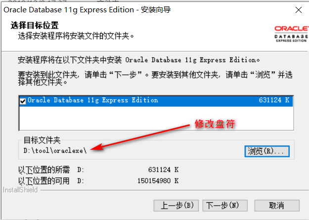

# 1、简介

Oracle数据库系统是目前世界上流行的关系数据库管理系统，系统可移植性好、使用方便、功能强，适用于各类大、中、小、微机环境。它是一种高效率、可靠性好的、适应高吞吐量的数据库方案

## 1.1、优点

1. 可用性强
2. 可扩展性强
3.  数据安全性强
4.  稳定性强

## 1.2、文件结构

数据库的物理存储结构是由一些多种物理文件组成，主要有**数据文件、控制文件、重做日志文件、归档日志文件、参数文件、口令文件、警告文件**等

- 控制文件：存储实例、数据文件及日志文件等信息的二进制文件。alter system set control_files=‘路径’。V$CONTROLFILE。
- 数据文件：存储数据，以.dbf做后缀。一句话：一个表空间对多个数据文件，一个数据文件只对一个表空间。dba_data_files/v$datafile。
- 日志文件：即Redo Log Files和Archivelog Files。记录数据库修改信息。ALTER SYSTEM SWITCH LOGFILE; 。V$LOG。
- 参数文件：记录基本参数。spfile和pfile。
- 警告文件：show parameter background_dump_dest---使用共享服务器连接
- 跟踪文件：show parameter user_dump_dest---使用专用服务器连接 

# 2、Oracle 11gXE

## 2.1、介绍

Oracle是这样介绍XE的：11g XE（Express Edition）简化版是在Oracle11gR2基础之上一个入门级的小体量数据库，免费用于开发/部署与发布，下载很快，使用简单。

**限制**
Oracle是这样解释XE的，一个强大的，性能已经得到证实的业界领先的软件，而且升级简单无需其他成本和复杂的移植。
为什么需要升级，因为这是一个精简版，精简的根本在于如下的限制，正是因为有了这个限制，XE才是真正的精简版而不至于才华横溢。

**资源项    限制**
CPU    一台机器上不超过一CPU
内存    内存不会超过1G
数据    数据库存储的数据量不会超过11G

## 2.2、下载

Oracle 11gXE：https://www.oracle.com/database/technologies/xe-prior-releases.html

instantclient：https://www.oracle.com/database/technologies/instant-client/downloads.html

PLSQL Developer：https://www.allroundautomations.com/registered-plsqldev/

## 3.3、安装

**参考文档：https://my.oschina.net/hongjunzhan/blog/1553158**

**Oracle 11gXE安装**





测试


**PLSQL Developer安装**

**需要先下载instantclient文件**：https://www.oracle.com/database/technologies/instant-client/downloads.html

修改盘符，全部默认安装


# 3、OracleXE和PLSQL Developer的配置

1. 首次使用PL/SQL，以无用户登录状态打开PL/SQL

   

   点击“Cancel”按钮即可无用户登录，打开后选择“tool”工具的Preference菜单项，修改Oracle Home和OCI Library路径。

   

2. 将下载的instantclient_11_1解压到Oracle的根目录下，在解压的根目录下创建tnsname.ora文件。

   

3. 修改tnsname.ora

   

   ```java
   XE =
     (DESCRIPTION =
       (ADDRESS = (PROTOCOL = TCP)(HOST = 127.0.0.1)(PORT = 1521))
       (CONNECT_DATA =
         (SERVER = DEDICATED)
         (SERVICE_NAME = XE)
       )
     )
   
   HLB_prod =
    (DESCRIPTION=
       (ADDRESS=(PROTOCOL=tcp)(HOST=192.168.2.136)(PORT=1521))
       (CONNECT_DATA=
           (SID=PROD)
       )
      )
   ```

# 4、解决Oracle占用8080端口问题

## 4.1、修改

==**oraclexe\app\oracle\product\11.2.0\server**目录下**Database_homepage**和**Get_Started**文件==


## 4.2、使用DBA身份登录Oracle


## 4.3、sql窗口执行以下语句

```sql
begin  
dbms_xdb.sethttpport('8081');  
dbms_xdb.setftpport('0');  
end;
```

## 4.4、注意

- 修改完后最好重启对应的服务

  

- 重启电脑

- 测试是否修改成功

  

# 5、Oracle权限

## 5.1、权限分类

1、系统权限：系统规定用户使用数据库的权限。（系统权限是对用户而言)。
2、实体权限：某种权限用户对其它用户的表或视图的存取权限。（是针对表或视图而言的）。

## 5.2、系统权限

DBA: 拥有全部特权，是系统最高权限，只有DBA才可以创建数据库结构。
RESOURCE:拥有Resource权限的用户只可以创建实体，不可以创建数据库结构。
CONNECT:拥有Connect权限的用户只可以登录Oracle，不可以创建实体，不可以创建数据库结构。
**对于普通用户：授予connect, resource权限。**
**对于DBA管理用户：授予connect，resource, dba权限**。

**常用命令**

1.查看用户被赋予了哪些角色。

select * from user_role_privs;

2.查看当前用户所拥有的全部权限

 Select * from session_privs;    

3.查看用户所授予的系统权限

Select * from user_sys_privs;

4.查看用户所授予的对象权限

select * from user_tab_privs;
5.系统权限回收：系统权限只能由DBA用户回收
Revoke connect, resource from 用户名;

## 5.3、实体权限

select, update, insert, alter, index, delete, all //all包括所有权限
execute //执行存储过程权限
user01:
SQL> grant select, update, insert on product to user02;
SQL> grant all on product to user02;
user02:
SQL> select * from user01.product; 
// 此时user02查user_tables，不包括user01.product这个表，但如果查all_tables则可以查到，因为他可以访问。
将表的操作权限授予全体用户：
SQL> grant all on product to public; // public表示是所有的用户，这里的all权限不包括drop。
实体权限数据字典
SQL> select owner, table_name from all_tables; // 用户可以查询的表
SQL> select table_name from user_tables; // 用户创建的表
SQL> select grantor, table_schema, table_name, privilege from all_tab_privs; // 获权可以存取的表（被授权的）
SQL> select grantee, owner, table_name, privilege from user_tab_privs;  // 授出权限的表(授出的权限)
DBA用户可以操作全体用户的任意基表(无需授权，包括删除)

下面就是oracle的权限一览表：

| 权限                        | 所能实现的操作                                               |
| --------------------------- | ------------------------------------------------------------ |
| 分析                        |                                                              |
| ANALYZE ANY                 | 分析数据库中的任何表、簇或索引                               |
| 审计                        |                                                              |
| AUDIT ANY                   | 审计数据库中的任何模式对象                                   |
| AUDIT SYSTEM                | 启用与停用语句和特权的审计选项                               |
| 簇                          |                                                              |
| CREATE CLUSTER              | 在自有的模式中创建一个簇                                     |
| CREATE ANY CLUSTER          | 在任何一个模式中创建一个簇；操作类似于CREATE ANY TABLE       |
| ALTER ANY CLUSTER           | 改变数据库中的任何一个簇                                     |
| DROP ANY CLUSTER            | 删除数据库中的任何一个簇                                     |
| 数据库                      |                                                              |
| ALTER DATA BASE             | 改变数据库；不管操作系统的特权，经由Oracle把文件添加到操作系统中 |
| 数据库链接                  |                                                              |
| CREATE DATABASE LINK        | 在自有模式中创建专用数据库链接                               |
| 索引                        |                                                              |
| CREATE ANY INDEX            | 在任何表的任何模式中创建一条索引                             |
| ALTER ANY INDEX             | 改变数据库中的任何索引                                       |
| DROP ANY INDEX              | 删除数据库中的任何索引                                       |
| 库                          |                                                              |
| CREATE LIBRARY              | 在自有模式中创建调出库                                       |
| CREATE ANY LIBRARY          | 在任何模式中创建调出库                                       |
| DROP LIBRARY                | 删除自有模式中的调出库                                       |
| DROP ANY LIBRARY            | 删除任何模式中的调出库                                       |
| 特权                        |                                                              |
| GRANT ANY PRIVILEGE         | 授予任何系统特权（不包括对象特权）                           |
| 过程                        |                                                              |
| CREATE PROCEDURE            | 在自有模式中创建存储的过程、函数和包                         |
| CREATE ANY PROCEDURE        | 在任何模式中创建存储的过程、函数和包（这要求用户还要有ALTER ANY TABLE 、BACKUP ANY TA B LE 、DROP ANY TABLE 、SELECT ANY TABLE 、INSERT ANY TABLE 、UPDATE ANY TABLE 、DELETE ANY TABLE 或GRANT ANY TABLE 特权 |
| ALTER ANY PROCEDURE         | 编译任何模式中的任何存储的过程、函数或包                     |
| DROP ANY PROCEDURE          | 删除任何模式中的任何存储的过程、函数或包                     |
| EXECUTE ANY PROCEDURE       | 执行任何过程或函数（独立的或成组的），或在任何模式中引用任何包变量 |
| 环境资源文件                |                                                              |
| CREATE PROFILE              | 创建环境资源文件                                             |
| ALTER PROFILE               | 改变数据库中的任何环境资源文件                               |
| DROP PROFILE                | 删除数据库中的任何环境资源文件                               |
| ALTER RESOURCE COST         | 设置所有的用户会话中使用的资源开销                           |
| 特权                        | 所能实现的操作                                               |
| 公共数据库链接              |                                                              |
| CREATE PUBLIC DATABASE LINK | 创建公共数据库链接                                           |
| DROP PUBLIC DATABASE LINK   | 删除公共数据库链接                                           |
| 公共同义词                  |                                                              |
| CREATE PUBLIC SYNONYM       | 创建公共同义词                                               |
| DROP PUBLIC SYNONYM         | 删除公共同义词                                               |
| 角色                        |                                                              |
| CREATE ROLE                 | 创建角色                                                     |
| ALTER ANY ROLE              | 改变数据库中的任何一个角色                                   |
| DROP ANY ROLE               | 删除数据库中的任何一个角色                                   |
| GRANT ANY ROLE              | 授权数据库中的任何一个角色                                   |
| 回滚段                      |                                                              |
| CREATE ROLLBACK SEGMENT     | 创建回滚段                                                   |
| ALTER ROLLBACK SEGMENT      | 改变回滚段                                                   |
| DROP ROLLBACK SEGMENT       | 删除回滚段                                                   |
| 会话                        |                                                              |
| CREATE SESSION              | 连接到数据库                                                 |
| ALTER SESSION               | 发出A LTER SESSION 语句                                      |
| RESTRICTED SESSION          | 当数据库利用STARTUP RESTRICT 启动时进行连接（OSOPER与 OSDBA角色包含此特权） |
| 序列                        |                                                              |
| CREATE SEQUENCE             | 在自有模式中创建序列                                         |
| CREATE ANY SEQUENCE         | 在任何模式中创建任何序列                                     |
| ALTER ANY SEQUENCE          | 在任何模式中改变任何序列                                     |
| DROP ANY SEQUENCE           | 在任何模式中删除任何序列                                     |
| SELECT ANY SEQUENCE         | 在任何模式中引用任何序列                                     |
| 快照                        |                                                              |
| CREATE SNAPSHOT             | 在自有模式中创建快照（用户还必须具有C R E ATE TA B L E 特权） |
| CREATE ANY SNAPSHOT         | 在任何模式中创建快照（用户还必须具有CREATE ANY TABLE特权）   |
| ALTER SNAPSHOT              | 改变任何模式中的任何快照                                     |
| DROP ANY SNAPSHOT           | 删除任何模式中的任何快照                                     |
| 同义词                      |                                                              |
| CREATE SYNONYM              | 在自有模式中创建同义词                                       |
| CREATE ANY SYNONYM          | 在任何模式中创建任何同义词                                   |
| DROP ANY SYNONYM            | 在任何模式中删除任何同义词                                   |
| 系统                        |                                                              |
| ALTER SYSTEM                | 发出ALTER SYSTEM 语句                                        |
| 表                          |                                                              |
| CREATE TABLE                | 在自有模式中创建表。还使被授权者能在自有模式下的表中创建索引，包 括那些用于完整性约束的索引（被授权者必须有表空间的定额或UNLIMITED TABLESPACE 特权） |
| CREATE ANY TABLE            | 在任何模式中创建表（假如被授权者有CREATE ANY TABLE 特权并在 另一个用户模式中创建了一张表，那么拥有者必须在那个表空间上有空间定额。表的拥有者不必具有CREAT [ANY] TABLE 特权） |
| ALTER ANY TABLE             | 改变任何模式中的任何表并编译任何模式中的任何视图             |
| BACKUP ANY TABLE            | 在任何模式中使用表的导出工具执行一个增量导出操作             |
| DROP ANY TABLE              | 删除或截断任何模式中的任何表                                 |
| LOCK ANY TABLE              | 锁定任何模式中的任何表或视图                                 |
| 特权                        | 所能实现的操作                                               |
| COMMENT ANY TABLE           | 对任何模式中的任何表、视图或列进行注释                       |
| SELECT ANY TABLE            | 对任何模式中的任何表、视图或快照进行查询                     |
| INSERT ANY TABLE            | 把行插入到任何模式中的任何表或视图中                         |
| UPDATE ANY TABLE            | 修改任何模式中的任何表或视图中的行                           |
| DELETE ANY TABLE            | 删除任何模式中的任何表或视图中的行                           |
| 表空间                      |                                                              |
| CREATE TABLESPACE           | 创建表空间；不管用户有何操作系统特权，经由Oracle把文件添加到操 作系统中 |
| ALTER TABLESPACE            | 改变表空间；不管用户有何操作系统特权，经由Oracle把文件添加到操 作系统中 |
| MANAGE TABLESPACE           | 使任何表空间脱机，使任何表空间联机，开始和结束对任何表空间的备份 |
| DROP TABLESPACE             | 删除表空间                                                   |
| UNLIMITED TABLESPACE        | 使用任何没有数量限制的表空间。此特权忽略了所分配的任何具体定额。 假如被取消的话，被授权者的模式对象仍然保留，但是进一步的表空间分配被拒绝，除非这一分配是具体的表空间定额允许的。此系统特权仅可以授予用户，而不授予角色。一般而言，应分配具体的表空间定额，而不授予此系统特权 |
| 事务                        |                                                              |
| FORCE TRANSACTION           | 强迫提交或回滚本地数据库中悬而未决的自有的分布式事务         |
| FORCE ANY TRANSACTION       | 强迫提交或回滚本地数据库中悬而未决的任何分布式事务           |
| 触发器                      |                                                              |
| CREATE TRIGGER              | 在自有模式中创建触发器                                       |
| CREATE ANY TRIGGER          | 在任何模式中创建与任何模式的任何表相关的任何触发器           |
| ALTER ANY TRIGGER           | 启用、停用或编译任何模式中的任何触发器                       |
| DROP ANY TRIGGER            | 删除任何模式中的任何触发器                                   |
| 用户                        |                                                              |
| CREATE ANY USER             | 创建用户；分配任意表空间上的定额，设置缺省和临时表空间，指定一个 环境资源文件（在CREATE USER 语句中） |
| BECOME ANY USER             | 成为另一个用户（这是任何一个执行完全数据库导入的用户所需要的） |
| ALTER USER                  | 改变其他用户：修改任意用户的口令或验证方法，分配表空间定额，设置 缺省或临时表空间，在ALTER USER 语句中指定环境资源文件与缺省角色（不必改变自有口令） |
| DROP USER                   | 删除另一个用户                                               |
| 视图                        |                                                              |
| CREATE VIEW                 | 在自有模式中创建视图                                         |
| CREATE ANY VIEW             | 在任意模式中创建视图。要在另一个用户模式中创建视图，你必须具有 CREATE ANY VIEW 特权，拥用者必须在该视图引用的对象上具有所需的特权 |

   

# 6、表空间及用户

## 6.1、问题

- 创建一个表空间：ts100，初始大小10m
- 创建一个账户：以自己姓名首字母缩写，密码123，属于这个表空间 
-  给“该账户”授予三中权限
-  用“该账户”创建一张表“students” ，包含sid、sname、age、birthday、tel列，只要求有主键约束

## 6.2、答案

```sql
-- 创建表空间
-- 语法：create tablespace 表间名 datafile ‘数据文件的存放位置\数据文件名(xxx.dbf)’ size 表空间大小
create tablespace ts100 datafile 'e:/ts100.dbf' size 10m;

-- 创建用户并指定表空间
-- 语法： create user 用户名 identified by 密码 default tablespace 表空间表;
create user zh identified by 123 default tablespace ts100;

-- 给用户授予权限    connect 登录 resources 资源使用 dba 管理员权限
grant connect,resource,dba to zh;

-- 查看当前用户
show user;

-- 切换用户
-- 语法：conn 用户名/密码
conn zh/123;

-- 查看当前用户
show user;

-- 创建students表
create table students(
   sid number(11,0) primary key,
   sname varchar2(20),
   age number(3,0),
   birthday date,
   tel varchar(11)
);

-- 插入数据
insert into students(sid,sname,age,birthday,tel) values(2018104279,'张恒'，20，to_date('2000-03-17','yyyy-MM-dd'),'17609208151');

-- 查询
select * from students;

```

## 6.3、扩展

```sql
-- 1 创建表空间,在D盘下创建一个student的表空间,要求5mb，可以自动增长的

create  tablespace  student        --创建表空间

datafile  ‘e:\student.dbf’    --指定表空间物理文件的存储位置

size  5M

autoextend  on;  --自动扩展

-- 2 创建用户,创建一个stu的用户，密码是stu,默认的表空间是student,建表t1 （age int）

create user stu   --用户名

identified by stu   --密码

default tablespace student;  --默认表空间
 
--创建表t1
--为了执行命令，在sqlplus只有以分号结尾才可直接执行
create table t1(
    age int
);        

-- 3 授权
-- 授予stu 登陆的权限,授予stu查询scott用户emp表的权限
grant connect to stu;  --授权

alter user scott account unlock;   --解锁

conn scott/tiger;   --切换用户

grant all on emp to stu;     --授权，这里的all 代表增删改查都已获取权限

conn stu/stu;     --切换用户

select * from scott.emp;          --查询成功

select * from dba_users; --查看数据库里面所有用户，前提是你是有dba权限的帐号，如sys,system

select * from all_users;  --查看你能管理的所有用户！

select * from user_users; --查看当前用户信息 ！

/*
连接：conn system/口令;    conn /as sysdba;     conn scott/tiger;(密码默认为tiger,默认未解锁)    conn 用户名/口令;

查看当前用户： show user;

删除用户/表/表空间： drop user 用户名/table 表名/tablespace 表空间;

查看表结构： desc 表名;

修改密码：  create user username identified by newpassword;

授权： grant connect ,resource,dba to username;  

收权 ：revoke connect ,resource,dba from username; 

授予用户创建session的权限，即登陆权限(与connect不同的是session只是一个会话的权限，关闭服务就没用了):

grant create session to 用户名;

授予用户使用表空间的权限：alter user 用户名 quota unlimited on 表空间;
或 alter user 用户名 quota *M on 表空间

授予创建表的权限：grant create table to username;

授予用户插入、删除，更新表的权限: grant insert/drop/update table to username;

注意：即使以上是以管理员登陆并授权但还会提示权限不够，需要指定 "any"   

grant insert/drop/update any table to username;

授予用户查看指定表的权限:grant select on tablename to username;

授予用户查看本用户下所有表的权限:    grant select any table to username;

授予删除/插入/修改表的权限：grant drop/insert /update  on tablename to username;

授予对指定表特定字段的插入和修改权限，注意，只能是insert和update:

grant insert(id)/update(id) on tablename to username;

授予用户alert任意表的权限:　　grant alert all table to username;

操作用户的表：select * from username.tablename;
*/
```

# 7、基本数据类型

## 字符类型

| 数据类型  | 取值范围 |                 说明                  |
| :-------: | :------: | :-----------------------------------: |
| varchar2  |  0~4000  |           可变长度的字符串            |
| nvarchar2 |  0~1000  | 用来存储unicode字符集的变长字符型数据 |
|   char    |  0~2000  |       用于描述定长的字符型数据        |
|   nchar   |  0~1000  | 用来存储unicode字符集的定长字符型数据 |
|   long    |  0~2GB   |         用来存储变长的字符串          |

## 数值类型

|  数据类型   |                             说明                             |
| :---------: | :----------------------------------------------------------: |
| number(p,s) | p最大精度是38位（十进制）p代表的是精度，s代表的是保留小数位数；可以用来存储定长的整数和小数 |
|    float    | 用来存储126位数据（二进制）存储的精度是按二进制计算的，精度范围为二进制的1~126，在转化为二进制时需要乘以0.30103 |
|     int     | 当定义整数类型时，可以直接使用NUMBER的子类型INT，顾名思义：INT用于整型数据。 |

## 日期类型

|    数据类型    |                             说明                             |
| :------------: | :----------------------------------------------------------: |
|      date      |                用来存储日期和时间，精确到秒。                |
|   timestamp    | 显示的日期比date更精确，精确到小数秒，还能够显示上午还是下午 |
| Date默认的格式 |                    DD-MM月-YY(18-7月-07）                    |
|   自定义格式   |              to_date('2018-03-05','yyyy-mm-dd')              |

## RAW类型

|   类型   |                             说明                             |
| :------: | :----------------------------------------------------------: |
|  raw(n)  | n为字节数，必须指定n，用于存储二进制数据，q最多能存储 2000 字节 |
| long raw |        用于存储可变长度的二进制数据，q最多能存储 2 GB        |

## LOB大对象类型

**CLOB：最大为(4GB-1)*数据库块大小，存储单字节或者多字节字符数据，支持事务处理。主要用于存储大型英文字符**

**NCLOB：最大为(4GB-1)*数据库块大小，存储Unicode数据。支持事务处理。主要用于存储大型非英文字符**

**BLOB：最大为(4GB-1)*数据库块大小，存储非结构化二进制数据，支持事务处理。可以被认为是没有字符集语义的比特流，主要存储图像、声音、视频等文件。**

**BFILE：LOB地址指向文件系统上的一个二进制文件，维护目录和文件名。不参与事务处理。只支持只读操作。**

# 8、SQL操作符

## 8.1、算数操作符

- 算术操作符用于执行数值计算

- 可以在SQL语句中使用算术表达式，算术表达式由数值数据类型的列名、数值常量和连接它们的算术操作符组成

- 算术操作符包括加(+)、减(-)、乘(*)、除(/)

- ==取余(mod)==

  ```sql
  -- 5%2
  SQL> select mod(5,2) from test01;
  
    MOD(5,2)
  ----------
           1
           1
  ```

## 8.2、比较操作符

- 比较操作符用于比较两个表达式的值
- 比较操作符包括 =、!=、<、>、<=、>=、BETWEEN…AND、IN、LIKE 和 IS NULL等

## 8.3、逻辑操作符

- 逻辑操作符用于组合多个计较运算的结果以生成一个或真或假的结果。
- 逻辑操作符包括与(AND)、或(OR)和非(NOT)。 

## 8.4、集合操作符

- 集合操作符将两个查询的结果组合成一个结果

- 常见集合操作符：MINUS(减去),INTERSECT(交集)和UNION ALL(并集);

- union 操作符返回两个查询的不重复的所有行。

  ```sql
  -- 查询你年龄在50以上的，单个语句查询会有重复的数据
  SQL> select * from test01 where age > 50
       union
       select * from test01 where age > 60;
  
           ID NAME                  AGE
  ----------- -------------------- ----
            6 张恒3                  60
            7 张恒3                  70
  ```

- intersect 操作符只返回两个查询的公共行。

  ```sql
  SQL> select * from test01 where age > 50
       intersect
       select * from test01 where age > 60;
  
           ID NAME                  AGE
  ----------- -------------------- ----
            7 张恒3                  70
  ```

- minus 操作符返回从第一个查询结果中排除第二个查询中出现的行。

  ```sql
  SQL> select * from test01 where age > 50
       minus
       select * from test01 where age > 60;
  
           ID NAME                  AGE
  ----------- -------------------- ----
            6 张恒3                  60
  ```

## 8.5、连接操作符

- 连接操作符用于将多个字符串或数据值合并成一个字符串

- 通过使用连接操作符可以将表中的多个列合并成逻辑上的一行列

  ```sql
  SQL> select (name||age) 我是一行 from test01;
  
  我是一行
  ------------------------------------------------------------
  张恒20
  admin20
  张恒330
  张恒340
  张恒350
  张恒360
  张恒370
  ```

## 8.6、伪表，伪列

```sql
-- 伪表   dual    虚拟的表，没有实际意义
select sysdate 时间 from dual
-- 伪列   rownum 标识查询结果集的序号
select rownum,t.* from test01 t
-- \\连接符号
select 'hello'||'word' from dual
-- mod取余
select mod(5,2) from dual
```

# 9、事务

## 9.1、什么是事务

- 事务是用户自定义的一个操作序列，包含一组数据库命令，构成单一逻辑工作单元的操作集合
- 这些操作是不可分割的工作逻辑单元，**是执行并发操作的最小控制单元**
- 这些操作**要么全部成功要么全部失败，是一个不可分割的工作单元**
  - 如果某一事物成功，则在该事务中进行的所有数据更改均会提交，成为数据库中的永久组成部分
  - 如果事务遇到错误且必须取消或者回滚，则所有更改均被清除

## 9.2、事务的特性(ACID)

- 原子性（atomicity）。一个事务是一个不可分割的工作单位，事务中包括的操作要么都做，要么都不做。
- 一致性（consistency）。事务必须是使数据库从一个一致性状态变到另一个一致性状态。一致性与原子性是密切相关的。
- 隔离性（isolation）。一个事务的执行不能被其他事务干扰。即一个事务内部的操作及使用的数据对并发的其他事务是隔离的，并发执行的各个事务之间不能互相干扰。
- 持久性（durability）。持久性也称永久性（permanence），指一个事务一旦提交，它对数据库中数据的改变就应该是永久性的。接下来的其他操作或故障不应该对其有任何影响。

## 9.3、Oracle事务

### 9.3.1、事务控制命令

在Oracle中没有开启事务的处理语句，所有的**事务都是隐式开启，用户不得显示使用命令开启事务**，Oracle中第一条修改数据的语句或一些要求事务处理的场合都是事务隐式自动开启，**当用户想终止一个事务时，必须显示使用commit和rollback语句结束**

- commit		提交事务
- savepoint    事务保存点(savepoint a)
- rollback(to)  回滚【回滚到定义的保存点】rollback to a
- set transaction    设置事务的属性

### 9.3.2、事务的结束

下列情况Oracle会认为一个事务的结束

- commit
- rollback ：如果事务中使用了存储点，则只取消存储点后的事务处理，而且事务并不会终止
- ddl：执行时(意味着前面的DML操作已经commit)
- 用户断开连接时(disconn)
- 用户进程意外，这时用户当前的事务被回滚

### 9.3.3、事务保存点

- savepoint：保存点是事务中的一点。用于取消部分事务，当结束事务时，会自动删除该事务所定义的所有保存点。当执行rollback时，通过指定保存点可以回退到指定的点
- 事务的重要操作
  1. 设置保存点			savepoint	a
  2. 取消部分事务        rollback to a
  3. 取消全部事务        rollback

## 9.4、练习

```sql
-- 查询表中数据
SQL> select * from test01;

         ID NAME                  AGE
----------- -------------------- ----
          1 张恒                   20
          2 admin                  20

-- 添加记录，此时自动隐式开启事务
SQL> insert into test01(id,name,age) values(3,'张恒3',30);

1 row inserted

-- 添加成功，此时数据存储在磁盘里，没有提交事务，并没有存储到数据库中
SQL> select * from test01;

         ID NAME                  AGE
----------- -------------------- ----
          1 张恒                   20
          2 admin                  20
          3 张恒3                  30
-- 回滚 取消全部事务，这时事务自动关闭
SQL> rollback;

Rollback complete

-- 再次查询，刚插入的数据没有，已经回滚了
SQL> select * from test01;

         ID NAME                  AGE
----------- -------------------- ----
          1 张恒                   20
          2 admin                  20

-- 插入数据 事务隐式自动开启
SQL> insert into test01(id,name,age) values(3,'张恒3',30);

1 row inserted

-- 定义保存点a
SQL> savepoint a;

Savepoint created

-- 插入数据
SQL> insert into test01(id,name,age) values(4,'张恒4',40);

1 row inserted

-- 定义保存点b
SQL> savepoint b;

Savepoint created

-- 插入数据
SQL> insert into test01(id,name,age) values(5,'张恒5',50);

1 row inserted

-- 定义保存点c
SQL> savepoint c;

Savepoint created

-- 回滚到保存点b，事务自动关闭，保存点b后面的数据被回滚
SQL> rollback to b;

Rollback complete

-- 查询数据
SQL> select * from test01;

         ID NAME                  AGE
----------- -------------------- ----
          1 张恒                   20
          2 admin                  20
          3 张恒3                  30
          4 张恒4                  40

-- 插入数据，事务隐式自动开启
SQL> insert into test01(id,name,age) values(5,'张恒5',50);

1 row inserted

-- 定义保存点a
SQL> savepoint a;

Savepoint created

-- 插入数据
SQL> insert into test01(id,name,age) values(6,'张恒6',60);

1 row inserted

-- 定义保存点b
SQL> savepoint b;

Savepoint created

-- 回滚全部事务
SQL> rollback;

Rollback complete

-- 查询数据
SQL> select * from test01;

         ID NAME                  AGE
----------- -------------------- ----
          1 张恒                   20
          2 admin                  20
          3 张恒3                  30
          4 张恒4                  40

SQL> 
```

# 10、SCOTT系统表练习

## 10.1、介绍

**Oracle中SCOTT用户密码tiger下 emp、dept、bonus、salgrade表**

源码：D:\tool\Oracle\oraclexe\app\oracle\product\11.2.0\server\rdbms\admin\utlsampl.sql

**emp 雇员表**

| 属性英文名 |      属性中文名      |
| :--------: | :------------------: |
|   empno    |       雇员编号       |
|   ename    |       雇员姓名       |
|    job     |       雇员职位       |
|    mgr     | 雇员对应的领导的编号 |
|  hiredate  |    雇员的雇佣日期    |
|    sal     |    雇员的基本工资    |
|    comm    |      奖金或补助      |
|   deptno   |       所在部门       |
**dept 部门表**

| 属性英文名 |  属性中文名  |
| :--------: | :----------: |
|   deptno   |   部门编号   |
|   dname    |   部门名称   |
|    loc     | 部门所在位置 |

**salgrade 工资等级表**

| 属性英文名 |    属性中文名    |
| :--------: | :--------------: |
|   grade    |     工资等级     |
|   losal    | 此等级的最低工资 |
|   hisal    | 此等级的最高工资 |

**bonus 工资表**

| 属性英文名 | 属性中文名 |
| :--------: | :--------: |
| enameename |  雇员名字  |
|    job     |  雇员职位  |
|    sal     |  雇员工资  |
|    comm    |  雇员资金  |

## 10.2、练习

```sql
-- Oracle练习的三个表emp,dept,salgrade,bonus在scott用户下
-- emp员工表(empno员工号/ename员工姓名/job工作/mgr上级编号/
--              hiredate受雇日期/sal薪金/comm佣金/deptno部门编号)
-- dept部门表(deptno部门编号/dname部门名称/loc部门所在位置)
-- salgrade工资等级表(grade工资等级/losal此等级的最低工资/hisal此等级的最高工资)
-- bonus 工资表(ename雇员名字/job雇员职位/sal雇员工资/comm雇员资金)
-- 1.显示部门号为10 的部门名、员工名和工资.
select d.dname 部门名,e.ename 员工名,e.sal 工资
from scott.emp e,scott.dept d
where e.deptno = d.deptno and e.deptno = 10;
-- 2.显示各个员工的姓名，工资，及其工资的级别
select e.ename 姓名,e.sal 工资,s.grade 工资级别
from scott.emp e,scott.salgrade s
where e.sal between s.losal and s.hisal
-- 3.显示员工BLAKE 的上级领导的姓名.
-- BLAKE 的上级领导的编号
select e.mgr from scott.emp e where e.ename = 'BLAKE';

select e.ename
from scott.emp e
where e.empno = (select e.mgr from scott.emp e where e.ename = 'BLAKE');
-- 4.显示与scott同一部门的所有员工.
select deptno from scott.emp where ename = 'SCOTT'

select *
from scott.emp e
where e.deptno = (select deptno from scott.emp where ename = 'SCOTT')


-- 5. 显示工资比部门 30 的所有员工的工资高的员工的姓名、工资和部门号.
-- 查询部门30最高的工资
select max(sal) from scott.emp e where e.deptno = 30;

select e.ename 姓名,e.sal 工资,e.deptno 部门号
from scott.emp e 
where e.sal > (select max(sal) from scott.emp e where e.deptno = 30)
-- 6. 查询与smith 部门和岗位完全相同的所有雇员. 
-- 查询SMITH的部门和岗位
select d.deptno deptno,d.loc loc
from scott.emp e,scott.dept d
where e.ename = 'SMITH' and e.deptno = d.deptno

select e.* 
from scott.emp e,scott.dept d,(select d.deptno deptno,d.loc loc from scott.emp e,scott.dept d where e.ename = 'SMITH' and e.deptno = d.deptno) d2
where e.deptno = d.deptno and d2.deptno = d.deptno and d2.loc = d.loc
-- 7. 显示高于部门平均工资的员工的信息.
-- 查询每个部门的平均工资
select deptno deptno,avg(sal) avgsal from scott.emp group by deptno

select e.*,avgs.avgsal
from scott.emp e,(select deptno deptno,avg(sal) avgsal from scott.emp group by deptno) avgs
where e.deptno = avgs.deptno and e.sal > avgs.avgsal
-- 8. 查询部门工资总和高于员工工资总和1/3的部门名及工资总和
-- 查询每个部门工资总和
select deptno, sum(sal) dsum from scott.emp group by deptno
-- 查询部门名
select d2.deptno,d.dname,d2.dsum from scott.dept d,(select deptno, sum(sal) dsum from scott.emp group by deptno) d2 where d.deptno = d2.deptno

select d3.dname,d3.dsum
from (select d2.deptno,d.dname,d2.dsum from scott.dept d,(select deptno, sum(sal) dsum from scott.emp group by deptno) d2 where d.deptno = d2.deptno) d3
where d3.dsum > (select sum(sal)/3 from scott.emp)
```

# 11、常用函数

## 11.1、日期函数

**日期函数对日期值进行运算，并生成日期数据类型或数值类型的结果**

- sysdate：查询当前时间

  ```sql
  SQL> select sysdate from dual;
  
  SYSDATE
  -----------
  2020/2/20 10:44:55
  ```

- add_months(d,<i>)：日期d，前后第i个月

  ```sql
  SQL> select add_months(sysdate,-1) from dual;
  
  ADD_MONTHS(SYSDATE,-1)
  ----------------------
  2020/1/20 10:50:09
  
  SQL> select add_months(sysdate,1) from dual;
  
  ADD_MONTHS(SYSDATE,1)
  ---------------------
  2020/3/20 10:50:24
  ```

- months_between(sysdate,datetime)：两个时间相差几个月

  ```sql
  SQL> select months_between(sysdate,to_date('2020-01-15','yyyy-mm-dd')) from dual;
  
  MONTHS_BETWEEN(SYSDATE,TO_DATE('2020-01-15','YYYY-MM-DD'))
  ----------------------------------------------------------
                                            1.17593525985663
  ```

- last_day(d)：当前月份的最后一天

  ```sql
  SQL> select last_day(sysdate) from dual;
  
  LAST_DAY(SYSDATE)
  -----------------
  2020/2/29 10:57:0
  
  SQL> select last_day(to_date('2020-01-15','yyyy-mm-dd')) from dual;
  
  LAST_DAY(TO_DATE('2020-01-15','YYYY-MM-DD'))
  --------------------------------------------
  2020/1/31
  ```

- next_day(d,day)：当前时间的下一个星期几的时间。day：参数可以时1-7，星期天-星期六

  ```sql
  SQL> select next_day(sysdate,1) from dual;
  
  NEXT_DAY(SYSDATE,1)
  -------------------
  2020/2/23 11:01:44
  ```

## 11.2、Round，trunc函数

- Round(number,[decimals])：截取数字
  - number：待做截取处理的数值
  - decimals：指明要保留小数点后面的位数。忽略所截去的小数点部分，并**四舍五入。如果是负数则表示从小数点开启左边的位数，相应整数数字用0填充，小数被去掉**

  ```sql
  SQL> select round(12345.6789,2) from dual;
  
  ROUND(12345.6789,2)
  -------------------
             12345.68
  
  SQL> select round(12345.6789,0) from dual;
  
  ROUND(12345.6789,0)
  -------------------
                12346
  
  SQL> select round(12345.6789,-2) from dual;
  
  ROUND(12345.6789,-2)
  --------------------
                 12300
  SQL> select round(12345.6789) from dual;
  
  ROUND(12345.6789)
  -----------------
              12346
  ```

- trunc(number,[decimals])
  - 和round用法一样，**没有四舍五入**

  ```sql
  SQL> select trunc(12345.6789,2) from dual;
  
  TRUNC(12345.6789,2)
  -------------------
             12345.67
  
  SQL> select trunc(12345.6789,0) from dual;
  
  TRUNC(12345.6789,0)
  -------------------
                12345
  
  SQL> select trunc(12345.6789,-2) from dual;
  
  TRUNC(12345.6789,-2)
  --------------------
                 12300
  
  SQL> select trunc(12345.6789) from dual;
  
  TRUNC(12345.6789)
  -----------------
              12345
  ```

## 11.3、对日期进行Round

**可以使用 ROUND 和 TRUNC 函数对日期四舍五入。**

```sql
CC          四舍五入年的后两位
SCC         四舍五入年的后两位
SYYYY       四舍五入年
YYYY        四舍五入年
YEAR        四舍五入年
SYEAR       四舍五入年
YYY         四舍五入年
YY          四舍五入年
Y           四舍五入年
IYYY        四舍五入ISO年
IY          四舍五入ISO年
IY          四舍五入ISO年
I           四舍五入ISO年
Q           四舍五入季度
MONTH       四舍五入月
MON         四舍五入月
MM          四舍五入月
RM          四舍五入月
WW          四舍五入每年的第一个星期
IW          四舍五入每月的第一个ISO星期
W           四舍五入每月的第一个星期
DDD         四舍五入日
DD          四舍五入日
J           四舍五入日
DAY         四舍五入日每星期的第一个天
DY          四舍五入日每星期的第一个天
D           四舍五入日每星期的第一个天
HH          四舍五入小时
HH12        四舍五入小时
HH24        四舍五入小时
MI          四舍五入分钟
```

```sql
-- 对年份四舍五入
SQL> select round(to_date('1984-07-01','yyyy-mm-dd'),'YYYY') from dual;

ROUND(TO_DATE('1984-07-01','YYYY-MM-DD'),'YYYY')
------------------------------------------------
1985/1/1
```

## 11.4、字符函数

- initcap(char) ：首字母大写，其余全部小写

  ```sql
  SQL> select initcap('saAXzax') from dual;
  
  INITCAP('SAAXZAX')
  ------------------
  Saaxzax
  ```

- lower(char) ：全部小写

  ```sql
  SQL> select lower('saAXzax') from dual;
  
  LOWER('SAAXZAX')
  ----------------
  saaxzax
  ```

- upper(char)：全部大写

  ```sql
  SQL> select upper('saAXzax') from dual;
  
  UPPER('SAAXZAX')
  ----------------
  SAAXZAX
  ```

- ltrim(c1,c2) ：函数是按照c2中的字符一个一个的截断c1的字符，而且还是从左开始执行的，一旦遇到c2中的字符，c1中的字符都会相对应的截断，一直到c1的字符没有c2的字符为止才会结束。

  ```sql
  SQL> select ltrim('ZXCvbnmASD','ZXC') from dual;
  
  LTRIM('ZXCVBNMASD','ZXC')
  -------------------------
  vbnmASD
  
  SQL> select ltrim('ZXCvbnmASD','XC') from dual;
  
  LTRIM('ZXCVBNMASD','XC')
  ------------------------
  ZXCvbnmASD
  SQL> select ltrim('abbcbddcc','abc') from dual;
  
  LTRIM('ABBCBDDCC','ABC')
  ------------------------
  ddcc
  ```

- rtrim(c1,c2) ：删除右边出现的字符串，和ltrim用呀一样

  ```sql
  SQL> select rtrim('abbcbddcc','abc') from dual;
  
  RTRIM('ABBCBDDCC','ABC')
  ------------------------
  abbcbdd
  ```

- lpad( string, padded_length, [ pad_string ])：在列的左边粘贴字符

  - string：准备被填充的字符串
  - padded_length：填充之后的字符串长度，也就是该函数返回的字符串长度，如果这个数量比原字符串的长度要短，lpad函数将会把字符串截取成从左到右的n个字符
  - pad_string：填充字符串，是个可选参数，这个字符串是要粘贴到string的左边，如果这个参数未写，lpad函数将会在string的左边粘贴空格

  ```sql
  SQL> select lpad('abc',10,'X') from dual;
  
  LPAD('ABC',10,'X')
  ------------------
  XXXXXXXabc
  
  SQL> select lpad('abc',2,'X') from dual;
  
  LPAD('ABC',2,'X')
  -----------------
  ab
  
  SQL> select lpad('abc',10,'Xyx') from dual;
  
  LPAD('ABC',10,'XYX')
  --------------------
  XyxXyxXabc
  ```

- rpad( string, padded_length, [ pad_string ])：在列的右边粘贴字符。与lpad相反

- replace(char, searchstring,[rep string]) ：替换字符

  ```sql
  SQL> select replace('abc','c','123') from dual;
  
  REPLACE('ABC','C','123')
  ------------------------
  ab123
  
  ```

- substr (char, m, n) ：从第m个字符开始，保留n个，如果m是负数，就从右边开始

  ```sql
  SQL> select substr('abcder',3,5) from dual;
  
  SUBSTR('ABCDER',3,5)
  --------------------
  cder
  
  SQL> select substr('abcder',3,1) from dual;
  
  SUBSTR('ABCDER',3,1)
  --------------------
  c
  
  SQL> select substr('abcder',-1,1) from dual;
  
  SUBSTR('ABCDER',-1,1)
  ---------------------
  r
  ```

- concat (expr1, expr2) ：合并字符串

  ```sql
  SQL> select concat('aaa','bbb') from dual;
  
  CONCAT('AAA','BBB')
  -------------------
  aaabbb
  ```

- length：字符串长度

  ```sql
  SQL> select length('aaa') from dual;
  
  LENGTH('AAA')
  -------------
              3
  ```

## 11.5、数字函数

- abs(n)：绝对值

  ```sql
  SQL> select abs(-10) from dual;
  
    ABS(-10)
  ----------
          10
  ```

- ceil(n)：向上取整

  ```sql
  SQL> select ceil(-10.12) from dual;
  
  CEIL(-10.12)
  ------------
           -10
  
  SQL> select ceil(10.12) from dual;
  
  CEIL(10.12)
  -----------
           11
  ```

- floor(n)：向下取整

  ```sql
  SQL> select floor(10.56) from dual;
  
  FLOOR(10.56)
  ------------
            10
  
  SQL> select floor(-10.56) from dual;
  
  FLOOR(-10.56)
  -------------
            -11
  ```

- power(m,n)：计算m的n次方

  ```sql
  
  SQL> select power(4,0) from dual;
  
  POWER(4,0)
  ----------
           1
  
  SQL> select power(2,3) from dual;
  
  POWER(2,3)
  ----------
           8
  ```

- mod(m,n)：取余

  ```sql
  SQL> select mod(4,3) from dual;
  
    MOD(4,3)
  ----------
           1
  ```

- round(m,n)：截取数字，并四舍五入

  ```sql
  SQL> select round(4.32141,3) from dual;
  
  ROUND(4.32141,3)
  ----------------
             4.321
  ```

- sqrt(n)：开平方根

  ```sql
  SQL> select sqrt(16) from dual;
  
    SQRT(16)
  ----------
           4
  ```

## 11.6、转换函数

- to_char：将日期转换字符串

  ```sql
  SQL> select to_char(sysdate,'yyyy"年"mm"月"dd"日"') from dual;
  
  TO_CHAR(SYSDATE,'YYYY"年"MM"月"DD"日"')
  ------------------------------------
  2020年02月20日
  ```

- to_date：将字符串转换为日期

  ```sql
  SQL> select to_date('2020-02-20','yyyy-mm-dd') from dual;
  
  TO_DATE('2020-02-20','YYYY-MM-DD')
  ----------------------------------
  2020/2/20
  ```

## 11.7、分组函数

- avg：平均值
- min：最小
- max：最大
- sum：和
- count：统计
-  group by：用于将信息划分为更小的组，每一组行返回针对该组的单个结果
-  having：用于指定 GROUP BY 子句检索行的条件

## 11.8、分析函数

- over(partition by ... order by ...)
  - over()在什么条件之上; 
  - partition by 按哪个字段划分组；
  - order by 按哪个字段排序；

**排序**

- asc：正序。由小到大
- desc：倒序。由大到小

- row_number：返回连续的排位，不论值是否相等

  ```sql
  SQL> select row_number() over(order by e.sal) PX,e.* from scott.emp e;
  
          PX EMPNO ENAME      JOB         MGR HIREDATE          SAL      COMM DEPTNO
  ---------- ----- ---------- --------- ----- ----------- --------- --------- ------
           1  7369 SMITH      CLERK      7902 1980/12/17     800.00               20
           2  7900 JAMES      CLERK      7698 1981/12/3      950.00               30
           3  7876 ADAMS      CLERK      7788 1987/5/23     1100.00               20
           4  7521 WARD       SALESMAN   7698 1981/2/22     1250.00    500.00     30
           5  7654 MARTIN     SALESMAN   7698 1981/9/28     1250.00   1400.00     30
           6  7934 MILLER     CLERK      7782 1982/1/23     1300.00               10
           7  7844 TURNER     SALESMAN   7698 1981/9/8      1500.00      0.00     30
           8  7499 ALLEN      SALESMAN   7698 1981/2/20     1600.00    300.00     30
           9  7782 CLARK      MANAGER    7839 1981/6/9      2450.00               10
          10  7698 BLAKE      MANAGER    7839 1981/5/1      2850.00               30
          11  7566 JONES      MANAGER    7839 1981/4/2      2975.00               20
          12  7902 FORD       ANALYST    7566 1981/12/3     3000.00               20
          13  7788 SCOTT      ANALYST    7566 1987/4/19     3000.00               20
          14  7839 KING       PRESIDENT       1981/11/17    5000.00               10
  
  14 rows selected
  ```

- rank：具有相等值的行排位相同，序数随后跳跃

  ```sql
  SQL> select rank() over(order by e.sal) PX,e.* from scott.emp e;
  
          PX EMPNO ENAME      JOB         MGR HIREDATE          SAL      COMM DEPTNO
  ---------- ----- ---------- --------- ----- ----------- --------- --------- ------
           1  7369 SMITH      CLERK      7902 1980/12/17     800.00               20
           2  7900 JAMES      CLERK      7698 1981/12/3      950.00               30
           3  7876 ADAMS      CLERK      7788 1987/5/23     1100.00               20
           4  7521 WARD       SALESMAN   7698 1981/2/22     1250.00    500.00     30
           4  7654 MARTIN     SALESMAN   7698 1981/9/28     1250.00   1400.00     30
           6  7934 MILLER     CLERK      7782 1982/1/23     1300.00               10
           7  7844 TURNER     SALESMAN   7698 1981/9/8      1500.00      0.00     30
           8  7499 ALLEN      SALESMAN   7698 1981/2/20     1600.00    300.00     30
           9  7782 CLARK      MANAGER    7839 1981/6/9      2450.00               10
          10  7698 BLAKE      MANAGER    7839 1981/5/1      2850.00               30
          11  7566 JONES      MANAGER    7839 1981/4/2      2975.00               20
          12  7902 FORD       ANALYST    7566 1981/12/3     3000.00               20
          12  7788 SCOTT      ANALYST    7566 1987/4/19     3000.00               20
          14  7839 KING       PRESIDENT       1981/11/17    5000.00               10
  
  14 rows selected
  ```

- dense_rank：具有相等值的行排位相同，序号是连续的

  ```sql
  SQL> select dense_rank() over(order by e.sal) PX,e.* from scott.emp e;
  
          PX EMPNO ENAME      JOB         MGR HIREDATE          SAL      COMM DEPTNO
  ---------- ----- ---------- --------- ----- ----------- --------- --------- ------
           1  7369 SMITH      CLERK      7902 1980/12/17     800.00               20
           2  7900 JAMES      CLERK      7698 1981/12/3      950.00               30
           3  7876 ADAMS      CLERK      7788 1987/5/23     1100.00               20
           4  7521 WARD       SALESMAN   7698 1981/2/22     1250.00    500.00     30
           4  7654 MARTIN     SALESMAN   7698 1981/9/28     1250.00   1400.00     30
           5  7934 MILLER     CLERK      7782 1982/1/23     1300.00               10
           6  7844 TURNER     SALESMAN   7698 1981/9/8      1500.00      0.00     30
           7  7499 ALLEN      SALESMAN   7698 1981/2/20     1600.00    300.00     30
           8  7782 CLARK      MANAGER    7839 1981/6/9      2450.00               10
           9  7698 BLAKE      MANAGER    7839 1981/5/1      2850.00               30
          10  7566 JONES      MANAGER    7839 1981/4/2      2975.00               20
          11  7902 FORD       ANALYST    7566 1981/12/3     3000.00               20
          11  7788 SCOTT      ANALYST    7566 1987/4/19     3000.00               20
          12  7839 KING       PRESIDENT       1981/11/17    5000.00               10
  
  14 rows selected
  ```


# 12、同义词

**Oracle synonym  同义词是数据库当前用户通过给另外一个用户的对象创建一个别名，然后可以通过对别名进行查询和操作，等价于直接操作该数据库对象。Oracle同义词常常是给表、视图、函数、过程、包等制定别名，可以通过CREATE 命令进行创建、ALTER 命令进行修改、DROP 命令执行删除操作。 **

## 12.1、同义词的优点

- 简化SQL语句
- 隐藏对象的名称和所有者
- 提供对对象的公共访问

## 12.2、类型

- 公有同义词：只能具有DBA用户才能进行创建，所有用户都可以访问的。
- 私有同义词：只能当前用户可以访问，前提：当前用户具有create synonym 权限。

## 12.3、创建

**普通用户不能创建同义词，同义词的创建只能由管理员创建，或者拥有dba权限的用户创建**

**普通用户创建同义词，需要dba用户授权，同义词创建权限**

### 13.3.1、dba用户创建

**语法结构：**

==CREATE [OR REPLACE] [PUBLIC] SYNONYM [当前用户.]synonym_name FOR [其他用户.]object_name;==

**解析：**

1、create [or replace] 命令create建表命令一样，当当前用户下同义词对象名已经存在的时候，就会删除原来的同义词，用新的同义词替代上。

2、[public]：创建的是公有同义词，在实际开发过程中比较少用，因为创建就代表着任何用户都可以通过自己用户访问操作该对象，一般我们访问其他用户对象时，需要该用户进行授权给我们。

3、用户名.object_name：oralce用户对象的权限都是自己用户进行管理的，需要其他用户的某个对象的操作权限，只能通过对象拥有者（用户）进行授权给当前用户。或者当前用户具有系统管理员权限（DBA），即可通过用户名.object_name操作该对象。

```sql
-- dba用户创建私有同义词
create synonym zh.emp for Beloved.emp;

-- dba用户创建共有同义词
create public synonym emp for Beloved.emp;
```

### 13.3.2、普通用户创建

**dba用户授权**

==语法：grant create  [public] synonym to 用户名==

**普通用户创建同义词**

==语法：create [public] synonym 同义词名 for 用户.表名;==

```sql
-- dba用户授权私有同义词权限
grant create synonym to zh;

-- dba用户授权共有同义词权限
grant create public synonym to zh;

-- 普通用户创建私有同义词
create synonym emp for Beloved.emp;

-- 普通用户创建共有同义词
create public synonym emp for Beloved.emp;
```

## 12.4、删除

**同义词删除只能通过同义词拥有者的用户或者具有DBA权限的用户才能删除。**

**语法结构：**

==DROP [PUBLIC] SYNONYM [用户.]sysnonym_name;==

### 12.4.1、普通用户删除

**普通用户只能删除自己的私有同义词**

```sql
-- 普通用户删除私有同义词
drop synonym emp;
```

### 12.4.2、dba用户删除

**dba用户可以删除所有用户的私有同义词，也可以删除共有同义词**

```sql
-- dba用户删除私有同义词
drop synonym zh.emp;

-- dba用户删除共有同义词
drop public synonym emp;
```

### 12.4.3、dba用户删除普通用户创建同义词权限

```sql
-- 删除创建私有同义词权限
revoke create synonym from zh;

-- 删除创建共有同义词权限
revoke create public synonym from zh;
```

# 13、序列

## 13.1、序列定义

**序列(SEQUENCE)是序列号生成器，可以为表中的行自动生成序列号，产生一组等间隔的数值(类型为数字)。不占用磁盘空间，占用内存。其主要用途是生成表的主键值，可以在插入语句中引用，也可以通过查询检查当前值，或使序列增至下一个值。**

## 13.2、创建序列

**创建序列需要CREATE SEQUENCE系统权限。**

序列的创建语法如下：

　　CREATE SEQUENCE 序列名

　　[INCREMENT BY n]

　　[START WITH n]

　　[{MAXVALUE/ MINVALUE n| NOMAXVALUE}]

　　[{CYCLE|NOCYCLE}]

　　[{CACHE n| NOCACHE}];

  其中：

1) **INCREMENT BY用于定义序列的步长，如果省略，则默认为1，如果出现负值，则代表Oracle序列的值是按照此步长递减的。**

2) **START WITH 定义序列的初始值**(即产生的第一个值)，**默认为1。**

3) **MAXVALUE 定义序列生成器能产生的最大值**。选项NOMAXVALUE是默认选项，代表没有最大值定义，这时对于递增Oracle序列，系统能够产生的最大值是10的27次方;对于递减序列，最大值是-1。

4) **MINVALUE定义序列生成器能产生的最小值**。选项NOMAXVALUE是默认选项，代表没有最小值定义，这时对于递减序列，系统能够产生的最小值是?10的26次方;对于递增序列，最小值是1。

5)  **CYCLE**和**NOCYCLE** 表示当序列生成器的**值达到限制值后是否循环**。**CYCLE代表循环**，**NOCYCLE代表不循环**。如果循环，则当递增序列达到最大值时，循环到最小值;对于递减序列达到最小值时，循环到最大值。**如果不循环，达到限制值后，继续产生新值就会发生错误。**

6) **CACHE(缓冲)**定义存放序列的内存块的大小，**默认为20**。NOCACHE表示不对序列进行内存缓冲。对序列进行内存缓冲，可以改善序列的性能。

大量语句发生请求，申请序列时，为了避免序列在运用层实现序列而引起的性能瓶颈。Oracle序列允许将序列提前生成 cache  x个先存入内存，在发生大量申请序列语句时，可直接到运行最快的内存中去得到序列。但cache个数也不能设置太大，因为在数据库重启时，会清空内存信息，预存在内存中的序列会丢失，当数据库再次启动后，序列从上次内存中最大的序列号+1 开始存入cache x个。这种情况也能会在数据库关闭时也会导致序号不连续。

7) **NEXTVAL 返回序列中下一个有效的值**，任何用户都可以引用。

8) **CURRVAL 中存放序列的当前值**,NEXTVAL 应在 CURRVAL 之前指定 ，二者应同时有效。

```sql
-- 查看用户是否有create sequence权限
select * from session_privs;

-- 创建升序序列
create sequence seq1
start with 1
increment by 1;

-- 创建降序序列
create sequence seq2
start with -1
increment by -1;

SQL> select seq1.currval,seq1.nextval from dual;

   CURRVAL    NEXTVAL
---------- ----------
         1          1

SQL> select seq1.currval,seq1.nextval from dual;

   CURRVAL    NEXTVAL
---------- ----------
         2          2
         
SQL> select seq2.currval,seq2.nextval from dual;

   CURRVAL    NEXTVAL
---------- ----------
        -1         -1

SQL> select seq2.currval,seq2.nextval from dual;

   CURRVAL    NEXTVAL
---------- ----------
        -2         -2
```

## 13.3、序列的使用

调用NEXTVAL将生成序列中的下一个序列号，调用时要指出序列名，即用以下方式调用: **序列名.NEXTVAL**

CURRVAL用于产生序列的当前值，无论调用多少次都不会产生序列的下一个值。如果序列还没有通过调NEXTVAL产生过序列的下一个值，先引用CURRVAL没有意义。调用CURRVAL的方法同上，要指出序列名，即用以下方式调用:**序列名.CURRVAL**

```sql
SQL> insert into students values(seq1.nextval,'张三',22,to_date('1999-02-03','yyyy-mm-dd'),'123456789');

1 row inserted

SQL> select * from students;

         SID SNAME                 AGE BIRTHDAY    TEL
------------ -------------------- ---- ----------- -----------
           4 张三                   22 1999/2/3    123456789
           1 张恒                   20 2000/3/17   17609208151

SQL> select seq1.nextval from dual;

   NEXTVAL
----------
         5

SQL> insert into students values(seq1.nextval,'李四',22,to_date('2005-02-03','yyyy-mm-dd'),'123456789');

1 row inserted

SQL> select * from students;

         SID SNAME                 AGE BIRTHDAY    TEL
------------ -------------------- ---- ----------- -----------
           4 张三                   22 1999/2/3    123456789
           6 李四                   22 2005/2/3    123456789
           1 张恒                   20 2000/3/17   17609208151
```

## 13.4、序列的修改

- 必须是序列的拥有者或对序列有 ALTER any sequence权限

- 只有将来的序列值会被改变

- 改变序列的初始值只能通过删除序列之后重建序列的方法实现

```sql
SQL> alter sequence seq1 start with 10;
alter sequence seq1 start with 10
-- 初始值无法修改
ORA-02283: 无法变更启动序列号

SQL> 
SQL> -- 修改序列步长为3最大值10不循环
SQL> alter sequence seq1 increment by 3 maxvalue 10 nocycle;

Sequence altered


SQL> select seq1.currval,seq1.nextval from dual;

   CURRVAL    NEXTVAL
---------- ----------
         9          9

SQL> select seq1.currval,seq1.nextval from dual;
select seq1.currval,seq1.nextval from dual

-- 当序列到达最大值，不循环的情况下报错
ORA-08004: 序列 SEQ1.NEXTVAL exceeds MAXVALUE 无法实例化
```

## 13.5、查询序列

- 通过数据字典USER_OBJECTS可以查看用户拥有的序列。

  ```sql
  SQL> select object_name,object_type from user_objects;
  
  OBJECT_NAME                OBJECT_TYPE
  ---------------------------------------------------
  SYS_C006997                INDEX
  STUDENTS                   TABLE
  SEQ2                       SEQUENCE
  SEQ1                       SEQUENCE
  
  ```

- 通过数据字典USER_SEQUENCES可以查看序列的设置。

  ```sql
  SQL> select * from user_sequences;
  
  SEQUENCE_NAME MIN_VALUE MAX_VALUE INCREMENT_BY CYCLE_FLAG ORDER_FLAG CACHE_SIZE LAST_NUMBER
  ------------------------------ ---------- ---------- ------------ ---------- ------
  SEQ1         1         10            3 N          N                  20          12
  SEQ2      -1E27         -1           -1 N          N                  20        -21
  ```

## 13.6、删除序列

```sql
SQL> drop sequence seq1;

Sequence dropped

SQL> drop sequence seq2;

Sequence dropped
```

# 14、视图

- 视图以经过定制的方式显示来自一个或多个表的数据

- 视图可以视为“虚拟表”或“存储的查询”

- 创建视图所依据的表称为“基表”

## 14.1、优点

- 提供了另外一种级别的表安全性

- 隐藏的数据的复杂性

- 简化的用户的SQL命令

- 隔离基表结构的改变

- 通过重命名列，从另一个角度提供数据

## 14.2、视图与表的区别

- 表占磁盘空间，视图不占

- 视图不能加索引

- 视图可以简化操作

- 提高安全性（可以给不同用户分配不同的视图）

## 14.3、视图的创建

**要在当前方案中创建视图, 用户必须具有create view系统权限; 要在其他方案中创建视图, 用户必须具有create any view系统权限. 视图的功能取决于视图拥有者的权限**

**语法:** 

==create [ or replace ] [ force ] view [schema.]view_name
           [ (column1,column2,...) ]
           as 
           select ...
           [ with check option ]            [ constraint constraint_name ]
           [ with read only ];==

**解析**
 **or replace:** 如果存在同名的视图, 则使用新视图"替代"已有的视图
 **force:** "强制"创建视图,不考虑基表是否存在,也不考虑是否具有使用基表的权限
 **column1,column2,...**：**视图的列名, 列名的个数必须与select查询中列的个数相同; 如果select查询包含函数或表达式, 则必须为其定义列名.此时, 既可以用column1, column2指定列名, 也可以在select查询中指定列名.**

**with check option:** *指定对视图执行的dml操作必须满足“视图子查询”的条件即,对通过视图进行的增删改操作进行"检查",要求增删改操作的数据, 必须是**select查询所能查询到的数据**,否则不允许操作并返回错误提示. 默认情况下, 在增删改之前"并不会检查"这些行是否能被select查询检索到. 
 **with read only：**创建的视图只能用于查询数据, 而不能用于更改数据.

```sql
-- 查询用户是否具有create view权限
 Select * from session_privs;  
 
-- 没有权限切换dba用户给用户授权
conn sys/123456 @XE as sysdba;
grant create view to zh;
conn zh/123456 @XE;

 
-- 创建简单的的视图
create or replace view v1(id,name,age) as
select sid,sname,age from students;

-- 查询视图结构
desc v1;

-- 对试图进行DML操作
select * from v1;
insert into v1 values(5,'aaa',23);
update v1 set age = 25 where id = 5;
delete v1 where id = 5;


SQL> insert into v1 values(5,'aaa',23);

1 row inserted

SQL> select * from v1;

          ID NAME                  AGE
------------ -------------------- ----
           4 张三                   22
           6 李四                   22
           5 aaa                    23
           1 张恒                   20

SQL> select * from students;

         SID SNAME                 AGE BIRTHDAY    TEL
------------ -------------------- ---- ----------- -----------
           4 张三                   22 1999/2/3    123456789
           6 李四                   22 2005/2/3    123456789
           5 aaa                    23             
           1 张恒                   20 2000/3/17   17609208151

SQL> update v1 set age = 25 where id = 5;

1 row updated

SQL> select * from students;

         SID SNAME                 AGE BIRTHDAY    TEL
------------ -------------------- ---- ----------- -----------
           4 张三                   22 1999/2/3    123456789
           6 李四                   22 2005/2/3    123456789
           5 aaa                    25             
           1 张恒                   20 2000/3/17   17609208151

SQL> delete v1 where id = 5;

1 row deleted

SQL> select * from students;

         SID SNAME                 AGE BIRTHDAY    TEL
------------ -------------------- ---- ----------- -----------
           4 张三                   22 1999/2/3    123456789
           6 李四                   22 2005/2/3    123456789
           1 张恒                   20 2000/3/17   17609208151
```

==对试图进行DML操作，基表也会发生改变==

## 14.4、创建只读视图

```sql
-- 创建只读视图 使用or replace替换之前的视图
create or replace view v1(id,name,age) as
select sid,sname,age from students
with read only;

SQL> create or replace view v1(id,name,age) as
  2  select sid,sname,age from students
  3  with read only;

View created

SQL> select * from v1;

          ID NAME                  AGE
------------ -------------------- ----
           4 张三                   22
           6 李四                   22
           1 张恒                   20

SQL> insert into v1 values(5,'aaa',23);
insert into v1 values(5,'aaa',23)

ORA-42399: 无法对只读视图执行 DML 操作
```

==无法对只读视图执行 DML 操作==

## 14.5、创建检查约束视图with check option

```sql
create or replace view v1(id,name,age) as
select sid,sname,age from students where age = 20
with check option;

SQL> create or replace view v1(id,name,age) as
  2  select sid,sname,age from students where age = 20
  3  with check option;

View created

SQL> select * from v1;

          ID NAME                  AGE
------------ -------------------- ----
           1 张恒                   20

SQL> insert into v1 values(5,'aaa',23);
insert into v1 values(5,'aaa',23)

ORA-01402: 视图 WITH CHECK OPTION where 子句违规

SQL> insert into v1 values(5,'aaa',20);

1 row inserted
```

**创建检查视图：对通过视图进行的增删改操作进行检查，要求增删改操作的数据必须是select查询所能查询到的数据**

age=23不在查询范围内，**违反检查约束**,所以无法插入；

## 14.6、连接视图

**连接视图是指基于多个表所创建的视图，即，定义视图的查询是一个连接查询。 主要目的是为了简化连接查询；**

### 14.6.1、创建

```sql
-- 创建连接视图
create or replace view v1(sid,sname,age,tname) as
select s.sid,s.sname,s.age,t.tname from students s,teachers t where s.tid = t.tid

SQL> create or replace view v1(sid,sname,age,tname) as
  2  select s.sid,s.sname,s.age,t.tname from students s,teachers t where s.tid = t.tid
  3  ;

View created

SQL> select * from v1;

         SID SNAME                 AGE TNAME
------------ -------------------- ---- --------------------
           1 张恒                   20 苏老师
           2 张三                   25 苏老师
           3 李四                   35 苏老师
```

### 14.6.2、连接试图的DML

```sql
SQL> insert into v1 values(4,'aaa',20,'张老师');
insert into v1 values(4,'aaa',20,'张老师')

ORA-01776: 无法通过联接视图修改多个基表
```

**在视图上进行的所有DML操作，最终都会在基表上完成；**
**select 视图没有什么限制，但insert/delete/update有一些限制；**

### 14.6.3、键值保存表

如果连接视图中的一个“基表的键”(主键、唯一键)在它的视图中仍然存在，并且“基表的键”仍然是“连接视图中的键”(主键、唯一键)；即，**某列在基表中是主键|唯一键，在视图中仍然是主键|唯一键**，则称这个基表为“键值保存表”。  
 一般地，由主外键关系的2个表组成的连接视图，外键表就是键值保存表，而主键表不是。

### 14.6.4、连接视图的更新准则

1.  一般准则
   - 任何DML操作，只能对视图中的键值保存表进行更新, 即，“不能通过连接视图修  改多个基表”;
   - 在DML操作中，“只能使用连接视图定义过的列”;
   - “自连接视图”的所有列都是可更新(增删改)的
2. insert准则
   -  在insert语句中不能使用“非键值保存表”中的列(包括“连接列”)；
   -  执行insert操作的视图，至少应该“包含”键值保存表中所有设置了约束的列；
   - 如果在定义连接视图时使用了WITH CHECK OPTION 选项，则“不能”针对连接视 图执行insert操作 
3. update准则
   - 键值保存表中的列是可以更新的；
   - 如果在定义连接视图时使用了WITH CHECK OPTION 选项，则连接视图中的连接列(一般就是“共有列”)和基表中的“其他共有列”是“不可”更新的，连接列和共有列之外的 其他列是“可以”更新的、
4. delete准则
   - 如果在定义连接视图时使用了WITH CHECK OPTION 选项，依然“可以”针对连接视图执行delete操作 

### 14.6.5、可更新连接视图

**如果创建连接视图的select查询“不包含”如下结构，并且遵守连接视图的“更新准则”，则这样的连接视图是“可更新”的：**

- 集合运算符(union,intersect,minus)
- DISTINCT关键字
- GROUP BY，ORDER BY，CONNECT BY或START WITH子句
- 子查询
- 分组函数
- 需要更新的列不是由“列表达式”定义的
- 基表中所有NOT NULL列均属于该视图

## 14.7、创建复杂视图

**复杂视图是指包含函数、表达式、或分组数据的视图。主要目的是为了简化查询。主要用于执行查询操作，并不用于执行DML操作。**
**注意：当视图的select查询中包含函数或表达式时，必须为其定义列别名。**

```sql
-- 创建复杂视图
create or replace view v1(ages) as
select sum(age) from students;

SQL> create or replace view v1(ages) as
  2  select sum(age) from students;

View created

SQL> select * from v1;

      AGES
----------
        80
```

## 14.8、强制创建视图

==正常情况下，如果基表不存在，创建视图就会失败。但是可以使用force选项强制创建视图(前提：创建视图的语句没有语法错误！)，此时该视图处于失效状态==

```sql
SQL> create or replace view v1 as
  2  select * from test;
create or replace view v1 as
select * from test

-- 此时没有基表，语句报错
ORA-00942: 表或视图不存在

-- 使用force强制创建视图
SQL> create force view v1 as
  2  select * from test;
-- 警告: 创建的视图带有编译错误。
Warning: View created with compilation errors

-- 查询视图，没有test基表报错
SQL> select * from v1;
select * from v1

ORA-04063: view "ZH.V1" 有错误

-- 查询视图状态
select object_name,status from user_objects where object_name='V1';
SQL> select object_name,status from user_objects where object_name='V1';
--  INVALID：视图状态为不可用
OBJECT_NAME                                          STATUS
-----------------------------------------------------------------------
V1                                                   INVALID

-- 创建基表 插入测试数据
SQL> create table test(id number);
Table created
SQL> insert into test values(1);
1 row inserted

-- 查询视图
SQL> select * from v1;
        ID
----------
         1
         
 -- 查询视图状态        
SQL> select object_name,status from user_objects where object_name='V1';
-- VALID：视图状态为可用
OBJECT_NAME                                               STATUS
-----------------------------------------------------------------------------------
V1                                                        VALID

```

==强制创建视图之后创建基表，查询视图之后，视图状态才会发生改变。INVALID：视图状态为不可用。VALID：视图状态为可用==

## 14.9、更改视图

在对视图进行更改(或重定义)之前，需要考虑如下几个问题：

1. 由于视图只是一个虚表，其中没有数据，所以更改视图只是改变数据字典中对该视图的定义信息，视图的所有基础对象都不会受到任何影响
2. 更改视图之后，依赖于该视图的所有视图和PL/SQL程序都将变为INVALID(失效)状态
3. 如果以前的视图中具有with check option选项，但是重定义时没有使用该选项，则以前的此选项将自动删除

### 14.9.1、更改视图的定义

**执行create or replace view语句。这种方法代替了先删除(“权限也将随之删除”)后创建的方法，会保留视图上的权限，但与该视图相关的存储过程和视图会失效。**

```sql
-- 创建只读视图 使用or replace替换之前的视图
create or replace view v1(id,name,age) as
select sid,sname,age from students
with read only;
```

### 14.9.2、视图的重新编译

 **语法：**==alter view 视图名 compile;==
 **作用：**==当视图依赖的基表改变后，视图会“失效”。==为了确保这种改变“不影响”视图和依赖于该视图的其他对象，应该使用 alter  view 语句“明确的重新编译”该视图，从而在运行视图前发现重新编译的错误。视图被重新编译后，若发现错误，则依赖该视图的对象也会失效；若没有错误，视图会变为“有效”。
 **权限：**为了重新编译其他模式中的视图，==必须拥有alter any table系统权限。==
 **注意：**当访问基表改变后的视图时，oracle会“自动重新编译”这些视图。

```sql
-- 查询视图状态        
SQL> select object_name,status from user_objects where object_name='V1';
-- VALID：视图状态为可用
OBJECT_NAME                                               STATUS
-----------------------------------------------------------------------------------
V1                                                        VALID

-- 修改基表
SQL> alter table students modify(sid number(20));

Table altered

-- 查询视图状态
select object_name,status from user_objects where object_name='V1';
SQL> select object_name,status from user_objects where object_name='V1';
--  INVALID：视图状态为不可用
OBJECT_NAME                                          STATUS
-----------------------------------------------------------------------
V1                                                   INVALID

-- 重新编译
SQL> alter view v1 compile;

View altered

-- 查询视图状态        
SQL> select object_name,status from user_objects where object_name='V1';
-- VALID：视图状态为可用
OBJECT_NAME                                               STATUS
-----------------------------------------------------------------------------------
V1                                                        VALID
```

## 14.10、查看视图

使用数据字典视图

- dba_views——DBA视图描述数据库中的所有视图
-  all_views——ALL视图描述用户“可访问的”视图
-  user_views——USER视图描述“用户拥有的”视图 
-  dba_tab_columns——DBA视图描述数据库中的所有视图的列(或表的列)
-  all_tab_columns——ALL视图描述用户“可访问的”视图的列(或表的列)
-  user_tab_columns——USER视图描述“用户拥有的”视图的列(或表的列) 

```sql
-- 查看当前方案所有视图信息
 select view_name,text from user_views;
-- 查询当前方案中指定视图(或表)的列名信息
select * from user_tab_columns where table_name='V1'; 

SQL>  select view_name,text from user_views;

VIEW_NAME                      TEXT
------------------------------ ----------------------------------------------
V1                             select sid,sname,age from students
                               with read only
```

## 14.11、删除视图

- 可以删除当前模式中的任何视图；
- 如果要删除其他模式中的视图，必须拥有DROP ANY VIEW系统权限；
- 视图被删除后，该视图的定义会从词典中被删除，并且在该视图上授予的“权限”也将被删除。
- 视图被删除后，其他引用该视图的视图及存储过程等都会失效。

```sql
-- 删除视图
SQL> drop view v1;

View dropped
```

==**参考文档：https://www.cnblogs.com/cxdanger/p/9914307.html**==

# 15、索引

- 索引是与表相关的一个可选结构
- 用以提高 SQL 语句执行的性能
- 减少磁盘I/O
- 使用 CREATE INDEX 语句创建索引
- 在逻辑上和物理上都独立于表的数据
- Oracle 自动维护索引

## 15.1、索引的分类

- BTree索引
  - B*树索引的存储结构类似书的索引结构，有分支和叶两种类型的存储数据块，分支块相当于书的大目录，叶块相当于索引到的具体的书页。Oracle用B*树机制存储索引条目，以保证用最短路径访问键值。默认情况下大多使用B*树索引，该索引就是通常所见的唯一索引、逆序索引等。
- 位图索引
  - 位图索引存储主要用于节省空间，减少oracle对数据块的访问。它采用位图偏移方式来与表的行ID号对应，采用位图索引一般是重复值太多的表字段。位图索引之所以在实际密集型OLTP（联机事物处理）中用的比较少，是因为OLTP会对表进行大量的删除、修改、新建操作。Oracle每次进行操作都会对要操作的数据块加锁。以防止多人操作容易产生的数据库锁等待甚至死锁现象。在OLAP（联机分析处理）中应用位图有优势，因为OLAP中大部分是对数据库的查询操作，而且一般采用数据仓库技术，所以大量数据采用位图索引节省空间比较明显。当创建表的命令中包含有唯一性关键字时，不能创建位图索引，创建全局分区索引时也不能用位图索引。

## 15.2、索引原理

- 若没有索引，搜索某个记录时（例如查找name='wish'）需要搜索所有的记录，因为不能保证只有一个wish，必须全部搜索一遍
- 若在name上建立索引，oracle会对全表进行一次搜索，将每条记录的name值哪找升序排列，然后构建索引条目（name和rowid），存储到索引段中，查询name为wish时即可直接查找对应地方
- **创建了索引并不一定就会使用，oracle自动统计表的信息后，决定是否使用索引**，表中数据很少时使用全表扫描速度已经很快，没有必要使用索引

## 15.3、标准索引

**创建**

==语法：create  index   索引名   on   表名 (字段)==

```sql
SQL> create index i1 on students(sname);

Index created
```

**删除**

==语法：drop  index   索引名==

```sql
SQL> drop index i1;

Index dropped
```

## 15.4、唯一索引

- 唯一索引确保在定义索引的列中没有重复值
- Oracle自动在表的主键列上创建唯一索引
- 使用CREATE UNIQUE INDEX语句创建唯一索引

==语法：create  unique  index   索引名   on   表名 (字段)==

```sql
SQL> create unique index i1 on students(sname);

Index created
```

## 15.5、组合索引

- 组合索引是在表的多个列上创建的索引
- 索引中列的顺序是任意的
- 如果 SQL 语句的 WHERE 子句中引用了组合索引的所有列或大多数列，则可以提高检索速度

==语法：create  index   索引名   on   表名 (字段列表)==

```sql
SQL> create index i1 on students(sid,sname);

Index created
```

## 15.6、反向键索引

- 反向键索引反转索引列键值的每个字节
- 通常建立在值是连续增长的列上，使数据均匀地分布在整个索引上
- 创建索引时使用REVERSE关键字

==索引是存在硬盘上，如果数据的修改导致数据的顺序要修改（如删除一条数据），系统会锁定一大块索引数据。==

==语法：create  index   索引名   on   表名 (字段)  reverse==

```sql
SQL> create index i1 on students(sname) reverse;

Index created
```

## 15.7、位图索引

- 位图索引适合创建在低基数列上
- 位图索引不直接存储ROWID，而是存储字节位到ROWID的映射
- 减少响应时间
- 节省空间占用

==Oracle企业版才有添加位图索引的功能==

==语法：create bitmap index 索引名   on   表名 (字段)==

```sql
SQL> create bitmap index i1  on students(sid);
create bitmap index i1  on students(sid)

ORA-00439: 未启用功能: Bit-mapped indexes
```

## 15.8、基于函数的索引

- 基于一个或多个列上的函数或表达式创建的索引
- 表达式中不能出现聚合函数
- 不能在LOB类型的列上创建
- 创建时必须具有 QUERY REWRITE 权限

==语法：create index i 索引名   on   表名 (函数(字段))==

```sql
SQL> create index i1 on students(sum(age));
create index i1 on students(lower(age))

ORA-00934: 此处不允许使用分组函数

SQL> create index i1 on students(lower(age));

Index created
```

## 15.9、索引组织表

-  索引组织表的数据是根据主键排**不仅可以存储数据，还可以存储为表建立的索引**序后的顺序进行排列的，这样就提高了访问的速度。
- 但是这是由牺牲插入和更新性能为代价的(每次写入和更新后都要重新进行重新排序)。 
- 适合数据不会改变的情况使用（如软件说明书）
- **针对查询比较频繁，数据存储不多的表可以采用，**比如数据字典、参数表等

```sql
SQL> CREATE TABLE ind_org_tab (
       vencode NUMBER(4) PRIMARY KEY,
       venname VARCHAR2(20)
     ) 
ORGANIZATION INDEX;
```

## 15.10、分区表索引

- 表的数据存储在不同的分区上，可以创建分区表的索引，可以分为本地的和全局的
- 分区表本地索引语法
  - Create index 索引名 on 表名(列名) local
- 分区表全局索引
  - Create index 索引名 on 表名(列名)global

## 15.11、索引中的分区

- 索引对象也会占用存储空间，可以将索引存储在不同的分区中

- 与分区有关的索引有三种类型：
  - 局部分区索引 － 在分区表上创建的索引，在每个表分区上创建独立的索引，索引的分区范围与表一致
  - 全局分区索引 － 在分区表或非分区表上创建的索引，索引单独指定分区的范围，与表的分区范围或是否分区无关
  - 全局非分区索引 － 在分区表上创建的全局普通索引，索引没有被分区

```sql
Create index 索引名 on 表名(列名)global
Partition by range(列名)(
Partition a values less then(1500),
Partition a values less then(maxvalue)
);
```

## 15.12、总结

- 使用索引原则：
  1. 在大表上建立索引才有意义
  2. 在where字句或是连接条件上经常引用的列上建立索引
  3. 索引的层次不要超过4层。
- 索引的不足：
  1. 占磁盘空间
  2. 更新时消耗时间

# 16、PL/SQL

## 16.1、简介

SQL语言只是访问、操作数据库的语言，并不是一种具有**流程控制**的程序设计语言，而只有程序设计语言才能用于应用软件的开发。**PL/SQL 是对 SQL 的扩展** 。PL /SQL是一种高级数据库程序设计语言，该语言**专门用于在各种环境下对ORACLE数据库进行访问**。由于改语言集成于数据库服务器中，所以PL/SQL代码可以对数据进行快速高效的处理。除此之外，可以在Oracle数据库的某些客户端工具中使用PL/SQL语言也是该语言的一个特点

在PL/SQL中可以使用的SQL语句有：insert，update，delete，select .... into，commit，rollback，savepnint

**在PL/SQL中只能使用SQL中的DML操作，不能使用DDL操作。如（create table），只能使用动态方式**

## 16.2、优点

- 支持 SQL，在 PL/SQL 中可以使用：
  - 数据操纵命令
  - 事务控制命令
  - 游标控制
  - SQL 函数和 SQL 运算符
  - 完全支持SQL数据类型

- 支持面向对象编程 (OOP) 

- 可移植性，可运行在任何操作系统和平台上的Oralce 数据库

- 更佳的性能

## 16.3、PL/SQL块

- PL/SQL 块是构成 PL/SQL 程序的基本单元

- PL/SQL块 分为三个部分，声明部分、可执行部分和异常处理部分

```sql
DECLARE   
  --声明部分: 在此声明PL/SQL用到的变量,类型及游标，以及局部的存储过程和函数 
BEGIN 
  -- 执行部分:  过程及SQL 语句  , 即程序的主要部分 
EXCEPTION 
  -- 执行异常部分: 错误处理 
END;
```

```sql
-- 控制台输出命令
SQL> set serveroutput on
SQL> 
SQL> begin
  2    dbms_output.put_line('hello PL/SQL');
  3  end;
  4  /   -- /表示代码块结束
hello PL/SQL

PL/SQL procedure successfully completed
```

**注意**

- 执行部分不能省略。
- 在控制台输出，需要开启==set serveroutput on==
- 代码块结束使用==/==表示结束

## 16.4、数据类型

### 16.4.1、基本数据类型


### 16.4.2、属性类型

- 用于引用数据库列的数据类型，以及表示表中一行的记录类型

- 属性类型有两种：
  - %TYPE - 引用变量和数据库列的数据类型
  - %ROWTYPE - 提供表示表中一行的记录类型

- 使用属性类型的优点：
  - **不需要知道被引用的表列的具体类型**
  - **如果被引用对象的数据类型发生改变，PL/SQL 变量的数据类型也随之改变**

```sql
v_sal emp.sal%TYPE;
v_row emp%ROWTYPE;
```

### 16.4.3、变量和常量

- PL/SQL 块中可以使用变量和常量
  - 在声明部分声明，使用前必须先声明
  - 声明时必须指定数据类型，每行声明一个标识符
  - 在可执行部分的 SQL 语句和过程语句中使用

- 声明变量和常量的语法：

  ```sql
  variable_name [CONSTANT] datatype [NOT NULL] [:= | DEFAULT initial_value]
  ```

  - `variable_name` - 分配给变量的名称。
  - `CONSTANT` - 可选的。 如果指定，变量的值是恒定的，不能被更改。
  - `datatype` - 要分配给变量的数据类型。

- 给变量赋值有两种方法：

  - 使用赋值语句 :=

  - 使用 SELECT INTO 语句

### 16.4.4、练习

#### 16.4.4.1、:=赋值

```sql
-- 声明变量
SQL> declare
  2  pi number(5,4) := 3.14;
  3  begin
  4    pi := 3.1415;  -- 可以改变
  5    dbms_output.put_line(pi);
  6  end;
  7  /

3.1415

PL/SQL procedure successfully completed


-- 声明常量 constant
SQL> declare
  2  pi constant number(5,4) := 3.14;
  3  begin
  4    pi := 3.1415; -- 不可以改变，报错
  5    dbms_output.put_line(pi);
  6  end;
  7  /
declare
pi constant number(5,4) := 3.14;
begin
  pi := 3.1415;
  dbms_output.put_line(pi);
end;

ORA-06550: 第 4 行, 第 3 列: 
PLS-00363: 表达式 'PI' 不能用作赋值目标
ORA-06550: 第 4 行, 第 3 列: 
PL/SQL: Statement ignored
```

#### 16.4.4.2、select into赋值

```sql
-- select into 赋值
SQL> declare
  2  age number(3);
  3  begin
  4    select s.age into age from students s where s.sid = 1;
  5    dbms_output.put_line(age);
  6  end;
  7  /
20
PL/SQL procedure successfully completed
```

#### 16.4.4.3、%type

**根据表中的一列的类型定义一个变量**

```sql
SQL> -- %type
SQL> declare
  2  sname students.sname%type;
  3  begin
  4    select s.sname into sname from students s where s.sid = 1;
  5    dbms_output.put_line(sname);
  6  end;
  7  /
张三

PL/SQL procedure successfully completed

```

#### 16.4.4.4、%rowtype

**根据表中的一行的类型定义一个变量**

```sql
SQL> -- %rowtype  根据表中的一行的类型定义一个变量
SQL> declare
  2  s_row students%rowtype;
  3  begin
  4    select * into s_row from students s where s.sid = 1;
  	   -- 这个一行。输出必须指定这一行中的字段
  5    dbms_output.put_line(s_row);
  6  end;
  7  /

ORA-06550: 第 5 行, 第 3 列: 
PLS-00306: 调用 'PUT_LINE' 时参数个数或类型错误
ORA-06550: 第 5 行, 第 3 列: 
PL/SQL: Statement ignored

SQL> 
SQL> -- %rowtype  根据表中的一行的类型定义一个变量
SQL> declare
  2  s_row students%rowtype;
  3  begin
  4    select * into s_row from students s where s.sid = 1;
  5    dbms_output.put_line(s_row.sname);
  6  end;
  7  /
张三

PL/SQL procedure successfully completed
```

## 16.5、控制结构

**PL/SQL 支持的流程控制结构：**

- 条件控制
  - IF 语句
  - CASE 语句

- 循环控制
  - LOOP 循环
  - WHILE 循环
  - FOR 循环

- 顺序控制
  - GOTO 语句
  - NULL 语句

### 16.5.1、条件控制

#### 16.5.1.1、if语句

**IF 语句根据条件执行一系列语句，有三种形式：if-THEN、IF-THEN-ELSE 和 IF-THEN-ELSIF**

```sql
语法： IF  条件表达式  THEN
      	 	执行语句
 	  END IF;
或者
 	  IF  条件表达式  THEN
			执行语句
	  ELSIF 条件表达式 THEN
			执行语句
	  ELSE
			执行语句
	  END IF;
```

```sql
SQL> -- if
SQL> declare
  2  age int := 5;
  3  begin
  4    if age = 0 then
  5      dbms_output.put_line('男');
  6    elsif age = 1 then
  7      dbms_output.put_line('女');
  8    else
  9      dbms_output.put_line('不能识别');
 10    end if;
 11  end;
 12  /
不能识别

PL/SQL procedure successfully completed
```

#### 16.5.1.2、case语句

- **CASE 语句用于根据单个变量或表达式与多个值进行比较**
- **执行 CASE 语句前，先计算选择器的值**

```sql
语法： case  字符串变量
          when  结果值1   THEN  执行语句；
          when  结果值2   THEN  执行语句；
          。。。
	      else 执行语句；
	  end  case;
或者
      case  
          when  条件表达式1   THEN  执行语句；
          when  条件表达式2   THEN  执行语句；
          。。。
		  else 执行语句；
	  end  case;
```

```sql
SQL> -- case01
SQL> declare
  2  age int := 0;
  3  begin
  4    case age
  5      when 0 then
  6        dbms_output.put_line('男');
  7      when 2 then
  8        dbms_output.put_line('女');
  9      else
 10        dbms_output.put_line('不能识别');
 11    end case;
 12  end;
 13  /
男

PL/SQL procedure successfully completed

-------------------------------------------------------------------------------------

SQL> 
SQL> -- case02
SQL> declare
  2  score int := 80;
  3  begin
  4    case
  5      when score >= 90 then
  6        dbms_output.put_line('优');
  7      when score >= 60 then
  8        dbms_output.put_line('良');
  9      when score > 0 then
 10        dbms_output.put_line('差');
 11      else
 12        dbms_output.put_line('输入错误');
 13    end case;
 14  end;
 15  /
良

PL/SQL procedure successfully completed
```

### 16.5.2、循环控制

- 循环控制用于重复执行一系列语

- 循环控制的三种类型：
  - LOOP  -  无条件循环
  - WHILE - 根据条件循环
  - FOR - 循环固定的次数

==无论是使用for还是while循环，都是以loop循环作为基础==

#### 16.5.2.1、loop

==表达式：循环结束条件==

```sql
LOOP
     EXIT WHEN 条件表达式;
     执行语句
END  LOOP;
```

```sql
SQL> -- loop
SQL> declare
  2  i int := 0;
  3  begin
  4    loop
  5      exit when i > 10;
  6      dbms_output.put_line(i);
  7      i := i+1;
  8    end loop;
  9  end;
 10  /
0
1
2
3
4
5
6
7
8
9
10

PL/SQL procedure successfully completed
```

#### 16.5.2.2、while

==表达式：循环条件==

```sql
While  表达式
LOOP
     执行语句
END  LOOP;
```

```sql
SQL> -- while
SQL> declare
  2  i int := 0;
  3  begin
  4    while i < 10
  5      loop
  6        dbms_output.put_line(i);
  7        i := i+1;
  8      end loop;
  9  end;
 10  /
0
1
2
3
4
5
6
7
8
9

PL/SQL procedure successfully completed
```

#### 16.5.2.3、for

```sql
For   变量 in 起始值..结束值
LOOP
     执行语句
END  LOOP;
```

```sql
SQL> -- for
SQL> begin
  2    for i in 1..10
  3      loop
  4        dbms_output.put_line(i);
  5      end loop;
  6  end;
  7  /
1
2
3
4
5
6
7
8
9
10

PL/SQL procedure successfully completed
```

### 16.5.3、跳转控制

- 有的业务逻辑只用顺序、分支和循环控制可能效率很低，如果引入跳转控制可以极大的提高程序效率。
  - GOTO 语句 - 无条件地转到标签指定的语句
  - NULL 语句 - 什么也不做的空语句

==节点之后要加return或null==

```sql
SQL> -- 跳转结构
SQL> declare
  2  i int := 2;
  3  begin
  4    if i = 1 then
  5      goto a;
  6    elsif i = 2 then
  7      goto b;
  8    else
  9      goto c;
 10    end if;
 11    <<a>>
 12      dbms_output.put_line('跳转到a');
 13      return;
 14    <<b>>
 15      dbms_output.put_line('跳转到b');
 16      return;
 17    <<c>>
 18      null;
 19  end;
 20  /
跳转到b

PL/SQL procedure successfully completed


SQL> 
SQL> -- 跳转结构
SQL> declare
  2  i int := 5;
  3  begin
  4    if i = 1 then
  5      goto a;
  6    elsif i = 2 then
  7      goto b;
  8    else
  9      goto c;
 10    end if;
 11    <<a>>
 12      dbms_output.put_line('跳转到a');
 13      return;
 14    <<b>>
 15      dbms_output.put_line('跳转到b');
 16      return;
 17    <<c>>
 18      null;
 19  end;
 20  /

PL/SQL procedure successfully completed
```

## 16.6、异常

**EXCEPTION**

- 在运行程序时出现的错误叫做异常

- 发生异常后，语句将停止执行，控制权转移到 PL/SQL 块的异常处理部分

- 异常有两种类型：
  - 预定义异常 - 当 PL/SQL 程序违反 Oracle 规则或超越系统限制时隐式引发
  - 用户定义异常 - 用户可以在 PL/SQL 块的声明部分定义异常，自定义的异常通过 RAISE 语句显式引发

### 16.6.1、预定义异常

```sql
SQL> -- 预定义异常
SQL> declare
  2    age number(3);
  3  begin
  4    select s.age into age from students s;
  5  exception
  6    when too_many_rows then
  7      dbms_output.put_line ('返回多行');
  8  end;
  9  /
返回多行

PL/SQL procedure successfully completed
```

### 16.6.2、自定义异常

```sql
SQL> 
SQL> -- 用户自定义异常
SQL> -- 1.exc exception;定义异常
SQL> -- 2.raise exc;抛出异常
SQL> -- 3.when exc then捕获异常
SQL> declare
  2    exc exception;
  3    v_a int:=1;
  4  begin
  5       if v_a<3 then
  6           raise exc;
  7       else
  8            dbms_output.put_line('v_a大于于等于3');
  9       end if;
 10     exception
 11         when exc then
 12            dbms_output.put_line('出问题那');
 13  end;
 14  /
出问题那

PL/SQL procedure successfully completed

```

## 16.7、动态SQL

- 动态 SQL ：在PL/SQL把直接执行字符串的操作称为动态sql

- 编译程序对动态 SQL 不做处理，而是在程序运行时动态构造语句、对语句进行语法分析并执行

- DDL 语句命令和会话控制语句不能在 PL/SQL 中直接使用，但是可以通过动态 SQL 来执行

- 执行动态 SQL 的语法：

```sql
EXECUTE IMMEDIATE dynamic_sql_string

[INTO define_variable_list]

[USING bind_argument_list];
```

**执行DDL操作**

```sql
SQL> begin
  2      execute immediate 'create table ccc(aa int)';
  3  end;
  4  /

PL/SQL procedure successfully completed


SQL> select * from ccc;

                                     AA
---------------------------------------
```

# 17、存储过程与存储函数

**区别**：是否可以通过return返回函数值。存储函数可以通过return返回函数值，而存储过程不可以。

**相同点**：保存一段可执行的SQL语句，方便开发调用

**优点**

1. 效率高
   - 存储过程编译一次后，就会存到数据库，每次调用时都直接执行。而普通的sql语句我们要保存到其他地方（例如：记事本  上），都要先分析编译才会执行。所以想对而言存储过程效率更高。
2. 降低网络流量
   - 存储过程编译好会放在数据库，我们在远程调用时，不会传输大量的字符串类型的sql语句。
3. 复用性高
   - 存储过程往往是针对一个特定的功能编写的，当再需要完成这个特定的功能时，可以再次调用该存储过程。
4. 可维护性高
   - 当功能要求发生小的变化时，修改之前的存储过程比较容易，花费精力少。
5. 安全性高
   - 完成某个特定功能的存储过程一般只有特定的用户可以使用，具有使用身份限制，更安全。

## 存储过程

### 17.1、创建

**语法**

```sql
create [or replace] procedure 过程名(参数名 in/out 类型)
as
变量定义
begin
end;
```

==其中参数IN表示输入参数，是参数的默认模式。
OUT表示返回值参数，类型可以使用任意Oracle中的合法类型。
OUT模式定义的参数只能在过程体内部赋值，表示该参数可以将某个值传递回调用他的过程
IN OUT表示该参数可以向该过程中传递值，也可以将某个值传出去==

==in可以忽略，out不可以==

- 存储过程或者存储函数，只能创建或者替换；
- 参数可以带也可以不带；
- `as`相当于PLSQL语句中的`declare`，用来声明变量，游标等，但是不可以省略。

- 要说明，参数是输入参数(in)还是输出参数(out)；
- 为保证调用多个存储过程中处在同一个事务中，所以一般不在存储过程或者存储函数中,commit或rollback；

**练习**

```sql
-- 定义存储过程 根据id修改指定学生年龄+5，并打印前后的年龄
create or replace procedure UPDATEAGE(id in number)
as
 age number(3);
begin
  select s.age into age from students s where s.sid = id;
  dbms_output.put_line(age);
  update students set age = age + 5 where sid = id;
  select s.age into age from students s where s.sid = id;
  dbms_output.put_line(age);
end;

-- 调用存储过程
begin
  UPDATEAGE(1);
end;

-- 存储过程out 查询指定学生的年龄
create or replace procedure PfindAgeById(id number,age out number)
as
begin
  select s.age into age from students s where s.sid = id;
end;

declare
age number(3);
begin 
  PfindAgeById(1,age);
  dbms_output.put_line(age);
end;
```

==注意==

**存储过程创建后在Procedures文件夹可以看见**

```sql
create or replace procedure UPDATEAGE(id in number)
as
 age number(3);
begin
  -- 语法错误
  selec s.age into age from students s where s.sid = id;
  dbms_output.put_line(age);
  update students set age = age + 5 where sid = id;
  select s.age into age from students s where s.sid = id;
  dbms_output.put_line(age);
end;
```

==存储过程创建过程中，如果出现语法错误，是不会提示。只要在调用的时候才会报错。可以如下图查看==


### 17.2、查看

==这里的存储名必须为大写==

#### 17.2.1、查看存储过程的脚本

```sql
-- 查看存储过程的脚本
select text from user_source where name = 'UPDATEAGE';
```


#### 17.2.2、查看存储过程的状态

```sql
-- 查看存储过程的状态
select status from user_objects where object_name = 'UPDATEAGE';
```


**说明：VALID表示该存储过程有效(即通过编译)，INVALID表示存储过程无效或需要重新编译。当Oracle调用一个无效的存储过程或函数时，首先试图对其进行编译，如果编译成功则将状态置成VALID并执行，否则给出错误信息。**

**当一个存储过程编译成功，状态变为VALID，会不会在某些情况下变成INVALID。结论是完全可能的。比如一个存储过程中包含对表的查询，如果表被修改或删除，存储过程就会变成无效INVALID。所以要注意存储过程和函数对其他对象的依赖关系**

### 17.3、删除

==DROP PROCEDURE 存储过程名;==

```sql
-- 删除存储过程
drop procedure updateAge;
```

## 存储函数

- 函数(Function)为一命名的存储程序，可带参数，并返回一计算值；
- 函数和过程的结构类似，但必须有一个return子句，用于返回函数值。

### 17.1、创建

**语法**

```sql
create [or replace] function 方法名(参数名 in/out 类型) return 参数类型
as
变量名 类型要和return的返回类型一致
begin
  return 变量名
end;
```

**测试**

```sql
-- 存储函数 查询指定学生的年龄
create or replace function findAgeById(id number) return number
as
age number(3);
begin
  select s.age into age from students s where s.sid = id;
  return age;
end;

-- 调用存储函数
declare
age number(3);
begin
  age := findAgeById(1);
  dbms_output.put_line(age);
end;
```

### 17.2、查看

**查看语法与存储过程一样**

### 17.3、删除

==drop function 函数名==

```sql
-- 删除
drop function FINDAGEBYID;
```

## 总结

- 一般来讲，存储过程和存储函数的区别在于存储函数可以有一个返回值，而存储过程没有返回值；
- 过程和函数都可以通过out指定一个或多个输出参数。我们可以利用out参数，在过程和函数中实现返回多个值；
  - 存储过程和存储函数都可以有out参数；
  - 存储过程和存储函数都可以有多个out参数；
  - 存储过程可以通过out参数来实现返回值。
- 什么时候用存储过程/存储函数?
  - 原则：如果只有一个返回值，用存储函数；否则，就用存储过程。

# 18、触发器(trigger)

**触发器的定义就是说==某个条件成立==的时候，触发器里面所定义的语句就会被==自动的执行==。
因此触发器==不需要人为的去调用，也不能调用。==**

## 18.1、创建

**语法**

```sql
create [or replace] trigger 触发器名
before\after
insert\update\delete
on 表名
for each row -- :new   :old
begin
end;
```

**说明**

`before`：执行之前

`after`：执行之后

`insert` `update` `delete`：触发操作

`for each row`：行级触发器

`old` ：代表变更前记录

`new`：代表变更后的记录

==:new  :old这两个变量只有在使用了关键字 "for each row"时才存在.且update语句两个都有,而insert只有:new ,delect 只有:old==

**练习一**

```sql
-- 插入一条数据之后，打印‘有一条数据被插入’
create or replace trigger t1
after
insert
on students
begin
  dbms_output.put_line('有一条数据被插入');
end;

SQL> insert into students values(4,'admin',20);

有一条数据被插入

1 row inserted
```

**练习二：insert**

```sql
-- 插入一条数据之前，打印新插入的年龄
create or replace trigger t2
before
insert
on students
for each row
begin
  dbms_output.put_line(:new.age);
end;

SQL> insert into students values(4,'admin',20);

20
有一条数据被插入

1 row inserted
```

**练习三：update**

```sql
-- 修改一条数据之前，打印新旧数据
create or replace trigger t3
before
update
on students
for each row
begin
  dbms_output.put_line(:old.age);
  dbms_output.put_line(:new.age);
end;

SQL> update students set age = 25 where sid = 4;

20
25
1 row updated
```

**练习四：delete**

```sql
-- 删除一条数据之后，打印旧数据
create or replace trigger t4
after
delete
on students
for each row
begin
  dbms_output.put_line(:old.age);
end;

SQL> delete from students where sid = 4;

25

1 row deleted
```

## 18.2、删除

==drop trigger  触发器名;==

```sql
drop trigger t4;
```

