# 1、线程简介

## 1.1、多任务

多任务处理是指用户可以在同一时间内运行多个应用程序,每个应用程序被称作一个任务。Linux、windows就是支持多任务的操作系统。

当多任务操作系统使用某种**任务调度策略**允许两个或更多进程并发共享一个处理器时，**事实上处理器在某一时刻只会给一件任务提供服务。因为任务调度机制保证不同任务之间的切换速度十分迅速，因此给人多个任务同时运行的错觉。**

多任务系统中有3个功能单位：任务、进程和线程。

百度百科：https://baike.baidu.com/item/%E5%A4%9A%E4%BB%BB%E5%8A%A1/1011764?fr=aladdin

## 1.2、进程

**进程（Process）**：是计算机中的程序关于某数据集合上的一次运行活动，是**系统进行资源分配和调度的基本单位，是操作系统结构的基础**。在早期面向进程设计的计算机结构中，进程是程序的基本执行实体；在当代面向线程设计的计算机结构中，**进程是线程的容器**。程序是指令、数据及其组织形式的描述，进程是程序的实体。

百度百科：https://baike.baidu.com/item/%E8%BF%9B%E7%A8%8B/382503?fr=aladdin

## 1.3、线程

**线程（thread）**：是**操作系统能够进行运算调度的最小单位**。它被包含在进程之中，是进程中的实际运作单位。一条线程指的是进程中一个单一顺序的控制流，**一个进程中可以并发多个线程，每条线程并行执行不同的任务**。

**线程是独立调度和分派的基本单位**。

百度百科：https://baike.baidu.com/item/%E7%BA%BF%E7%A8%8B/103101?fr=aladdin

## 1.4、多线程

**多线程（multithreading）**：是指从软件或者硬件上实现**多个线程并发执行的技术**。具有多线程能力的计算机因有硬件支持而能够在同一时间执行多于一个线程，进而提升整体处理性能。具有这种能力的系统包括对称多处理机、多核心处理器以及芯片级多处理或同时多线程处理器。在一个程序中，这些独立运行的程序片段叫作“线程”（Thread），利用它编程的概念就叫作“多线程处理” 

百度百科：https://baike.baidu.com/item/%E5%A4%9A%E7%BA%BF%E7%A8%8B/1190404?fr=aladdin

**普通方法调用和多线程**

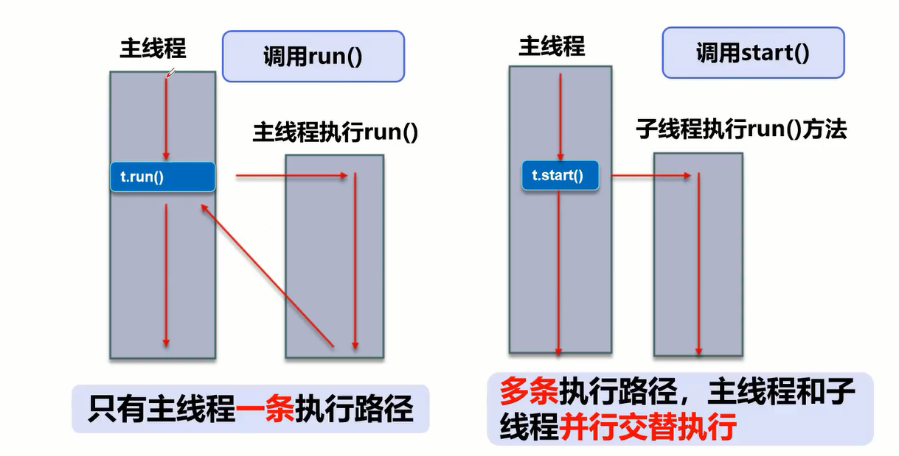

## 1.5、Process与Thread

- 程序是指令和数据的有序集合，其本身没有任何运行的焊锡，是一个静态的概念
- **进程**是执行程序的一次执行过程，它是一个动态的概念。是系统资源分配的单位
- 通常一个进程中可以包含若干个**线程**，一个进程中至少有一个线程，不然没有存在的意义。线程是CPU调度和执行的单位

> 注意：很多多线程是模拟出来的，真正的多线程是指有很多个CPU，即多核，如服务器。如果是模拟出来的多线程，即在一个CPU的情况下，在同一时间点，CPU只能执行一个代码，因为切换很快，所以就有同时执行的错觉

**总结：**

- 线程就是独立的执行路径
- 在程序运行时，即使没有自己创建线程，后台也会有多个线程，如主程序，GC线程
- main()称之为主线程，为系统入口，用于执行整个程序
- 在一个进程中，如果开辟了多个线程，线程的运行由调度器安排调度，调度器是与操作系统紧密相关的，先后顺序是不能认为的干预
- 对同一份资源操作时，会存在资源抢夺的问题，需要加入并发控制
- 线程会带来额外的开销，如CPU调度时间，并发控制开销
- 每个线程在自己的工作内存交互，内存控制不当会造成数据不一致

# 2、线程创建

## 2.1、Thread

- 自定义线程类继承**Thread**类
- 重写**run()**方法，编写线程执行体
- 创建线程对象，调用**start()**方法启动线程

**线程不一定立即执行，CPU安排调度**

### 2.1.1、测试

```java
package com.zh.thread;

/**
 * @author Beloved
 * @date 2020/9/22 20:49
 * 1、继承Thread类
 * 2、重写run()方法
 * 3、调用start开启线程
 */
public class Test1 extends Thread {

    @Override
    public void run() {
        // run方法线程体
        for (int i = 0; i < 20; i++) {
            System.out.println("run--->"+i);
        }

    }

    public static void main(String[] args) {
        // main线程，主线程

        // 创建线程对象
        Test1 thread1 = new Test1();

        // 开启线程
        thread1.start();

        for (int i = 0; i < 20; i++) {
            System.out.println("main--->"+i);
        }
    }
}
```

运行结果

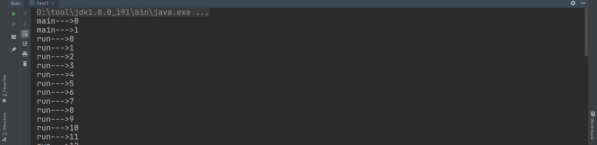

### 2.1.2、多线程下载图片

**commons-io工具类下载图片**

```xml
<!-- https://mvnrepository.com/artifact/commons-io/commons-io -->
<dependency>
    <groupId>commons-io</groupId>
    <artifactId>commons-io</artifactId>
    <version>2.8.0</version>
</dependency>
```

```java
package com.zh.thread;

import org.apache.commons.io.FileUtils;

import java.io.File;
import java.io.IOException;
import java.net.URL;

/**
 * @author Beloved
 * @date 2020/9/22 21:02
 * 多线程同步下载图片
 */
public class Test02 extends Thread{

    private String url;
    private String name;

    public Test02(String url, String name) {
        this.url = url;
        this.name = name;
    }

    @Override
    public void run() {
        WebDownloader downloader = new WebDownloader();
        downloader.downloader(url,name);
        System.out.println("下载文件名为："+name);
    }

    public static void main(String[] args) {
        Test02 t1 = new Test02("https://api.btstu.cn/sjbz/api.php", "1.jpg");
        Test02 t2 = new Test02("https://api.btstu.cn/sjbz/api.php", "2.jpg");
        Test02 t3 = new Test02("https://api.btstu.cn/sjbz/api.php", "3.jpg");

        t1.start();
        t2.start();
        t3.start();
    }
}

/**
 * 下载器
 */
class WebDownloader{
    // 下载方法
    public void downloader(String url,String name){
        try {
            FileUtils.copyURLToFile(new URL(url),new File(name));
        } catch (IOException e) {
            e.printStackTrace();
            System.out.println("IO异常");
        }
    }
}
```

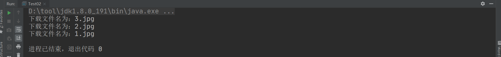

### 2.1.3、总结

**多线程并不是按顺序执行，而是由CPU调度**

## 2.2、Runnable

**推荐使用Runnable对象，因为Java单继承有局限性**

- 实现**Runnable接口**
- 实现**run()**方法，编写线程执行体
- 创建线程对象，调用**start()**方法启动线程

### 2.2.1、测试

```java
package com.zh.runnable;

/**
 * @author Beloved
 * @date 2020/9/22 21:27
 * 1、实现Runnable接口
 * 2、重写run方法
 * 3、执行线程需要丢入Runnable接口实现类，调用start方法
 */
public class Test01 implements Runnable{

    @Override
    public void run() {
        for (int i = 0; i < 20; i++) {
            System.out.println("run--->"+i);
        }
    }

    public static void main(String[] args) {
        Test01 t1 = new Test01();

        new Thread(t1).start();

        for (int i = 0; i < 20; i++) {
            System.out.println("main--->"+i);
        }
    }
}
```

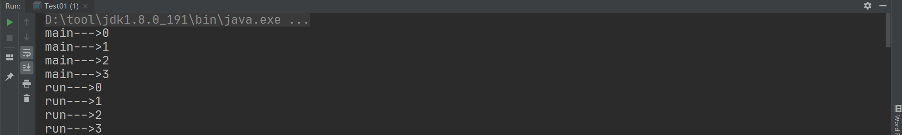

### 2.2.2、多线程下载图片

```java
package com.zh.runnable;

import org.apache.commons.io.FileUtils;

import java.io.File;
import java.io.IOException;
import java.net.URL;

/**
 * @author Beloved
 * @date 2020/9/22 21:33
 */
public class Test02 implements Runnable{

    private String url;
    private String name;

    public Test02(String url, String name) {
        this.url = url;
        this.name = name;
    }

    @Override
    public void run() {
        WebDownloader downloader = new WebDownloader();
        downloader.downloader(url,name);
        System.out.println("下载文件名为："+name);
    }

    public static void main(String[] args) {
        Test02 t1 = new Test02("https://api.btstu.cn/sjbz/api.php", "1.jpg");
        Test02 t2 = new Test02("https://api.btstu.cn/sjbz/api.php", "2.jpg");
        Test02 t3 = new Test02("https://api.btstu.cn/sjbz/api.php", "3.jpg");

        new Thread(t1).start();
        new Thread(t2).start();
        new Thread(t3).start();
    }
}

/**
 * 下载器
 */
class WebDownloader{
    // 下载方法
    public void downloader(String url,String name){
        try {
            FileUtils.copyURLToFile(new URL(url),new File(name));
        } catch (IOException e) {
            e.printStackTrace();
            System.out.println("IO异常");
        }
    }
}
```

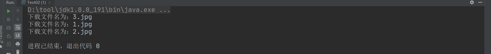

## 2.3、Callable

- 实现Callable接口，需要返回值类型
- 重写call方法，需要抛出异常
- 创建目标对象
- 创建执行服务：`ExecutorService ser = Executors.newFixedThreadPool(1);`
- 提交执行：`Future<Boolean> result = ser.submit(t1);`
- 获取结果：`boolean r = result.get();`
- 关闭服务：`ser.shutdownNow();`

### 2.3.1、多线程下载图片

```java
package com.zh.callable;

import org.apache.commons.io.FileUtils;

import java.io.File;
import java.io.IOException;
import java.net.URL;
import java.util.concurrent.*;

/**
 * @author Beloved
 * @date 2020/9/22 21:48
 */
public class Test01 implements Callable<Boolean> {

    private String url;
    private String name;

    public Test01(String url, String name) {
        this.url = url;
        this.name = name;
    }

    // 自定义返回值
    @Override
    public Boolean call() throws Exception {
        WebDownloader downloader = new WebDownloader();
        downloader.downloader(url,name);
        System.out.println("下载文件名为："+name);
        return true;
    }

    public static void main(String[] args) throws ExecutionException, InterruptedException {
        Test01 t1 = new Test01("https://api.btstu.cn/sjbz/api.php", "1.jpg");
        Test01 t2 = new Test01("https://api.btstu.cn/sjbz/api.php", "2.jpg");
        Test01 t3 = new Test01("https://api.btstu.cn/sjbz/api.php", "3.jpg");

        // 创建执行服务     nThreads：多少个线程
        ExecutorService ser = Executors.newFixedThreadPool(3);

        // 提交执行
        Future<Boolean> rs1 = ser.submit(t1);
        Future<Boolean> rs2 = ser.submit(t2);
        Future<Boolean> rs3 = ser.submit(t3);

        // 获取结果
        Boolean r1 = rs1.get();
        Boolean r2 = rs2.get();
        Boolean r3 = rs3.get();

        System.out.println(r1);
        System.out.println(r2);
        System.out.println(r3);

        // 关闭服务
        ser.shutdownNow();
    }
}

/**
 * 下载器
 */
class WebDownloader{
    // 下载方法
    public void downloader(String url,String name){
        try {
            FileUtils.copyURLToFile(new URL(url),new File(name));
        } catch (IOException e) {
            e.printStackTrace();
            System.out.println("IO异常");
        }
    }
}
```

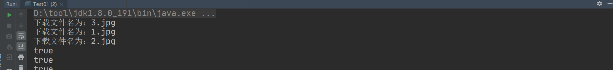

## 2.4、总结

**继承Thread类：**

- 子类继承Thread类具备多线程能力
- 启动线程：子类对象`.start()`
- 不建议使用：避免OOP单继承局限性

**实现Runnable接口：**

- 实现接口Runnable具有多线程能力
- 启动线程：传入目标对象+Thread对象.start()
- 推荐使用：避免单继承局限性，灵活方便，方便同一个对象被多个线程使用

**实现Callable接口：**

- 实现接口Callable具有多线程能力
- 启动线程：见2.3
- 不推荐使用：掌握即可

# 3、并发问题

**当多个线程同时操作同一个对象时，有可能同一时间操作同一数据，导致线程不安全，数据紊乱**

## 3.1、买火车票

```java
package com.zh.concurrent;

/**
 * @author Beloved
 * @date 2020/9/22 22:12
 */
public class Test01 implements Runnable {

    // 票数
    private int ticketNums = 10;

    @Override
    public void run() {
        while (true) {
            if (ticketNums <= 0) {
                break;
            }
            // 模拟延迟
            try {
                Thread.sleep(200);
            } catch (InterruptedException e) {
                e.printStackTrace();
            }

            // Thread.currentThread().getName()：获取当前线程名
            System.out.println(Thread.currentThread().getName()+"--->拿到了第"+ticketNums--+"票");
        }
    }


    public static void main(String[] args) {
        Test01 t = new Test01();

        new Thread(t,"张三").start();
        new Thread(t,"李四").start();
        new Thread(t,"王五").start();
    }
}
```

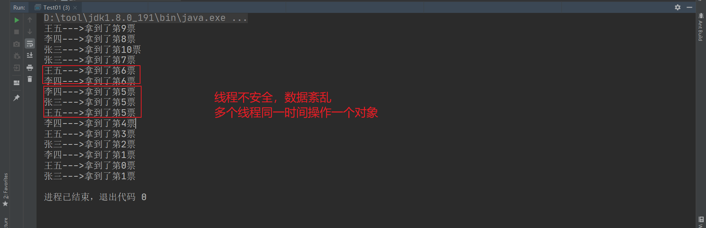

# 4、Lamda

- 避免匿名内部类定义过多
- 可以让代码看起来简洁
- 去掉没有意义的代码，只留核心的逻辑

**其实质属于函数式编程的概念**

函数式接口的定义：

- 任何接口，如果只包含唯一一个抽象方法，那么它就是一个函数式接口

  ```java
  public interface Runnable{
      public abstract void run();
  }
  ```

- 对于函数式接口，可以通过Lamda表达式创建该接口

  ```java
  new Thread( ()-> System.out.println("你好")).start();
  ```

## 4.1、推导Lamda

```java
package com.zh.lamda;

/**
 * @author Beloved
 * @date 2020/9/23 0:15
 */
public class TestLamda01 {

    // 3.静态内部类
    static class Like2 implements ILike{

        @Override
        public void lamda() {
            System.out.println("i like lamda--->2");
        }
    }

    public static void main(String[] args) {

        ILike like = new Like();
        like.lamda();

        like = new Like2();
        like.lamda();

        // 4.局部内部类
        class Like3 implements ILike{

            @Override
            public void lamda() {
                System.out.println("i like lamda--->3");
            }
        }
        like = new Like3();
        like.lamda();

        // 5.匿名内部类。 没有类名,必须借助接口或者父类
        like = new ILike() {
            @Override
            public void lamda() {
                System.out.println("i like lamda--->4");
            }
        };
        like.lamda();

        // 6.Lamda简化
        like = ()-> {
            System.out.println("i like lamda--->5");
        };
        like.lamda();
    }

}

// 1.定义一个函数式接口
interface ILike{
    void lamda();
}

// 2.实现类
class Like implements ILike{

    @Override
    public void lamda() {
        System.out.println("i like lamda--->1");
    }
}
```

## 4.2、Lamda简化

**去除花括号代码体前提只有一行**

```java
package com.zh.lamda;

/**
 * @author Beloved
 * @date 2020/9/23 0:27
 */
public class TestLamda02 {

    public static void main(String[] args) {

        // Lamda简化
        ILove love = (String name)->{
            System.out.println("I Love " + name);
        };

        // 简化：去除参数类型
        love = (name)->{
            System.out.println("I Love " + name);
        };

        // 简化：去除括号
        love = name->{
            System.out.println("I Love " + name);
        };

        // 简化：去除花括号
        love = name-> System.out.println("I Love " + name);

        love.love("Java");

    }
}

interface ILove{
    void love(String name);
}
```

# 5、线程状态

## 5.1、五大状态

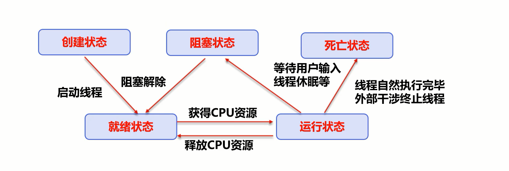

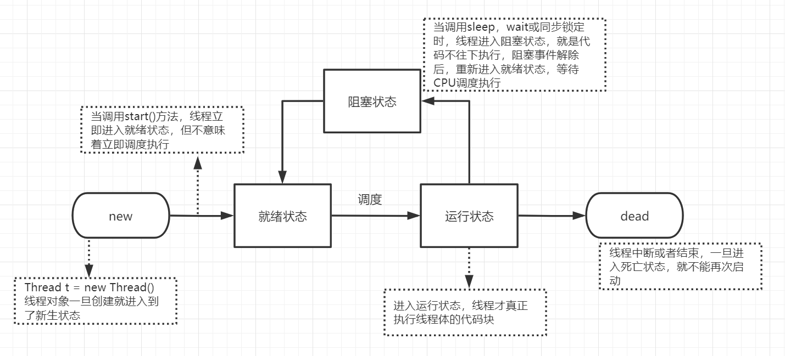

## 5.2、线程方法

| 方法                           | 说明                                       |
| ------------------------------ | ------------------------------------------ |
| setPriority(int newPriority)   | 更改线程的优先级                           |
| static void sleep(long millis) | 在指定的毫秒数内让当前正在执行的线程休眠   |
| void join()                    | 等待该线程终止                             |
| static void yield()            | 暂停当前正在执行的线程对象，并执行其他线程 |
| void interrupt()               | 中断线程，不推荐这个方式                   |
| boolean isAlive()              | 测试线程是否处于活动状态                   |

## 5.3、停止线程

- 不推荐使用JDK提供的stop()、destroy()方法【已废弃】
- 推荐线程自己停止
- 建议使用一个标志位进行终止变量，当flag=false，则终止线程运行

```java
package com.zh.state;

/**
 * @author Beloved
 * @date 2020/9/23 20:17
 * 测试线程停止
 *  1、建议线程正常停止--->利用次数，不建议死循环
 *  2、建议使用标识位---->设置一个标志位
 *  3、不要使用stop或destroy等过时方法或JDK不建议使用的
 */
public class TestStop implements Runnable{

    // 设置标识位
    private boolean flag = true;

    @Override
    public void run() {
        int i = 0;
        while (flag){
            System.out.println("run...Thread--->"+i++);
        }
    }

    // 公开方法停止线程
    public void stop(){
        this.flag = false;
    }

    public static void main(String[] args) {
        TestStop testStop = new TestStop();

        new Thread(testStop).start();

        for (int i = 0; i < 100; i++) {
            System.out.println("main--->"+i);
            if (i == 10){
                testStop.stop();
                System.out.println("线程停止了..........");
            }
        }
    }
}
```

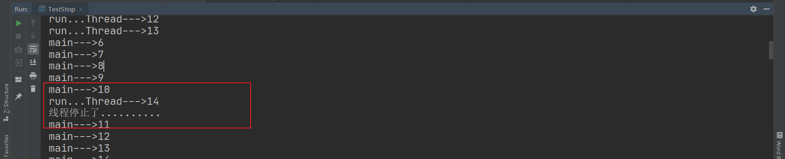

## 5.4、线程休眠

- sleep（时间）指定当前线程阻塞的毫秒数
- sleep存在异常InterruptedException
- sleep时间达到后线程进入就绪状态
- sleep可以模拟网络延时，倒计时等
- **每一个对象都有一个锁，sleep不会释放锁**

可以模拟网络延迟（见前面抢票）、模拟倒计时

```java
package com.zh.state;

import java.text.SimpleDateFormat;
import java.util.Date;
import java.util.logging.SimpleFormatter;

/**
 * @author Beloved
 * @date 2020/9/23 20:39
 */
public class TestSleep {

    public static void main(String[] args) {
        // 打印当前系统时间
        Date date = new Date(System.currentTimeMillis()); // 获取系统当前时间

        while (true){
            try {
                Thread.sleep(1000);
                System.out.println(new SimpleDateFormat("HH:mm:ss").format(date));
                date = new Date(System.currentTimeMillis()); // 更新当前时间
            } catch (InterruptedException e) {
                e.printStackTrace();
            }
        }
    }


    // 模拟倒计时
    public static void tenDown() throws InterruptedException {
        int num = 10;
        while (true){
            Thread.sleep(1000);
            System.out.println(num--);
            if (num<=0){
                break;
            }
        }
    }

}
```

## 5.5、线程礼让

- 礼让线程，让当前正在执行的线程暂停，但不阻塞
- 将线程从运行状态转为就绪状态
- **让CPU重新调度，礼让不一定成功！看CPU心情**

**多次运行，查看不同的结果**

```java
package com.zh.state;

/**
 * @author Beloved
 * @date 2020/9/23 20:50
 * 测试礼让线程
 *  礼让不一定成功
 */
public class TestYield {

    public static void main(String[] args) {

        MyYield myYield = new MyYield();

        new Thread(myYield,"A").start();
        new Thread(myYield,"B").start();
    }
}

class MyYield implements Runnable{

    @Override
    public void run() {
        System.out.println(Thread.currentThread().getName()+"--->线程开始执行");
        Thread.yield(); // 礼让
        System.out.println(Thread.currentThread().getName()+"--->线程停止执行");
    }
}
```

## 5.6、强制执行

- Join合并线程，待此线程执行完成后，在执行其他线程，其他线程阻塞
- 可以想象成插队

主线程等待插队线程执行完毕才继续执行

```java
package com.zh.state;

/**
 * @author Beloved
 * @date 2020/9/23 20:57
 */
public class TestJoin implements Runnable {
    @Override
    public void run() {
        for (int i = 0; i < 5; i++) {
            System.out.println("VIP线程--->"+i);
        }
    }

    public static void main(String[] args) {
        TestJoin testJoin = new TestJoin();
        Thread thread = new Thread(testJoin);
        thread.start();

        // 主线程
        for (int i = 0; i < 10; i++) {
            if (i==5){
                try {
                    thread.join();
                } catch (InterruptedException e) {
                    e.printStackTrace();
                }
            }
            System.out.println("main--->"+i);
        }
    }
}
```


## 5.7、状态观测

**线程状态（Thread.state）:**

- NEW：尚未启动的线程处于次状态
- RUNNABLE：在Java虚拟机中执行的线程处于次状态
- BLOCKED：被阻塞等待监视器锁定的线程处于次状态
- WAITING：正在等待另一个线程执行特定动作的线程处于此状态
- TIMED_WAITING：正在等待另一个线程执行动作达到指定等待时间的线程处于此状态
- TERMINATED：已退出的线程处于此状态

一个线程可以在给定时间点处于一个状态。这些状态是不反映任何操作系统线程状态的虚拟机状态

```java
package com.zh.state;

/**
 * @author Beloved
 * @date 2020/9/23 21:10
 * 测试线程状态
 */
public class TestState {

    public static void main(String[] args) {

        Thread thread = new Thread(()->{
            try {
                Thread.sleep(5000);
            } catch (InterruptedException e) {
                e.printStackTrace();
            }

            System.out.println("----------------------------");
        });


        // 观察状态
        Thread.State state = thread.getState();
        System.out.println(state);   // NEW  还未启动

        // 观察启动后
        thread.start();// 启动线程
        state = thread.getState();
        System.out.println(state); // RUN

        while (state != Thread.State.TERMINATED){ // 只要线程不终止，就一直输出状态
            try {
                Thread.sleep(500);
            } catch (InterruptedException e) {
                e.printStackTrace();
            }

            state = thread.getState(); // 更新线程状态
            System.out.println(state); // 输出状态
        }
        
        // thread.start();  线程已经死了，再次启动就会报错
    }

}
```

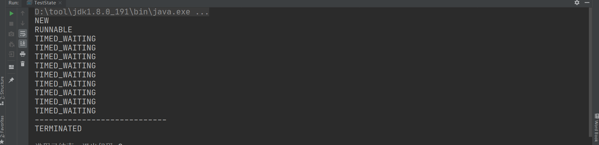

## 5.8、优先级

- Java提供一个线程调度器来监控程序中启动后进入就绪状态的所有线程，线程调度器按照优先级决定应该调度那个线程执行
- 线程优先级用数字表示，范围从1~10
  - Thread.MIN_PRIORITY = 1
  - Thread.NORM_PRIORITY = 5
  - Thread.MAX_PRIORITY = 10
- 使用以下方式改变或获取优先级
  - getPriority() 
  - .setPriority(int xxx)
- **优先级的设定建议在start()调度前**
- 优先级低只是意味着获得的调度概率低，并不是优先级低就不会被调用了，都是看CPU的调度

**多次运行，查看启动顺序**

```java
package com.zh.state;

/**
 * @author Beloved
 * @date 2020/9/23 21:31
 * 测试优先级
 * 优先级范围 1 ~ 10
 */
public class TestPriority {

    public static void main(String[] args) {
        // 主线程默认优先级
        System.out.println(Thread.currentThread().getName()+"--->"+Thread.currentThread().getPriority());

        MyPriority myPriority = new MyPriority();

        Thread t1 = new Thread(myPriority, "t1");
        Thread t2 = new Thread(myPriority, "t2");
        Thread t3 = new Thread(myPriority, "t3");
        Thread t4 = new Thread(myPriority, "t4");
        Thread t5 = new Thread(myPriority, "t5");
        Thread t6 = new Thread(myPriority, "t6");

        // 先设置优先级在启动
        t1.start(); // 默认

        t2.setPriority(Thread.MIN_PRIORITY); // MIN_PRIORITY = 1
        t2.start();

        t3.setPriority(Thread.NORM_PRIORITY); // NORM_PRIORITY = 5
        t3.start();

        t4.setPriority(Thread.MAX_PRIORITY); // MAX_PRIORITY = 10
        t4.start();

        //t5.setPriority(-1); // 超出范围报错
        t5.setPriority(3);
        t5.start();

        //t6.setPriority(11); // 超出范围报错
        t6.setPriority(8);
        t6.start();
    }

}

class MyPriority implements Runnable{

    @Override
    public void run() {
        System.out.println(Thread.currentThread().getName()+"--->"+Thread.currentThread().getPriority());
    }
}
```

## 5.9、守护线程

- 线程分为**用户线程**和**守护线程**
- 虚拟机必须确保用户线程执行完毕
- 虚拟机不用等待守护线程执行完毕
- 如：后台记录操作日志，监控内存，垃圾回收等待...

**用户线程结束，整个程序就会停止**

```java
package com.zh.state;

/**
 * @author Beloved
 * @date 2020/9/23 22:29
 * 测试守护线程
 *  虚拟机不会管守护线程
 *  用户线程结束，程序就会结束
 */
public class TestDaemon {

    public static void main(String[] args) {
        God god = new God();
        You you = new You();

        Thread thread = new Thread(god);
        thread.setDaemon(true); // 默认是false表示用户线程，正常的线程都是用户线程

        thread.start(); // 守护线程启动

        new Thread(you).start(); // 用户线程启动

    }
}

// 上帝：守护线程
class God implements Runnable{

    @Override
    public void run() {
        while (true){
            System.out.println("上帝保佑你");
        }
    }
}

// 你：用户线程
class You implements Runnable{

    @Override
    public void run() {
        for (int i = 0; i < 36500; i++) {
            System.out.println("每一天都开心的活着");
        }
        System.out.println("========goodbye! world!==========");
    }
}
```

# 6、线程同步

**并发：同一个对象被多个线程同时操作**

**队列：**处理多线程问题时，多个线程访问同一个对象，并且某些线程还想修改这个对象，这时候就需要线程同步。线程同步就是一种

​				**等待机制**，多个需要同时访问此对象的线程进入这个**对象的等待池**形成队列，等待前面线程使用完毕，下一个线程在使用

**锁：**当线程进入队列之中，会带上锁，防止其它线程进入队列

**线程同步：**

- 形成条件：队列+锁
- 由于同一进程的多个线程共享同一块存储空间，在带来方便的同时，也带来了访问冲突问题，为了保证数据在方法中被访问时的正确性，在访问时加入**锁机制（synchronized）**，当一个线程获得对象的排它锁，独占资源，其他线程必须等待
- 一个线程持有锁会导致其他所有需要此锁的线程挂起
- 在多线程竞争下，加锁，释放锁会导致比较多的上下文切换和调度延时，引起性能问题
- 如果一个优先级高的线程等待一个优先级低的线程释放锁会导致优先级倒置，引起性能问题

## 6.1、不安全案例

### 6.1.1、买票

```java
package com.zh.syn;

/**
 * @author Beloved
 * @date 2020/9/23 22:56
 * 不安全的买票
 */
public class UnsafeBuyTicket {

    public static void main(String[] args) {
        BuyTicket buyTicket = new BuyTicket();

        new Thread(buyTicket,"张三").start();
        new Thread(buyTicket,"李四").start();
        new Thread(buyTicket,"黄牛").start();
    }

}


class BuyTicket implements Runnable{

    // 票
    private int ticketNums = 10;
    private boolean flag = true; // 外部停止标识

    @Override
    public void run() {
        // 买票
        while (flag){
            buy();
        }
    }

    private void buy(){
        // 判断是否有票
        if (ticketNums <= 0){
            flag = false;
            return;
        }

        // 模拟网络延迟
        try {
            Thread.sleep(100);
        } catch (InterruptedException e) {
            e.printStackTrace();
        }

        //买票
        System.out.println(Thread.currentThread().getName()+"--->"+ticketNums--);
    }

}
```

### 6.1.2、银行取钱

```java
package com.zh.syn;

/**
 * @author Beloved
 * @date 2020/9/24 8:21
 * 不安全线程模拟
 *  两个人同时去银行取同一个账户的钱
 */
public class UnsafeBank {

    public static void main(String[] args) {
        Account account = new Account(100, "公共账户");

        Drawing drawing1 = new Drawing(account, 50, "张三");
        Drawing drawing2 = new Drawing(account, 100, "李四");

        drawing1.start();
        drawing2.start();
    }
}

// 账户
class Account{
    int money; // 余额
    String name; // 卡名

    public Account(int money, String name) {
        this.money = money;
        this.name = name;
    }
}

// 银行 模拟取钱
class Drawing extends Thread{

    // 账户
    Account account;
    // 取了多少钱
    int drawingMoney;
    // 手里的钱
    int nowMoney;

    public Drawing(Account account, int drawingMoney,String name) {
        super(name);
        this.account = account;
        this.drawingMoney = drawingMoney;
    }

    // 取钱
    @Override
    public void run() {
        // 判断有没有钱
        if (account.money - drawingMoney < 0){
            System.out.println(Thread.currentThread().getName()+"--->钱不够，取不了");
            return;
        }

        // 模拟延时  sleep可以放大问题的发生性
        try {
            Thread.sleep(1000);
        } catch (InterruptedException e) {
            e.printStackTrace();
        }

        // 卡内余额 = 余额 - 取得钱
        account.money = account.money - drawingMoney;

        // 手里的钱
        nowMoney = nowMoney + drawingMoney;

        System.out.println(account.name+"--->余额为："+account.money);

        System.out.println(this.getName()+"--->手里的钱："+nowMoney);

    }
}
```

### 6.1.3、集合

```java
package com.zh.syn;

import java.util.ArrayList;
import java.util.List;

/**
 * @author Beloved
 * @date 2020/9/24 8:36
 *
 * 线程不安全的集合
 */
public class UnsafeList {

    public static void main(String[] args) throws InterruptedException {
        List<String> list = new ArrayList<>();

        for (int i = 0; i < 10000; i++) {
            new Thread(()->{
               list.add(Thread.currentThread().getName());
            }).start();
        }
        // 并不能插入10000条数据
        System.out.println(list.size());
    }

}
```

## 6.2、同步方法

- `synchronized`关键字，修饰方法或代码块（synchronized方法/synchronized块）
  - private synchronized void buy(){}
- synchronized方法控制“对象”的访问，每个对象对应一把锁，每个synchronized方法都必须获得调用该方法的对象的锁才能执行，否则线程会阻塞，方法一旦执行，就独占该锁，直到该方法返回才释放锁，后面被阻塞的线程才能获得这个锁，继续执行
  - 缺陷：若将一个大的反法申明为synchronized将会影响效率
- 方法里面需要修改的内容才需要锁，锁的太多，浪费资源

**修改买票案例**：将票给多观测

**synchronized修饰的方法会向上找，找到当前的类**

测试结果：加锁之后，每个线程会去排队，不会出现抢到同一张票的情况

```java
package com.zh.syn;

/**
 * @author Beloved
 * @date 2020/9/23 22:56
 * 不安全的买票
 */
public class UnsafeBuyTicket {

    public static void main(String[] args) {
        BuyTicket buyTicket = new BuyTicket();

        new Thread(buyTicket,"李四").start();
        new Thread(buyTicket,"张三").start();
        new Thread(buyTicket,"黄牛").start();
    }

}


class BuyTicket implements Runnable{

    // 票
    private int ticketNums = 1000;
    private boolean flag = true; // 外部停止标识

    @Override
    public void run() {
        // 买票
        while (flag){
            buy();
        }
    }

    // synchronized 同步方法 锁的this--->BuyTicket
    private synchronized void buy(){
        // 判断是否有票
        if (ticketNums <= 0){
            flag = false;
            return;
        }

        // 模拟网络延迟
        try {
            Thread.sleep(100);
        } catch (InterruptedException e) {
            e.printStackTrace();
        }

        //买票
        System.out.println(Thread.currentThread().getName()+"--->"+ticketNums--);
    }

}
```

## 6.3、同步块

同步块：synchronized(Obj) {}

Obi称为**同步监视器**

- Obj可以是任何对象，但是推荐使用共享资源作为同步监视器
- 同步方法中无需指定同步监视器，因为同步方法的同步监视器就是`this`，就是这个对象本身，或者是class

同步监视器的执行过程：

- 第一个线程访问，锁定同步监视器，执行其中代码
- 第二个线程访问，发现同步监视器被锁定，无法访问
- 第一个线程访问完毕，解锁同步监视器
- 第二个线程访问，发现同步监视器没有锁，然后访问并锁定

### 修改模拟银行取钱案例

需要锁的对象是账户而不是银行，如果使用同步方法修饰，监视的是this--->Drawing(银行)，没有效果，应该使用同步块锁定Account（账户）

```java
package com.zh.syn;

/**
 * @author Beloved
 * @date 2020/9/24 8:21
 * 不安全线程模拟
 *  两个人同时去银行取同一个账户的钱
 */
public class UnsafeBank {

    public static void main(String[] args) {
        Account account = new Account(100, "公共账户");

        Drawing drawing1 = new Drawing(account, 50, "张三");
        Drawing drawing2 = new Drawing(account, 100, "李四");

        drawing1.start();
        drawing2.start();
    }
}

// 账户
class Account{
    int money; // 余额
    String name; // 卡名

    public Account(int money, String name) {
        this.money = money;
        this.name = name;
    }
}

// 银行 模拟取钱
class Drawing extends Thread{

    // 账户
    Account account;
    // 取了多少钱
    int drawingMoney;
    // 手里的钱
    int nowMoney;

    public Drawing(Account account, int drawingMoney,String name) {
        super(name);
        this.account = account;
        this.drawingMoney = drawingMoney;
    }

    // 取钱
    @Override
    public void run() {

        // 锁定的对象就是变化的量，需要增删改的
        synchronized(account){
            // 判断有没有钱
            if (account.money - drawingMoney < 0){
                System.out.println(Thread.currentThread().getName()+"--->钱不够，取不了");
                return;
            }

            // 模拟延时  sleep可以放大问题的发生性
            try {
                Thread.sleep(1000);
            } catch (InterruptedException e) {
                e.printStackTrace();
            }

            // 卡内余额 = 余额 - 取得钱
            account.money = account.money - drawingMoney;

            // 手里的钱
            nowMoney = nowMoney + drawingMoney;

            System.out.println(account.name+"--->余额为："+account.money);

            System.out.println(this.getName()+"--->手里的钱："+nowMoney);
        }
    }
}
```

### 修改List为线程安全

```java
package com.zh.syn;

import java.util.ArrayList;
import java.util.List;

/**
 * @author Beloved
 * @date 2020/9/24 8:36
 *
 * 线程不安全的集合
 */
public class UnsafeList {

    public static void main(String[] args) throws InterruptedException {
        List<String> list = new ArrayList<>();

        for (int i = 0; i < 10000; i++) {
            new Thread(()->{
                synchronized (list){
                    list.add(Thread.currentThread().getName());
                }
            }).start();
        }

        Thread.sleep(100);
        // 并不能插入10000条数据
        System.out.println(list.size());
    }

}
```

### 安全的集合

```java
package com.zh.syn;

import java.util.concurrent.CopyOnWriteArrayList;

/**
 * @author Beloved
 * @date 2020/9/24 11:03
 *
 * JUC安全类型的集合
 */
public class TestJUC {

    public static void main(String[] args) throws InterruptedException {
        CopyOnWriteArrayList<String> list = new CopyOnWriteArrayList<>();

        for (int i = 0; i < 10000; i++) {
            new Thread(()->{
                list.add(Thread.currentThread().getName());
            }).start();
        }

        Thread.sleep(100);

        System.out.println(list.size());
    }

}
```

## 6.4、死锁

多个线程各自占有一些共享资源，并且互相等待其他线程占有的资源才能运行，而导致两个或者多个线程都在等待对方释放资源，都停止执行的情况。**某一同步块同时拥有“两个以上对象的锁”时，就可能发生“死锁”**

### 6.4.1、模拟死锁

**运行之后，两个线程各获得一个不同资源，但都还想获得对方资源，就发生僵持，程序死锁**

```java
package com.zh.deadlock;

/**
 * @author Beloved
 * @date 2020/9/24 11:10
 *
 * 死锁：多个线程互相拥有对方需要的资源，然后形成僵持
 */
public class Deadlock {

    public static void main(String[] args) {
        Makeup makeup1 = new Makeup(1, "白雪公主");
        Makeup makeup2 = new Makeup(2, "灰姑娘");

        makeup1.start();
        makeup2.start();
    }
}

// 口红
class Lipstick{}

// 镜子
class Mirror{}

class Makeup extends Thread{

    // 需要的资源只有一份，用static保证只有一份
    static Lipstick lipstick = new Lipstick();
    static Mirror mirror = new Mirror();

    int id; // 用户标识
    String girlName; // 用户名

    public Makeup(int id, String girlName) {
        this.id = id;
        this.girlName = girlName;
    }

    @Override
    public void run() {
        try {
            makeup();
        } catch (InterruptedException e) {
            e.printStackTrace();
        }
    }

    // 化妆  互相拥有对方的资源，需要拿到对方的资源才能运行
    private void makeup() throws InterruptedException {
        if (id == 1){
            synchronized (lipstick){ // 获得口红的锁
                System.out.println(this.girlName+"--->获得口红的锁");
                Thread.sleep(1000);
                synchronized (mirror){ // 一秒后想获得镜子的锁
                    System.out.println(this.girlName+"--->获得镜子的锁");
                }
            }
        }else {
            synchronized (mirror){ // 获得镜子的锁
                System.out.println(this.girlName+"--->获得镜子的锁");
                Thread.sleep(2000);
                synchronized (lipstick){ // 两秒后想获得口红的锁
                    System.out.println(this.girlName+"--->获得口红的锁");
                }
            }
        }
    }
}
```

### 6.4.2、死锁避免方法

产生死锁的四个必要条件：

- 互斥条件：一个资源每次只能被一个进程使用
- 请求与保持条件：一个进程因请求资源而阻塞时，对已获得的资源保持不放
- 不剥夺条件：进程已获得的资源，在未使用完之前，不能强行剥夺
- 循环等待条件：若干进程之间形成一种头尾相接的循环等待资源关系

避免以上条件中的一个或多个就可避免死锁发生

**修改：**

```java
package com.zh.deadlock;

/**
 * @author Beloved
 * @date 2020/9/24 11:10
 *
 * 死锁：多个线程互相拥有对方需要的资源，然后形成僵持
 */
public class Deadlock {

    public static void main(String[] args) {
        Makeup makeup1 = new Makeup(1, "白雪公主");
        Makeup makeup2 = new Makeup(2, "灰姑娘");

        makeup1.start();
        makeup2.start();
    }
}

// 口红
class Lipstick{}

// 镜子
class Mirror{}

class Makeup extends Thread{

    // 需要的资源只有一份，用static保证只有一份
    static Lipstick lipstick = new Lipstick();
    static Mirror mirror = new Mirror();

    int id; // 用户标识
    String girlName; // 用户名

    public Makeup(int id, String girlName) {
        this.id = id;
        this.girlName = girlName;
    }

    @Override
    public void run() {
        try {
            makeup();
        } catch (InterruptedException e) {
            e.printStackTrace();
        }
    }

    // 化妆  互相拥有对方的资源，需要拿到对方的资源才能运行
    private void makeup() throws InterruptedException {
        if (id == 1){
            synchronized (lipstick){ // 获得口红的锁
                System.out.println(this.girlName+"--->获得口红的锁");
                Thread.sleep(1000);
            }
            synchronized (mirror){ // 一秒后想获得镜子的锁
                System.out.println(this.girlName+"--->获得镜子的锁");
            }
        }else {
            synchronized (mirror){ // 获得镜子的锁
                System.out.println(this.girlName+"--->获得镜子的锁");
                Thread.sleep(2000);
            }
            synchronized (lipstick){ // 两秒后想获得口红的锁
                System.out.println(this.girlName+"--->获得口红的锁");
            }
        }
    }
}
```

## 6.5、Lock（锁）

- 从JDK 5.0开始，Java提供了显式定义同步锁对象来实现。同步锁使用Lock对象充当
- `java.util.concurrent.locks.Lock`接口是控制多个线程对共享资源进行访问的工具。锁提供了对共享资源的独占访问，每次只能有一个线程对Lock对象加锁，线程开始访问共享资源之前应先获得Lock对象
- `ReentrantLock`类实现了Lock，它拥有与`synchronized`相同的并发性和内存语义，在实现线程安全的控制中，比较常用的是`ReentrantLock`，可以显示加锁，释放锁。

**保证线程安全的代码要放在`try`中，如果同步代码有异常，要将`unlock()`写入`finall`语句块**

**例子：**

```java
package com.zh.lock;

import java.util.concurrent.locks.ReentrantLock;

/**
 * @author Beloved
 * @date 2020/9/24 11:34
 *
 * 测试Lock锁
 */
public class TestLock {

    public static void main(String[] args) {
        BuyTicket buyTicket = new BuyTicket();

        new Thread(buyTicket,"张三").start();
        new Thread(buyTicket,"李四").start();
        new Thread(buyTicket,"王五").start();
    }

}

class BuyTicket implements Runnable{

    // 票
    private int ticketNums = 10000;

    // 定义Lock锁
    private final ReentrantLock lock = new ReentrantLock();

    @Override
    public void run() {
        // 买票
        while (true){

            try {
                // 加锁
                lock.lock();
                if (ticketNums > 0){
                    try {
                        Thread.sleep(100);
                    } catch (InterruptedException e) {
                        e.printStackTrace();
                    }
                    System.out.println(Thread.currentThread().getName()+"---->"+ticketNums--);
                }else {
                    break;
                }
            }finally {
                // 解锁
                lock.unlock();
            }
        }
    }
}
```

## 6.6、synchronized与Lock的对比

- Lock是显式锁（手动开启和关闭锁，别忘记关闭锁）、synchronized是隐式锁，出了作用域自动释放
- Lock只有代码块锁，synchronized有代码块锁和方法锁
- 使用Lock锁，JVM将花费较少的时间来调度线程，性能更好。并且具有更好的扩展性（提供更多的子类）
- 优先使用顺序：Lock > 同步代码块（已经进入了方法体，分配了相应的资源）> 同步方法（在方法体之外）


