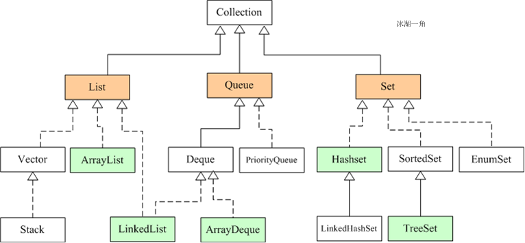

# 基础模块

## JDK、JRE、JVM有什么区别？

**JDK：**（Java Development Kit）Java开发工具包，提供了Java的开发环境和运行环境。

**JRE：**（Java Runtime Environment）Java运行环境，包含了Java虚拟机及一些基础类库

**JVM：**（Java Virtual Machine）Java虚拟机，提供执行字节码文件的能力

JDK 其实包含了 JRE，同时还包含了编译 java 源码的编译器 javac，还包含了很多 java 程序调试和分析的工具。简单来说：如果你需要运行 java 程序，只需安装 JRE 就可以了，如果你需要编写 java 程序，需要安装 JDK。

JVM是实现Java跨平台核心，但JVM本身不跨平台，不同平台需要安装不同的JVM

****

## ==和equals的区别？


**==：**对于基本类型和引用类型的作用效果不同

- 基本类型：比较值是否相等
- 引用类型：比较的引用指向的值（地址）

**equals：**本质上还是==，只不过String等重写了equals方法，把引用比较改成了值比较。

```java
/**
 * @author Beloved
 * @date 2020/10/11 10:05
 *
 * == 与 equals的区别
 */
public class Compare {

static class User {
    private String name;

    public User(String name) {
        this.name = name;
    }
}


    public static void main(String[] args) {

        String s1 = "aaa";
        String s2 = "aaa";

        String s3 = new String("aaa");

        System.out.println(s1 == s2); // true  s1和s2指向同一个引用
        System.out.println(s1 == s3); // false s3是new重新开辟了内存空间，两个引用不一样

        // 自定义引用类型，没有重写equals方法
        User user1 = new User("张三");
        User user2 = new User("张三");

        System.out.println(user1.equals(user2)); // false  equals默认比较的还是引用地址，等同于==
        System.out.println(s1.equals(s3)); // true String重写了equals比较的是值
    }

}
```

**总结：== 对于基本类型来说是值比较，对于引用类型来说是比较的是引用；而 equals 默认情况下是引用比较，只是很多类重写了 equals 方法，比如 String、Integer 等把它变成了值比较，所以一般情况下 equals 比较的是值是否相等。**

****

## final 在 java 中有什么作用？

- final 修饰的类叫最终类。该类不能被继承
- final 修饰的方法不能被重写
- final 修饰的变量叫常量，常量必须初始化，初始化之后值就不能被修改

**注意：**

修饰的是基本数据类型，这个值本身不能修改

**修饰的是引用类型，引用的指向不能修改**

例如：

```java
final Student student = new Student(1,"张三");
student.setAge(18); // 注意，这个是可以的
```

****

## String、StringBuffer、StringBuilder区别

**String跟其它两个类的区别是：**

String是final类型，每次声明的都是不可变的对象

所以每次操作都会产生新的String对象，然后将指针指向新的String对象。

**StringBuffer、StringBuilder都是在原有对象上进行操作**

所以，如果需要经常改变字符串内容，则建议采用这两者

**StringBuffer vs StringBuilder**

前者是线程安全，后者是线程不安全的。

线程不安全性能更高，所以在开发中，优先采用StringBuilder

StringBuilder	>	StringBuffer	>	String

****

## String str="i"与 String str=new String(“i”)一样吗？

不一样，因为内存的分配方式不一样。

String str="i"的方式，java 虚拟机会将其分配到常量池中；

而 String str=new String(“i”) 则会被分到堆内存中。

****

## 方法的重写和重载的区别

**重载：**发生在一个类里面，方法名相同，参数列表不同（**混淆点：跟返回类型没关系**）

```java
// 以下不构成重载
public double add(int a, int b);
public int add(int a, int b);
```

**重写：**发生在父类子类之间的，方法名相同，参数列表相同

****

## IO流的分类即选择

**分类：**

按方向分：输入流、输出流（在程序角度，输入流用于读文件，输出流用于写文件）

按读取单位分：字节流、字符流

按处理方式分：节点流、处理流

> 比如，FileInputStream和BufferedInputStream(后者带有缓存区功能-byte[])

IO流的4大基类：InputStream，OutputStream，Reader，Writer

**选择：**

字节流可以读取任何文件

读取文本文件的时候，选择字符流（解析文件内容的需求，比如逐行处理，则采用字符流，比如txt文件）

读取二进制文件的时候，选择字节流（视频、音频、图片、ppt.....）

****

## BIO、NIO、AIO 有什么区别？

- BIO：BIock IO同步阻塞式IO，就是平常使用的传统IO，它的特点就是模式简单使用方便，并发处理能力低
- NIO：New IO同步非阻塞IO，传统IO的升级，客户端和服务端通过Channel（通道）通讯，实现了多路复用
- AIO：Asynchronous IO是NIO的升级，也叫NIO2，实现了异步非堵塞IO，异步IO的操作基于事件和回调机制

****

## 面向对象的三大基本特征，五大基本原则

### 三大基本特征

- **封装：**

  **封装就是隐藏对象的属性和实现细节，仅对外公开接口**，控制再程序中属性的读和修改的级别访问，将抽象得到的数据和行为（或功能）相结合，**形成一个有机的整体**，也就是将数据与操作数据的源代码进行有机结合，形成“类”，其中数据和函数都是类的成员。

  **封装的目的是增强安全性和简化编程，使用者不必了解具体的实现细节，而只是要通过外部接口**，以特定的访问权限来使用类的成员

- **继承：**

  继承机制允许创建分等级层次的类。**继承就是子类继承父类的特征和行为**，使得子类对象（实例）具有父类的实例域和方法，或子类从父类继承方法，是的子类具有父类相同的行为

- **多态：**

  多态同一个行为具有多个不同表现形式或形态的能力。是指一个类实例（对象）的相同方法再不同情形有不同表现形式。多态机制使具有不同内部结构的对象可以共享相同的外部接口。

  **多态的优点：**

  - 消除类型之间的耦合关系
  - 可替换性
  - 可扩充性
  - 接口性
  - 灵活性
  - 简化性

  **多态存在的三个必要条件：**

  - 继承
  - 重写（子类继承父类后对父类方法进行重新定义）
  - 父类引用指向子类对象

  **多态其实是在继承的基础上的**

### 五大基本原则

- **单一职责原则（SRP）：**一个类应该有且只有一个去改变它的理由，意味着一个类应该只有一项工作
- **开放封闭原则（OCP）：**对象或实体应该对扩展开发，对修改封闭
- **里氏替换原则（LSP）：**对父类的调用同样适用于子类
- **依赖倒置原则（DIP）：**高层次的模块不应该依赖于低层次的模块，他们都应该依赖于抽象。具体实现应该依赖于抽象，而不是抽象依赖于实现
- **接口隔离原则（ISP）：**不应该强迫客户端实现一个使用不上的接口，或客户端不应该被迫依赖不使用的方法，使用多个专门的接口比使用单个接口要好

# 集合框架

## 常见集合框架




集合可以看作是一种容器，用来存储对象信息。所有**集合类都位于java.util**包下，但支持**多线程的集合类位于java.util.concurrent包下**。

Java集合类主要由两个根接口Collection和Map派生出来的，Collection派生出了三个子接口：List、Set、Queue（Java5新增的队列），因此Java集合大致也可分成List、Set、Queue、Map四种接口体系，（注意：Map不是Collection的子接口）。

其中List代表了有序可重复集合，可直接根据元素的索引来访问；

Set代表无序不可重复集合，只能根据元素本身来访问；

Queue是队列集合；

Map代表的是存储key-value对的集合，可根据元素的key来访问value。

　　上图中淡绿色背景覆盖的是集合体系中常用的实现类，分别是**ArrayList、LinkedList、ArrayQueue、HashSet、TreeSet、HashMap、TreeMap**等实现类。

****

## Collections和Collection的区别

**Collection：**是一个集合接口。它提供了对集合对象进行基本操作的通用接口方法。Collection接口在Java类库中有很多具体的实现。Collection接口的意义是为各种具体的集合提供了最大化的统一操作方式。

**Collections：**是一个包装类。它包含了各种有关集合操作的静态多态方法。此类不能实例化，就像一个工具类，服务于Java和Collection框架

****

## List、Set、Map 之间的区别是什么？

| 比较       | List                                                | Set                                          | Map                                                          |
| ---------- | --------------------------------------------------- | -------------------------------------------- | ------------------------------------------------------------ |
| 继承接口   | Collection                                          | Collection                                   |                                                              |
| 常见实现类 | ArrayList、LinkedList、Vector                       | HashSet、LinkedHashSet、TreeSet              | HashMap、HashTable                                           |
| 常用方法   | add()、remove()、clear()、get()、contains()、size() | add()、remove()、clear()、contains()、size() | put()、get()、remove()、clear()、containsKey()、containsValue()、KeySet()、values()、size() |
| 元素       | 可重复                                              | 不可重复（用equals()判断）                   | 不可重复                                                     |
| 顺序       | 有序                                                | 无序（由HashCode决定）                       |                                                              |
| 线程安全   | Vector线程安全                                      |                                              | HashTable线程安全                                            |

****

## ==ArrayList和LinkedList的区别==

**底层数据结构的差异：**

- ArrayList：数组，连续一块内存空间
- LinkedList：双向链表，不是连续的内存空间

**常规结论：**

ArrayList：查找快，因为是连续的内存空间，方便寻址，但删除，插入慢，因为需要发生数据迁移

LinkedList：查找慢，因为需要通过指针一个个寻找，但是删除，插入快，因为只需要改变前后节点的指针指向即可。

**查找分析：**

ArrayList	-->	a、b、c、d

LinkedList	-->	a、b、c、d

例如：

1：查找第2个元素：

ArrayList：连续的内存空间，可以计算偏移量

LinkedList：不连续，无法计算，需要一个个往下找

ArrayList	>	LinkedList

2：查找b元素

没有什么区别，都需要遍历

**插入分析：**

1：向中间位置插入

ArrayList：连续的内存空间，向中间插入，后面的数据要改变位置，需要进行内存的复制

LinkedList：只需要改变相应节点前后的指针指向

LinkedList	>	ArrayList

2：向末尾添加元素

ArrayList：连续的可计算

LinkedList：**有两个指针，一个指向头部，一个指向末尾**

两个都差不多

### 确认存储1000个对象，ArrayList和LinkedList那个更省内存？

**ArrayList：**底层是数组，初始化好空间，就是1000，存储1000个对象

**LinkedList：**底层是双向链表，不仅要存储1000个对象，每个节点还要保存两个指针（一个指向前面，一个后面）

### ArrayList扩容机制

ArrayList的底层是数组

**数组的是连续的内存空间且长度固定**

但ArrayList长度可变

具体扩容：

- 当超过预定值的时候，进行扩容

- 按原先数组容量的1.5倍进行扩容，**位运算**

  ```java
  int oldCapacity = elementData.length;
  int newCapacity = oldCapacity + (oldCapacity >> 1);
  ```

- 将原数组的数据在迁移到新数组

****

## ArrayList 和 Vector 的区别是什么

- Vector是同步的，而ArrayList不是。然而，如果寻求在迭代的时候对列表进行改变，应该使用CopyOnWriteArrayList
- ArrayList比Vector快，它有同步，不会过载
- ArrayList更加通用，可以使用Collections工具类轻易的获取同步列表和只读列表

****

## Array 和 ArrayList 有何区别？

- Array可以容纳基本类型和对象，ArrayList只能容纳对象
- Array指定大小后不可变，ArrayList大小可以改变
- Array没有提供ArrayList那么多功能，比如addAll、removeAll和iterator等。

****

## ==HashTable  &  HashTable  &  ConcurrentHashMap==

**HashTable：**同步的，线程安全但是效率低，不允许有空键值

**HashMap：**非同步，线程不安全但是效率高，允许有空键值

Collections.synchronizedMap()，工具类提供了同步包装器的方法，来返回具有线程安全的集合对象

```java
public static <K,V> Map<K,V> synchronizedMap(Map<K,V> m) {
	sreturn new SynchronizedMap<>(m);
}
//在这个类的内部方法实现上，也只是单纯加上了锁
public V put(K key, V value) {
	synchronized (mutex) {return m.put(key, value);}
}
```

==**ConcurrentHashMap：**==

兼顾了线程安全和效率的问题。

**分析：**HashTable锁了整段数据（多个消除同时操作需要等待）。ConcurrentHashMap把数据分段，执行分段锁（分离锁），核心把锁的范围变小，这样出现并发冲突的概率就变小了，只要不是同时操作一个小段就不会出现。

在保存的时候，计算所存储的数据是属于那一段，只锁当前这一段

**注意：分段锁（分离锁）是JDK1.8之前的方案，JDK1.8之后做了优化**

**JDK1.7跟1.8在ConcurrentHashMap实现的区别：**

- 数据结构

  JDK1.7采用链表的方式，而JDK1.8则采用链表+红黑树的方式

- 发生hash碰撞之后

  JDK1.7：采用链表的方式解决

  JDK1.8：默认采用链表，但当链表的长度超过8，且数组容量超过64时，会转换成红黑树存储

- 保证并发安全

  JDK1.7采用分段锁的方式，而JDK1.8采用CAS和synchronized的组合模式

- 查询复杂度

  JDK1.7采用链表方式，时间复杂度为O(n)，而JDK1.8在采用红黑树的方式时，时间复杂度为O(log(n))

**三者的选择：**

- 优先选择HashMap

  如果不是多个线程访问同一个资源的情况，优先选择HashMap

- 是全局变量，多个线程共享访问，选择ConcurrentHashMap

****

## HashMap的实现原理

**HashMap概述：**HashMap是基于哈希表的Map接口的比同步实现。此实现提供所有可选择的映射操作，并允许使用null值和null键。此类不保证映射的顺序，他别是它不保证该顺序恒久不变

**HashMap的数据结构：**在Java编程语言中，最基本的结构就是两种，一个是数组，另一个是模拟指针（引用），所有的数据结构都可以用这两个基本结构来构造。**HashMap实际上是一个”链表散列“的数据结构，即数组和链表的结合体**

当往HashMap中put元素时，首先根据Key的HashCode重新计算Hash值，根据Hash值的到这个元素在数组的位置（下标），如果该数组在该位置上已经存放了其它元素，那么在这个位置上的元素将以链表的形式存放，新加入的放在链头，最先加入的放在链尾，如果数组中该位置没有元素，就直接将该元素放到数组的该位置上。

需要注意JDK1.8中对HashMap的实现做了优化，当链表中的节点数据超过8个之后，该链表会转换成红黑树来提高查询效率，从原来的O(n)到O(logn)

****

## HashSet实现原理

- HashSet底层由HashMap实现
- HashSet值存放在HashMap的Key上
- HashMap的value统一为PRESENT

****

## 线程安全的集合

- **Vector：**就比ArrayList多了个同步化机制（线程安全），因为效率低，不建议使用
- **Statck：**堆栈类，先进后出
- **HashTable：**就比HashMap多了个线程安全
- **Enumeration：**枚举，相当于迭代器

****

# 异常

## Java异常体系


**Error（错误）：**是程序中无法处理的错误，表示运行应用程序中出现了严重的错误。此类错误一般表示代码运行时JVM出现问题。通常有Virtual MachineError（虚拟机运行错误）、NoClassDefFoundError（类定义错误）等。比如说当jvm耗完可用内存时，将出现OutOfMemoryError。此类错误发生时，JVM将终止线程。

- 栈内存溢出错误：StackOverflowError（递归，递归层次太多或递归没有结束）
- 堆内存溢出错误：OutOfMemoryError（堆创建了很多对象）

**Exception（异常）：程序本身可以捕获并且可以处理的异常**

Exception这种异常又分为两类：运行时异常和编译异常

- **运行时异常（不受检异常）：**RuntimeException类及其子类表示JVM在运行期间可能出现的错误。比如空指针异常（NullPointerException）、数组下标越界（ArrayIndexOutBoundException）。此类异常属于不可查异常，一般是由程序逻辑错误引起的，在程序中可以选择捕获异常处理，也可以不处理。
- **编译异常（受检异常）：**Exception中除RuntimeException及其子类之处的异常。如果程序中出现此类异常，比如，IOException，必须对该异常进行处理，否则编译不通过。在程序中，通常不会自定义该类异常，而是直接使用系统提供的异常类。

**Java中所有异常可以分为可查异常和不可查异常：**

**可查异常：**编译器要求处理的异常。正确的程序在运行过程中，经常容易出现的、符合预期的异常情况。一旦放生此类异常，就必须采用某种方式进行处理。除RuntimeException及其子类外，其它的Exception异常都属于可查异常。编译器会检查此类异常，也就是说当编译器检查到应用中某处可能会此类异常时，将会提示你处理本异常。要么使用try-catch捕获，要么使用throws语句抛出，否则编译不通过

**不可查异常：**编译器不会进行检查且不要求必须处理的异常，也就是说当程序中出现此类异常时，即使没有try-catch捕获，也没有使用throws抛出，编译也会正常通过。该异常包括运行时异常（RuntimeException极其子类）和错误（Error）。

****

## throw 和 throws 的区别？

- **throw：**作用于方法没，用于主动抛出一个具体的异常
- **throws：**作用于方法声明上，声明该方法可能抛出的所有异常信息，throws只是声明但是不处理，而是将异常往上传，谁调用就交给谁处理

在项目中，异常的处理方式，一般采用层层往上抛，最终通过异常处理机制统一处理（展示异常页面，或返回统一的json信息）。

自定义异常一般继承RunntimeException。比如Hibernate等框架，异常处理机制最终继承自RunntimeException

****

## final、finally、finalize 有什么区别？

- **final：**可以修饰类、变量、方法，修饰类表示该类不能被继承、修饰方法表示该方法不能被重写、修饰变量表示该变量是一个常量不能被重新赋值。
- **finally：**一般作用在try-catch代码块，在处理异常的时候，通常将一定要执行的代码放在finally代码块中，表示不管是否出现异常，该代码都会执行，一般用来存放一些关闭资源的代码。
- **finalize：**是一个方法，属于Object类的一个方法，而Object类是所有类的父类，该方法一般由垃圾回收器来调用，当调用System的gc()方法的时候，由垃圾回收器调用finalize()，回收垃圾。

****

## try-catch-finally 中哪个部分可以省略？

答：catch 可以省略

**原因：**

try只适合处理运行时异常，try+catch适合处理运行时异常+普通异常。也就是说，如果只用try去处理普通异常却不加以catch处理，编译是通不过的，因为编译器硬性规定，普通异常如果选择捕获，则必须用catch显示声明以便进一步处理。而运行时异常在编译时没有如此规定，所以catch可以省略

****

## try-catch-finally 中，如果 catch 中 return 了，finally 还会执行吗？

会执行，在 return 前执行。

finally会catch结束前执行，最终会返回finally的

示例代码：

最终返回30

```java
package com.zh;

/**
 * @author Beloved
 * @date 2020/10/13 23:10
 */
public class Test01 {

    public static void main(String[] args) {
        System.out.println(getInt()); // 30
    }

    public static int getInt(){

        try {
            int a = 10/0;
            return 10;
        }catch (Exception e){

            return 20;
        }finally {
            return 30;
        }
    }
}
```

## 常见的异常类有哪些？

- NullPointerException：当应用程序试图访问空对象时，则抛出该异常。
- SQLException：提供关于数据库访问错误或其他错误信息的异常。
- IndexOutOfBoundsException：指示某排序索引（例如对数组、字符串或向量的排序）超出范围时抛出。
- NumberFormatException：当应用程序试图将字符串转换成一种数值类型，但该字符串不能转换为适当格式时，抛出该异常。
- FileNotFoundException：当试图打开指定路径名表示的文件失败时，抛出此异常。
- IOException：当发生某种I/O异常时，抛出此异常。此类是失败或中断的I/O操作生成的异常的通用类。
- ClassCastException：当试图将对象强制转换为不是实例的子类时，抛出该异常。
- ArrayStoreException：试图将错误类型的对象存储到一个对象数组时抛出的异常。
- IllegalArgumentException：抛出的异常表明向方法传递了一个不合法或不正确的参数。
- ArithmeticException：当出现异常的运算条件时，抛出此异常。例如，一个整数“除以零”时，抛出此类的一个实例。
- NegativeArraySizeException：如果应用程序试图创建大小为负的数组，则抛出该异常。
- NoSuchMethodException：无法找到某一特定方法时，抛出该异常。
- SecurityException：由安全管理器抛出的异常，指示存在安全侵犯。
- UnsupportedOperationException：当不支持请求的操作时，抛出该异常。
- RuntimeExceptionRuntimeException：是那些可能在Java虚拟机正常运行期间抛出的异常的超类。

****

# 多线程

## 并行和并发有什么区别？

- 并行是指两个或者多个事件在同一时刻发生；并发是指两个或多个事件在同一时间间隔发生
- 并行是在不同实体上的多个事件，并发是在同一实体上的多个事件
- 在一台处理器上“同时”处理多个任务，在多台处理器上同时处理多个任务

****

## 创建线程的几种方式？

- **继承Thread类创建线程类**
  - 定义Thread类的子类，并重写该类的run方法，该run方法的方法体就代表了线程要完成的任务。因此吧run()方法称为执行体
  - 创建Thread子类的实例，即创建了线程对象
  - 调用线程对象的start()方法来启动该线程
- **通过Runnable接口创建线程类**
  - 定义Runnable接口的实现类，并重写该接口的run()方法，该run()方法的方法体是改线程的线程执行体
  - 创建Runnable实现类的实例，并依此实例作为Thread的target来创建Thread对象，该Thread对象才是真正的线程对象
  - 调用该线程对象的start()方法来启动该线程
- **通过Callable和Future创建线程**
  - 创建Callabl接口的实现类，并实现call()方法，该call()方法将作为线程执行体，并且有返回值
  - 创建Callabe实现类的实例，使用FutureTask类来包装Callable对象，该FutureTask对象封装了该Callable对象的call()方法的返回值
  - 使用FutureTask对象作为Thread对象的target创建并启动新线程

****

## 说一下 runnable 和 callable 有什么区别？

- Runnable接口中的run()方法的返回值是void，它做的事情只是纯粹地去执行run()方法中的代码而已
- Callable接口中的call()方法是有返回值的，是一个泛型，和Future、FutureTask配合可以用来获取异步执行的结果

****

## 线程有哪些状态？

线程通常都有五种状态：创建、就绪、运行、阻塞和死亡

- **创建：**在生成线程对象，并没有调用该对象的start方法，这是线程处于创建状态
- **就绪：**当调用了线程对象的start方法之后，该线程就进入了就绪状态，但是此时线程调度程序还没有吧该线程设置为当前线程，此时线程处于就绪状态。在线程运行之后，从等待或者睡眠中回来之后，也会处于就绪状态
- **运行：**线程调度程序处于就绪状态的线程设置为当前线程，此时线程就进入了运行状态，开始运行run函数当中的代码
- **阻塞：**线程正在运行的时候，被暂停，通常是为了等待某个事件的发生（比如某项资源就绪）之后在继续运行。sleep、suspend、wait等方法都可以导致线程阻塞
- **死亡：**如果一个线程run方法执行结束或者调用stop方法后，改线程就会死亡。对于已经死亡的线程，无法再使用start方法令其进入就绪


