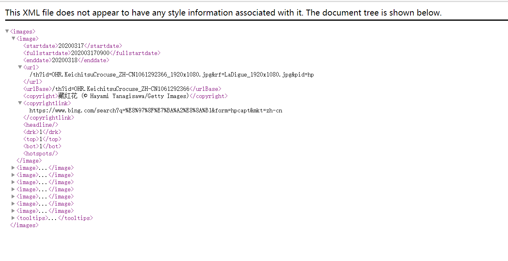

# 项目描述

**使用ssm整合框架开发的答题系统**

**前端UI框架：bootstrap**

**富文本编辑器：simditor**

**第三方登录：QQ，GitHub，Gitee**

**必应每日一图接口**

**只展示相关配置详细业务代码见：https://github.com/beloved-zh/answer_ssm **

# 1、开发环境

- IDEA
- MySql 5.5.29
- Tomcat 8.5.28
- Maven  3.5.4

# 2、数据库环境

**answer.sql**

# 3、环境搭建

> **创建maven-web项目。answer_ssm。修改web.xml头文件**
>
> **mvaen创建的web项目，生成的web.xml版本过低，需要手动修改高版本**

```xml
<?xml version="1.0" encoding="UTF-8"?>
<web-app xmlns="http://xmlns.jcp.org/xml/ns/javaee"
         xmlns:xsi="http://www.w3.org/2001/XMLSchema-instance"
         xsi:schemaLocation="http://xmlns.jcp.org/xml/ns/javaee http://xmlns.jcp.org/xml/ns/javaee/web-app_4_0.xsd"
         version="4.0">

</web-app>
```

> **导入ssm基础依赖**

```xml
<!--依赖：junit，数据库驱动，连接池，servlet，jsp，mybatis，mybatis-spring,spring-->
<dependencies>
  <!--Junit-->
  <dependency>
    <groupId>junit</groupId>
    <artifactId>junit</artifactId>
    <version>4.12</version>
  </dependency>
  <!--数据库驱动-->
  <dependency>
    <groupId>mysql</groupId>
    <artifactId>mysql-connector-java</artifactId>
    <version>5.1.47</version>
  </dependency>
  <!-- 数据库连接池 c3p0 -->
  <dependency>
    <groupId>com.mchange</groupId>
    <artifactId>c3p0</artifactId>
    <version>0.9.5.2</version>
  </dependency>

  <!--Servlet - JSP -->
  <dependency>
    <groupId>javax.servlet</groupId>
    <artifactId>servlet-api</artifactId>
    <version>2.5</version>
  </dependency>
  <dependency>
    <groupId>javax.servlet.jsp</groupId>
    <artifactId>jsp-api</artifactId>
    <version>2.2</version>
  </dependency>
  <dependency>
    <groupId>javax.servlet</groupId>
    <artifactId>jstl</artifactId>
    <version>1.2</version>
  </dependency>
  <!--Mybatis-->
  <dependency>
    <groupId>org.mybatis</groupId>
    <artifactId>mybatis</artifactId>
    <version>3.5.2</version>
  </dependency>
  <dependency>
    <groupId>org.mybatis</groupId>
    <artifactId>mybatis-spring</artifactId>
    <version>2.0.2</version>
  </dependency>

  <!--Spring-->
  <dependency>
    <groupId>org.springframework</groupId>
    <artifactId>spring-webmvc</artifactId>
    <version>5.1.9.RELEASE</version>
  </dependency>
  <dependency>
    <groupId>org.springframework</groupId>
    <artifactId>spring-jdbc</artifactId>
    <version>5.1.9.RELEASE</version>
  </dependency>
  <!--lombok-->
  <dependency>
    <groupId>org.projectlombok</groupId>
    <artifactId>lombok</artifactId>
    <version>1.18.8</version>
  </dependency>
  <!--aop织入-->
  <dependency>
    <groupId>org.aspectj</groupId>
    <artifactId>aspectjweaver</artifactId>
    <version>1.9.4</version>
  </dependency>
</dependencies>
```

> **其余扩展依赖**

```xml
<!--json-->
<dependency>
  <groupId>com.alibaba</groupId>
  <artifactId>fastjson</artifactId>
  <version>1.2.60</version>
</dependency>
<!--文件上传-->
<dependency>
  <groupId>commons-fileupload</groupId>
  <artifactId>commons-fileupload</artifactId>
  <version>1.3.3</version>
</dependency>
<!--servlet-api导入高版本的-->
<dependency>
  <groupId>javax.servlet</groupId>
  <artifactId>javax.servlet-api</artifactId>
  <version>4.0.1</version>
</dependency>

<!-- dom4j解析xml数据 -->
<dependency>
  <groupId>dom4j</groupId>
  <artifactId>dom4j</artifactId>
  <version>1.6.1</version>
</dependency>

<!--java代码发送请求依赖包-->
<dependency>
  <groupId>org.apache.httpcomponents</groupId>
  <artifactId>httpclient</artifactId>
  <version>4.5.6</version>
</dependency>

<!--邮件发送-->
<!-- https://mvnrepository.com/artifact/javax.mail/javax.mail-api -->
<dependency>
  <groupId>javax.mail</groupId>
  <artifactId>javax.mail-api</artifactId>
  <version>1.6.2</version>
</dependency>
<dependency>
  <groupId>com.sun.mail</groupId>
  <artifactId>javax.mail</artifactId>
  <version>1.6.2</version>
</dependency>
<!-- https://mvnrepository.com/artifact/javax.activation/activation -->
<dependency>
  <groupId>javax.activation</groupId>
  <artifactId>activation</artifactId>
  <version>1.1.1</version>
</dependency>
```

> **配置静态资源过滤**

```xml
<!--静态资源过滤-->
<build>
  <resources>
    <resource>
      <directory>src/main/java</directory>
      <includes>
        <include>**/*.properties</include>
        <include>**/*.xml</include>
      </includes>
      <filtering>false</filtering>
    </resource>
    <resource>
      <directory>src/main/resources</directory>
      <includes>
        <include>**/*.properties</include>
        <include>**/*.xml</include>
      </includes>
      <filtering>false</filtering>
    </resource>
  </resources>
</build>
```

> **建立项目基本结构和框架配置**

- com.zh.pojo

- com.zh.mapper

- com.zh.service

- com.zh.controller

- mybatis-config.xml

  ```xml
  <?xml version="1.0" encoding="UTF-8" ?>
  <!DOCTYPE configuration
          PUBLIC "-//mybatis.org//DTD Config 3.0//EN"
          "http://mybatis.org/dtd/mybatis-3-config.dtd">
  <configuration>
  
  </configuration>
  ```

- applicationContext.xml

  ```xml
  <?xml version="1.0" encoding="UTF-8"?>
  <beans xmlns="http://www.springframework.org/schema/beans"
         xmlns:xsi="http://www.w3.org/2001/XMLSchema-instance"
         xsi:schemaLocation="http://www.springframework.org/schema/beans
          http://www.springframework.org/schema/beans/spring-beans.xsd">
  
  </beans>
  ```

# 4、整合SpringMvc

## 4.1、web.xml相关配置

```xml
<?xml version="1.0" encoding="UTF-8"?>
<web-app xmlns="http://xmlns.jcp.org/xml/ns/javaee"
         xmlns:xsi="http://www.w3.org/2001/XMLSchema-instance"
         xsi:schemaLocation="http://xmlns.jcp.org/xml/ns/javaee
         http://xmlns.jcp.org/xml/ns/javaee/web-app_4_0.xsd"
         version="4.0">
    <!--DispatcherServlet-->
    <servlet>
        <servlet-name>springmvc</servlet-name>
        <servlet-class>org.springframework.web.servlet.DispatcherServlet</servlet-class>
        <init-param>
            <param-name>contextConfigLocation</param-name>
            <param-value>classpath:applicationContext.xml</param-value>
        </init-param>
        <load-on-startup>1</load-on-startup>
    </servlet>
    <servlet-mapping>
        <servlet-name>springmvc</servlet-name>
        <url-pattern>/</url-pattern>
    </servlet-mapping>

    <!--乱码过滤-->
    <filter>
        <filter-name>encodingFilert</filter-name>
        <filter-class>org.springframework.web.filter.CharacterEncodingFilter</filter-class>
        <init-param>
            <param-name>encoding</param-name>
            <param-value>utf-8</param-value>
        </init-param>
    </filter>
    <filter-mapping>
        <filter-name>encodingFilert</filter-name>
        <url-pattern>/*</url-pattern>
    </filter-mapping>

    <!--session超时时间-->
    <session-config>
        <session-timeout>15</session-timeout>
    </session-config>

</web-app>
```

## 4.2、Spring-mvc.xml

```xml
<?xml version="1.0" encoding="UTF-8"?>
<beans xmlns="http://www.springframework.org/schema/beans"
       xmlns:xsi="http://www.w3.org/2001/XMLSchema-instance"
       xmlns:mvc="http://www.springframework.org/schema/mvc"
       xmlns:context="http://www.springframework.org/schema/context"
       xsi:schemaLocation="http://www.springframework.org/schema/beans
       http://www.springframework.org/schema/beans/spring-beans.xsd
       http://www.springframework.org/schema/mvc
       https://www.springframework.org/schema/mvc/spring-mvc.xsd
       http://www.springframework.org/schema/context
       https://www.springframework.org/schema/context/spring-context.xsd">


    <!--自动扫描指定的包，下面所有注解类交给IOC容器管理 -->
    <context:component-scan base-package="com.zh.controller"/>
    <!--静态资源过滤-->
    <mvc:default-servlet-handler/>
    <!--json乱码问题-->
    <mvc:annotation-driven>
        <mvc:message-converters register-defaults="true">
            <ref bean="stringHttpMessageConverter" />
            <ref bean="fastJsonHttpMessageConverter" />
        </mvc:message-converters>
    </mvc:annotation-driven>

    <!--配置fastjson-->
    <bean id="stringHttpMessageConverter"
          class="org.springframework.http.converter.StringHttpMessageConverter">
        <constructor-arg value="UTF-8" index="0"></constructor-arg>
        <property name="supportedMediaTypes">
            <list>
                <value>text/plain;charset=UTF-8</value>
            </list>
        </property>
    </bean>
    <bean id="fastJsonHttpMessageConverter" class="com.alibaba.fastjson.support.spring.FastJsonHttpMessageConverter4">
        <property name="supportedMediaTypes">
            <list>
                <value>text/html;charset=UTF-8</value>
                <value>application/json;charset=UTF-8</value>
            </list>
        </property>
        <property name="fastJsonConfig">
            <bean class="com.alibaba.fastjson.support.config.FastJsonConfig">
                <property name="features">
                    <list>
                        <value>AllowArbitraryCommas</value>
                        <value>AllowUnQuotedFieldNames</value>
                        <value>DisableCircularReferenceDetect</value>
                    </list>
                </property>
                <property name="dateFormat" value="yyyy-MM-dd HH:mm:ss"></property>
            </bean>
        </property>
    </bean>

    <!-- 视图解析器 -->
    <bean class="org.springframework.web.servlet.view.InternalResourceViewResolver"
          id="internalResourceViewResolver">
        <!-- 前缀 -->
        <property name="prefix" value="/WEB-INF/views/" />
        <!-- 后缀 -->
        <property name="suffix" value=".jsp" />
    </bean>


    <!--
        对静态资源的访问
        mapping：url路径
        location：本地路径
    -->
    <mvc:resources mapping="/static/**" location="/static/" />

    <!--配置拦截器-->
    <mvc:interceptors>
        <mvc:interceptor>
            <!--拦截所有请求-->
            <mvc:mapping path="/**"/>
            <!--放行的请求-->
            <mvc:exclude-mapping path="/index.jsp"/>
            <mvc:exclude-mapping path="/github/**"/>
            <mvc:exclude-mapping path="/gitee/**"/>
            <mvc:exclude-mapping path="/qq/**"/>
            <mvc:exclude-mapping path="/user/login/"/>
            <mvc:exclude-mapping path="/getImage"/>
            <mvc:exclude-mapping path="/favicon.ico"/>
            <!--放行静态资源请求-->
            <mvc:exclude-mapping path="/static/**"/>
            <!--将拦截器注入到ioc容器-->
            <bean class="com.zh.config.LoginInterceptor"/>
        </mvc:interceptor>
    </mvc:interceptors>
</beans>
```

**==注意：使用的json解析jar包不一样，配置文件中配置的json数据乱码也不一样。具体配置见：springmvc.md==**

**==相关拦截器配置之后。一定要注意静态资源过滤问题==**

# 5、整合mybatis

## 5.1、数据库配置文件：database.properties

```properties
jdbc.driver=com.mysql.jdbc.Driver
jdbc.url=jdbc:mysql://localhost:3306/answer?useUnicode=true&characterEncoding=utf8
jdbc.username=root
jdbc.password=123456
```

## 5.2、mybatis-config.xml

```xml
<?xml version="1.0" encoding="UTF-8" ?>
<!DOCTYPE configuration
        PUBLIC "-//mybatis.org//DTD Config 3.0//EN"
        "http://mybatis.org/dtd/mybatis-3-config.dtd">
<configuration>

    <settings>
        <!--日志打印-->
        <setting name="logImpl" value="STDOUT_LOGGING"/>
    </settings>

    <!--别名-->
    <typeAliases>
        <package name="com.zh.pojo"/>
    </typeAliases>
    
</configuration>
```

## 5.3、spring-mybatis.xml

```xml
<?xml version="1.0" encoding="UTF-8"?>
<beans xmlns="http://www.springframework.org/schema/beans"
       xmlns:xsi="http://www.w3.org/2001/XMLSchema-instance"
       xmlns:context="http://www.springframework.org/schema/context"
       xsi:schemaLocation="http://www.springframework.org/schema/beans
       http://www.springframework.org/schema/beans/spring-beans.xsd
       http://www.springframework.org/schema/context
       https://www.springframework.org/schema/context/spring-context.xsd">
    <!--==================数据源=============================-->
    <!--1.关联数据库配置文件-->
    <context:property-placeholder location="classpath:database.properties"/>

    <!--2.c3p0连接池-->
    <bean id="dataSource" class="com.mchange.v2.c3p0.ComboPooledDataSource">
        <property name="driverClass" value="${jdbc.driver}"/>
        <property name="jdbcUrl" value="${jdbc.url}"/>
        <property name="user" value="${jdbc.username}"/>
        <property name="password" value="${jdbc.password}"/>

        <!-- c3p0连接池的私有属性 -->
        <property name="maxPoolSize" value="30"/>
        <property name="minPoolSize" value="10"/>
        <!-- 关闭连接后不自动commit -->
        <property name="autoCommitOnClose" value="false"/>
        <!-- 获取连接超时时间 -->
        <property name="checkoutTimeout" value="10000"/>
        <!-- 当获取连接失败重试次数 -->
        <property name="acquireRetryAttempts" value="2"/>
    </bean>

    <!--=======================spring与mybatis的整合=============================-->
    <!--3.sqlSessionFactory-->
    <bean id="sqlSessionFactory" class="org.mybatis.spring.SqlSessionFactoryBean">
        <!--数据源-->
        <property name="dataSource" ref="dataSource"/>
        <!--绑定mybatis配置文件-->
        <property name="configLocation" value="classpath:mybatis/mybatis-config.xml"/>
        <!--指定mybatis的mapper文件位置-->
        <property name="mapperLocations" value="classpath:mapper/*.xml" />
    </bean>

    <!--4.配置mapper接口扫描包，动态实现了Mapper接口可以注入到spring容器中-->
    <bean class="org.mybatis.spring.mapper.MapperScannerConfigurer">
        <!--注入sqlSessionFactory-->
        <property name="sqlSessionFactoryBeanName" value="sqlSessionFactory"/>
        <!--要扫描的mapper包-->
        <property name="basePackage" value="com.zh.mapper"/>
    </bean>

</beans>
```

## 5.4、Mapper.xml

```xml
<?xml version="1.0" encoding="UTF-8" ?>
<!DOCTYPE mapper
        PUBLIC "-//mybatis.org//DTD Mapper 3.0//EN"
        "http://mybatis.org/dtd/mybatis-3-mapper.dtd">

<mapper namespace="com.zh.mapper.CourseMapper">

    <select id="findAll" resultType="course">
        select * from course;
    </select>

</mapper>
```

# 6、整合service层

```xml
<?xml version="1.0" encoding="UTF-8"?>
<beans xmlns="http://www.springframework.org/schema/beans"
       xmlns:xsi="http://www.w3.org/2001/XMLSchema-instance"
       xmlns:tx="http://www.springframework.org/schema/tx"
       xmlns:aop="http://www.springframework.org/schema/aop"
       xmlns:context="http://www.springframework.org/schema/context"
       xsi:schemaLocation="http://www.springframework.org/schema/beans
       http://www.springframework.org/schema/beans/spring-beans.xsd
       http://www.springframework.org/schema/tx
       http://www.springframework.org/schema/tx/spring-tx.xsd
       http://www.springframework.org/schema/aop
       https://www.springframework.org/schema/aop/spring-aop.xsd
       http://www.springframework.org/schema/context
       https://www.springframework.org/schema/context/spring-context.xsd">

    <!--扫描service层的包-->
    <context:component-scan base-package="com.zh.service" />

    <!--=======================事务配置==================================-->
    <!--声明式事务配置-->
    <bean id="transactionManager" class="org.springframework.jdbc.datasource.DataSourceTransactionManager">
        <!--注入数据源-->
        <property name="dataSource" ref="dataSource"/>
    </bean>
    <!--aop事务支持-->
    <!--结合aop实现事务的织入-->
    <tx:advice id="txAdvice" transaction-manager="transactionManager">
        <tx:attributes>
            <tx:method name="*" propagation="REQUIRED"/>
        </tx:attributes>
    </tx:advice>
    <!--配置事务切入-->
    <aop:config>
        <aop:pointcut id="txPointcut" expression="execution(* com.zh.service.*.*(..))"/>
        <aop:advisor advice-ref="txAdvice" pointcut-ref="txPointcut"/>
    </aop:config>
</beans>
```

# 7、配置文件整合

```xml
<?xml version="1.0" encoding="UTF-8"?>
<beans xmlns="http://www.springframework.org/schema/beans"
       xmlns:xsi="http://www.w3.org/2001/XMLSchema-instance"
       xmlns:context="http://www.springframework.org/schema/context"
       xsi:schemaLocation="http://www.springframework.org/schema/beans
       http://www.springframework.org/schema/beans/spring-beans.xsd
       http://www.springframework.org/schema/context
       https://www.springframework.org/schema/context/spring-context.xsd">

    <import resource="spring/spring-mvc.xml"/>
    <import resource="spring/spring-mybatis.xml"/>
    <import resource="spring/spring-service.xml"/>

    <context:component-scan base-package="com.zh.utils"/>
</beans>
```

**==最后在applicationContext.xml中引入相关的spring的配置文件==**

# 8、必应每日一图接口处理

后台发送http请求依赖的jar包

```xml
<!--java代码发送请求依赖包-->
<dependency>
  <groupId>org.apache.httpcomponents</groupId>
  <artifactId>httpclient</artifactId>
  <version>4.5.6</version>
</dependency>
```

## **8.1、每日一图接口**

```http
https://cn.bing.com/HPImageArchive.aspx?format=js&idx=0&n=1
```

**数据分析**


返回的是json数据，获取url，在前面加上www.bing.com可获取图片

需要在后台请求接口，前台ajax请求，会有跨域拦截

```java
/**
 * 每日一图
 * @return
 */
public Map<String,String> getImage(){

    //必应每日一图接口
    String bing = "https://cn.bing.com/HPImageArchive.aspx?format=js&idx=0&n=1";

    //得到的json数据，用String保存
    String json = "";

    try {
        URL  url = new URL(bing);
            URLConnection conn = url.openConnection();
        BufferedReader reader = new BufferedReader(new InputStreamReader(conn.getInputStream(),"utf-8"));//转码。
        String line = null;
        while ((line = reader.readLine()) != null)
            json += (line + " ");
        reader.close();
    } catch (MalformedURLException e) {
        e.printStackTrace();
    } catch (UnsupportedEncodingException e) {
        e.printStackTrace();
    } catch (IOException e) {
        e.printStackTrace();
    }

    //将字符串转换为json
    JSONObject jsonObject = JSONObject.parseObject(json);

    //获取图片的数据
    JSONArray images = jsonObject.getJSONArray("images");

    //图片数据是一个数组，长度为1
    String s = images.get(0).toString();

    //将数据转换为json
    JSONObject jsonObject1 = JSONObject.parseObject(s);

    String url = jsonObject1.get("url").toString();
    url = "https://www.bing.com" + url;
    String copyright = jsonObject1.get("copyright").toString();

    Map<String,String> map = new HashMap<>();
    map.put("url",url);
    map.put("copyright",copyright);

    return map;
}
```

## 8.2、历史图片

```http
https://cn.bing.com/HPImageArchive.aspx?idx=0&n=10
```

改变n的参数，可获取不同数量的图片，最大是8

**数据分析**



返回的数据是XML数据。解析XML数据需要使用dom4j的依赖包

```xml
<!-- dom4j解析xml数据 -->
<dependency>
  <groupId>dom4j</groupId>
  <artifactId>dom4j</artifactId>
  <version>1.6.1</version>
</dependency>
```

```java
/**
 * 历史图片
 * @return
 */
public List<Map> getImages(){
    //必应每日一图历史接口
    String bing = "https://cn.bing.com/HPImageArchive.aspx?idx=0&n=10";

    //得到的XML数据，用String保存
    String xmlStr = "";

    URL url = null;
    try {
        url = new URL(bing);
        URLConnection conn = url.openConnection();
        BufferedReader reader = new BufferedReader(new InputStreamReader(conn.getInputStream(),"utf-8"));//转码。
        String line = null;
        while ((line = reader.readLine()) != null)
            xmlStr += (line + " ");
        reader.close();
    } catch (MalformedURLException e) {
        e.printStackTrace();
    } catch (UnsupportedEncodingException e) {
        e.printStackTrace();
    } catch (IOException e) {
        e.printStackTrace();
    }

    //System.out.println(xmlStr);
    //保存所有的图片
    List<Map> images = new ArrayList<>();

    // 1.将字符串转为XML
    Document document = null;
    try {
        document = DocumentHelper.parseText(xmlStr);
        //2.获取根节点
        Element rootElement = document.getRootElement();
        Iterator iterator = rootElement.elementIterator();
        while (iterator.hasNext()){
            Element stu = (Element) iterator.next();
            List<Attribute> attributes = stu.attributes();
            //System.out.println("======获取属性值======");
            for (Attribute attribute : attributes) {
                System.out.println(attribute.getValue());
            }
            //System.out.println("======遍历子节点======");
            Iterator iterator1 = stu.elementIterator();
            //保存单个图片
            Map<String,String> image = new HashMap<>();
            while (iterator1.hasNext()){

                Element stuChild = (Element) iterator1.next();
                String name = stuChild.getName();
                String value = stuChild.getStringValue();
                if (name.equals("url")){
                    image.put("url","https://www.bing.com"+value);
                }
                if (name.equals("copyright")){
                    image.put("copyright",value);
                }
                //System.out.println("节点名："+stuChild.getName()+"---节点值："+stuChild.getStringValue());

            }
            if (image.size() > 0){
                images.add(image);
            }
        }
    } catch (DocumentException e) {
        e.printStackTrace();
    }

    return images;
}
```

# 9、第三方登录

## **9.1、请求工具类**

```java
package com.zh.utils;

import com.alibaba.fastjson.JSONArray;
import com.alibaba.fastjson.JSONObject;
import org.apache.http.HttpEntity;
import org.apache.http.client.methods.CloseableHttpResponse;
import org.apache.http.client.methods.HttpGet;
import org.apache.http.client.methods.HttpPost;
import org.apache.http.entity.StringEntity;
import org.apache.http.impl.client.CloseableHttpClient;
import org.apache.http.impl.client.HttpClientBuilder;
import org.apache.http.impl.client.HttpClients;
import org.apache.http.message.BasicHeader;
import org.apache.http.protocol.HTTP;
import org.apache.http.util.EntityUtils;
import org.junit.Test;

import java.io.*;
import java.net.HttpURLConnection;
import java.net.MalformedURLException;
import java.net.URL;
import java.net.URLConnection;
import java.util.HashMap;
import java.util.Map;

public class HttpClientUtils {


    /**
     * 发送post请求
     * @param url  路径
     * @return
     */
    public static String doPost(String url){
        System.out.println("进入doPost");
        //创建http请求,模拟浏览器
        //CloseableHttpClient httpClient = HttpClients.createDefault();
        /**
         * 注意：post请求
         * 直接创建http请求，会有问题。
         * 发送请求会被服务器拒绝访问。
         * 需要设置UA字段
         */
        //我们可以使用一个Builder来设置UA字段，然后再创建HttpClient对象
        HttpClientBuilder builder = HttpClients.custom();
        //对照UA字串的标准格式理解一下每部分的意思
        builder.setUserAgent("Mozilla/5.0(Windows;U;Windows NT 5.1;en-US;rv:0.9.4)");
        CloseableHttpClient httpClient = builder.build();
        //创建HttpPost
        HttpPost post=new HttpPost(url);

        CloseableHttpResponse response=null;
        try {
            //发起post请求
            response =httpClient.execute(post);

            System.out.println(response.getStatusLine().getStatusCode());
            if(response.getStatusLine().getStatusCode()==200){
                // 获取响应的内容
                HttpEntity responseEntity = response.getEntity();

                return EntityUtils.toString(responseEntity);
            }
        } catch (Exception e) {
            System.out.println(e.getMessage());

            e.printStackTrace();
        }finally {
            try {
                response.close();
                post.clone();
            } catch (Exception e) {
                System.out.println(e.getMessage());
                e.printStackTrace();
            }
        }
        return null;
    }


    /**
     * 发送get请求，利用java代码发送请求
     * @param url
     * @return
     * @throws Exception
     */
    public static String doGet(String url){

        //CloseableHttpClient httpclient = HttpClients.createDefault();
        //我们可以使用一个Builder来设置UA字段，然后再创建HttpClient对象
        HttpClientBuilder builder = HttpClients.custom();
        //对照UA字串的标准格式理解一下每部分的意思
        builder.setUserAgent("Mozilla/5.0(Windows;U;Windows NT 5.1;en-US;rv:0.9.4)");
        CloseableHttpClient httpClient = builder.build();
        HttpGet httpGet = new HttpGet(url);
        // 发送了一个http请求
        try {
            CloseableHttpResponse response = httpClient.execute(httpGet);
            // 如果响应200成功,解析响应结果
            System.out.println(response.getStatusLine().getStatusCode());
            if(response.getStatusLine().getStatusCode()==200){
                // 获取响应的内容
                HttpEntity responseEntity = response.getEntity();

                return EntityUtils.toString(responseEntity);
            }
        } catch (IOException e) {
            e.printStackTrace();
        }
        return null;
    }

    /**
     * 将字符串转换成map
     * @param responseEntity
     * @return
     */
    public static Map<String,String> getMap(String responseEntity) {

        Map<String, String> map = new HashMap<>();
        // 以&来解析字符串
        String[] result = responseEntity.split("\\&");

        for (String str : result) {
            // 以=来解析字符串
            String[] split = str.split("=");
            // 将字符串存入map中
            if (split.length == 1) {
                map.put(split[0], null);
            } else {
                map.put(split[0], split[1]);
            }

        }
        return map;
    }

    /**
     * 通过json获得map
     * @param responseEntity
     * @return
     */
    public static Map<String,String> getMapByJson(String responseEntity) {
        Map<String, String> map = new HashMap<>();
        // 阿里巴巴fastjson  将json转换成map
        JSONObject jsonObject = JSONObject.parseObject(responseEntity);
        for (Map.Entry<String, Object> entry : jsonObject.entrySet()) {
            String key = entry.getKey();
            // 将obj转换成string
            String value = String.valueOf(entry.getValue()) ;
            map.put(key, value);
        }
        return map;
    }

    /**
     * 处理qq登录数据的方法
     * @param responseStr
     * @return
     */
    public static String getOpenID(String responseStr){

        String json = responseStr.substring(responseStr.indexOf("{"), responseStr.indexOf("}") + 1);

        Map<String, String> map = getMapByJson(json);

        String openid = map.get("openid");

        return openid;
    }

}
```

## 9.2、GitHub

```java
package com.zh.utils.github;

import org.springframework.stereotype.Component;

/**
 * GitHub登录常量类
 */
@Component
public class GitHubConstant {

    // 这里填写在GitHub上注册应用时候获得 CLIENT ID
    public static final String  CLIENT_ID="*****";
    //这里填写在GitHub上注册应用时候获得 CLIENT_SECRET
    public static final String CLIENT_SECRET="*****";
    // 回调路径
    public static final String CALLBACK = "******";

	//跳转GitHub登录api
    public static final String CODE_URL = "https://github.com/login/oauth/authorize?client_id="+CLIENT_ID+"&state=STATE&redirect_uri="+CALLBACK+"";
    //获取token的url
    public static final String TOKEN_URL = "https://github.com/login/oauth/access_token?client_id="+CLIENT_ID+"&client_secret="+CLIENT_SECRET+"&code=CODE&redirect_uri="+CALLBACK+"";
    //获取用户信息的url
    public static final String USER_INFO_URL = "https://api.github.com/user?access_token=TOKEN";

}
```

## 9.3、Gitee

```java
package com.zh.utils.gitee;


import org.springframework.stereotype.Component;

/**
 * Gitee登录常量类
 */
@Component
public class GiteeConstant {

    // 这里填写在Gitee上注册应用时候获得 CLIENT ID
    public static final String  CLIENT_ID="*****";
    //这里填写在Gitee上注册应用时候获得 CLIENT_SECRET
    public static final String CLIENT_SECRET="*****";
    // 回调路径
    public static final String CALLBACK = "*****";

    //获取code的url  跳转登录页面
    public static final String CODE_URL = "https://gitee.com/oauth/authorize?client_id="+CLIENT_ID+"&response_type=code&redirect_uri="+CALLBACK+"";
    //获取token的url
    public static final String TOKEN_URL = "https://gitee.com/oauth/token?grant_type=authorization_code&code=CODE&client_id="+CLIENT_ID +"&redirect_uri="+CALLBACK+"&client_secret=" +CLIENT_SECRET+"";
    //获取用户信息的url
    public static final String USER_INFO_URL = "https://gitee.com/api/v5/user?access_token=Token";

}
```

**==GitHub与Gitee比较相似，处理数据的时候一个是get请求，一个是post请求==**

## 9.4、QQ

```
package com.zh.utils.qq;


import org.springframework.stereotype.Component;

/**
 * qq登录常量类
 */
@Component
public class QQConstant {

    // 这里填写在qq上注册应用时候获得 APP_ID
    public static final String  APP_ID="*****";
    //这里填写在qq上注册应用时候获得 APP_KEY
    public static final String APP_KEY="*****";
    // 回调路径
    public static final String CALLBACK = "*****";

    //获取code的url
    public static final String CODE_URL = "https://graph.qq.com/oauth2.0/authorize?response_type=code&client_id="+APP_ID+"&redirect_uri="+CALLBACK+"&state=state";
    //获取token的url
    public static final String TOKEN_URL = "https://graph.qq.com/oauth2.0/token?grant_type=authorization_code&client_id="+APP_ID+"&client_secret="+APP_KEY+"&redirect_uri="+CALLBACK+"&code=CODE";
    //获取OpendID
    public static final String OPENDID_URL = "https://graph.qq.com/oauth2.0/me?access_token=TOKEN";
    //获取用户信息的url
    public static final String USER_INFO_URL = "https://graph.qq.com/user/get_user_info?access_token=TOKEN&oauth_consumer_key="+APP_ID+"&openid=OPENID";

}
```

**==qq与其余的多了一个opid的请求，qq的回调路径注册时可以多个，用；隔开==**

## 9.5、总结

**第三方登录都是使用OAuth协议。都是大同小异的。**

**请求接口的时候，注意官方文档请求的类型，是get还是post**

# 10、simditor富文本编辑器

网站地址:https://simditor.tower.im/

GitHub:https://github.com/mycolorway/simditor

官网有详细教程，插件安装大同小异

> **配置导入**

```html
<%--simditor富文本编辑器配置--%>
<!--基本css样式-->
<link rel="stylesheet" href="${pageContext.request.contextPath}/static/simditor/css/app.css">
<link rel="stylesheet" href="${pageContext.request.contextPath}/static/simditor/css/mobile.css">
<link rel="stylesheet" href="${pageContext.request.contextPath}/static/simditor/css/simditor.css">

<!--基本js配置-->
<script type="text/javascript" src="${pageContext.request.contextPath}/static/simditor/js/jquery.min.js"></script>
<script type="text/javascript" src="${pageContext.request.contextPath}/static/simditor/js/module.js"></script>
<!--绑定热键-->
<script type="text/javascript" src="${pageContext.request.contextPath}/static/simditor/js/hotkeys.js"></script>
<!--文件上传-->
<script type="text/javascript" src="${pageContext.request.contextPath}/static/simditor/js/uploader.js"></script>
<script type="text/javascript" src="${pageContext.request.contextPath}/static/simditor/js/simditor.js"></script>
<!--荧光笔插件-->
<script type="text/javascript" src="${pageContext.request.contextPath}/static/simditor/js/simditor-mark.js"></script>
<!--全屏插件-->
<script type="text/javascript" src="${pageContext.request.contextPath}/static/simditor/js/simditor-fullscreen.js"></script>
<!--marked插件-->
<script type="text/javascript" src="${pageContext.request.contextPath}/static/simditor/js/marked.js"></script>
<script type="text/javascript" src="${pageContext.request.contextPath}/static/simditor/js/simditor-marked.js"></script>
<link rel="stylesheet" href="${pageContext.request.contextPath}/static/simditor/css/simditor-fullscreen.css">
<%--end--%>
```

> **初始化设置**

```js
//设置富文本编译器
editor = new Simditor({
    textarea: $('#editor'),
    //工具栏
    toolbar: ['title','bold','italic','underline','fontScale','color',
        'mark','marked','ol','ul','code','table','image','hr', 'link', 'fullscreen',
        'blockquote','strikethrough','indent','outdent','alignment'],
    //开启从剪贴板粘贴图像来支持上传
    pasteImage:true,
    //提示信息
    /*placeholder: '写点什么...',*/
    /*文件上传
     * url：请求地址
     *     params：参数
     *     fileKey：参数的键
     *     leaveConfirm：文件上传是离开页面，显示的消息
     *     connectionCount：同时可以上传多少张图片
     *
     *     上传完成后必须返回指定格式的json，不然会报错
     *     success：状态 msg：信息      file_path：路径
     *     {
     *   "success": true/false,
     *   "msg": "error message", # optional
     *   "file_path": "[real file path]"
     * }
     *  这里不需要保存文件，直接使用字节码
     *  防止提示文件上传失败
     *  注释simditor.js 第4539行的alert(msg);
     * */
    upload: {
        url: '',
        params: null,
        fileKey: 'file',
        leaveConfirm: '正在上传文件..',
        connectionCount: 3
    }
});

//获取html内容
var html = editor.getValue();
```

> **html**

```html
<textarea id="editor"  autofocus></textarea>
```